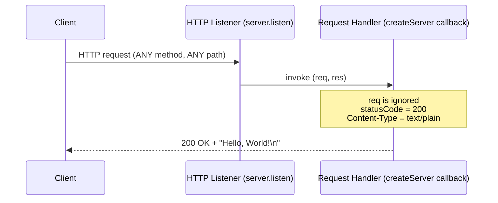
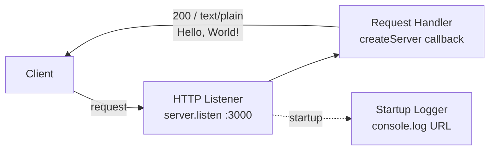

# march_repo_hello_world

A minimal Node.js HTTP server that returns a static `Hello, World!` plain-text response to every request. `Source: server.js:L1, L6-L10`

---

## Table of Contents

- [Overview](#overview)
- [Features](#features)
- [Prerequisites](#prerequisites)
- [Setup / Installation](#setup--installation)
- [Running the Server](#running-the-server)
- [API Documentation](#api-documentation)
- [Deployment Guide](#deployment-guide)
- [Code Explanation](#code-explanation)
- [Project Structure](#project-structure)
- [Notes](#notes)

---

## Overview

`march_repo_hello_world` is a single-file HTTP service built entirely on the Node.js built-in
[`http`](https://nodejs.org/api/http.html) module. It starts a web server that listens on the
loopback interface and answers **every** incoming request — regardless of HTTP method, URL path,
headers, or body — with the same fixed plain-text response, `Hello, World!`. `Source: server.js:L1, L3, L6-L10`

It is intentionally minimal: there is no framework, no router, no configuration layer, and no
third-party dependency. The complete program lives in a single file, `server.js`. `Source: server.js:L1; repository root inventory`

### Features

- **Zero dependencies** — uses only the Node.js built-in `http` module; there is nothing to install. `Source: server.js:L1`
- **Loopback binding** — listens on `127.0.0.1:3000` (the local machine only). `Source: server.js:L3-L4`
- **Catch-all response** — any method on any path returns the identical response. `Source: server.js:L6-L10`
- **Startup log** — prints the running URL to stdout once the listener is ready. `Source: server.js:L12-L14`
- **No build step** — run the source directly with `node server.js`. `Source: repository root inventory`

---

## Prerequisites

- A **Node.js runtime** on any currently supported (non-EOL) LTS line — for example **v22**
  (Maintenance LTS) or **v24** (Active LTS) as of June 2026. Node.js ships with the built-in `http`
  module this server uses, so no additional runtime components are required. `Source: server.js:L1`
- **No other tooling is required** — there is no bundler, transpiler, or package-manager step.
  `Source: repository root inventory`

> This documentation's examples were verified locally on **Node.js v20.x** with **npm 11.x**. Use
> any **currently supported (non-EOL) LTS** release; `npm` is **not** used by this project (see [Setup / Installation](#setup--installation)).

---

## Setup / Installation

Obtain the code by cloning the repository and changing into its directory:

```bash
git clone <repo-url>
cd march_repo_hello_world
```

> **There is NO dependency installation step.** Do **not** run `npm install` — the project has
> **zero third-party packages** and uses only the Node.js built-in `http` module. There is also no
> `package.json` and no lockfile. `Source: server.js:L1`

Once the runtime is installed and the code is cloned, the server is ready to run — there is nothing
else to fetch or compile. `Source: repository root inventory`

---

## Running the Server

Start the server with:

```bash
node server.js
```

On startup it binds `127.0.0.1:3000` and logs the running URL to stdout. The expected output is
exactly (`Source: server.js:L12-L14`):

```text
Server running at http://127.0.0.1:3000/
```

The process stays in the foreground and keeps listening until you stop it (press `Ctrl+C`). `Source: server.js:L12-L14`

---

## API Documentation

The server exposes a single **catch-all** endpoint. It performs no routing: the request method,
URL path, headers, and body are all ignored, and every request receives the same response.
`Source: server.js:L6-L10`

| Property          | Value                                            |
| ----------------- | ------------------------------------------------ |
| Endpoint (path)   | Any path — `/*`                                  |
| Methods           | Any — `GET`, `POST`, `PUT`, `DELETE`, `PATCH`, … |
| Status code       | `200 OK`                                         |
| Response header   | `Content-Type: text/plain`                       |
| Response body     | `Hello, World!\n`                                |
| `Content-Length`  | `14`                                             |

`Source: server.js:L6-L10`

### Request / Response examples

Because routing is ignored, a `GET` to `/` and a `POST` to an arbitrary path return the **identical**
response — this demonstrates the catch-all contract.

**Example 1 — `GET /` (default method):**

```bash
curl -i http://127.0.0.1:3000/
```

**Example 2 — `POST /any/path` with a body (a non-`GET` request):**

```bash
curl -i -X POST http://127.0.0.1:3000/any/path -d 'x=1'
```

Both commands produce the same response (only the `Date` header value varies):

```text
HTTP/1.1 200 OK
Content-Type: text/plain
Date: <current-date>
Connection: keep-alive
Keep-Alive: timeout=5
Content-Length: 14

Hello, World!
```

The body is the exact string `Hello, World!\n` (13 visible characters plus a trailing newline =
`Content-Length: 14`). `Source: server.js:L6-L10`

### Request lifecycle

The diagram below shows that any client request — regardless of method or path — flows through the
HTTP listener to the request handler and yields the same static response. `Source: server.js:L6-L10`



---

## Deployment Guide

This project has **no build step** and **no dependency installation**, so deployment is simply
running the source file with Node.js. `Source: repository root inventory`

```bash
node server.js
```

### Loopback binding caveat

The server binds the loopback interface `127.0.0.1`, so **it only accepts connections from the local
machine**. `Source: server.js:L3` Requests from other hosts will not reach it as-is. To make the
server reachable remotely you have two options (both are operational/infrastructure changes — they
are **not** required by this project and are **not** performed here):

- **Bind a public interface** — listen on `0.0.0.0` so the server accepts connections on all network
  interfaces, **or**
- **Use a reverse proxy** — place the process behind a reverse proxy (for example nginx) that
  forwards external traffic to `127.0.0.1:3000`.

> This guide documents the caveat only. The code is **not** changed — `hostname` remains `127.0.0.1`
> and `port` remains `3000`. `Source: server.js:L3-L4`

---

## Code Explanation

The entire program is `server.js`. The walkthrough below narrates it block by block; the bracketed
line numbers (`[L1]` through `[L14]`) refer to the executable source statements shown in the code
block below. `Source: server.js:L1-L14`

```javascript
const http = require('http');                          // [L1]

const hostname = '127.0.0.1';                          // [L3]
const port = 3000;                                     // [L4]

const server = http.createServer((req, res) => {       // [L6]
  res.statusCode = 200;                                // [L7]
  res.setHeader('Content-Type', 'text/plain');         // [L8]
  res.end('Hello, World!\n');                          // [L9]
});                                                    // [L10]

server.listen(port, hostname, () => {                  // [L12]
  console.log(`Server running at http://${hostname}:${port}/`); // [L13]
});                                                    // [L14]
```

- **`[L1]` — Import the HTTP module.** `const http = require('http');` loads the Node.js built-in
  `http` module. This is the only dependency, and it ships with Node.js — there are no third-party
  packages. `Source: server.js:L1`
- **`[L3-L4]` — Define the bind target.** `hostname` is set to `127.0.0.1` (the loopback address)
  and `port` is set to `3000`. These are hardcoded constants — there are **no** environment
  variables, CLI arguments, or configuration files (the configuration surface is *none*).
  `Source: server.js:L3-L4`
- **`[L6-L10]` — The request handler (catch-all response).** `http.createServer(...)` registers the
  request handler callback. It sets `res.statusCode = 200`, sets the `Content-Type: text/plain`
  header, and ends the response with the body `Hello, World!\n`. The `req` argument is accepted to
  satisfy the callback signature but is intentionally **unused** — the handler never inspects the
  method, path, headers, or body, which is exactly why every request receives the same response.
  `Source: server.js:L6-L10`
- **`[L12-L14]` — Start listening and log (the startup callback).** `server.listen(port, hostname, callback)`
  binds the socket to `127.0.0.1:3000` and begins accepting connections. The startup callback runs
  once, when the server is ready, and logs `Server running at http://127.0.0.1:3000/` to stdout.
  `Source: server.js:L12-L14`

### Component flow

The diagram below shows the three logical components inside `server.js` — the HTTP listener, the
request handler, and the startup logger — and the one-time startup log. `Source: server.js:L1-L14`



---

## Project Structure

The repository contains exactly two files (`Source: repository root inventory`):

```text
.
├── server.js   # The entire HTTP server (Node.js built-in http module)
└── README.md   # This documentation
```

There is **no** `package.json`, **no** lockfile (`package-lock.json` / `yarn.lock` /
`pnpm-lock.yaml`), and **no** `docs/` directory. `Source: repository root inventory` The
configuration surface is **none**: the server reads no environment variables, no CLI arguments, and
no configuration file — `hostname` and `port` are hardcoded constants. `Source: server.js:L3-L4`

## Notes

- **No `LICENSE` file** is present in the repository, and none is created by this documentation. If
  you intend to distribute this project, consider adding a license of your choice. `Source: repository root inventory`
- **No test suite** and **no build step** exist — the source runs directly under Node.js. `Source: repository root inventory`
- **Title vs. repository name.** This README's title is `march_repo_hello_world`, which documents the
  project as-is. It may differ cosmetically from the hosting repository's name; that difference is
  intentional and no name is invented here.
