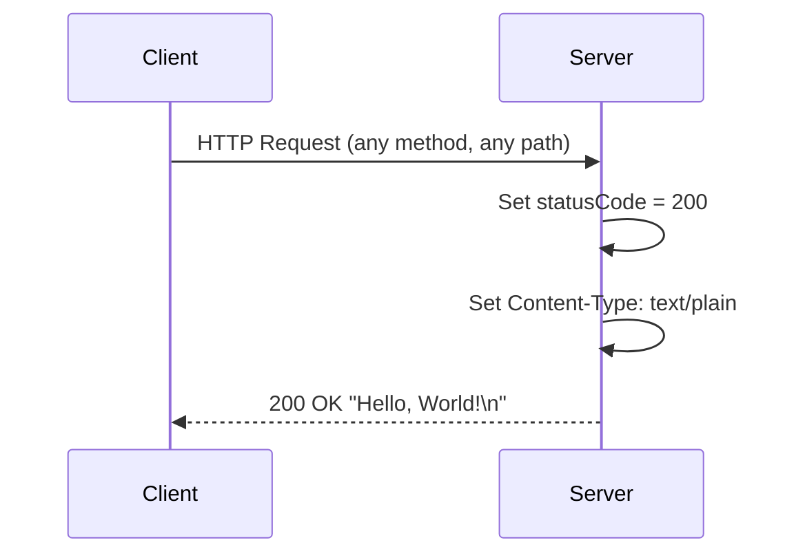
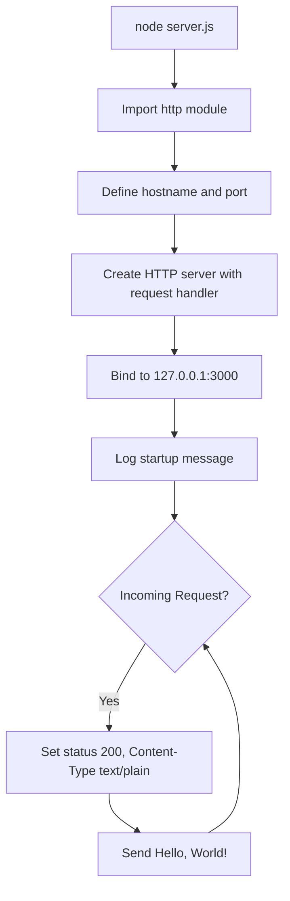

# march_repo_hello_world


## Overview

**march_repo_hello_world** is a minimal Node.js HTTP server that responds with "Hello, World!" to every incoming HTTP request. It uses **only** the built-in `http` module — no external dependencies, no `package.json`, and no build step required.

This project serves as a straightforward starting point for developers ranging from beginners to intermediate level who want to understand how a basic HTTP server works in Node.js using the standard library.

## Features

- **Lightweight HTTP server** using the Node.js built-in `http` module
- **Returns plain text** `Hello, World!\n` response to all requests
- **Binds to the loopback interface** (`127.0.0.1`) on port `3000`
- **Zero external dependencies** — no `node_modules/`, no `package.json`
- **Single-file application** — the entire server is contained in `server.js`

## Prerequisites

- **Node.js** version **4.0.0** or later (LTS release recommended)
- No `package.json` or npm dependencies are needed

Verify that Node.js is installed by running:

```bash
node --version
```

You should see a version number (e.g., `v20.20.1`). If the command is not found, install Node.js from [nodejs.org](https://nodejs.org/).

## Installation & Setup

1. **Clone the repository:**

   ```bash
   git clone <repository-url>
   cd march_repo_hello_world
   ```

2. **No additional installation is required.** There are zero dependencies — you can run the server immediately.

## Usage

### Start the Server

```bash
node server.js
```

**Expected output:**

```
Server running at http://127.0.0.1:3000/
```

### Test the Server

Open your browser and navigate to `http://127.0.0.1:3000/`, or use `curl`:

```bash
curl http://127.0.0.1:3000/
```

**Expected response:**

```
Hello, World!
```

### Stop the Server

Press `Ctrl+C` in the terminal to send a `SIGINT` signal and stop the server.

## API Reference

The server exposes a single HTTP endpoint that returns the same response regardless of the request method or path.

### Endpoint

| Property          | Value                          |
|-------------------|--------------------------------|
| **URL**           | `http://127.0.0.1:3000/`      |
| **Method**        | Any (`GET`, `POST`, `PUT`, etc.) |
| **Status Code**   | `200 OK`                       |
| **Response Header** | `Content-Type: text/plain`   |
| **Response Body** | `Hello, World!\n`              |

### Examples

**Basic request:**

```bash
curl http://127.0.0.1:3000/
```

```
Hello, World!
```

**Verbose request** (shows headers and status code):

```bash
curl -v http://127.0.0.1:3000/
```

```
*   Trying 127.0.0.1:3000...
* Connected to 127.0.0.1 (127.0.0.1) port 3000
> GET / HTTP/1.1
> Host: 127.0.0.1:3000
> User-Agent: curl/8.x.x
> Accept: */*
>
< HTTP/1.1 200 OK
< Content-Type: text/plain
< Date: ...
< Connection: keep-alive
< Keep-Alive: timeout=5
<
Hello, World!
```

### Request-Response Flow



## Code Walkthrough

The entire application is contained in `server.js` (14 lines). Below is a walkthrough of each logical block.

### 1. Module Import

```javascript
const http = require('http');
```

This line imports the built-in Node.js `http` module using CommonJS `require()` syntax. The `http` module provides the functionality to create an HTTP server without any external dependencies. It is bundled with every Node.js installation.

### 2. Server Configuration

```javascript
const hostname = '127.0.0.1';
const port = 3000;
```

Two constants define the server's network binding configuration:

- **`hostname`** (`'127.0.0.1'`) — The loopback interface address, restricting the server to accept connections only from the local machine.
- **`port`** (`3000`) — The TCP port on which the server listens for incoming connections. Port 3000 is a common choice for local development servers.

Both values are hardcoded constants. To change them, you must edit `server.js` directly.

### 3. Server Creation & Request Handler

```javascript
const server = http.createServer((req, res) => {
  res.statusCode = 200;
  res.setHeader('Content-Type', 'text/plain');
  res.end('Hello, World!\n');
});
```

`http.createServer()` creates a new HTTP server instance and registers a **request handler** callback that is invoked for every incoming request:

- **`req`** (`http.IncomingMessage`) — The incoming request object containing method, URL, headers, and body stream. This server does not inspect the request — all requests receive the same response.
- **`res`** (`http.ServerResponse`) — The outgoing response object used to send data back to the client.

Inside the request handler:

1. `res.statusCode = 200` — Sets the HTTP status code to `200 OK`.
2. `res.setHeader('Content-Type', 'text/plain')` — Sets the response content type to plain text.
3. `res.end('Hello, World!\n')` — Sends the response body and signals that the response is complete.

### 4. Server Startup

```javascript
server.listen(port, hostname, () => {
  console.log(`Server running at http://${hostname}:${port}/`);
});
```

`server.listen()` binds the HTTP server to the specified `hostname` and `port`, then begins accepting connections. The **startup logger** callback fires once the server is successfully bound:

- It logs `Server running at http://127.0.0.1:3000/` to the console, confirming the server is ready to handle requests.
- After this point, the Node.js event loop keeps the process alive, waiting for incoming HTTP requests.

### Application Lifecycle



## Deployment Guide

### Local Execution

Run the server directly with Node.js:

```bash
node server.js
```

The server starts and listens on `127.0.0.1:3000`. It runs in the foreground and logs its startup message to stdout.

### Loopback Binding

The server binds to `127.0.0.1` (the **loopback interface**), which means it only accepts connections originating from the local machine. Other devices on your network cannot reach the server.

### Network Exposure

To make the server accessible from other machines on the network, you would need to change the `hostname` value in `server.js` from `'127.0.0.1'` to `'0.0.0.0'` (all interfaces). **Note:** This requires modifying the source code and should be done with awareness of your network security posture.

### Port Availability

Port `3000` must be available (not in use by another process). If the port is already occupied, the server will fail to start with an `EADDRINUSE` error. See the [Troubleshooting](#troubleshooting) section for resolution steps.

### Process Management

For long-running or production-like deployments, consider using a process manager to keep the server running in the background:

- **[pm2](https://pm2.keymetrics.io/)** — `pm2 start server.js`
- **systemd** — Create a service unit file for automatic startup and restart
- **nohup** — `nohup node server.js &` (simple background execution)

These tools are informational suggestions and are **not required** for basic local usage.

## Troubleshooting

### `Error: listen EADDRINUSE: address already in use 127.0.0.1:3000`

**Cause:** Port 3000 is already occupied by another process.

**Solution:** Find and stop the process using port 3000, or change the `port` value in `server.js`:

```bash
# Find the process using port 3000
lsof -i :3000

# Kill the process (replace <PID> with the actual process ID)
kill <PID>
```

### `command not found: node`

**Cause:** Node.js is not installed or not in your system's `PATH`.

**Solution:** Install Node.js from [nodejs.org](https://nodejs.org/) and ensure the `node` binary is available in your terminal.

### `curl: (7) Failed to connect to 127.0.0.1 port 3000`

**Cause:** The server is not running.

**Solution:** Start the server first with `node server.js`, then retry the `curl` command.

### Cannot access the server from another machine

**Cause:** By design, the server binds to `127.0.0.1` (loopback interface), which only accepts local connections.

**Solution:** If you need network access, change `hostname` in `server.js` to `'0.0.0.0'` and restart the server. Be aware of the security implications of exposing the server on all network interfaces.

## Project Structure

```
march_repo_hello_world/
├── README.md        # Project documentation
└── server.js        # HTTP server entry point
```

## Contributing

Contributions are welcome! To contribute:

1. **Fork** the repository
2. **Create a feature branch** (`git checkout -b feature/your-feature`)
3. **Commit your changes** (`git commit -m 'Add your feature'`)
4. **Push to your branch** (`git push origin feature/your-feature`)
5. **Open a Pull Request**

Please keep changes focused and consistent with the project's minimal, educational nature.

## License

No license file is currently included in this repository. If you plan to share or distribute this project publicly, consider adding a `LICENSE` file (e.g., MIT, Apache 2.0) to clarify usage rights.
