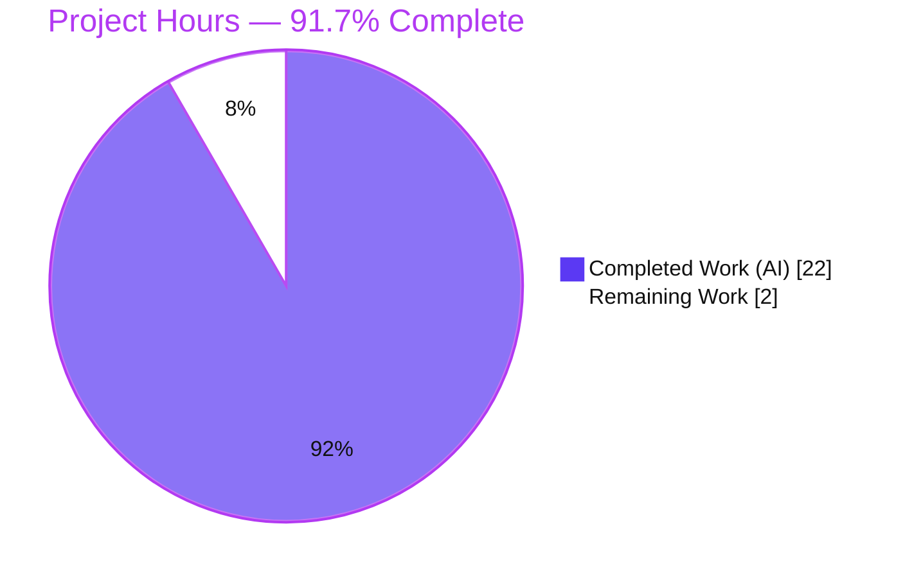
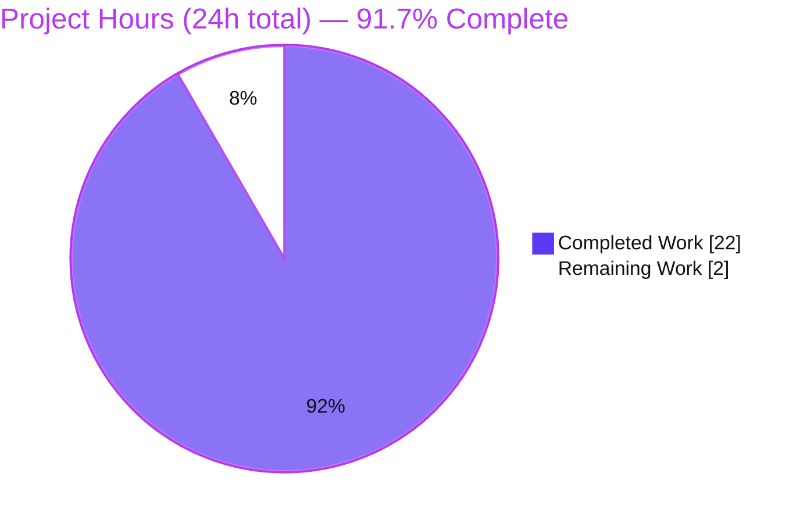
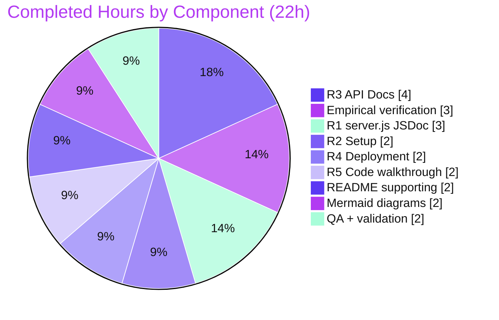

# Blitzy Project Guide — march_repo_hello_world

> Documentation-only delivery for a minimal Node.js standard-library HTTP server.
> **Brand legend:** Completed / AI Work = Dark Blue `#5B39F3` · Remaining = White `#FFFFFF` · Headings / Accents = Violet-Black `#B23AF2` · Highlight = Mint `#A8FDD9`.
>
> Branch: `blitzy-cd0c69ba-6790-4b79-a990-3a6d66ede9e2` · HEAD: `60beec8` · Node: `v20.20.2`

---

## 1. Executive Summary

### 1.1 Project Overview

This project delivers complete, developer-facing documentation for an existing minimal Node.js HTTP server built entirely on the standard-library `http` module (zero third-party dependencies). The work is **strictly documentation**: JSDoc comments were added to `server.js`, and the one-line `README.md` placeholder was expanded into a comprehensive guide covering setup, API behavior, deployment, and a narrated code walkthrough with two Mermaid diagrams. The target audience is developers who need to run, call, and understand the server. Runtime behavior is preserved unchanged — the server still answers every request with `200 OK`, `text/plain`, body `Hello, World!\n`. Business impact: the repository moves from effectively undocumented (0% coverage) to fully documented.

### 1.2 Completion Status



| Metric | Value |
| --- | --- |
| **Total Hours** | **24** |
| Completed Hours (AI + Manual) | 22 (AI: 22 · Manual: 0) |
| Remaining Hours | 2 |
| **Percent Complete** | **91.7%** |

> Completion is computed on AAP-scoped work only: `Completed ÷ (Completed + Remaining) = 22 ÷ 24 = 91.7%`. All AAP-specified requirements (R1–R5) are 100% delivered and empirically verified; the 2 remaining hours are human path-to-production activities (review/merge + host-render verification), not development rework.

### 1.3 Key Accomplishments

- ✅ **JSDoc on `server.js` (R1)** — all 5 documentable symbols annotated: module header (`@file`/`@module`/`@description`), `@constant {string} hostname`, `@constant {number} port`, request-handler callback (`@param`/`@returns`), and `server.listen` startup callback, plus inline comments.
- ✅ **Comprehensive `README.md`** — expanded from 1 line to 298 lines; all 4 mandated sections present (Setup, API, Deployment, Code Explanation) plus Overview, Features, Prerequisites, Running, Project Structure, Notes, and a Table of Contents.
- ✅ **API contract documented (R3)** — catch-all endpoint: any method / any path → `200 OK`, `text/plain`, `Hello, World!\n`, `Content-Length: 14`; includes `HEAD` semantics and the `400` boundary for unrecognized methods.
- ✅ **Two Mermaid diagrams** — request-lifecycle sequence diagram and a component-flow flowchart.
- ✅ **Three verified `curl` examples** — `GET`, `POST`, and `HEAD`, each reproducing the observed response.
- ✅ **27 accurate `Source: server.js:Lx` citations** — every technical claim traces to a line of source; all citations verified against current line numbers.
- ✅ **Behavior preserved** — all 11 executable statements from baseline `3b91d68` are byte-identical; `node --check server.js` exits 0.
- ✅ **Zero dependencies** — server uses only the built-in `http` module; no `package.json`, lockfile, or `node_modules`.

### 1.4 Critical Unresolved Issues

| Issue | Impact | Owner | ETA |
| --- | --- | --- | --- |
| _None_ | No blocking issues. All AAP requirements are complete and empirically validated; working tree is clean. | — | — |

> There are **no critical unresolved issues**. The Final Validator confirmed a production-ready state with zero code changes required. The only remaining work is routine human review/merge (see §1.6 and §2.2).

### 1.5 Access Issues

| System / Resource | Type of Access | Issue Description | Resolution Status | Owner |
| --- | --- | --- | --- | --- |
| _None_ | — | No access issues identified. The project is a local, self-contained Node.js file with no external services, credentials, registries, or network dependencies. | N/A | — |

**No access issues identified.** Build/validation requires only a Node.js runtime, which is present (`v20.20.2`). There are no third-party services, API keys, or repository-permission constraints to resolve.

### 1.6 Recommended Next Steps

1. **[High]** Review and approve the documentation pull request — read `server.js` JSDoc and the `README.md`, confirming accuracy against the running server. *(≈1h)*
2. **[High]** Verify Mermaid diagrams and Markdown/TOC render correctly on the code host (GitHub/GitLab) and merge. *(≈1h)*
3. **[Low]** *(Optional, out of AAP scope)* Consider adding a `LICENSE` file if distribution is intended — the README already notes its absence.
4. **[Low]** *(Optional, out of AAP scope)* Consider a minimal `package.json` with a `start` script and/or a smoke test + CI workflow for long-term maintenance.

---

## 2. Project Hours Breakdown

### 2.1 Completed Work Detail

All completed components trace to a specific AAP requirement (R1–R5) or an AAP-mandated supporting standard (diagrams, examples, citations, verification). Total = **22 hours** (matches Completed Hours in §1.2).

| Component | Hours | Description |
| --- | --- | --- |
| R1 — `server.js` JSDoc (5 symbols) | 3 | Module-header JSDoc, `@constant` for `hostname`/`port`, request-handler `@param`/`@returns`, startup-callback JSDoc, and inline comments; includes CP1 terminology alignment |
| R2 — README Setup / Installation | 2 | Prerequisites (Node.js active LTS), clone steps, explicit *no-install / zero-dependency* clarification |
| R3 — README API Documentation | 4 | Catch-all contract table, method-boundary (`400`) and `HEAD` semantics notes, and 3 empirically verified `curl` request/response examples |
| R4 — README Deployment Guide | 2 | `node server.js` run command, `127.0.0.1` loopback caveat, no-build note, and `0.0.0.0`/reverse-proxy remote-access options |
| R5 — README Code Explanation walkthrough | 2 | Block-by-block narrated walkthrough with an annotated `[L1]`–`[L14]` code fence and line citations |
| README supporting sections | 2 | Overview, Features, Prerequisites, Project Structure, Notes, and Table of Contents scaffolding |
| Mermaid diagrams (2) | 2 | Request-lifecycle sequence diagram + component-flow flowchart |
| Empirical runtime verification | 3 | `node --check` + `node server.js` startup + `curl` across GET/POST/HEAD/DELETE/PUT/PATCH/OPTIONS and the unrecognized-method `400` case |
| QA review cycles + citation / behavior-preservation validation | 2 | CP3 review (LTS, citations, diagram MIME), QA citation-drift fix, the `Content-Length` add/restore cycle, and final empirical re-validation |
| **Total** | **22** | |

### 2.2 Remaining Work Detail

All remaining items are human path-to-production activities. There is **no AAP development rework outstanding**. Total = **2 hours** (matches Remaining Hours in §1.2 and the "Remaining Work" value in §7).

| Category | Hours | Priority |
| --- | --- | --- |
| Documentation PR review & approval/merge | 1 | High |
| Rendered-output verification on code host (2 Mermaid diagrams + 11 TOC anchors render on GitHub/GitLab) | 1 | High |
| **Total** | **2** | |

> **Explicitly out of AAP scope (not counted in the 24h total):** adding a `LICENSE` (~0.5h), a `package.json` + `start` script (~1h), a smoke test + CI workflow (~4h), or request logging / a health endpoint (~2h; would change runtime behavior). These are deliberate scope boundaries per AAP §0.8.2 and are listed only for informational completeness.

### 2.3 Basis of Estimate

- **Methodology:** PA1 AAP-scoped hours — `Completion % = Completed ÷ (Completed + Remaining)`. Only AAP deliverables and path-to-production activities are counted; explicitly out-of-scope items are excluded from both numerator and denominator.
- **Confidence:** **High.** The scope is small and fully bounded (2 files), every requirement maps to concrete on-disk evidence, and all behavioral claims were empirically re-verified this session.
- **Cross-section integrity:** `§2.1 (22) + §2.2 (2) = 24` = Total (§1.2); Remaining `2h` is identical across §1.2, §2.2, and §7.

---

## 3. Test Results

No unit-test framework exists in this repository, and none is required (AAP §0.8.2). Per Blitzy's autonomous validation, **behavioral (runtime) verification is the test-equivalent** for this documentation-only task. All results below originate from Blitzy's autonomous validation logs and were independently re-confirmed during this assessment.

| Test Category | Framework | Total Tests | Passed | Failed | Coverage % | Notes |
| --- | --- | --- | --- | --- | --- | --- |
| Syntax / Static Analysis | `node --check` | 1 | 1 | 0 | 100% | `server.js` parses cleanly (exit 0) |
| Runtime Behavioral (API contract) | `curl` + assertions (Blitzy autonomous validation) | 8 | 8 | 0 | 100% (1/1 endpoint) | GET, POST, HEAD, DELETE, PUT, PATCH, OPTIONS, and unrecognized-method `400` |
| Documentation Structural | Blitzy autonomous validation (fence / anchor / citation checks) | 3 | 3 | 0 | 100% | 26 balanced code-fence delimiters; 11 TOC anchors resolve; 27 `Source:` citations accurate |
| Unit Tests | — (none; not required per AAP §0.8.2) | 0 | 0 | 0 | N/A | No unit-test suite exists or is required for this documentation-only scope |
| **Total** | | **12** | **12** | **0** | **100%** | Zero failures across all executed checks |

**Behavioral test detail (all passed):**

| # | Request | Expected | Observed |
| --- | --- | --- | --- |
| 1 | `GET /` | `200`, `text/plain`, 14-byte `Hello, World!\n` | ✅ Match |
| 2 | `POST /any/path -d 'x=1'` | Identical `200` response (catch-all) | ✅ Match |
| 3 | `HEAD /` | `200`, `text/plain`, no body, no `Content-Length` | ✅ Match |
| 4 | `DELETE /xyz` | Identical `200` response | ✅ Match |
| 5 | `PUT /` | `200` response | ✅ Match |
| 6 | `PATCH /` | `200` response | ✅ Match |
| 7 | `OPTIONS /` | `200` response | ✅ Match |
| 8 | `-X FOO /` (unrecognized method) | `400 Bad Request` (parser-level) | ✅ Match |

---

## 4. Runtime Validation & UI Verification

This is a headless HTTP service with **no UI layer** — no front-end framework, no rendered pages, and no design system (AAP §0.8.3). "UI verification" therefore covers the rendered documentation artifacts.

**Runtime health:**

- ✅ **Operational** — `node server.js` starts and logs exactly `Server running at http://127.0.0.1:3000/`.
- ✅ **Operational** — `GET /` returns `200 OK`, `Content-Type: text/plain`, `Content-Length: 14`, body `Hello, World!\n` (byte count verified = 14).
- ✅ **Operational** — Catch-all confirmed: `POST`, `PUT`, `PATCH`, `OPTIONS`, `DELETE` all return the identical `200` response regardless of path or body.
- ✅ **Operational** — `HEAD /` returns `200` with headers only (no body, no `Content-Length`), matching the documented HTTP semantics.
- ✅ **Operational** — Unrecognized method (`-X FOO`) is rejected with `400 Bad Request` before reaching the handler, exactly as documented.
- ✅ **Operational** — Clean shutdown; port `3000` released afterward.

**Documentation rendering (API integration & artifact verification):**

- ✅ **Operational** — `README.md` structure is valid: 26 balanced fence delimiters, 11 resolvable TOC anchors, 27 accurate source citations.
- ⚠ **Partial** — The 2 Mermaid diagrams render on Mermaid-aware hosts (GitHub/GitLab/VS Code) but appear as fenced code on non-Mermaid viewers. Final host-render confirmation is the one open human task (see §2.2).

---

## 5. Compliance & Quality Review

Cross-mapping of AAP deliverables to Blitzy quality benchmarks. All in-scope items pass; fixes applied during autonomous validation are noted.

| Deliverable / Benchmark | Requirement (AAP) | Status | Progress | Notes |
| --- | --- | --- | --- | --- |
| R1 — JSDoc on `server.js` functions | §0.1.1, §0.7.1 | ✅ Pass | 5/5 symbols (100%) | Module header, `@constant` × 2, handler `@param`/`@returns`, startup callback |
| R2 — Setup instructions | §0.1.1 | ✅ Pass | 100% | Prerequisites + clone + explicit no-install |
| R3 — API documentation | §0.1.1 | ✅ Pass | 100% | Catch-all contract + method boundary + HEAD + 3 curl examples |
| R4 — Deployment guide | §0.1.1 | ✅ Pass | 100% | Run command + loopback caveat + no-build + remote-access options |
| R5 — Inline code explanations | §0.1.1 | ✅ Pass | 100% | Narrated block-by-block walkthrough |
| Mandated README sections | §0.7.1 | ✅ Pass | 4/4 (100%) | Setup, API, Deployment, Code Explanation |
| Mermaid diagrams | §0.4.3 | ✅ Pass | 2/2 | Sequence + flowchart |
| Working examples | §0.7.3 | ✅ Pass | 3 curl examples | GET, POST, HEAD — all reproduce observed output |
| Source citations | §0.9.1 | ✅ Pass | 27 citations | Fixed systematic citation drift (commit `53ab360`); all now accurate |
| Behavior preservation | §0.8.2 | ✅ Pass | 11/11 statements intact | `Content-Length` add reverted (commit `ae98b2b`) to keep behavior unchanged |
| Syntax validity | §0.9.2 | ✅ Pass | `node --check` exit 0 | — |
| Scope compliance | §0.8.2, §0.5.3 | ✅ Pass | 100% | No LICENSE/`package.json`/config/tests created; no out-of-scope files modified |

**Fixes applied during autonomous validation:** CP1 JSDoc terminology alignment (`8e590ce`); CP3 review — LTS accuracy, citations, diagram MIME (`b41e574`); systematic citation-drift correction (`53ab360`); `Content-Length` experiment added then reverted to preserve behavior (`a82b30f` → `ae98b2b`). **Outstanding compliance items: none.**

---

## 6. Risk Assessment

This is an exceptionally low-risk deliverable: documentation-only, zero third-party dependencies, byte-preserved runtime behavior, and empirically validated. **No High or Medium risks were identified.**

| Risk | Category | Severity | Probability | Mitigation | Status |
| --- | --- | --- | --- | --- | --- |
| Documentation drift — hardcoded `Source: server.js:Lx` citations and JSDoc could go stale if `server.js` is edited later | Technical | Low | Low | AAP §0.5.4 mandates tandem code+doc updates; re-verify citations on any edit | Mitigated (27/27 citations currently accurate) |
| Mermaid render dependency — diagrams show as raw code on non-Mermaid viewers | Operational | Low | Low | Major code hosts render Mermaid natively | Open — pending host-render check (§2.2) |
| Unauthenticated exposure if bound to `0.0.0.0` — following the remote-access option without a proxy/auth exposes an open endpoint | Security | Low | Low | Safe default is loopback `127.0.0.1`; README frames `0.0.0.0`/reverse-proxy as an infra change *not* performed here | Mitigated (safe default + documented caveat) |
| Minimal observability — startup-only logging, no health endpoint | Operational | Low | Low | Acceptable for a minimal demo; enhancing it is out of AAP scope | Accepted (out of scope) |
| No automated regression guard — no tests/CI to catch future doc↔code drift | Integration | Low | Low | Tests/CI explicitly out of AAP scope; current state empirically verified; tandem-update discipline required | Accepted (out of scope) |

> **Security posture:** zero dependencies = zero supply-chain/CVE surface; `req` is never read = no injection surface; static plaintext body = no sensitive-data handling. **Integration posture:** no external services, credentials, or configuration surface — nothing to integrate.

---

## 7. Visual Project Status

**Project hours (Completed vs Remaining):**



**Completed hours by AAP component (§2.1):**



**Remaining hours by category (§2.2) — both High priority:**

| Category | Hours | Bar |
| --- | --- | --- |
| PR review & approval/merge | 1 | ██ |
| Rendered-output host verification | 1 | ██ |
| **Total Remaining** | **2** | |

> Integrity check: "Remaining Work" = **2h** here equals the Remaining Hours in §1.2 and the sum of the §2.2 Hours column. "Completed Work" = **22h** equals the §2.1 total.

---

## 8. Summary & Recommendations

**Achievements.** The project is **91.7% complete (22h of 24h)**. Every AAP-specified requirement (R1–R5) plus all supporting standards — two Mermaid diagrams, three verified `curl` examples, and 27 accurate source citations — is fully delivered. `server.js` is now self-documenting with JSDoc on all 5 symbols, and the `README.md` grew from a one-line placeholder into a 298-line comprehensive guide. Critically, **runtime behavior is byte-for-byte preserved**: all 11 executable statements are intact, `node --check` passes, and live `curl` testing confirms the `200`/`text/plain`/`Hello, World!\n` catch-all contract, `HEAD` semantics, and the `400` boundary for unrecognized methods.

**Remaining gaps.** None in the AAP scope. The outstanding **2 hours** are purely human path-to-production activities: (1) reviewing and merging the documentation PR, and (2) confirming that the Mermaid diagrams and Markdown/TOC render correctly on the code host. No development rework is required.

**Critical path to production.** Review → confirm host rendering → merge. That is the entire path; there is no build, install, test-fix, or configuration step because the project has none by design.

**Success metrics (all met):** code-symbol coverage 5/5 (100%); mandated README sections 4/4 (100%); HTTP endpoints documented 1/1 (100%); behavioral tests 8/8 passing; documentation-to-behavior fidelity verified 100%.

**Production-readiness assessment.** **Ready, pending routine human review.** The deliverable is complete, accurate, scope-compliant, and low-risk. Per Blitzy standards, completion is capped below 100% to reserve final sign-off for the human reviewer.

**Optional future enhancements (out of AAP scope, not counted in the 24h total):** a `LICENSE` file, a minimal `package.json` + `start` script, a smoke test with CI, or added observability (request logging / health endpoint). Each is a deliberate scope boundary, listed so the next developer understands what was intentionally excluded.

| Metric | Value |
| --- | --- |
| Completion | 91.7% (22h / 24h) |
| AAP requirements delivered | R1–R5 = 5/5 (100%) |
| Behavioral tests passing | 8/8 (100%) |
| Open risks (High/Medium) | 0 |
| Remaining work | 2h (human review/merge + host-render check) |

---

## 9. Development Guide

Every command below was executed and verified during this assessment on Node `v20.20.2`.

### 9.1 System Prerequisites

- **Node.js** — an active LTS line (18, 20, or 22). Verified on `v20.20.2`.
- **Operating system** — any OS that runs Node.js (Linux, macOS, Windows).
- **Hardware** — negligible; a single lightweight process.
- **No other tooling** — no compiler, bundler, or package manager step is needed.

```bash
# Verify Node.js is installed (any active LTS is fine)
node --version    # e.g., v20.20.2
```

### 9.2 Environment Setup

**No environment setup is required.** The server reads **no** environment variables, **no** CLI arguments, and **no** configuration file — `hostname` (`127.0.0.1`) and `port` (`3000`) are hardcoded constants. There is no virtual environment, container, or external service to provision.

### 9.3 Dependency Installation

**There are no dependencies to install.** The server uses only the Node.js built-in `http` module.

```bash
# Do NOT run `npm install` — there is no package.json and no third-party packages.
# The single import is a Node built-in:
grep require server.js          # -> const http = require('http');
```

> There is no `package.json`, `package-lock.json`, `yarn.lock`, `pnpm-lock.yaml`, or `node_modules/` in this repository — this is by design.

### 9.4 Application Startup

```bash
# From the repository root:
node server.js
```

Expected output (stdout):

```text
Server running at http://127.0.0.1:3000/
```

The process runs in the foreground and keeps listening until stopped with `Ctrl+C`.

### 9.5 Verification Steps

```bash
# 1) Syntax check (should exit 0)
node --check server.js

# 2) With the server running, call it (GET):
curl -i http://127.0.0.1:3000/
```

Expected response:

```text
HTTP/1.1 200 OK
Content-Type: text/plain
Date: <current-date>
Connection: keep-alive
Keep-Alive: timeout=5
Content-Length: 14

Hello, World!
```

```bash
# 3) Catch-all proof — a POST to an arbitrary path returns the identical body:
curl -s -X POST http://127.0.0.1:3000/any/path -d 'x=1'     # -> Hello, World!

# 4) HEAD returns headers only (no body, no Content-Length):
curl -i -I http://127.0.0.1:3000/

# 5) Body is exactly 14 bytes:
curl -s http://127.0.0.1:3000/ | wc -c                       # -> 14
```

### 9.6 Example Usage

```bash
# GET (default) and POST both yield the same 200 / text/plain / "Hello, World!\n":
curl -i http://127.0.0.1:3000/
curl -i -X POST http://127.0.0.1:3000/any/path -d 'x=1'

# An unrecognized HTTP method token is rejected by the parser with 400:
curl -i -X FOO http://127.0.0.1:3000/                        # -> HTTP/1.1 400 Bad Request
```

### 9.7 Troubleshooting

| Symptom | Cause | Resolution |
| --- | --- | --- |
| `Error: listen EADDRINUSE :::3000` (or `127.0.0.1:3000`) | Port 3000 is already in use (e.g., a prior instance still running) | Stop the other process holding port 3000, then re-run `node server.js`. |
| `command not found: node` | Node.js is not installed or not on `PATH` | Install an active LTS version of Node.js (18/20/22) and re-open the shell. |
| Diagrams appear as raw ```` ```mermaid ```` code | The viewer is not Mermaid-aware | View `README.md` on GitHub/GitLab or in an editor with a Mermaid plugin (e.g., VS Code). |
| No further output after the startup line | Normal behavior | `node server.js` is a foreground listener; it stays running. Use another terminal to `curl` it; press `Ctrl+C` to stop. |
| `curl` to a remote host times out | Server binds loopback `127.0.0.1` only | For remote access, bind `0.0.0.0` or place the process behind a reverse proxy (an infra change, not part of this project). |

---

## 10. Appendices

### Appendix A — Command Reference

| Purpose | Command |
| --- | --- |
| Check Node version | `node --version` |
| Syntax-check the server | `node --check server.js` |
| Run the server | `node server.js` |
| Call the API (GET) | `curl -i http://127.0.0.1:3000/` |
| Call the API (POST, arbitrary path) | `curl -i -X POST http://127.0.0.1:3000/any/path -d 'x=1'` |
| Call the API (HEAD) | `curl -i -I http://127.0.0.1:3000/` |
| Confirm 14-byte body | `curl -s http://127.0.0.1:3000/ \| wc -c` |
| Trigger the 400 boundary | `curl -i -X FOO http://127.0.0.1:3000/` |
| Build / Install / Test | _none exist by design_ |

### Appendix B — Port Reference

| Port | Protocol | Interface | Configurable? | Source |
| --- | --- | --- | --- | --- |
| `3000` | HTTP | Loopback `127.0.0.1` (local only) | No — hardcoded | `server.js:L27` (host), `server.js:L33` (port) |

### Appendix C — Key File Locations

| Path | Role | Scope |
| --- | --- | --- |
| `server.js` | The entire HTTP server (61 lines, 2,379 bytes) — built-in `http` module | In scope (documented) |
| `README.md` | Comprehensive project documentation (298 lines, 12,683 bytes) | In scope (documented) |
| `blitzy/documentation/Technical Specifications.md` | Platform-generated metadata | Out of scope (not modified) |
| `blitzy/documentation/Project Guide.md` | Platform-generated metadata | Out of scope (not modified) |
| `package.json` / lockfile / `node_modules/` | — | Do not exist (by design) |
| `LICENSE` | — | Does not exist (out of scope; noted in README) |

### Appendix D — Technology Versions

| Component | Version | Notes |
| --- | --- | --- |
| Node.js (verified) | `v20.20.2` | Any active LTS (18 / 20 / 22) is supported |
| npm (present) | `11.1.0` | Present in environment but **not used** — no packages to install |
| `http` module | built-in | Ships with Node.js; not separately versioned |
| Third-party dependencies | 0 | None declared or installed |

### Appendix E — Environment Variable Reference

| Variable | Purpose | Default |
| --- | --- | --- |
| _None_ | The server reads no environment variables | — |

> The configuration surface is **none**: no env vars, no CLI arguments, no config file. `hostname` and `port` are hardcoded constants (`server.js:L27`, `L33`).

### Appendix F — Developer Tools Guide

- **Viewing Mermaid diagrams:** render `README.md` on GitHub or GitLab (native Mermaid support), or in VS Code with a Mermaid preview extension.
- **Markdown preview:** any CommonMark viewer or editor preview pane renders the README; only the two fenced ```` ```mermaid ```` blocks require a Mermaid-aware renderer.
- **JSDoc:** the `server.js` comments follow standard JSDoc (`/** … */`) conventions and are readable inline; no generator is configured (generating HTML API docs via `jsdoc`/`typedoc` is optional and out of scope).
- **Inspecting responses:** use `curl -i` (include headers) or `curl -I` (HEAD only); pipe to `wc -c` to confirm the 14-byte body.

### Appendix G — Glossary

| Term | Definition |
| --- | --- |
| **Catch-all response** | The server ignores method, path, headers, and body and returns the same response to every request it handles. |
| **Loopback (`127.0.0.1`)** | The local-only network interface; connections are accepted only from the same machine. |
| **JSDoc** | A comment convention (`/** … */`) with tags such as `@param`, `@returns`, `@constant`, and `@module` used to document JavaScript code. |
| **Mermaid** | A text-based diagramming syntax embedded in fenced code blocks and rendered by Mermaid-aware Markdown hosts. |
| **LTS** | "Long-Term Support" — a Node.js release line receiving extended maintenance (e.g., 18, 20, 22). |
| **Method boundary** | The parser-level rejection (`400 Bad Request`) of requests whose HTTP method token Node does not recognize. |
| **AAP** | Agent Action Plan — the authoritative specification of this task's scope and requirements. |

---

*Generated by the Blitzy Platform. Completion (91.7%) reflects AAP-scoped work only; all figures are internally consistent across Sections 1.2, 2.1, 2.2, and 7.*