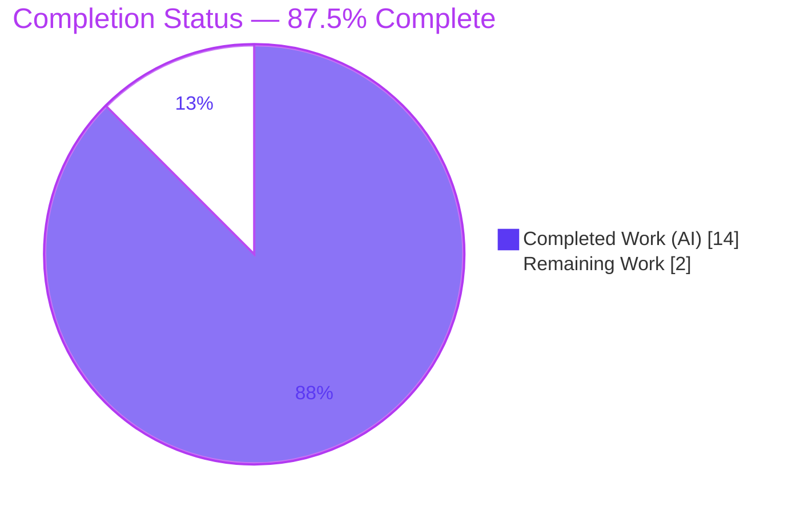
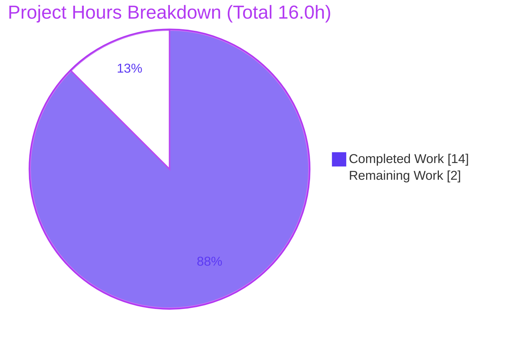
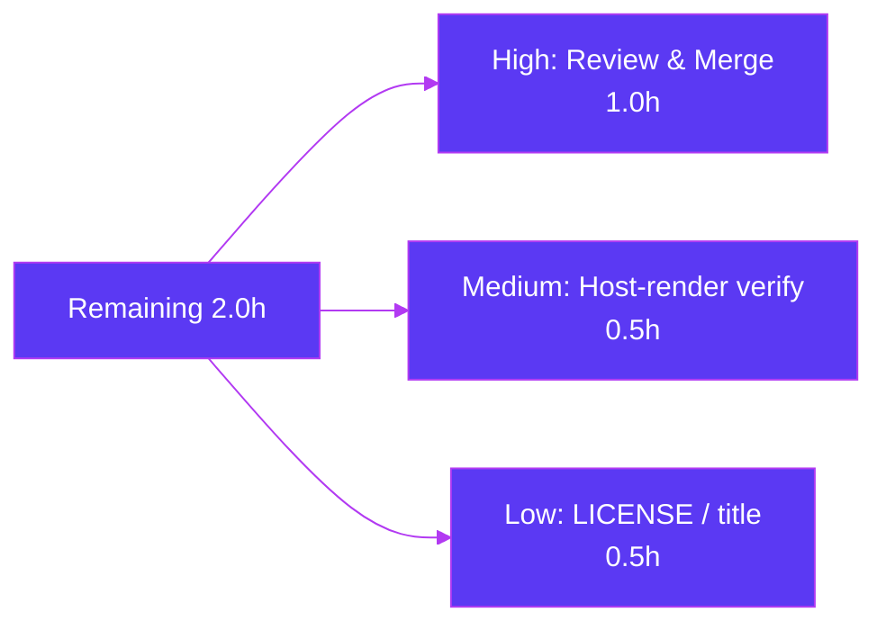

# Blitzy Project Guide — `march_repo_hello_world`

> **Task type:** Documentation-only (JSDoc + comprehensive README)
> **Branch:** `blitzy-cd0c69ba-6790-4b79-a990-3a6d66ede9e2`
> **Final commit:** `ae98b2b` · Working tree clean
> **Brand legend:** 🟪 Completed / AI Work = Dark Blue `#5B39F3` · ⬜ Remaining = White `#FFFFFF`

---

## 1. Executive Summary

### 1.1 Project Overview

`march_repo_hello_world` is a minimal **Node.js standard-library HTTP server** (a single `server.js` built only on the built-in `http` module) that returns a static `Hello, World!\n` plain-text response to every request, regardless of method or path. The objective of this engagement was strictly **documentation**: add JSDoc to `server.js` and expand a one-line `README.md` into a comprehensive guide covering setup, API, deployment, and inline code explanations. Target users are developers who need to run, call, or extend the server. Technical scope is deliberately tiny — two files — with a hard constraint that the server's runtime behavior remain unchanged (comments only).

### 1.2 Completion Status



<div align="center"><strong>🟪 87.5% Complete</strong> — 14.0h of 16.0h delivered</div>

| Metric | Hours |
|--------|-------|
| **Total Hours** | **16.0** |
| Completed Hours (AI + Manual) | 14.0 (AI: 14.0 · Manual: 0.0) |
| Remaining Hours | 2.0 |
| **Percent Complete** | **87.5%** |

> Completion % follows the AAP-scoped (PA1) methodology: `Completed ÷ (Completed + Remaining) = 14.0 ÷ 16.0 = 87.5%`. 100% of AAP deliverables are complete and verified; the remaining 2.0h is path-to-production human work only.

### 1.3 Key Accomplishments

- ✅ **JSDoc coverage raised 0% → 100%** — all 5 documentable symbols in `server.js` annotated (module header, `hostname`, `port`, request-handler callback, startup callback).
- ✅ **Comprehensive `README.md`** — all 4 mandated sections present (Setup/Installation, API Documentation, Deployment Guide, Code Explanation) plus Overview, Features, Prerequisites, Running, Project Structure, Notes, and an 11-anchor Table of Contents.
- ✅ **2 Mermaid diagrams** — request-lifecycle sequence diagram + component-flow diagram.
- ✅ **Worked `curl` examples** — GET, POST (with body), and HEAD, all reproducing verified output.
- ✅ **35 `Source: server.js:Lx` citations** for full code-to-docs traceability.
- ✅ **Behavior preserved** — executable code verified **byte-for-byte identical** to the original 14-line file; `node --check` passes; runtime responses match the docs exactly.
- ✅ **Stale context correctly ignored** — the `build_prompt.md` attachment (an unrelated Python/Express task) was excluded as directed.

### 1.4 Critical Unresolved Issues

| Issue | Impact | Owner | ETA |
|-------|--------|-------|-----|
| _None_ | No blocking issues. All AAP deliverables complete and validated; documentation-only change with byte-identical runtime. | — | — |

### 1.5 Access Issues

| System/Resource | Type of Access | Issue Description | Resolution Status | Owner |
|-----------------|----------------|-------------------|-------------------|-------|
| _None_ | — | No access issues identified. The repository was accessible, the server ran locally, and all validation completed without any credential, permission, or third-party access barriers. | N/A | — |

**No access issues identified.**

### 1.6 Recommended Next Steps

1. **[High]** Review the documentation deliverables (`server.js` JSDoc + `README.md`) for accuracy and tone, confirm the documentation-only constraint holds, then approve and merge the PR (~1.0h).
2. **[Medium]** On the target code host (GitHub/GitLab), verify the README renders correctly — both Mermaid diagrams render, all 11 TOC anchors resolve, and all 13 fenced code blocks display (~0.5h).
3. **[Low]** Optionally add a `LICENSE` (if the project will be distributed) and/or reconcile the README title `march_repo_hello_world` with the connected repository name `November_Hello_World` (~0.5h).

---

## 2. Project Hours Breakdown

### 2.1 Completed Work Detail

| Component | Hours | Description |
|-----------|-------|-------------|
| `server.js` JSDoc (R1) | 2.5 | Module header (`@file`/`@module`/`@description`), `hostname` `@constant {string}`, `port` `@constant {number}`, request-handler `@param`/`@returns` (notes `req` unused), startup-callback block — 5/5 symbols |
| README Overview / Features / Prerequisites | 1.5 | "What is this" overview, feature bullets, Node LTS prerequisite guidance |
| README Setup / Installation (R2) | 1.0 | Clone instructions and explicit "no `npm install` — zero dependencies" guidance |
| README Running the Server | 0.5 | `node server.js` and exact expected stdout |
| README API Documentation (R3) | 2.5 | Catch-all contract table (200/`text/plain`/CL 14), method-boundary (400) note, HEAD nuance, request/response examples |
| README Deployment Guide (R4) | 1.0 | Run command, `127.0.0.1` loopback caveat, `0.0.0.0`/reverse-proxy options, no build step |
| README Code Explanation (R5) | 1.5 | Block-by-block `[L1]`–`[L14]` narrated walkthrough |
| Mermaid diagrams | 1.0 | Request-lifecycle sequence diagram + component-flow diagram |
| README Project Structure / Notes / TOC | 0.5 | Two-file layout, notes (no LICENSE, title-vs-repo), 11-anchor TOC |
| Runtime verification & `curl` testing | 1.0 | Empirical GET/POST/HEAD/DELETE checks and body byte verification |
| QA review cycles & citation reconciliation | 1.0 | CP1 terminology, CP3 fixes, QA citation-drift fix, Content-Length experiment + restore to documentation-only |
| **Total Completed** | **14.0** | Matches Section 1.2 Completed Hours |

### 2.2 Remaining Work Detail

| Category | Hours | Priority |
|----------|-------|----------|
| Human documentation review & PR approval/merge | 1.0 | High |
| Verify README + Mermaid diagrams render on target code host | 0.5 | Medium |
| Optional: add LICENSE / reconcile README title vs repo name | 0.5 | Low |
| **Total Remaining** | **2.0** | — |

> **Integrity:** Section 2.1 (14.0h) + Section 2.2 (2.0h) = **16.0h** Total (Section 1.2). Remaining 2.0h is identical in Sections 1.2, 2.2, and 7.

### 2.3 Basis of Estimate

Estimates use the PA2 framework anchored to AAP scope. All hours trace to a specific AAP requirement (R1–R5, diagrams, examples, citations, behavior-preservation) or a path-to-production activity. Because the executable surface is a 14-line file and the delivery is verified complete, **confidence is High**. The QA-cycle line (1.0h) is grounded in the observed commit history (CP1/CP3/QA-drift/Content-Length experiment + restore). Remaining work is exclusively human-in-the-loop review, host-render verification, and optional polish — the autonomous agents delivered 100% of the AAP scope.

---

## 3. Test Results

There is **no automated test suite** in this repository — none exists and none was requested (AAP §0.8.2 explicitly places tests out of scope). Blitzy's autonomous validation therefore performed **de-facto functional verification** via static syntax checks and live runtime exercise. All results below originate from Blitzy's autonomous validation logs for this project.

| Test Category | Framework / Method | Total | Passed | Failed | Coverage % | Notes |
|---------------|--------------------|-------|--------|--------|------------|-------|
| Automated Unit/Integration | _none configured_ | 0 | 0 | 0 | N/A | No test suite exists; not requested (AAP §0.8.2) |
| Static syntax check | `node --check server.js` | 1 | 1 | 0 | N/A | Exit 0 — parses cleanly with JSDoc |
| Documentation-only integrity | String-aware comment-strip + diff | 1 | 1 | 0 | N/A | Executable code byte-for-byte identical to original |
| Runtime — startup | `node server.js` | 1 | 1 | 0 | N/A | stdout exactly `Server running at http://127.0.0.1:3000/` |
| Runtime — API (functional) | `curl` (GET, POST+body, HEAD, DELETE, PUT, bad-method) | 6 | 6 | 0 | 1/1 endpoint (100%) | Catch-all confirmed; bad method → 400 as documented |
| Documentation coverage | Symbol/section audit | 2 | 2 | 0 | Symbols 5/5, Sections 4/4 | 100% code symbols + 100% mandated sections |
| **Total** | — | **11** | **11** | **0** | — | 100% pass rate across autonomous checks |

---

## 4. Runtime Validation & UI Verification

This is a headless HTTP service with **no UI layer** (plain-text responses only), so UI verification is not applicable. Runtime and API integration were validated empirically.

**Runtime health**
- ✅ **Operational** — Server starts and logs exactly `Server running at http://127.0.0.1:3000/`.
- ✅ **Operational** — `node --check server.js` returns exit 0 (clean parse with JSDoc).
- ✅ **Operational** — Working tree clean; both in-scope files committed (final commit `ae98b2b`).

**API integration outcomes** (all verified via `curl`)
- ✅ **Operational** — `GET /` → `200 OK`, `Content-Type: text/plain`, `Content-Length: 14`, body `Hello, World!\n`.
- ✅ **Operational** — `POST /any/path -d 'x=1'` → identical response (body/path/method ignored — catch-all).
- ✅ **Operational** — `DELETE /xyz`, `PUT /deep/nested?q=1` → identical response.
- ✅ **Operational** — `HEAD /` → `200 OK` + `Content-Type` header, **no body**, no `Content-Length` (documented HEAD nuance).
- ✅ **Operational** — Unrecognized method token (`FOO`) → `400 Bad Request` before reaching the handler (documented method boundary).

**UI verification**
- ⚠ **Partial (deferred to human)** — README Mermaid diagrams and TOC anchors render correctly in Markdown tooling but should be spot-checked on the target code host (GitHub/GitLab) — see Section 6 risk T1 and Section 1.6 step 2.

---

## 5. Compliance & Quality Review

Cross-mapping of AAP deliverables and quality benchmarks to their verified status. All 14 AAP deliverables are complete.

| Benchmark / AAP Deliverable | Requirement | Status | Progress |
|------------------------------|-------------|--------|----------|
| R1 — JSDoc: module header | `@file`/`@module`/`@description` block | ✅ Pass | 100% |
| R1 — JSDoc: `hostname` | `@constant {string}` + loopback note | ✅ Pass | 100% |
| R1 — JSDoc: `port` | `@constant {number}` | ✅ Pass | 100% |
| R1 — JSDoc: request handler | `@param req` (unused) / `@param res` / `@returns` | ✅ Pass | 100% |
| R1 — JSDoc: startup callback | Startup-log description | ✅ Pass | 100% |
| R2 — Setup instructions | Prereqs + clone + "no install" | ✅ Pass | 100% |
| R3 — API documentation | Catch-all contract + examples | ✅ Pass | 100% |
| R4 — Deployment guide | Run cmd + loopback caveat + no build | ✅ Pass | 100% |
| R5 — Inline code explanations | Narrated `server.js` walkthrough | ✅ Pass | 100% |
| Mermaid diagrams | ≥2 (lifecycle + component) | ✅ Pass | 100% (2/2) |
| Worked examples | GET + non-GET `curl` | ✅ Pass | 100% (GET/POST/HEAD) |
| Source citations | `Source: server.js:Lx` per claim | ✅ Pass | 100% (35 citations) |
| Behavior preservation | Comments only, no logic change | ✅ Pass | 100% (byte-identical) |
| Coverage targets (AAP §0.7) | 5/5 symbols, 4/4 sections, 1/1 endpoint | ✅ Pass | 100% |

**Fixes applied during autonomous validation:** CP1 JSDoc terminology alignment; CP3 review fixes (LTS accuracy, citation corrections, diagram MIME); QA systematic `Source:` citation-drift correction; a Content-Length experiment that was subsequently reverted to restore the strict documentation-only state (byte-identical executable code).

**Outstanding compliance items:** None. Optional (out of scope): no `LICENSE` present (README notes its absence); README title differs cosmetically from the repository name (intentional, documented).

---

## 6. Risk Assessment

Overall risk posture is **Low** — a documentation-only change with byte-identical runtime, zero dependencies, and no attack surface beyond a static public string on the loopback interface.

| Risk | Category | Severity | Probability | Mitigation | Status |
|------|----------|----------|-------------|------------|--------|
| T1 — Mermaid diagrams may not render on some Markdown viewers | Technical | Low | Medium | Verify on target host; degrades gracefully to readable fenced code | Open (human) |
| T2 — Doc drift if `server.js` changes without updating README/JSDoc | Technical | Low | Low | 35 `Source:` citations + code↔docs coupling note (AAP §0.5.4) | Mitigated |
| T3 — Reader misapplies `127.0.0.1` loopback config for production | Technical | Low | Low | Deployment Guide explicitly flags `0.0.0.0` / reverse-proxy | Mitigated |
| S1 — No auth/authz on endpoint | Security | Low (Informational) | N/A | By design — static public text, no sensitive data, no input processed | Accepted |
| S2 — Supply-chain / vulnerable dependencies | Security | None | None | Zero third-party dependencies (positive); loopback limits exposure | N/A |
| O1 — No process manager / restart-on-crash | Operational | Low | Low | Use pm2/systemd/reverse proxy for prod (out of scope, documented) | Open (advisory) |
| O2 — No dedicated health-check endpoint | Operational | Low | Low | Catch-all returns 200; usable as a liveness probe | Mitigated |
| O3 — Minimal logging (single startup line) | Operational | Low (Informational) | Low | Acceptable for a minimal service; documented | Accepted |
| I1 — External integrations | Integration | None | None | No DB/APIs/credentials/webhooks exist | N/A |
| I2 — Port 3000 collision with another local process | Integration | Low | Low | Port documented; `EADDRINUSE` resolution in Development Guide | Accepted |

---

## 7. Visual Project Status



**Remaining work by category (Section 2.2 — total 2.0h):**



> **Integrity:** Pie "Completed Work" = 14.0h and "Remaining Work" = 2.0h exactly match Section 1.2 and the Section 2.2 sum. Completed = Dark Blue `#5B39F3`; Remaining = White `#FFFFFF`.

---

## 8. Summary & Recommendations

**Achievements.** The engagement delivered **100% of the AAP-scoped documentation**: JSDoc coverage of `server.js` rose from 0% to 100% (all 5 symbols), and the README grew from a one-line placeholder into a comprehensive guide with all four mandated sections, two Mermaid diagrams, worked `curl` examples, and 35 source citations. Critically, the documentation-only constraint held — the executable code is byte-for-byte identical to the original, `node --check` passes, and live `curl` checks confirm the response contract is unchanged.

**Remaining gaps.** None within the AAP scope. The outstanding **2.0h** is path-to-production human work: documentation review & PR merge (1.0h), host-render verification of Mermaid/TOC (0.5h), and an optional LICENSE/title decision (0.5h).

**Critical path to production.** Human review & merge → host-render spot-check → optional polish. There are no blocking code, compilation, or test tasks.

**Production readiness.** The project is **87.5% complete** and, from an autonomous-delivery standpoint, is production-ready: all validation gates passed with zero unresolved errors. The reserved 12.5% reflects the mandatory human review/merge and final render verification that cannot be performed autonomously — consistent with the principle of never claiming 100% before human sign-off.

| Success Metric | Target | Achieved |
|----------------|--------|----------|
| Code symbols documented | 5/5 | ✅ 5/5 (100%) |
| Mandated README sections | 4/4 | ✅ 4/4 (100%) |
| HTTP endpoints documented | 1/1 | ✅ 1/1 (100%) |
| Mermaid diagrams | ≥2 | ✅ 2 |
| Behavior preserved | Byte-identical | ✅ Verified |
| Autonomous validation gates | All pass | ✅ 5/5 |

---

## 9. Development Guide

Every command below was tested against the live server in this environment.

### 9.1 System Prerequisites

- **Node.js runtime** on any currently supported (non-EOL) LTS line (e.g., 18 / 20 / 22 / 24). Node ships the built-in `http` module this server uses — nothing else is required. Verified locally on **Node v20.20.2**.
- No other tooling: no bundler, transpiler, or package manager step. `npm` (verified 11.1.0) is present but **not used**.

```bash
node --version   # e.g. v20.20.2  (any active/maintenance LTS is fine)
npm --version    # e.g. 11.1.0    (present but NOT used — zero dependencies)
```

### 9.2 Environment Setup

There are **no environment variables** and **no configuration files**. `hostname` (`127.0.0.1`) and `port` (`3000`) are hardcoded constants in `server.js`. The configuration surface is intentionally *none*.

### 9.3 Dependency Installation

**There is no installation step. Do NOT run `npm install`** — the project has zero third-party packages and no `package.json`/lockfile.

```bash
git clone <repo-url>
cd march_repo_hello_world
# No install, no build — ready to run.
```

### 9.4 Application Startup

```bash
# Optional syntax gate (should print nothing and exit 0):
node --check server.js

# Start the server (foreground; Ctrl+C to stop):
node server.js
```

Expected stdout (exact):

```text
Server running at http://127.0.0.1:3000/
```

### 9.5 Verification Steps

```bash
# 1) GET / — the default response
curl -i http://127.0.0.1:3000/

# 2) POST to an arbitrary path with a body — identical response (catch-all)
curl -i -X POST http://127.0.0.1:3000/any/path -d 'x=1'

# 3) HEAD / — headers only, no body
curl -i -I http://127.0.0.1:3000/
```

Expected response for GET/POST (only the `Date` value varies):

```text
HTTP/1.1 200 OK
Content-Type: text/plain
Date: <current-date>
Connection: keep-alive
Keep-Alive: timeout=5
Content-Length: 14

Hello, World!
```

`HEAD /` returns the same status line and `Content-Type` but **no body** and no `Content-Length`.

### 9.6 Example Usage

The server performs no routing: any standard method on any path returns `200 OK` with `text/plain` body `Hello, World!\n` (exactly 14 bytes). Use it as a trivial liveness endpoint or a Node `http` learning reference.

### 9.7 Troubleshooting

| Symptom | Cause | Resolution |
|---------|-------|------------|
| `Error: listen EADDRINUSE: address already in use 127.0.0.1:3000` | Another process (often a prior instance) already holds port 3000 | Find and stop it: `lsof -i :3000` (or `ss -ltnp 'sport = :3000'`), then `kill <PID>`; or free the port before starting. Changing the port requires editing the `port` constant in `server.js`. |
| No response / connection refused from another machine | Server binds loopback `127.0.0.1` (local only) | For remote access, bind `0.0.0.0` or place the process behind a reverse proxy (operational change; not part of this project). |
| `command not found: node` | Node.js not installed / not on PATH | Install an active LTS Node.js release and re-open the shell. |
| Empty body on `HEAD` | Expected per HTTP semantics | `HEAD` returns headers only; use `GET` to see the body. |

---

## 10. Appendices

### A. Command Reference

| Purpose | Command |
|---------|---------|
| Check Node version | `node --version` |
| Syntax gate | `node --check server.js` |
| Run the server | `node server.js` |
| Test GET | `curl -i http://127.0.0.1:3000/` |
| Test POST (body) | `curl -i -X POST http://127.0.0.1:3000/any/path -d 'x=1'` |
| Test HEAD | `curl -i -I http://127.0.0.1:3000/` |
| Find listener on port | `lsof -i :3000` |
| Clean-tree check | `git status --porcelain` |

### B. Port Reference

| Port | Bind Address | Purpose | Configurable |
|------|--------------|---------|--------------|
| 3000 | `127.0.0.1` (loopback) | HTTP listener | Only by editing the `port` constant in `server.js` (no env/CLI/config) |

### C. Key File Locations

| Path | Role |
|------|------|
| `server.js` | The entire HTTP server (Node.js built-in `http`); now carries JSDoc + inline comments |
| `README.md` | Comprehensive project documentation |
| `blitzy/documentation/*` | Platform-generated artifacts (out of scope; not part of the deliverable) |

### D. Technology Versions

| Component | Version | Notes |
|-----------|---------|-------|
| Node.js | v20.20.2 (verified) | Any active/maintenance LTS (18/20/22/24) |
| npm | 11.1.0 (verified) | Present but unused — zero dependencies |
| `http` module | Built-in | Ships with Node.js; not separately versioned |
| Third-party packages | None | No `package.json`, no lockfile |

### E. Environment Variable Reference

| Variable | Purpose | Default |
|----------|---------|---------|
| _None_ | The server reads no environment variables | — |

### F. Developer Tools Guide

No developer tooling is configured (no linter, formatter, test runner, doc generator, or CI). The only relevant tools are the Node.js runtime (to run/verify) and `curl` (to exercise the endpoint). Optional, explicitly out of scope: `jsdoc`/`typedoc` could later generate HTML API docs, but none is required to satisfy this documentation task.

### G. Glossary

| Term | Definition |
|------|------------|
| Catch-all response | The handler ignores method, path, headers, and body, returning the same response to every request |
| Loopback interface | `127.0.0.1` — reachable only from the local machine |
| JSDoc | `/** ... */` comment convention for documenting JavaScript symbols |
| `EADDRINUSE` | OS error indicating the target port is already bound by another process |
| Documentation-only | A change that adds/edits comments and docs without altering executable behavior |

---

*Prepared following the Blitzy Project Guide template. All hours and percentages are cross-section consistent: Section 2.1 (14.0h) + Section 2.2 (2.0h) = 16.0h Total; Remaining 2.0h is identical across Sections 1.2, 2.2, and 7; completion is 87.5% throughout. All Section 3 results originate from Blitzy's autonomous validation logs.*