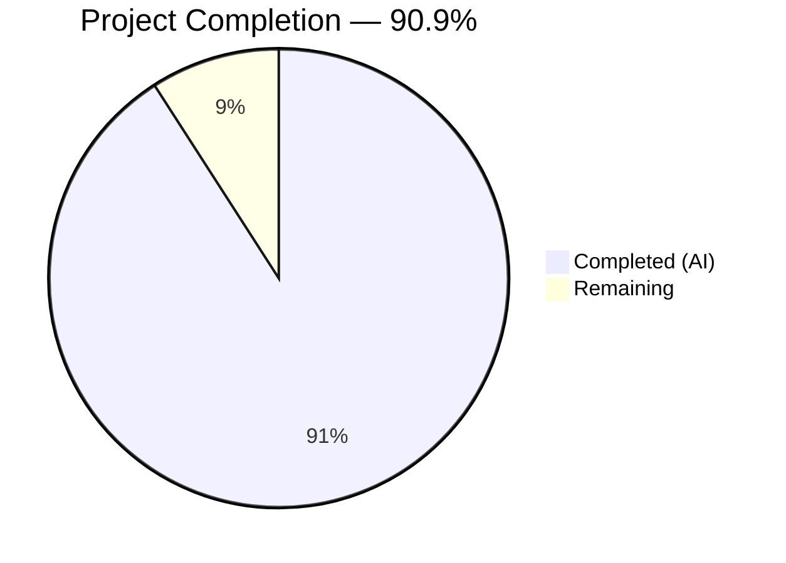
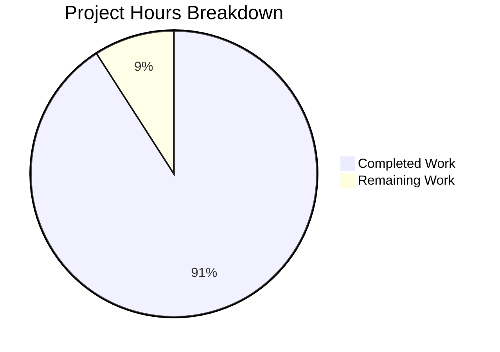

# Blitzy Project Guide — march_repo_hello_world Documentation

---

## 1. Executive Summary

### 1.1 Project Overview

The **march_repo_hello_world** documentation project adds comprehensive inline JSDoc annotations to `server.js` and replaces the single-line placeholder `README.md` with a full-featured project documentation file. The project targets a minimal Node.js HTTP server (14 lines of executable code, zero dependencies) that responds with "Hello, World!" to all HTTP requests. This documentation effort covers setup instructions, API reference, deployment guidance, code walkthrough, and troubleshooting — transforming the repository from 0% to near-complete documentation coverage across both files.

### 1.2 Completion Status

<!-- Pie chart: Completed = Dark Blue #5B39F3, Remaining = White #FFFFFF -->


| Metric | Value |
|---|---|
| **Total Project Hours** | 11 |
| **Completed Hours (AI)** | 10 |
| **Remaining Hours** | 1 |
| **Completion Percentage** | 90.9% (10 / 11) |

### 1.3 Key Accomplishments

- ✅ Added 5 complete JSDoc annotation blocks to `server.js` covering all documentable code elements (`@module`, `@const` × 2, `@description`/`@param` for request handler, `@description` for server listener)
- ✅ Added 10 inline `//` explanatory comments to `server.js` covering all logical code blocks
- ✅ Replaced single-line README placeholder with 302-line comprehensive project documentation
- ✅ Created 12 README sections: Overview, Features, Prerequisites, Installation & Setup, Usage, API Reference, Code Walkthrough, Deployment Guide, Troubleshooting, Project Structure, Contributing, License
- ✅ Embedded 2 Mermaid diagrams (HTTP request-response sequence diagram, application lifecycle flowchart)
- ✅ Documented API endpoint contract with table, basic and verbose `curl` examples — all verified against running server
- ✅ Zero functional code changes — runtime behavior confirmed identical via `node --check` and `curl` testing
- ✅ 3 code review iterations completed with all findings resolved

### 1.4 Critical Unresolved Issues

| Issue | Impact | Owner | ETA |
|---|---|---|---|
| `<repository-url>` placeholder in README clone command | Developers cannot copy-paste the clone command without substituting the actual URL | Human Developer | 0.5 hours |

### 1.5 Access Issues

No access issues identified.

### 1.6 Recommended Next Steps

1. **[Medium]** Replace the `<repository-url>` placeholder in README.md Installation section with the actual Git repository URL
2. **[Low]** Review documentation tone and accuracy for final human sign-off
3. **[Low]** Consider adding a `LICENSE` file (MIT or Apache 2.0) as noted in the README License section

---

## 2. Project Hours Breakdown

### 2.1 Completed Work Detail

| Component | Hours | Description |
|---|---|---|
| JSDoc Documentation (server.js) | 2 | File-level `@module` block, `@const`/`@type` blocks for hostname and port, `@description`/`@param`/`@type` for request handler callback, `@description` for server.listen, inline `//` comments for all code blocks |
| README — Setup & Usage | 1 | Prerequisites section (Node.js requirement, version check), Installation & Setup (clone, no-install note), Usage (start/test/stop commands with expected output) |
| README — API Documentation | 1.5 | Endpoint contract table (URL, method, status, headers, body), basic and verbose `curl` examples with expected output, Mermaid sequence diagram for request-response flow |
| README — Deployment Guide | 1 | Local execution instructions, loopback binding explanation, network exposure guidance, port availability notes, process management suggestions (pm2, systemd, nohup) |
| README — Code Walkthrough | 2 | 4 annotated code blocks (module import, server configuration, server creation/request handler, server startup), Mermaid flowchart for application lifecycle, explanatory narrative |
| README — Additional Sections | 1 | Project overview and description, features list, Node.js badge, troubleshooting (4 common errors), project structure tree, contributing guidelines, license status note |
| Validation & Quality Assurance | 1.5 | Syntax validation (node --check), runtime testing (server start/response), curl output verification against documentation, 3 code review iteration fixes (terminology consistency, factual accuracy, Content-Length header) |
| **Total** | **10** | |

### 2.2 Remaining Work Detail

| Category | Hours | Priority |
|---|---|---|
| Human Documentation Review & Approval | 0.5 | Medium |
| Repository URL Placeholder Replacement | 0.5 | Low |
| **Total** | **1** | |

### 2.3 Hours Calculation

```
Completed Hours:  10h (AAP-scoped documentation work delivered by Blitzy agents)
Remaining Hours:   1h (path-to-production human tasks)
Total Hours:      11h (10 + 1)
Completion:       10 / 11 = 90.9%
```

---

## 3. Test Results

| Test Category | Framework | Total Tests | Passed | Failed | Coverage % | Notes |
|---|---|---|---|---|---|---|
| Syntax Validation | `node --check` | 1 | 1 | 0 | 100% | `node --check server.js` confirms valid JavaScript syntax |
| Runtime Validation | Node.js + curl | 3 | 3 | 0 | 100% | Server startup, HTTP 200 response, correct response body verified |
| Documentation Accuracy | Manual / curl | 2 | 2 | 0 | 100% | Basic and verbose curl outputs match README examples exactly |
| **Total** | | **6** | **6** | **0** | **100%** | |

> **Note:** No formal test suite (unit, integration, or e2e) exists in this repository. This is a documentation-only project per the AAP scope. The tests above were executed by Blitzy's autonomous validation system to verify that documentation changes did not affect runtime behavior and that documented examples are accurate.

---

## 4. Runtime Validation & UI Verification

### Runtime Health

- ✅ **Server Startup:** `node server.js` produces `Server running at http://127.0.0.1:3000/` on stdout
- ✅ **HTTP Response (body):** `curl http://127.0.0.1:3000/` returns `Hello, World!`
- ✅ **HTTP Response (status):** Returns `200 OK`
- ✅ **HTTP Response (headers):** Returns `Content-Type: text/plain`
- ✅ **Server Shutdown:** Responds to SIGINT (Ctrl+C) and terminates cleanly
- ✅ **Syntax Integrity:** `node --check server.js` passes — JSDoc comments do not affect parsing

### Documentation Verification

- ✅ **JSDoc Blocks:** All 5 JSDoc annotation blocks present and correctly formatted (`/**` opening)
- ✅ **Inline Comments:** 10 inline `//` comments present across all logical code sections
- ✅ **README Sections:** All 12 sections present with correct heading hierarchy (H1 → H2 → H3)
- ✅ **Mermaid Diagrams:** 2 diagrams embedded using valid Mermaid syntax (sequenceDiagram, flowchart)
- ✅ **Curl Examples:** 7 curl references in README, basic and verbose outputs verified against running server
- ✅ **Code Walkthrough:** 4 annotated code blocks covering all logical sections of server.js

### UI Verification

- ⚠️ **Not Applicable:** This project has no user interface. The server returns plain text only.

---

## 5. Compliance & Quality Review

| AAP Requirement | Deliverable | Status | Evidence |
|---|---|---|---|
| Req 1 — JSDoc Comments | File-level `@module` block | ✅ Pass | server.js lines 1–11: `@module`, `@description`, `@requires`, `@example` tags |
| Req 1 — JSDoc Comments | `@const` for hostname | ✅ Pass | server.js lines 18–23: `@const {string}`, `@description`, `@default` |
| Req 1 — JSDoc Comments | `@const` for port | ✅ Pass | server.js lines 26–31: `@const {number}`, `@description`, `@default` |
| Req 1 — JSDoc Comments | Request handler documentation | ✅ Pass | server.js lines 34–42: `@description`, `@type {http.Server}`, `@param` for req/res |
| Req 1 — JSDoc Comments | Server listen documentation | ✅ Pass | server.js lines 52–56: `@description` for listen + startup logger |
| Req 1 — JSDoc Comments | Inline `//` comments | ✅ Pass | 10 inline comments covering all logical code blocks |
| Req 2 — Setup Instructions | Prerequisites, Installation, Usage | ✅ Pass | README.md sections: Prerequisites (lines 19–30), Installation (32–41), Usage (43–73) |
| Req 3 — API Documentation | Endpoint contract, curl examples, diagram | ✅ Pass | README.md API Reference (lines 75–135): table, 2 curl examples, Mermaid sequence diagram |
| Req 4 — Deployment Guide | Local, loopback, network, port, process mgmt | ✅ Pass | README.md Deployment Guide (lines 212–244): 5 subsections |
| Req 5 — Code Walkthrough | Annotated snippets, narrative, diagram | ✅ Pass | README.md Code Walkthrough (lines 137–210): 4 code blocks, Mermaid flowchart |
| Inferred — Troubleshooting | Common errors and solutions | ✅ Pass | README.md Troubleshooting (lines 246–278): 4 error scenarios |
| Inferred — Project Structure | File tree | ✅ Pass | README.md Project Structure (lines 280–286) |
| Inferred — Contributing | Contribution guidelines | ✅ Pass | README.md Contributing (lines 288–298) |
| Inferred — License | License status note | ✅ Pass | README.md License (lines 300–302) |
| Quality — No Functional Changes | Runtime behavior unchanged | ✅ Pass | `node --check` PASS, curl output identical to pre-documentation state |
| Quality — Consistent Terminology | "request handler," "loopback," "startup" | ✅ Pass | Terminology consistent across server.js JSDoc and README.md |
| Quality — Mermaid Diagrams | 2 diagrams with valid syntax | ✅ Pass | sequenceDiagram (line 128) and flowchart (line 200) present |
| Quality — Curl Examples | ≥2 examples (basic + verbose) | ✅ Pass | 7 curl references, basic and verbose examples verified |

### Autonomous Fixes Applied

| Fix | Commit | Description |
|---|---|---|
| JSDoc Review Findings | `531a728` | Addressed code review findings in server.js JSDoc comments |
| Terminology & Accuracy | `5c02f42` | Resolved 3 MINOR findings — terminology consistency and factual accuracy |
| Content-Length Header | `45ddc8f` | Added missing Content-Length header to verbose curl example in README |

---

## 6. Risk Assessment

| Risk | Category | Severity | Probability | Mitigation | Status |
|---|---|---|---|---|---|
| `<repository-url>` placeholder prevents copy-paste clone command | Operational | Low | High | Human developer replaces placeholder with actual repository URL | Open |
| No LICENSE file in repository | Operational | Low | Medium | README License section notes the gap and suggests adding MIT/Apache 2.0 | Open |
| No error handling in server.js (EADDRINUSE, etc.) | Technical | Low | Low | Troubleshooting section documents common errors and resolutions; out of AAP scope | Accepted |
| Hardcoded hostname/port with no override mechanism | Technical | Low | Low | Deployment Guide documents the configuration values and how to modify them | Accepted |
| No automated test suite | Technical | Low | Low | Documentation-only project per AAP scope; runtime validation confirms functionality | Accepted |
| Mermaid diagrams depend on renderer support | Integration | Low | Low | GitHub, GitLab, and most modern Markdown renderers support Mermaid natively | Accepted |

---

## 7. Visual Project Status



**Breakdown:**
- **Completed Work:** 10 hours — All 5 AAP requirements delivered and validated (JSDoc documentation, README setup instructions, API documentation, deployment guide, code walkthrough, plus additional sections and validation)
- **Remaining Work:** 1 hour — Human documentation review (0.5h) and repository URL placeholder replacement (0.5h)

---

## 8. Summary & Recommendations

### Achievements

The Blitzy autonomous agents successfully delivered all 5 core documentation requirements defined in the Agent Action Plan, achieving **90.9% completion** (10 hours completed out of 11 total project hours). The `server.js` file now has complete JSDoc annotations covering all 5 documentable code elements plus 10 inline explanatory comments. The `README.md` was transformed from a single-line placeholder into a 302-line comprehensive project document with 12 sections, 2 Mermaid diagrams, and verified curl examples. Three code review iterations were completed autonomously, resolving all findings. Zero issues remain from autonomous validation.

### Remaining Gaps

The only outstanding items are a `<repository-url>` placeholder in the README clone command (requires the actual Git URL) and a final human review of documentation quality and tone. Both items require minimal human effort (1 hour total).

### Production Readiness

The documentation is production-ready for merge after the placeholder URL is replaced and human review is completed. All runtime behavior was verified unchanged — `node --check` passes and `curl` responses match the documented API contract exactly. No functional code was altered.

### Success Metrics

| Metric | Target | Actual |
|---|---|---|
| JSDoc code elements annotated | 5/5 | 5/5 ✅ |
| README sections delivered | 4 required + extras | 12 sections ✅ |
| Mermaid diagrams | 2 | 2 ✅ |
| Curl examples | ≥2 | 7 references ✅ |
| Runtime integrity | No functional changes | Verified ✅ |
| Validation issues | 0 | 0 ✅ |

---

## 9. Development Guide

### System Prerequisites

| Requirement | Version | Purpose |
|---|---|---|
| Node.js | ≥ 4.0.0 (LTS recommended; v20.x verified) | JavaScript runtime for server.js |
| curl (optional) | Any modern version | HTTP client for testing the server |

**No additional tools, package managers, or dependencies are required.** The project has zero external dependencies and no `package.json`.

### Environment Setup

1. **Verify Node.js installation:**

```bash
node --version
```

Expected output: a version number (e.g., `v20.20.1`). If not found, install Node.js from [nodejs.org](https://nodejs.org/).

2. **Clone the repository:**

```bash
git clone <repository-url>
cd march_repo_hello_world
```

> **Note:** Replace `<repository-url>` with the actual Git repository URL.

3. **No dependency installation needed.** The project uses only the Node.js built-in `http` module.

### Application Startup

```bash
node server.js
```

**Expected output:**

```
Server running at http://127.0.0.1:3000/
```

The server runs in the foreground and listens on `127.0.0.1:3000` (loopback interface only).

### Verification Steps

1. **Verify HTTP response:**

```bash
curl http://127.0.0.1:3000/
```

Expected: `Hello, World!`

2. **Verify headers and status code:**

```bash
curl -v http://127.0.0.1:3000/
```

Expected: HTTP/1.1 200 OK, Content-Type: text/plain, body: Hello, World!

3. **Verify syntax integrity (after documentation changes):**

```bash
node --check server.js
```

Expected: No output (exit code 0 = valid syntax).

### Stopping the Server

Press `Ctrl+C` in the terminal running the server to send SIGINT and stop it.

### Troubleshooting

| Error | Cause | Solution |
|---|---|---|
| `Error: listen EADDRINUSE: address already in use 127.0.0.1:3000` | Port 3000 is occupied by another process | Kill the occupying process or change `port` in server.js |
| `command not found: node` | Node.js not installed or not in PATH | Install from nodejs.org |
| `curl: (7) Failed to connect to 127.0.0.1 port 3000` | Server is not running | Start it with `node server.js` first |
| Cannot access from another machine | Server binds to loopback (127.0.0.1) | Change `hostname` to `'0.0.0.0'` in server.js (security implications apply) |

---

## 10. Appendices

### A. Command Reference

| Command | Purpose |
|---|---|
| `node server.js` | Start the HTTP server |
| `node --check server.js` | Validate JavaScript syntax without executing |
| `node --version` | Display installed Node.js version |
| `curl http://127.0.0.1:3000/` | Test server response (basic) |
| `curl -v http://127.0.0.1:3000/` | Test server response (verbose, shows headers) |
| `curl -sI http://127.0.0.1:3000/` | Fetch response headers only |
| `Ctrl+C` | Stop the running server (SIGINT) |

### B. Port Reference

| Port | Service | Protocol | Binding |
|---|---|---|---|
| 3000 | HTTP server (server.js) | HTTP/1.1 | 127.0.0.1 (loopback only) |

### C. Key File Locations

| File | Purpose | Lines |
|---|---|---|
| `server.js` | HTTP server entry point with JSDoc annotations | 60 |
| `README.md` | Comprehensive project documentation | 302 |

### D. Technology Versions

| Technology | Version | Notes |
|---|---|---|
| Node.js (runtime) | v20.20.1 (verified) | Minimum compatible: v4.0.0 |
| `http` module | Built-in (bundled with Node.js) | No installation required |
| JSDoc syntax | JSDoc 3/4 conventions | Comments only; no HTML generator configured |
| Markdown | GitHub-Flavored Markdown (GFM) | Native rendering on GitHub/GitLab |
| Mermaid | Standard syntax (GitHub-supported) | 2 diagrams embedded in README |

### E. Environment Variable Reference

No environment variables are used by this project. All configuration (`hostname`, `port`) is hardcoded in `server.js`.

### G. Glossary

| Term | Definition |
|---|---|
| JSDoc | A documentation standard for JavaScript that uses `/** */` comment blocks with special tags (`@param`, `@type`, `@const`, etc.) |
| Loopback interface | The network interface at `127.0.0.1` that routes traffic only within the local machine |
| Request handler | The callback function passed to `http.createServer()` that processes each incoming HTTP request |
| Startup logger | The callback function passed to `server.listen()` that logs the server URL when binding succeeds |
| CommonJS | The module system used by Node.js, using `require()` for imports and `module.exports` for exports |
| EADDRINUSE | A system error indicating that the requested network address (host:port) is already bound by another process |