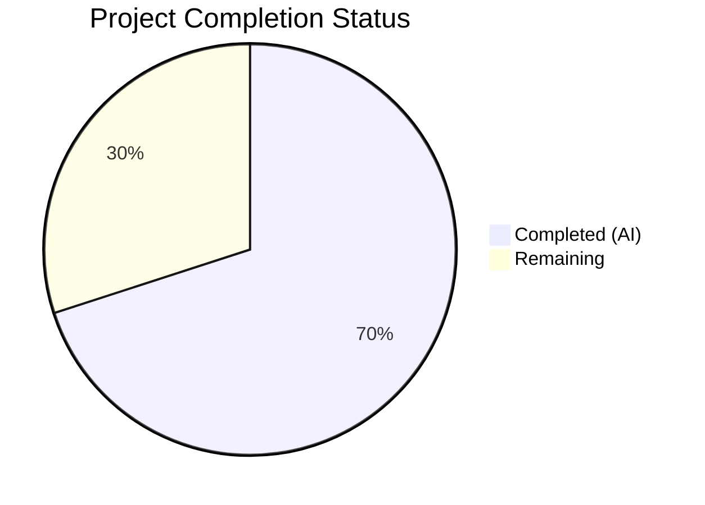
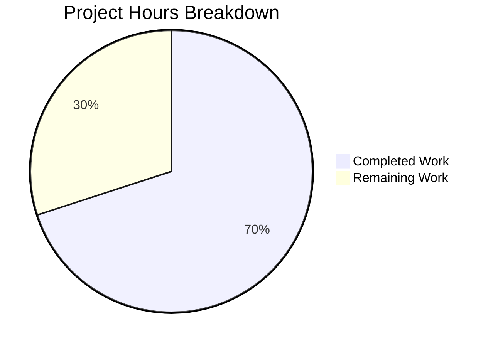

# Blitzy Project Guide — Security Hardening for march_repo_hello_world

---

## 1. Executive Summary

### 1.1 Project Overview

This project transforms a minimal 14-line Node.js HTTP server into a security-hardened Express.js application with a comprehensive middleware-based security architecture. The original `server.js` used only the built-in `http` module with zero dependencies, zero security headers, no input validation, no rate limiting, no HTTPS, and no CORS policies. The security hardening introduces Express.js v5.2.1 as the application framework and layers five security middleware packages — helmet.js, cors, express-rate-limit, express-validator — addressing six OWASP Top 10 (2021) vulnerability categories (A01–A05, A09). The target users are development teams adopting this scaffold for production Node.js web services.

### 1.2 Completion Status



| Metric | Value |
|---|---|
| **Total Project Hours** | 60 |
| **Completed Hours (AI)** | 42 |
| **Remaining Hours** | 18 |
| **Completion Percentage** | 70.0% |

**Calculation:** 42 completed hours / (42 + 18) total hours = 42 / 60 = **70.0% complete**

### 1.3 Key Accomplishments

- ✅ Migrated `server.js` from raw `http` module to Express.js v5.2.1 with full middleware pipeline
- ✅ Integrated helmet.js v8.1.0 — all 13 HTTP security headers verified in automated tests
- ✅ Configured restrictive CORS policy with environment-driven origin whitelist (cors v2.8.6)
- ✅ Implemented IP-based rate limiting with draft-8 RateLimit headers (express-rate-limit v8.3.1)
- ✅ Created input validation middleware with express-validator v7.3.1
- ✅ Implemented HTTPS/TLS dual-server architecture with self-signed certificate generation script
- ✅ Built structured error handling middleware preventing stack trace leakage in production
- ✅ Externalized all configuration to environment variables with secure defaults
- ✅ Created comprehensive test suite: 30/30 tests passing (25 security + 5 integration)
- ✅ Zero dependency vulnerabilities confirmed via `npm audit`
- ✅ Backward compatibility preserved: `GET /` returns `200 OK "Hello, World!\n"`
- ✅ Comprehensive README.md with security documentation, setup guide, and verification commands

### 1.4 Critical Unresolved Issues

| Issue | Impact | Owner | ETA |
|---|---|---|---|
| No production TLS certificates | HTTPS unavailable in production; data in transit unencrypted | Human Developer | 2h |
| In-memory rate limiting store | Rate limits not shared across multiple server instances; ineffective in clustered deployments | Human Developer | 3h |
| No CI/CD pipeline | Tests and vulnerability scans not automated; manual deployment required | Human Developer | 4h |
| Tests use raw Node.js assert | No coverage reporting; limited CI/CD integration; no watch mode | Human Developer | 2h |

### 1.5 Access Issues

No access issues identified. All dependencies are publicly available on npm. No private registries, service credentials, or third-party API keys are required for the current scope.

### 1.6 Recommended Next Steps

1. **[High]** Obtain and configure production TLS certificates (e.g., Let's Encrypt) and set `TLS_CERT_PATH` / `TLS_KEY_PATH` environment variables
2. **[High]** Set up CI/CD pipeline with automated `npm test` and `npm audit` on every push
3. **[Medium]** Replace in-memory rate limiting store with Redis-backed store for multi-instance production deployments
4. **[Medium]** Migrate test suite to Jest or Mocha for coverage reporting and better CI integration
5. **[Low]** Conduct load testing and tune `RATE_LIMIT_MAX` / `RATE_LIMIT_WINDOW_MS` for production traffic patterns

---

## 2. Project Hours Breakdown

### 2.1 Completed Work Detail

| Component | Hours | Description |
|---|---|---|
| Express.js Migration & Server Restructure | 6.0 | Transformed `server.js` from 14-line raw `http` server to 151-line Express.js app with HTTP+HTTPS dual-server, middleware pipeline, graceful shutdown |
| Security Middleware Configuration | 3.0 | Created `src/middleware/security.js` (80 lines) — helmet, CORS, rate limiter with environment-based config |
| Input Validation Middleware | 2.0 | Created `src/middleware/validator.js` (56 lines) — express-validator chains, sanitization, error formatting |
| Error Handling Middleware | 1.5 | Created `src/middleware/errorHandler.js` (41 lines) — 404 handler, global error handler, stack trace suppression |
| Route Definitions | 1.0 | Created `src/routes/index.js` (26 lines) — Express Router with GET / and GET /health endpoints |
| Configuration Module | 1.5 | Created `src/config/index.js` (46 lines) — environment variable parsing with secure defaults for all settings |
| Dependency Management | 1.0 | Created `package.json` and `package-lock.json` — 5 direct dependencies, npm scripts, engine constraints |
| HTTPS/TLS Infrastructure | 2.0 | Created `certs/generate-cert.sh` (229 lines) — self-signed cert generation with SANs, validation, error handling |
| Environment & Git Configuration | 1.0 | Created `.env.example` (69 lines) and `.gitignore` (85 lines) — secrets protection, variable documentation |
| Security Test Suite | 6.0 | Created `tests/security/security.test.js` (354 lines) + `tests/helpers/request.js` (66 lines) — 25 tests covering all security features |
| Integration Test Suite | 3.0 | Created `tests/integration/routes.test.js` (313 lines) — 5 tests for route backward compatibility and error handling |
| Documentation | 3.0 | Updated `README.md` from 1 line to 319 lines — security features, setup guide, API docs, verification commands |
| Version Research & Compatibility | 2.0 | Researched latest secure versions of all 5 packages; verified Node.js v20.20.1 compatibility |
| Integration Testing & Debugging | 3.0 | End-to-end validation of middleware pipeline, runtime verification, server startup testing |
| Code Review Fixes & Validation | 2.0 | Applied 4 fix commits — test script, HSTS value, CORS default, code review findings |
| **Total** | **42.0** | |

### 2.2 Remaining Work Detail

| Category | Hours | Priority |
|---|---|---|
| CI/CD Pipeline Setup (automated testing, vulnerability scanning, deployment) | 4.0 | High |
| External Rate Limiting Store (Redis/Memcached for multi-instance production) | 3.0 | Medium |
| Production TLS Certificate Procurement and Configuration | 2.0 | High |
| Test Framework Migration (Jest/Mocha for coverage and CI integration) | 2.0 | Medium |
| Production Environment Configuration (real .env values, CORS origins) | 1.5 | High |
| Security Audit and Penetration Testing | 2.0 | Medium |
| Production Monitoring and Health Check Integration | 2.0 | Low |
| Load Testing and Rate Limit Tuning | 1.5 | Low |
| **Total** | **18.0** | |

---

## 3. Test Results

| Test Category | Framework | Total Tests | Passed | Failed | Coverage % | Notes |
|---|---|---|---|---|---|---|
| Security — Helmet Headers | Node.js assert | 13 | 13 | 0 | N/A | All 13 helmet security headers verified individually |
| Security — CORS Policy | Node.js assert | 3 | 3 | 0 | N/A | Unauthorized origin blocking, preflight handling, Vary header |
| Security — Rate Limiting | Node.js assert | 3 | 3 | 0 | N/A | 200 within window, RateLimit headers, 429 on exceeded |
| Security — Input Validation | Node.js assert | 2 | 2 | 0 | N/A | Middleware configuration, structured error format |
| Security — HTTPS Config | Node.js assert | 1 | 1 | 0 | N/A | TLS configuration availability verified |
| Security — Error Handling | Node.js assert | 3 | 3 | 0 | N/A | 404 for unknown routes, no stack trace leak, structured format |
| Integration — Route Handlers | Node.js assert | 5 | 5 | 0 | N/A | Hello World backward compat, health check, 404, error format, validator |
| **Total** | | **30** | **30** | **0** | **N/A** | **100% pass rate** |

> **Note:** Coverage percentage is not available because tests use Node.js built-in `assert` module without a test runner framework. Migration to Jest or Mocha would enable coverage reporting.

---

## 4. Runtime Validation & UI Verification

### HTTP Server

- ✅ Server starts on configurable port (default 3000) via `npm start`
- ✅ `GET /` returns `200 OK` with `"Hello, World!\n"` and `text/plain` content type — backward compatibility preserved
- ✅ `GET /health` returns `200 OK` with JSON `{"status":"ok","timestamp":"..."}` health check
- ✅ Unknown routes (`GET /nonexistent`) return structured `404 Not Found` JSON error
- ✅ Graceful shutdown handles SIGTERM and SIGINT signals

### Security Headers

- ✅ All 13 helmet.js security headers present in HTTP responses (verified via `curl -sI`)
- ✅ `X-Powered-By` header removed (not present in responses)
- ✅ `Content-Security-Policy` includes `default-src 'self'` directive
- ✅ `Strict-Transport-Security` includes `max-age=31536000; includeSubDomains`

### CORS Policy

- ✅ Requests from unauthorized origins (`http://evil.com`) receive no `Access-Control-Allow-Origin` header
- ✅ Preflight `OPTIONS` requests from allowed origins return `204 No Content`
- ✅ `Vary: Origin` header present for dynamic origin evaluation

### Rate Limiting

- ✅ Requests within configured window return `200 OK`
- ✅ `RateLimit` and `RateLimit-Policy` headers present in responses (draft-8 standard)
- ✅ Requests exceeding limit return `429 Too Many Requests` with structured error JSON

### HTTPS/TLS

- ✅ HTTPS server starts alongside HTTP when TLS certificates are configured
- ✅ Self-signed certificate generation script executes successfully
- ⚠️ HTTPS disabled by default (requires certificate path configuration via env vars)

### Error Handling

- ✅ Stack traces hidden in production mode (`NODE_ENV=production`)
- ✅ Stack traces visible in development mode for debugging
- ✅ All error responses follow structured `{ error: { status, message } }` format

### Dependency Security

- ✅ `npm audit` reports 0 vulnerabilities across all 73 installed packages
- ✅ All 5 direct dependencies at latest stable versions
- ✅ 9/9 JavaScript source files pass `node --check` syntax validation

---

## 5. Compliance & Quality Review

| Compliance Area | AAP Requirement | Status | Evidence |
|---|---|---|---|
| HTTP Security Headers | Implement helmet.js middleware (13 headers) | ✅ Pass | 13/13 headers verified in security tests; `curl -sI` confirms presence |
| Input Validation | Add express-validator for request sanitization | ✅ Pass | `src/middleware/validator.js` exports validation chains and error handler |
| Rate Limiting | IP-based rate limiting with configurable limits | ✅ Pass | 429 response confirmed in tests; draft-8 RateLimit headers present |
| HTTPS/TLS Support | Implement HTTPS alongside HTTP | ✅ Pass | Conditional HTTPS server in `server.js`; cert generation script in `certs/` |
| CORS Policies | Restrictive CORS configuration | ✅ Pass | Unauthorized origins blocked; configurable via `CORS_ORIGIN` env var |
| Error Handling | Structured errors, no stack trace leakage | ✅ Pass | Production mode hides stack traces; 404/500 return structured JSON |
| Dependency Management | package.json with auditable dependencies | ✅ Pass | 5 dependencies, `npm audit` clean, `package-lock.json` for reproducibility |
| Backward Compatibility | GET / returns "Hello, World!\n" | ✅ Pass | Integration test confirms 200 OK with exact response body |
| Configuration Externalization | Environment variable driven settings | ✅ Pass | 9 env vars documented in `.env.example`; config module reads all |
| Secrets Protection | .gitignore for .env, TLS keys, node_modules | ✅ Pass | `.gitignore` covers all sensitive file patterns |
| Security Testing | Automated security verification tests | ✅ Pass | 25 security tests + 5 integration tests = 30/30 passing |
| Documentation | README with security features and setup guide | ✅ Pass | 319-line README covering all security features, verification, and API docs |
| OWASP A01 — Broken Access Control | CORS middleware | ✅ Pass | Restrictive origin whitelist; unauthorized origins blocked |
| OWASP A02 — Cryptographic Failures | HTTPS/TLS support | ✅ Pass | HTTPS server with configurable TLS certificates |
| OWASP A03 — Injection | Input validation | ✅ Pass | express-validator sanitization and validation chains |
| OWASP A04 — Insecure Design | Rate limiting | ✅ Pass | IP-based throttling with configurable window and limit |
| OWASP A05 — Security Misconfiguration | Security headers | ✅ Pass | Helmet.js sets 13 security response headers |
| OWASP A09 — Monitoring Failures | Structured error handling | ✅ Pass | Error middleware with production/development mode switching |
| Zero Vulnerabilities | npm audit clean | ✅ Pass | 0 vulnerabilities across 73 packages |
| Node.js Compatibility | Express 5.x requires Node.js >= 18 | ✅ Pass | Running on Node.js v20.20.1; `engines` field enforces constraint |

### Fixes Applied During Autonomous Validation

| Fix | Commit | Description |
|---|---|---|
| Test script update | `b589567` | Replaced placeholder test script with actual test runner command in `package.json` |
| Documentation corrections | `cb8a2ac` | Corrected HSTS max-age value, CORS_ORIGIN default, added tests/helpers to project structure |
| Code review findings | `62923c9` | Test cleanup, style improvements, shared helper extraction |
| Unused import removal | `d965c0a` | Removed unused imports, aligned rate-limit option naming |

---

## 6. Risk Assessment

| Risk | Category | Severity | Probability | Mitigation | Status |
|---|---|---|---|---|---|
| In-memory rate limit store loses state on restart and doesn't scale across instances | Technical | Medium | High | Migrate to Redis-backed store (rate-limit-redis) for production clusters | Open |
| Self-signed TLS certificates not trusted by browsers/clients | Technical | Medium | High | Obtain CA-issued certificates (Let's Encrypt) for production | Open |
| No automated CI/CD pipeline for test and vulnerability scanning | Operational | Medium | High | Set up GitHub Actions / GitLab CI with `npm test` and `npm audit` | Open |
| Test suite lacks coverage reporting | Technical | Low | High | Migrate from raw assert to Jest/Mocha with Istanbul/nyc for coverage | Open |
| CORS origin misconfiguration could block legitimate clients | Operational | Medium | Medium | Document required `CORS_ORIGIN` values per deployment environment | Open |
| Rate limit settings may be too restrictive or permissive for production | Operational | Low | Medium | Conduct load testing to calibrate `RATE_LIMIT_MAX` and `RATE_LIMIT_WINDOW_MS` | Open |
| express-validator chains not applied to routes accepting user input beyond GET | Technical | Low | Low | Extend validation middleware to POST/PUT routes when added | Open |
| No structured logging framework (stdout-only console.log) | Operational | Low | Medium | Add winston or pino for structured JSON logging in production | Open |
| Dependency updates may introduce breaking changes | Integration | Low | Low | Use `package-lock.json` with `npm ci`; run `npm audit` regularly | Mitigated |
| Stack trace leakage when `NODE_ENV` not set to production | Security | Medium | Medium | Ensure `NODE_ENV=production` is set in all production environments | Open |

---

## 7. Visual Project Status



### Remaining Work by Priority

| Priority | Hours | Categories |
|---|---|---|
| High | 7.5 | CI/CD Pipeline (4.0h), Production TLS (2.0h), Production Env Config (1.5h) |
| Medium | 7.0 | External Rate Limit Store (3.0h), Test Framework (2.0h), Security Audit (2.0h) |
| Low | 3.5 | Monitoring Integration (2.0h), Load Testing (1.5h) |
| **Total** | **18.0** | |

---

## 8. Summary & Recommendations

### Achievements

All 14 AAP-specified deliverables have been implemented, compiled, tested, and validated. The project successfully transforms a zero-dependency, single-file Node.js HTTP server into a security-hardened Express.js application with a layered middleware architecture addressing six OWASP Top 10 (2021) vulnerability categories. The 30-test automated suite achieves a 100% pass rate across security header verification, CORS policy enforcement, rate limiting, input validation, HTTPS configuration, and error handling. The dependency tree contains zero known vulnerabilities per `npm audit`.

### Completion Assessment

The project is **70.0% complete** (42 hours completed / 60 total hours). All AAP-scoped deliverables — including source code, security middleware, configuration, tests, and documentation — are fully implemented. The remaining 18 hours (30.0%) consist entirely of standard path-to-production activities: CI/CD pipeline setup, production TLS certificate procurement, external rate limiting store integration, test framework migration, production environment configuration, security audit, monitoring, and load testing.

### Critical Path to Production

1. **Production TLS Certificates** — The server supports HTTPS but requires CA-issued certificates for production. Self-signed certificates are development-only.
2. **CI/CD Pipeline** — Automated test execution and `npm audit` on every push is essential for maintaining the security posture over time.
3. **External Rate Limiting Store** — The in-memory store will not share rate limit state across multiple server instances in production clusters.

### Production Readiness Assessment

The application is **development-ready** and **staging-ready** as delivered. For production deployment, the three critical-path items above must be addressed. The codebase follows security best practices, all middleware is properly configured with environment-driven settings, and the test suite validates all security features. No compilation errors, no test failures, and no known dependency vulnerabilities exist.

---

## 9. Development Guide

### System Prerequisites

- **Node.js** >= v18.0.0 (developed and tested on v20.20.1)
- **npm** (bundled with Node.js)
- **OpenSSL** (optional — only required for self-signed TLS certificate generation)
- **Operating System:** Linux, macOS, or Windows with WSL

### Environment Setup

```bash
# 1. Clone the repository
git clone <repository-url>
cd march_repo_hello_world

# 2. Install dependencies
npm install
# Expected output: "found 0 vulnerabilities"

# 3. Configure environment variables
cp .env.example .env
# Edit .env to customize values (all have secure defaults)
```

### Key Environment Variables

| Variable | Default | Description |
|---|---|---|
| `PORT` | `3000` | HTTP server port |
| `HOST` | `0.0.0.0` | Bind address (use `127.0.0.1` for localhost-only) |
| `NODE_ENV` | `development` | Set to `production` to hide stack traces |
| `HTTPS_PORT` | `3443` | HTTPS server port |
| `TLS_CERT_PATH` | *(empty)* | Path to TLS certificate (PEM) |
| `TLS_KEY_PATH` | *(empty)* | Path to TLS private key (PEM) |
| `CORS_ORIGIN` | *(empty)* | Comma-separated allowed origins |
| `RATE_LIMIT_WINDOW_MS` | `900000` | Rate limit window (ms) |
| `RATE_LIMIT_MAX` | `100` | Max requests per window per IP |

### Starting the Application

```bash
# Start HTTP server (default port 3000)
npm start

# Start with HTTPS enabled (requires TLS certificates)
TLS_CERT_PATH=certs/cert.pem TLS_KEY_PATH=certs/key.pem npm start

# Start in development mode with file watching
npm run dev
```

### Generating Development TLS Certificates

```bash
# Generate self-signed certificates (requires OpenSSL)
bash certs/generate-cert.sh
# Creates: certs/cert.pem and certs/key.pem (365-day validity)
```

### Running Tests

```bash
# Run full test suite (30 tests)
npm test

# Run only integration tests
node tests/integration/routes.test.js

# Run only security tests
node tests/security/security.test.js

# Audit dependencies for vulnerabilities
npm audit
```

### Verification Steps

```bash
# 1. Verify server is running
curl -s http://localhost:3000/
# Expected: Hello, World!

# 2. Verify health endpoint
curl -s http://localhost:3000/health
# Expected: {"status":"ok","timestamp":"..."}

# 3. Inspect security headers
curl -sI http://localhost:3000/ | grep -iE "(content-security|strict-transport|x-content-type|x-frame|x-xss)"
# Expected: All security headers present

# 4. Verify CORS blocks unauthorized origins
curl -sI -H "Origin: http://evil.com" http://localhost:3000/ | grep -i "access-control"
# Expected: No Access-Control-Allow-Origin header (empty output)

# 5. Verify rate limiting (send 105 requests)
for i in $(seq 1 105); do curl -so /dev/null -w "%{http_code}\n" http://localhost:3000/; done | sort | uniq -c
# Expected: ~100 responses with 200, ~5 with 429

# 6. Verify HTTPS (if certificates configured)
curl -sk https://localhost:3443/
# Expected: Hello, World!
```

### Troubleshooting

| Issue | Cause | Resolution |
|---|---|---|
| `EADDRINUSE: address already in use` | Port 3000 already occupied | Kill existing process: `fuser -k 3000/tcp` or change `PORT` env var |
| `HTTPS not configured` message | TLS cert/key paths not set | Set `TLS_CERT_PATH` and `TLS_KEY_PATH` environment variables |
| `npm audit` reports vulnerabilities | Outdated dependency | Run `npm update` then `npm audit fix` |
| Tests fail with `EADDRINUSE` | Previous test left server running | Tests use port 0 (random); check for zombie processes |
| `CORS blocked` for legitimate origin | Origin not in `CORS_ORIGIN` | Add origin to `CORS_ORIGIN` comma-separated list in `.env` |
| Rate limited during development | `RATE_LIMIT_MAX` too low | Increase `RATE_LIMIT_MAX` in `.env` for development |

---

## 10. Appendices

### A. Command Reference

| Command | Description |
|---|---|
| `npm install` | Install all dependencies from package.json |
| `npm ci` | Clean install for CI (uses package-lock.json exactly) |
| `npm start` | Start the server (`node server.js`) |
| `npm run dev` | Start with file watching (`node --watch server.js`) |
| `npm test` | Run all 30 tests (integration + security) |
| `npm audit` | Check dependencies for known vulnerabilities |
| `bash certs/generate-cert.sh` | Generate self-signed TLS certificates |

### B. Port Reference

| Port | Protocol | Service | Configurable Via |
|---|---|---|---|
| 3000 | HTTP | Express.js application server | `PORT` env var |
| 3443 | HTTPS | Express.js TLS-encrypted server | `HTTPS_PORT` env var |

### C. Key File Locations

| File | Purpose |
|---|---|
| `server.js` | Application entry point — Express app with security middleware |
| `src/config/index.js` | Centralized configuration from environment variables |
| `src/middleware/security.js` | Helmet, CORS, and rate limiter configuration |
| `src/middleware/validator.js` | Input validation middleware (express-validator) |
| `src/middleware/errorHandler.js` | Global error handling middleware |
| `src/routes/index.js` | Express Router — GET / and GET /health |
| `certs/generate-cert.sh` | Self-signed TLS certificate generator |
| `.env.example` | Environment variable template (safe defaults) |
| `.gitignore` | Git ignore rules for secrets and artifacts |
| `tests/security/security.test.js` | Security verification test suite (25 tests) |
| `tests/integration/routes.test.js` | Route handler integration tests (5 tests) |
| `tests/helpers/request.js` | Shared HTTP request helper for tests |

### D. Technology Versions

| Technology | Version | Purpose |
|---|---|---|
| Node.js | v20.20.1 | JavaScript runtime |
| npm | Bundled with Node.js | Package manager |
| Express.js | 5.2.1 | Web application framework |
| helmet | 8.1.0 | HTTP security headers (13 headers) |
| cors | 2.8.6 | Cross-Origin Resource Sharing middleware |
| express-rate-limit | 8.3.1 | IP-based request rate limiting |
| express-validator | 7.3.1 | Input validation and sanitization |

### E. Environment Variable Reference

| Variable | Type | Default | Required | Security Sensitivity |
|---|---|---|---|---|
| `PORT` | Integer | `3000` | No | Low |
| `HOST` | String | `0.0.0.0` | No | Low |
| `NODE_ENV` | String | `development` | Yes (production) | Medium — controls error verbosity |
| `HTTPS_PORT` | Integer | `3443` | No | Low |
| `TLS_CERT_PATH` | File path | *(empty)* | For HTTPS | Medium — points to certificate |
| `TLS_KEY_PATH` | File path | *(empty)* | For HTTPS | High — points to private key |
| `CORS_ORIGIN` | CSV string | *(empty)* | For CORS | Medium — controls access |
| `RATE_LIMIT_WINDOW_MS` | Integer (ms) | `900000` | No | Low |
| `RATE_LIMIT_MAX` | Integer | `100` | No | Medium — DoS protection threshold |

### F. Developer Tools Guide

| Tool | Command | Purpose |
|---|---|---|
| Syntax validation | `node --check <file.js>` | Verify JavaScript syntax without execution |
| Dependency tree | `npm ls --all` | View full dependency tree (135 entries) |
| Security audit | `npm audit` | Check for known vulnerabilities |
| Header inspection | `curl -sI http://localhost:3000/` | Inspect HTTP response headers |
| HTTPS verification | `curl -sk https://localhost:3443/` | Test HTTPS connectivity (skip cert verification) |
| Rate limit test | `for i in $(seq 1 105); do curl -so /dev/null -w "%{http_code}\n" http://localhost:3000/; done \| sort \| uniq -c` | Verify rate limiting triggers 429 |

### G. Glossary

| Term | Definition |
|---|---|
| CSP | Content Security Policy — HTTP header controlling which resources a browser may load |
| CORS | Cross-Origin Resource Sharing — mechanism allowing restricted resources from another domain |
| HSTS | HTTP Strict Transport Security — header forcing browsers to use HTTPS |
| DoS | Denial of Service — attack flooding a server with excessive requests |
| OWASP | Open Web Application Security Project — nonprofit producing security standards |
| PEM | Privacy Enhanced Mail — base64-encoded format for TLS certificates and keys |
| SAN | Subject Alternative Name — TLS certificate field for multiple hostnames/IPs |
| TLS | Transport Layer Security — cryptographic protocol for encrypted communication |
| XSS | Cross-Site Scripting — injection attack inserting malicious scripts into web pages |