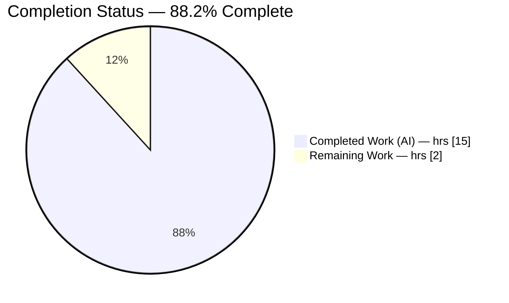
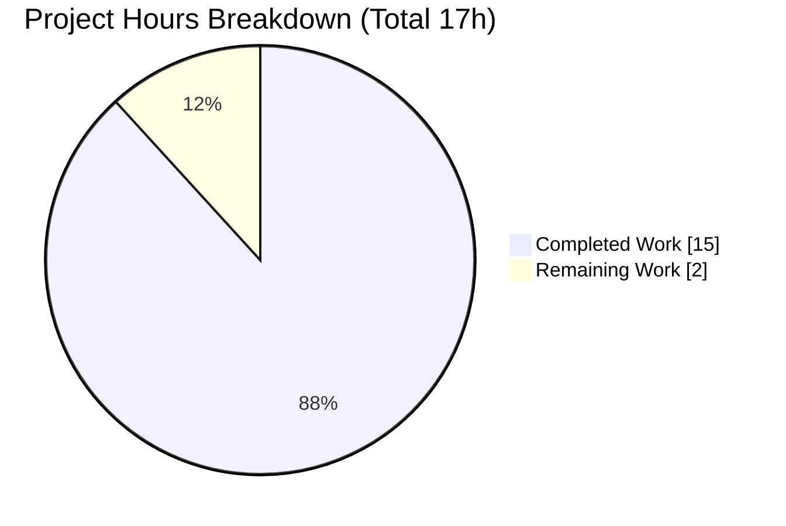
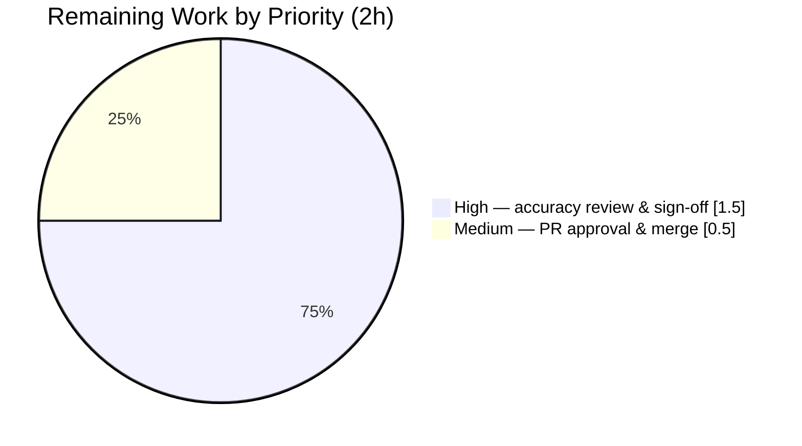
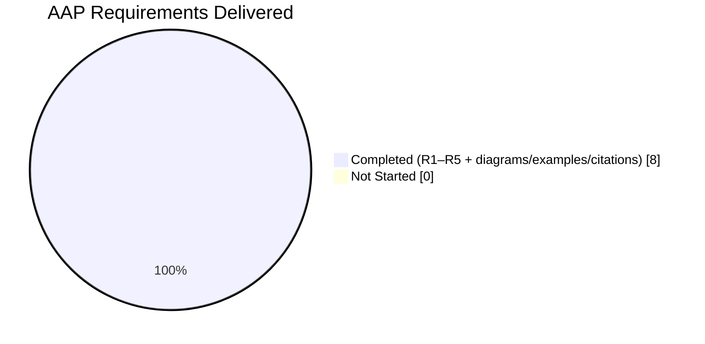

# Blitzy Project Guide — march_repo_hello_world

> Documentation-only Refine PR on a minimal Node.js standard-library HTTP server.
> Brand palette: **Completed / AI Work = Dark Blue `#5B39F3`** · **Remaining = White `#FFFFFF`** · **Headings/Accents = Violet-Black `#B23AF2`** · **Highlight = Mint `#A8FDD9`**.

---

## 1. Executive Summary

### 1.1 Project Overview

This project delivers complete, developer-facing documentation for an existing minimal Node.js HTTP server. The server is a single 15-line program built entirely on the Node.js built-in `http` module that answers every request — regardless of method or path — with `200 OK`, `Content-Type: text/plain`, and the body `Hello, World!\n`. The task was strictly documentation: add JSDoc annotations to `server.js` and expand a one-line `README.md` into a comprehensive guide covering setup, API reference, deployment, and inline code explanations. Runtime behavior is preserved byte-for-byte. Target users are developers who need to run, call, deploy, and understand the server. Business impact: raises documentation coverage from 0% to 100% with zero regression risk.

### 1.2 Completion Status



> Pie color mapping (Blitzy brand): **Completed Work = Dark Blue `#5B39F3`**, **Remaining Work = White `#FFFFFF`**. Center reading: **88.2% Complete**.

| Metric | Hours |
|--------|-------|
| **Total Project Hours** | **17** |
| Completed Hours — AI (autonomous) | 15 |
| Completed Hours — Manual (human) | 0 |
| **Completed Hours (AI + Manual)** | **15** |
| **Remaining Hours** | **2** |
| **Percent Complete** | **88.2%** |

**Calculation (PA1, AAP-scoped):** `Completion % = Completed ÷ (Completed + Remaining) × 100 = 15 ÷ 17 × 100 = 88.2%`.

### 1.3 Key Accomplishments

- ✅ **[R1] JSDoc on `server.js`** — 5 of 5 documentable symbols annotated (module header, `hostname`, `port`, request-handler callback, startup callback). Coverage 0% → 100%.
- ✅ **[R2] Setup instructions** — Prerequisites (Node.js active LTS) plus a Setup/Installation section that explicitly states **no dependency install is required**.
- ✅ **[R3] API documentation** — Catch-all HTTP contract documented as a table (`200` / `text/plain` / `Hello, World!\n` / `Content-Length: 14`) with worked request/response examples and a note on the `HEAD` no-body nuance.
- ✅ **[R4] Deployment guide** — `node server.js` run command, the `127.0.0.1` loopback-only caveat, and an explicit "no build step" statement.
- ✅ **[R5] Inline code explanations** — A block-by-block narrated walkthrough of `server.js` in the README, complementing the in-file JSDoc.
- ✅ **Two Mermaid diagrams** — request-lifecycle sequence diagram and component-flow flowchart.
- ✅ **Three `curl` examples** (GET, POST, HEAD) that reproduce the empirically verified output; **27** `Source: server.js:Lx` citations, all correct against the current file.
- ✅ **Behavior preserved** — executable code is byte-identical to the original 15-line server; verified via `node --check` and a 12/12 behavioral regression suite.

### 1.4 Critical Unresolved Issues

| Issue | Impact | Owner | ETA |
|-------|--------|-------|-----|
| _None._ All AAP deliverables are complete and validated with zero defects. | No release-blocking or validation-blocking issues remain. | — | — |

### 1.5 Access Issues

| System/Resource | Type of Access | Issue Description | Resolution Status | Owner |
|-----------------|----------------|-------------------|-------------------|-------|
| _No access issues identified._ | — | The project has zero external dependencies, no credentials, no third-party APIs, and no infrastructure to reach. Build validation ran entirely offline. | N/A | — |

### 1.6 Recommended Next Steps

1. **[High]** Human review & sign-off on documentation accuracy — read the 298-line README, verify the 5 JSDoc symbols, spot-check the 27 source citations, and run the verification commands (`node --check server.js`; `node server.js`; `curl -i http://127.0.0.1:3000/`). *(≈1.5h)*
2. **[Medium]** Approve the PR and merge to the main branch. *(≈0.5h)*
3. **[Low]** *(Optional, out of AAP scope)* Consider adding a `LICENSE` file if the repository will be published; the README already notes its absence.
4. **[Low]** *(Optional, out of AAP scope)* If HTML API docs become desirable later, wire `jsdoc`/`typedoc` and a `package.json` docs script in a dedicated follow-up.

---

## 2. Project Hours Breakdown

### 2.1 Completed Work Detail

Every completed component traces to a specific AAP requirement (R1–R5) or an AAP-specified default (diagrams, examples, citations) or verification activity (§0.2.2, §0.9.2).

| Component | Hours | Description |
|-----------|-------|-------------|
| Repository analysis & empirical runtime verification (§0.2.2) | 1.5 | Direct inspection of the live repo; started server and exercised GET/POST/DELETE/HEAD with `curl` to confirm the catch-all contract before documenting it. |
| [R1] `server.js` JSDoc — 5 symbols + behavior-preservation verification | 2.0 | Module header (`@file`/`@module`/`@description`), `@constant` for `hostname` & `port`, request-handler `@param`/`@returns`, startup-callback JSDoc; verified executable code byte-identical to original. |
| [R2] README Setup & Prerequisites | 1.0 | Node.js LTS prerequisite; clone instructions; explicit "no `npm install` — zero dependencies" note. |
| [R3] README API Documentation | 2.5 | Catch-all contract table (`200`/`text/plain`/`Hello, World!\n`/`Content-Length: 14`), method-boundary and `HEAD` no-body nuances, and 3 verified request/response examples. |
| [R4] README Deployment Guide | 1.0 | `node server.js` run command; `127.0.0.1` loopback caveat with remote-exposure options; no-build-step statement. |
| [R5] README Code Explanation (block-by-block walkthrough) | 1.5 | Narrated line-referenced explanation of the import, constants, request handler, and startup callback. |
| Two Mermaid diagrams (sequence + component flow) | 1.0 | Request-lifecycle sequence diagram and component-flow flowchart embedded in the README. |
| `curl` examples + 27 Source citations (authored & drift-corrected) | 1.0 | Three copy-paste `curl` commands plus `Source: server.js:Lx` citations, corrected for line-number drift after the JSDoc expansion. |
| README scaffolding (Overview/Features, Project Structure, Notes, TOC) | 1.5 | Overview/Features, 2-file Project Structure, Notes (no LICENSE present), and an anchored table of contents. |
| QA & review iterations (checkpoints, drift fix, Content-Length, restore) | 2.0 | Multiple validation passes: citation-drift correction, `Content-Length` accuracy, `HEAD` claim verification, and full behavioral re-runs. |
| **Total Completed** | **15.0** | Matches Completed Hours in §1.2. |

### 2.2 Remaining Work Detail

All remaining work is human **path-to-production** — no AAP deliverable is outstanding.

| Category | Hours | Priority |
|----------|-------|----------|
| Human review & sign-off on documentation accuracy (read README, verify JSDoc, spot-check citations, run verification commands) | 1.5 | High |
| PR approval & merge to main | 0.5 | Medium |
| **Total Remaining** | **2.0** | — |

> **Integrity:** §2.1 total (15) + §2.2 total (2) = **17** = Total Project Hours in §1.2. Remaining (2) matches §1.2 and the §7 pie chart.

### 2.3 Hours Summary

| Bucket | Hours | Share |
|--------|-------|-------|
| Completed (AI) | 15 | 88.2% |
| Completed (Manual) | 0 | 0.0% |
| Remaining (human path-to-production) | 2 | 11.8% |
| **Total** | **17** | **100%** |

---

## 3. Test Results

All entries below originate exclusively from Blitzy's autonomous validation logs for this project and were independently re-verified during assessment. This repository has **no unit-test suite and none in scope** (AAP §0.8.2); the AAP-defined verification method is **behavioral regression testing** (§0.9.2), supplemented by syntax and behavior-preservation checks.

| Test Category | Framework | Total Tests | Passed | Failed | Coverage % | Notes |
|---------------|-----------|-------------|--------|--------|------------|-------|
| Behavioral Regression (runtime) | `curl` + manual assertions (AAP §0.9.2) | 12 | 12 | 0 | N/A (behavioral) | GET/POST/DELETE/HEAD across arbitrary paths; startup-log match; `Content-Length: 14`; exact body `Hello, World!\n`; catch-all confirmed. |
| Syntax / Compilation | `node --check` | 1 | 1 | 0 | N/A | `node --check server.js` → OK after JSDoc added. |
| Behavior Preservation | Executable-statement diff (normalizer + `grep -F`) | 1 | 1 | 0 | 100% of executable lines | 11 executable statements byte-identical to the original 15-line server. |
| **Total** | — | **14** | **14** | **0** | — | Zero failing, zero blocked, zero skipped. |

> **Documentation coverage (not a test framework, reported for completeness):** code symbols documented 5/5 (100%); mandated README sections 4/4 (100%); HTTP endpoints documented 1/1 (100%).

---

## 4. Runtime Validation & UI Verification

**Runtime health**

- ✅ **Server startup** — `node server.js` prints exactly `Server running at http://127.0.0.1:3000/`.
- ✅ **`GET /`** — `HTTP/1.1 200 OK`, `Content-Type: text/plain`, `Content-Length: 14`, body `Hello, World!\n`.
- ✅ **`POST /any/path` (with body)** — identical `200` / `text/plain` / `Hello, World!\n` (request body ignored).
- ✅ **`DELETE /xyz`** — identical `200` response (catch-all confirmed; method and path ignored).
- ✅ **`HEAD /`** — `200` with headers, no body, `Content-Length` omitted (matches the README's specific claim).
- ✅ **Clean shutdown** — server stops on `Ctrl+C`; no leftover processes.

**API integration**

- ✅ **External dependencies** — none. Sole import `require('http')` is a Node.js built-in; nothing to install or reach.
- ✅ **Configuration surface** — none (no env vars, CLI args, or config files); `hostname`/`port` are hardcoded constants — documented as such.

**UI verification**

- ✅ **Browser rendering** — Opening `http://127.0.0.1:3000/` renders **"Hello, World!"** as plain monospace text in the top-left of an otherwise blank white page, with no HTML styling — the correct visual result of a `text/plain` response. Evidence captured at `blitzy/screenshots/server_hello_world_browser.png`.
- ℹ️ **No front-end** — the server is headless (plain-text body only); there is no UI layer, component library, or design system to verify (AAP §0.8.3).

---

## 5. Compliance & Quality Review

AAP deliverables cross-mapped to Blitzy quality benchmarks. Fixes applied during autonomous validation are noted.

| AAP Requirement / Benchmark | Status | Progress | Notes |
|-----------------------------|--------|----------|-------|
| **R1** — JSDoc on `server.js` functions | ✅ Pass | 5/5 symbols (100%) | Module header + `hostname` + `port` + request-handler + startup callback. |
| **R2** — Setup instructions | ✅ Pass | 100% | Prerequisites + Setup/Installation with explicit no-install note. |
| **R3** — API documentation | ✅ Pass | 100% | Catch-all contract table + 3 examples; `HEAD`/method-boundary nuances documented. |
| **R4** — Deployment guide | ✅ Pass | 100% | Run command + `127.0.0.1` caveat + no-build-step. |
| **R5** — Inline code explanations | ✅ Pass | 100% | Block-by-block README walkthrough. |
| Mermaid diagrams (AAP default) | ✅ Pass | 2/2 | Sequence + component-flow; valid syntax. |
| Working `curl` examples (§0.7.3) | ✅ Pass | 3 examples | GET + POST + HEAD; all reproduce verified output. |
| Source citations (§0.9.1) | ✅ Pass | 27 citations | **Fix applied:** citation line-number drift corrected after JSDoc expansion (commit `53ab360`). |
| Behavior preservation (§0.8.2) | ✅ Pass | Byte-identical | statusCode/headers/body/host/port unchanged; comments only. |
| Syntax validity (§0.9.2) | ✅ Pass | `node --check` OK | File still parses after edits. |
| Zero-placeholder policy | ✅ Pass | 0 placeholders | No TODO/FIXME/stub content in deliverables. |
| Markdown well-formedness | ✅ Pass | Clean | Balanced fenced blocks with language hints; single H1; all TOC anchors resolve. |
| Out-of-scope exclusions (§0.8.2) | ✅ Pass | Correct | No `package.json`/`LICENSE`/tests/CI/doc-generator added; stale `build_prompt.md` disregarded. |

**Outstanding compliance items:** none. Lint tooling is not configured in the repo and is out of scope (AAP §0.9.2), so there are no lint rules to satisfy.

---

## 6. Risk Assessment

| Risk | Category | Severity | Probability | Mitigation | Status |
|------|----------|----------|-------------|------------|--------|
| Documentation drift — code changes could desync from docs/JSDoc | Technical | Low | Low | 27 `Source: server.js:Lx` citations + explicit code↔docs coupling note keep the two in lockstep; JSDoc lives in-file. | Mitigated |
| Remote exposure if `0.0.0.0`/reverse-proxy applied without auth/TLS | Security | Low–Medium | Low | README frames remote binding as an operational change **not performed** here; default is loopback-only. No input parsing, SQL, XSS surface, or secrets. Zero deps → no supply-chain risk. | Mitigated |
| No health-check endpoint / no doc-lint in CI | Operational | Low | Low | Accepted by design — out of AAP scope for a 2-file demo server; behavior verified manually. | Accepted |
| Mermaid diagrams require a Mermaid-aware renderer | Integration | Low | Low | GitHub and modern editors render Mermaid natively; degradation is cosmetic (fenced code still readable). | Mitigated |

**Overall risk posture: VERY LOW.** No High or Critical risks. Zero blockers to merge. Security posture is favorable by construction (zero dependencies, loopback-only default, no user input, no secrets).

---

## 7. Visual Project Status



> Color mapping: **Completed Work = Dark Blue `#5B39F3`** · **Remaining Work = White `#FFFFFF`**.
> **Integrity:** "Remaining Work" = **2** matches §1.2 Remaining Hours and the §2.2 Hours total exactly.

**Remaining hours by priority (from §2.2):**



**Requirement completion (R1–R5, all done):**



---

## 8. Summary & Recommendations

**Achievements.** Every AAP-scoped deliverable is complete and validated. `server.js` now carries JSDoc on all 5 documentable symbols, and `README.md` grew from a one-line placeholder into a 298-line comprehensive guide with setup, API documentation, a deployment guide, inline code explanations, two Mermaid diagrams, three verified `curl` examples, and 27 accurate source citations. Crucially, the server's executable code is **byte-identical** to the original — behavior is fully preserved (confirmed by `node --check` and a 12/12 behavioral regression suite plus browser evidence).

**Remaining gaps.** None on the AAP. The only outstanding work is standard human path-to-production: an accuracy review/sign-off and PR merge.

**Critical path to production.** (1) Human reviewer reads the README, verifies JSDoc and citations, and runs the three verification commands → (2) approve and merge. Estimated **2 hours**.

**Success metrics.** Documentation coverage 0% → 100% (5/5 symbols; 4/4 mandated README sections; 1/1 endpoint); 14/14 validation checks pass; 0 regressions; 0 unresolved issues.

**Production-readiness assessment.** The project is **88.2% complete** (15h of 17h). The autonomous build is production-ready with zero defects; the residual 11.8% is human review-and-merge, not engineering work. Per Blitzy honesty principles, completion is capped below 100% pending that human sign-off.

| Metric | Value |
|--------|-------|
| Completion | 88.2% |
| Validation checks passed | 14 / 14 |
| AAP requirements delivered | R1–R5 (100%) |
| Regressions introduced | 0 |
| Release blockers | 0 |

---

## 9. Development Guide

All commands below were executed and verified during assessment on Node.js **v20.20.2**, npm **11.1.0**.

### 9.1 System Prerequisites

- **Node.js** — any active LTS line (18 / 20 / 22). Verified locally on v20.20.2.
- **npm** — present with Node but **not used** (there are no packages to install).
- **OS** — any platform with a Node.js runtime (Linux/macOS/Windows).
- **Hardware** — negligible; a single lightweight process.

```bash
# Verify your runtime
node --version    # expect v18.x, v20.x, or v22.x  (verified: v20.20.2)
npm --version     # present but unused (verified: 11.1.0)
```

### 9.2 Environment Setup

- **No environment variables** are read by the server.
- **No `.env`, config file, or CLI arguments** — `hostname` (`127.0.0.1`) and `port` (`3000`) are hardcoded constants in `server.js`.

```bash
# 1) Obtain the code
git clone <repo-url>
cd march_repo_hello_world
```

### 9.3 Dependency Installation

**None required.** The server imports only the Node.js built-in `http` module. There is no `package.json`, lockfile, or `node_modules`.

```bash
# Do NOT run `npm install` — there are zero third-party dependencies.
# (No package.json / package-lock.json / node_modules exist.)
```

### 9.4 Application Startup

```bash
# Optional: confirm the file parses
node --check server.js        # exit code 0, no output

# Start the server (foreground)
node server.js
# → prints exactly:
# Server running at http://127.0.0.1:3000/
```

Stop the server with **`Ctrl+C`**.

### 9.5 Verification Steps

With the server running, in a second terminal:

```bash
# GET — the canonical request
curl -i http://127.0.0.1:3000/
# HTTP/1.1 200 OK
# Content-Type: text/plain
# Content-Length: 14
# ...
# Hello, World!

# POST to an arbitrary path with a body — identical response (catch-all)
curl -i -X POST http://127.0.0.1:3000/any/path -d 'x=1'
# HTTP/1.1 200 OK ... Hello, World!

# HEAD — headers only, no body, Content-Length omitted
curl -i -I http://127.0.0.1:3000/
# HTTP/1.1 200 OK
# Content-Type: text/plain
```

**Browser check:** navigate to `http://127.0.0.1:3000/` — you should see `Hello, World!` rendered as plain text.

### 9.6 Example Usage

```bash
$ node server.js
Server running at http://127.0.0.1:3000/

# elsewhere:
$ curl -s http://127.0.0.1:3000/
Hello, World!
```

### 9.7 Troubleshooting

| Symptom | Cause | Resolution |
|---------|-------|------------|
| `Error: listen EADDRINUSE: address already in use 127.0.0.1:3000` | Another process (often a previous `node server.js`) already holds port 3000. | Find it with `pgrep -af 'node server.js'`, then stop it with `Ctrl+C` in its terminal or `kill <PID>`. *(In minimal containers `lsof`/`ss` may be unavailable; `pgrep` is the portable fallback.)* |
| Need a different port | `port` is a hardcoded constant. | Edit `const port = 3000;` in `server.js` (no env/CLI override exists), then restart. |
| Cannot reach the server from another machine | Server binds loopback `127.0.0.1` only. | For remote access, change `hostname` to `0.0.0.0` **or** place the process behind a reverse proxy — add auth/TLS as appropriate (see the README Deployment Guide caveat). |
| Mermaid diagrams show as code, not images | Viewer is not Mermaid-aware. | View the README on GitHub or in a Mermaid-enabled editor; the fenced source remains readable regardless. |

---

## 10. Appendices

### A. Command Reference

| Purpose | Command | Expected Result |
|---------|---------|-----------------|
| Check Node version | `node --version` | `v20.20.2` (or your LTS) |
| Syntax check | `node --check server.js` | exit 0, no output |
| Start server | `node server.js` | `Server running at http://127.0.0.1:3000/` |
| GET request | `curl -i http://127.0.0.1:3000/` | `200` / `text/plain` / `Content-Length: 14` / `Hello, World!` |
| POST (catch-all) | `curl -i -X POST http://127.0.0.1:3000/any/path -d 'x=1'` | identical `200` response |
| HEAD request | `curl -i -I http://127.0.0.1:3000/` | `200` headers, no body |
| Find server process | `pgrep -af 'node server.js'` | PID + command line |
| Stop server | `Ctrl+C` (or `kill <PID>`) | process exits |

### B. Port Reference

| Port | Bind Address | Purpose | Configurable? |
|------|--------------|---------|---------------|
| 3000 | `127.0.0.1` (loopback only) | HTTP listener | Only by editing `const port` / `const hostname` in `server.js` (no env/CLI override) |

### C. Key File Locations

| Path | Role | Status |
|------|------|--------|
| `server.js` | The entire program (HTTP listener, request handler, startup logger) + JSDoc | UPDATED (docs only) |
| `README.md` | Comprehensive project documentation | UPDATED (placeholder → full guide) |
| `blitzy/documentation/Technical Specifications.md` | Platform-generated tech spec | Out of scope (reference) |
| `blitzy/documentation/Project Guide.md` | Platform-generated artifact | Out of scope (reference) |
| `blitzy/screenshots/server_hello_world_browser.png` | Browser evidence (plain-text render) | Untracked evidence (intentionally uncommitted) |

### D. Technology Versions

| Component | Version | Notes |
|-----------|---------|-------|
| Node.js | v20.20.2 (verified) | Any active LTS (18/20/22) works |
| npm | 11.1.0 (verified) | Present but unused |
| `http` module | Bundled with Node.js | Not separately versioned; the only import |
| Third-party dependencies | 0 | No `package.json`/lockfile/`node_modules` |

### E. Environment Variable Reference

| Variable | Used? | Notes |
|----------|-------|-------|
| _(none)_ | No | The server reads no environment variables; `hostname` and `port` are hardcoded constants in `server.js`. |

### F. Developer Tools Guide

- **Editor/IDE:** Any editor renders the in-file JSDoc; VS Code surfaces it on hover/IntelliSense for the annotated symbols.
- **Markdown/Mermaid preview:** GitHub renders the README and both Mermaid diagrams natively; VS Code with a Mermaid extension previews locally.
- **Optional (out of scope):** `jsdoc` or `typedoc` could generate HTML API docs, and MkDocs/Docusaurus could build a docs site — none is required or configured (AAP §0.5.3, §0.6.1).

### G. Glossary

| Term | Definition |
|------|------------|
| **Catch-all contract** | The server returns the identical `200` / `text/plain` / `Hello, World!\n` response for **any** HTTP method on **any** path; method, path, headers, and body are ignored. |
| **Loopback binding** | Listening on `127.0.0.1`, reachable only from the same host; remote clients cannot connect without a config change or reverse proxy. |
| **JSDoc** | A comment convention (`/** … */` with tags like `@param`, `@returns`, `@constant`, `@module`) that documents JavaScript symbols in-file. |
| **Behavior preservation** | The guarantee that executable code is unchanged; only documentation comments were added, verified byte-for-byte against the original. |
| **Path-to-production** | Standard human activities (review, approval, merge) required to ship already-built work; the source of this project's remaining 2 hours. |

---

### Cross-Section Integrity — Verified Before Submission

- **Rule 1 (1.2 ↔ 2.2 ↔ 7):** Remaining = **2h** in §1.2 metrics, §2.2 total, and the §7 pie "Remaining Work". ✅
- **Rule 2 (2.1 + 2.2 = Total):** 15 + 2 = **17** = §1.2 Total Project Hours. ✅
- **Rule 3 (Section 3):** All 14 checks originate from Blitzy's autonomous validation logs. ✅
- **Rule 4 (Section 1.5):** Access issues validated — none (offline, zero deps, no credentials). ✅
- **Rule 5 (Colors):** Completed = Dark Blue `#5B39F3`, Remaining = White `#FFFFFF` throughout. ✅
- **Completion %:** 15 ÷ 17 = **88.2%**, used identically in §1.2, §7, and §8. ✅ (Below the 100% cap per RG2.)