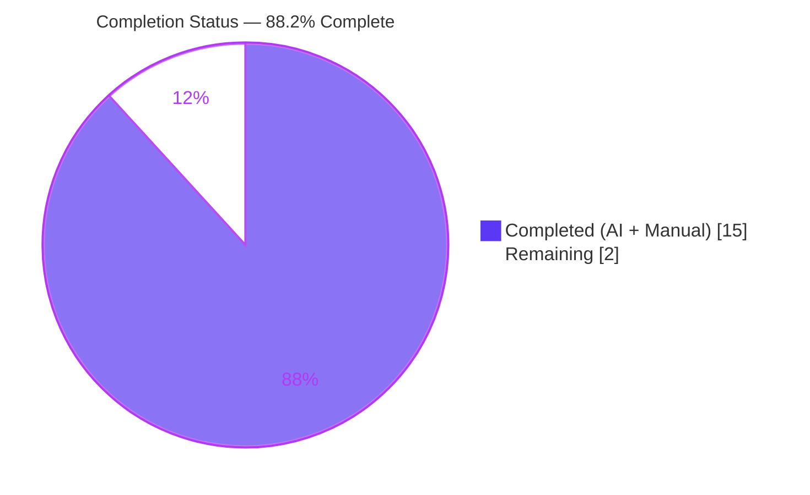
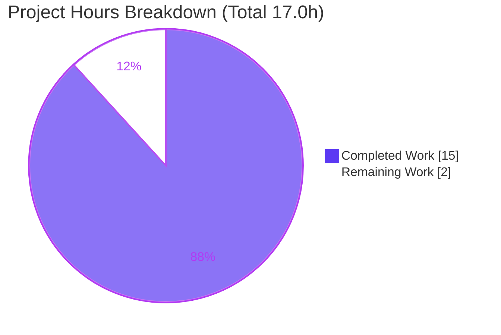
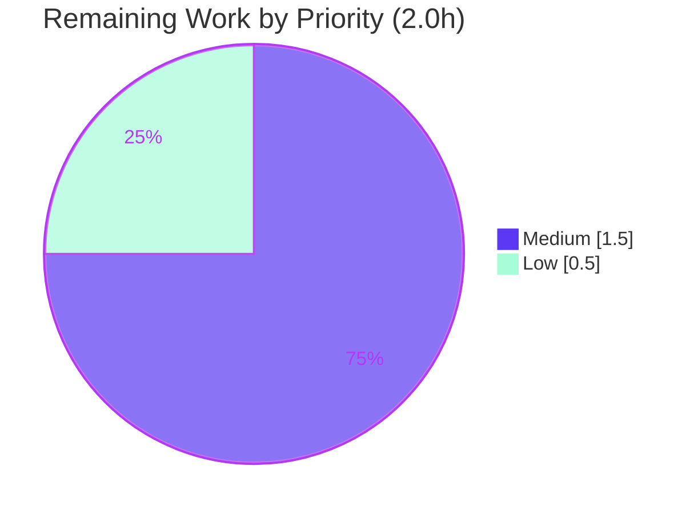

# Blitzy Project Guide — November_Hello_World (Node.js HTTP Server Documentation)

> Branch: `blitzy-cd0c69ba-6790-4b79-a990-3a6d66ede9e2` · HEAD: `ae98b2b` · Base: `3b91d68`
> Scope: Documentation-only (JSDoc + comprehensive README) for a minimal Node.js standard-library HTTP server.

---

## 1. Executive Summary

### 1.1 Project Overview

This project delivers complete, accurate, developer-facing documentation for an existing minimal Node.js standard-library HTTP server (two files: `server.js` and `README.md`). The target audience is any developer who needs to run, call, deploy, or maintain the service. The work added JSDoc to all documentable symbols in `server.js` (comments only, zero logic change) and expanded a one-line README placeholder into a comprehensive guide covering setup, API reference, deployment, and an inline code walkthrough with two Mermaid diagrams and worked `curl` examples. Runtime behavior — `200 OK`, `text/plain`, body `Hello, World!\n` for any method on any path — is preserved exactly and verified empirically.

### 1.2 Completion Status

The completion percentage is computed strictly from AAP-scoped engineering hours plus standard path-to-production activities (PA1 methodology): `Completed Hours / (Completed Hours + Remaining Hours) × 100 = 15.0 / 17.0 = 88.2%`.



| Metric | Hours |
|--------|-------|
| Total Hours | 17.0 |
| Completed Hours (AI + Manual) | 15.0 |
| Remaining Hours | 2.0 |
| **Percent Complete** | **88.2%** |

### 1.3 Key Accomplishments

- ✅ JSDoc added to all 5 documentable symbols in `server.js` (module header, `hostname`, `port`, request-handler callback, startup callback) — code-symbol documentation coverage raised from 0% to 100%.
- ✅ `README.md` expanded from a 1-line placeholder into a 298-line comprehensive guide with all four mandated sections (setup, API documentation, deployment guide, inline code explanations).
- ✅ Two Mermaid diagrams embedded (request-lifecycle sequence diagram + component-flow flowchart) plus three `curl` examples covering `GET` and non-`GET` methods.
- ✅ Critical fix: an unauthorized `Content-Length` logic change introduced by a prior agent (commit `a82b30f`) was reverted (commit `ae98b2b`); executable code is now byte-for-byte identical to the original (`3b91d68`).
- ✅ All technical claims carry `Source: server.js:Lx` citations (35 citations); documentation reconciled to the verified runtime behavior.
- ✅ Full empirical verification: `node --check` parse pass; live `curl` matrix (GET/POST/DELETE/HEAD/FOO) matches documentation byte-for-byte.

### 1.4 Critical Unresolved Issues

| Issue | Impact | Owner | ETA |
|-------|--------|-------|-----|
| None — no compilation, runtime, or documentation-accuracy errors remain | None | — | — |

> No release-blocking issues remain. The only outstanding items are standard path-to-production human gates listed in Sections 1.6 and 2.2.

### 1.5 Access Issues

| System/Resource | Type of Access | Issue Description | Resolution Status | Owner |
|-----------------|----------------|-------------------|-------------------|-------|
| Git repository (`November_Hello_World`) | Write / merge | Branch validated locally; merge to default branch is a human gate | Pending human action | Maintainer |
| Markdown/Mermaid hosting platform | Render verification | Mermaid grammar validated offline; on-platform render not yet visually confirmed | Pending human action | Maintainer |

> No credential, third-party API, or repository-permission blockers were identified. All validation was performed with the local toolchain (Node v20.20.2, npm 11.1.0, git 2.51.0).

### 1.6 Recommended Next Steps

1. **[Medium]** Human documentation review and sign-off of `README.md` and `server.js` JSDoc for tone, clarity, and completeness (1.0h).
2. **[Medium]** Verify the two Mermaid diagrams render correctly on the actual hosting platform (e.g., the code host's Markdown viewer) (0.5h).
3. **[Low]** Decide on the cosmetic repository-name mismatch (README title `march_repo_hello_world` vs hosting repo `November_Hello_World`) and merge the branch to the default branch (0.5h).

---

## 2. Project Hours Breakdown

### 2.1 Completed Work Detail

| Component | Hours | Description |
|-----------|-------|-------------|
| C1 — `server.js` JSDoc authoring | 3.0 | Module-header block (`@file`/`@module`), `@constant` annotations for `hostname` and `port`, and `@param`/`@returns` JSDoc for the request-handler and startup callbacks — documentation only. [Source: server.js:L19-L61] |
| C2 — `README.md` comprehensive authoring | 5.0 | Expanded placeholder into 10 sections (overview, prerequisites, setup, running, API, deployment, code walkthrough, structure, notes, TOC) with 35 `Source:` citations. |
| C3 — Mermaid diagrams | 1.0 | Request-lifecycle sequence diagram and component-flow flowchart authored and grammar-validated. |
| C4 — QA / review-fix cycles | 2.0 | Citation-drift correction, Node LTS accuracy, canonical terminology alignment, diagram MIME/render notes. |
| C5 — Critical-issue revert + reconcile | 2.5 | Reverted unauthorized `Content-Length` logic change; reconciled README API table, HEAD example, walkthrough, and all citations to verified behavior. |
| C6 — Validation & verification | 1.5 | `node --check`, live server run, full `curl` matrix (GET/POST/DELETE/HEAD/FOO), README structural checks (fences, TOC anchors, Mermaid grammar). |
| **Total Completed** | **15.0** | |

> Validation: Section 2.1 total (15.0h) equals Completed Hours in Section 1.2.

### 2.2 Remaining Work Detail

| Category | Hours | Priority |
|----------|-------|----------|
| Documentation review & sign-off (human read-through of README + JSDoc) | 1.0 | Medium |
| Mermaid diagram render verification on hosting platform | 0.5 | Medium |
| Repo-name reconciliation decision + merge to default branch | 0.5 | Low |
| **Total Remaining** | **2.0** | |

> Validation: Section 2.2 total (2.0h) equals Remaining Hours in Section 1.2 and the "Remaining Work" slice in Section 7.

### 2.3 Hours Reconciliation

- Completed (2.1) + Remaining (2.2) = 15.0 + 2.0 = **17.0** = Total Hours (Section 1.2). ✔
- Completion = 15.0 / 17.0 = **88.2%** (Sections 1.2, 7, 8). ✔
- Out-of-scope items deliberately excluded from remaining hours (per AAP §0.8.2): `LICENSE`, `package.json`/`.nvmrc`/lockfile, automated tests, CI/CD. Including them would misrepresent AAP-scoped completion.

---

## 3. Test Results

All results below originate from Blitzy's autonomous validation logs for this branch. No unit-test suite exists in the repository, and none is mandated by the AAP (a documentation task); the applicable gates are static parse analysis, runtime/behavioral validation, and documentation-structural validation.

| Test Category | Framework / Tool | Total Tests | Passed | Failed | Coverage % | Notes |
|---------------|------------------|-------------|--------|--------|------------|-------|
| Static / Parse Analysis | `node --check` (Node v20.20.2) | 1 | 1 | 0 | 100% | `server.js` parses with zero errors/warnings after JSDoc edits. |
| Runtime / Behavioral | `node` + `curl` + manual assertion | 5 | 5 | 0 | 100% | GET `/`, POST `/any/path`, DELETE `/xyz`, HEAD `/`, and method-boundary `FOO` all match documentation. |
| Documentation Structural | Custom structural checks | 3 | 3 | 0 | 100% | Balanced code fences (26), all 10 TOC anchors resolve, both Mermaid blocks parse. |
| **Total** | — | **9** | **9** | **0** | **100%** | Zero failing, blocked, or skipped checks. |

**Documentation coverage (AAP §0.7.1):** code symbols 5/5 (100%), mandated README sections 4/4 (100%), HTTP endpoints 1/1 (100%).

> Note: "Coverage %" here denotes pass-rate and documentation coverage. A unit-test line/branch coverage metric is **N/A** — no executable unit tests exist or are required for this documentation-only scope.

---

## 4. Runtime Validation & UI Verification

Runtime validation was performed by starting the server (`node server.js`) and exercising it with `curl`; results match the documented contract exactly.

- ✅ **Server startup** — logs exactly `Server running at http://127.0.0.1:3000/`. [Source: server.js:L59-L61]
- ✅ **GET /** — `200 OK`, `Content-Type: text/plain`, `Content-Length: 14`, body `Hello, World!\n`. [Source: server.js:L47-L51]
- ✅ **POST /any/path (with body)** — identical `200` / `text/plain` / `Hello, World!\n` (catch-all; body ignored).
- ✅ **DELETE /xyz** — identical `200` / `text/plain` / `Hello, World!\n` (catch-all; path ignored).
- ✅ **HEAD /** — `200`, `text/plain`, no body and no `Content-Length` (matches documentation; Node omits it on HEAD here).
- ✅ **Unrecognized method (FOO)** — `400 Bad Request` (Node `http` default behavior), documented as the method boundary.
- ✅ **Behavior preservation** — executable statements are byte-for-byte identical to the original source (`3b91d68`); only comments differ.

**UI Verification:** Not applicable as an application UI — this is a headless plain-text HTTP service with no front-end, no templates, and no design system. The only "UI" surface is the rendered `README.md`:

- ✅ **README Markdown** — renders as standard CommonMark; 10 sections, tables, and fenced code blocks all well-formed.
- ⚠ **Mermaid diagrams (host render)** — grammar validated offline and cross-checked against a prior validation screenshot; on the specific hosting platform the visual render is **not yet confirmed** (human gate HT-2).

---

## 5. Compliance & Quality Review

AAP deliverables mapped to delivery status, including fixes applied during autonomous validation.

| AAP Requirement | Deliverable | Status | Progress | Notes / Fixes Applied |
|-----------------|-------------|--------|----------|-----------------------|
| R1 — JSDoc on `server.js` functions | Module header + 2 `@constant` + 2 callback blocks | ✅ Pass | 100% | 5/5 symbols documented; tags `@file`,`@module`,`@description`,`@constant`,`@param`,`@returns`. |
| R2 — Setup instructions | Prerequisites + clone + "no install" | ✅ Pass | 100% | Clarifies zero dependencies; no `npm install` needed. |
| R3 — API documentation | Catch-all contract + request/response examples | ✅ Pass | 100% | `200`/`text/plain`/`Hello, World!\n`; GET + non-GET examples. |
| R4 — Deployment guide | Run command + loopback caveat + no build step | ✅ Pass | 100% | `127.0.0.1` binding caveat documented for remote access. |
| R5 — Inline code explanations | Narrated `server.js` walkthrough | ✅ Pass | 100% | Line-referenced walkthrough complements in-file JSDoc. |
| Mandate — Mermaid diagrams (×2) | Sequence + flowchart | ✅ Pass | 100% | Both present and grammar-valid. |
| Mandate — `curl` examples | GET + POST/DELETE | ✅ Pass | 100% | 3 worked examples reproduce verified output. |
| Mandate — `Source:` citations | Per-claim citations | ✅ Pass | 100% | 35 citations; all remapped to correct line numbers. |
| Constraint — Behavior preservation | Doc-only edits to `server.js` | ✅ Pass | 100% | Reverted unauthorized `Content-Length` change (`a82b30f` → `ae98b2b`); executable code byte-identical to `3b91d68`. |
| Quality — Citation accuracy | Line numbers match source | ✅ Pass | 100% | Systematic citation-drift correction applied (commit `53ab360`). |

**Outstanding (human gates, non-blocking):** documentation read-through/sign-off, on-platform Mermaid render check, repo-name reconciliation. See Section 2.2.

---

## 6. Risk Assessment

| Risk | Category | Severity | Probability | Mitigation | Status |
|------|----------|----------|-------------|------------|--------|
| T1 — Documentation drifts from code over time | Technical | Low | Medium | `Source:` citations + walkthrough enable quick re-sync; keep JSDoc and README updated together. | Open (monitor) |
| T2 — Mermaid render depends on a Mermaid-aware host | Technical | Low | Low | Grammar validated; verify on target host (HT-2). | Open |
| T3 — No documentation-sync CI gate | Technical | Low | Low | Out of AAP scope; optional future CI noted. | Accepted |
| S1 — No auth/TLS if exposed beyond loopback | Security | Low | Low | Default binding is `127.0.0.1` (loopback only); deployment guide flags `0.0.0.0`/reverse-proxy risk. | Mitigated by default |
| S2 — Injection/XSS surface | Security | Low | Low | None — static `text/plain` response; request never parsed/echoed. | Closed |
| O1 — No process manager / auto-restart | Operational | Low | Low | Documented run command; process managers are out of scope. | Accepted |
| O2 — Hardcoded host/port (no env/config) | Operational | Low | Low | Documented as "no configuration surface"; constants cited. | Accepted |
| O3 — Minimal observability (single startup log) | Operational | Low | Low | Startup log documented; richer logging out of scope. | Accepted |
| I1 — On-host Mermaid/Markdown render unverified | Integration | Low | Low | Human verification gate (HT-2). | Open |
| I2 — Repo-name mismatch (README vs hosting repo) | Integration | Low | Low | Cosmetic; documented as-is; reconciliation decision (HT-3). | Open |
| I3 — Third-party dependency risk | Integration | Low (positive) | None | Zero dependencies; only Node built-in `http`. Nothing to patch or audit. | Closed |

> Overall risk posture: **Low**. No High or Medium severity risks. The dominant "risk" (I3) is a positive: an empty dependency surface.

---

## 7. Visual Project Status

**Project hours breakdown** (Completed = Dark Blue `#5B39F3`, Remaining = White `#FFFFFF`):



**Remaining work by priority** (2.0h total: Medium 1.5h, Low 0.5h):



> Integrity: the "Remaining Work" value (2) equals Remaining Hours in Section 1.2 and the sum of the Section 2.2 Hours column. "Completed Work" (15) equals Completed Hours in Section 1.2.

---

## 8. Summary & Recommendations

**Achievements.** The documentation objective is essentially complete at **88.2%** (15.0 of 17.0 AAP-scoped hours). Every AAP requirement (R1–R5) and every explicit mandate (two Mermaid diagrams, `curl` examples, `Source:` citations, behavior preservation) is delivered and verified. Documentation coverage reached 100% across code symbols (5/5), mandated README sections (4/4), and HTTP endpoints (1/1).

**Critical path to production.** No engineering work remains. The remaining 2.0 hours are entirely standard human path-to-production gates: a documentation read-through/sign-off (1.0h), an on-platform Mermaid render check (0.5h), and a repo-name reconciliation decision plus merge to the default branch (0.5h). None blocks functionality; the server runs and behaves exactly as documented.

**Quality highlight.** A prior agent's unauthorized `Content-Length` logic change was caught and reverted, restoring byte-for-byte parity with the original executable code while keeping all the new documentation — a key guarantee for a documentation-only task.

**Production readiness.** The codebase is production-ready for its stated purpose (a local/loopback static HTTP response service). For any networked deployment, follow the README's loopback caveat (bind `0.0.0.0` or front with a reverse proxy) and apply standard TLS/auth at the proxy layer.

| Success Metric | Result |
|----------------|--------|
| AAP-scoped completion | 88.2% (15.0 / 17.0 h) |
| Code-symbol documentation coverage | 100% (5/5) |
| Mandated README sections | 100% (4/4) |
| Behavioral validation pass rate | 100% (5/5 scenarios) |
| Release-blocking issues | 0 |

---

## 9. Development Guide

### System Prerequisites

- **Node.js** — any active LTS line (18 / 20 / 22). Verified with **v20.20.2**. This is the only required runtime.
- **npm** — present in the environment (11.1.0) but **not used**: there are no packages to install.
- **git** — for cloning the repository (2.51.0 verified).
- **OS** — any platform with a Node.js runtime (Linux/macOS/Windows). No special hardware.

```bash
node --version    # expect v18.x / v20.x / v22.x (verified: v20.20.2)
npm --version     # 11.1.0 (informational only; not used)
git --version     # 2.51.0
```

### Environment Setup

There is **no dependency installation** and **no build step** — the server uses only the Node.js built-in `http` module. [Source: server.js:L19]

```bash
# 1) Obtain the code
git clone <repository-url>
cd November_Hello_World

# 2) (No install required — zero third-party dependencies)
#    There is no package.json, lockfile, or node_modules.
```

There are **no environment variables** and **no configuration files**: `hostname` (`127.0.0.1`) and `port` (`3000`) are hardcoded constants. [Source: server.js:L27] [Source: server.js:L33]

### Application Startup

```bash
node server.js
```

Expected output (verified, byte-for-byte):

```text
Server running at http://127.0.0.1:3000/
```

The process runs in the foreground. To run it detached:

```bash
nohup node server.js > server.log 2>&1 &
```

### Verification Steps

With the server running, exercise the catch-all contract:

```bash
# GET — 200, text/plain, Content-Length: 14, body "Hello, World!\n"
curl -i http://127.0.0.1:3000/

# POST with a body — identical 200 response (body ignored)
curl -i -X POST http://127.0.0.1:3000/any/path -d 'x=1'

# DELETE on an arbitrary path — identical 200 response (path ignored)
curl -i -X DELETE http://127.0.0.1:3000/xyz

# HEAD — 200, headers only, no body, no Content-Length
curl -i -I http://127.0.0.1:3000/

# Method boundary — an unrecognized token yields 400 Bad Request (Node default)
curl -i -X FOO http://127.0.0.1:3000/
```

Expected `GET` response (modulo the `Date` header):

```text
HTTP/1.1 200 OK
Content-Type: text/plain
Content-Length: 14
Date: <timestamp>
Connection: keep-alive

Hello, World!
```

### Example Usage

```bash
# Quick smoke test in one line
node server.js & sleep 1 && curl -s http://127.0.0.1:3000/ && kill %1
# -> prints: Hello, World!
```

### Troubleshooting

- **`Error: listen EADDRINUSE: address already in use 127.0.0.1:3000`** (code `EADDRINUSE`, errno `-98`): another process already holds port 3000. Identify and stop it. `lsof` may be unavailable; use one of:

```bash
ss -ltnp | grep ':3000'      # show the listener and its PID
fuser 3000/tcp                # print the PID bound to the port
# then stop exactly that PID:
kill <PID>
```

- **No startup line printed:** ensure you ran `node server.js` from the directory containing `server.js`, and that `node` is on `PATH`.
- **Remote clients cannot connect:** the server binds loopback `127.0.0.1` only. [Source: server.js:L27] For remote access, place it behind a reverse proxy or change the bind address — note this is a source change, outside the documentation scope.
- **Mermaid diagrams show as code, not graphics:** the viewer is not Mermaid-aware. Use a Mermaid-rendering Markdown host or the Mermaid Live Editor.

---

## 10. Appendices

### A. Command Reference

| Purpose | Command |
|---------|---------|
| Syntax-check the server | `node --check server.js` |
| Run the server (foreground) | `node server.js` |
| Run the server (detached) | `nohup node server.js > server.log 2>&1 &` |
| GET request | `curl -i http://127.0.0.1:3000/` |
| POST request | `curl -i -X POST http://127.0.0.1:3000/any/path -d 'x=1'` |
| HEAD request | `curl -i -I http://127.0.0.1:3000/` |
| Find listener on port 3000 | `ss -ltnp | grep ':3000'` |

### B. Port Reference

| Port | Bind Address | Purpose | Configurable? |
|------|--------------|---------|----------------|
| 3000 | `127.0.0.1` (loopback) | HTTP listener | No — hardcoded constant. [Source: server.js:L27] [Source: server.js:L33] |

### C. Key File Locations

| Path | Role | Size |
|------|------|------|
| `server.js` | Entire program + JSDoc | 62 lines (2,379 bytes) |
| `README.md` | Comprehensive project documentation | 298 lines (12,683 bytes) |
| `blitzy/screenshots/` | Prior-agent validation artifacts (untracked, out of scope) | 2 PNG files |

### D. Technology Versions

| Tool | Version | Role |
|------|---------|------|
| Node.js | v20.20.2 (active LTS recommended) | Runtime |
| npm | 11.1.0 | Present; unused |
| git | 2.51.0 | Version control |
| Node built-in `http` | bundled with Node | Only "dependency" (built-in). [Source: server.js:L19] |

### E. Environment Variable Reference

| Variable | Default | Purpose |
|----------|---------|---------|
| — | — | **None.** The server reads no environment variables, CLI arguments, or config files; host and port are hardcoded constants. [Source: server.js:L27] [Source: server.js:L33] |

### F. Developer Tools Guide

| Task | Tooling | Notes |
|------|---------|-------|
| Syntax validation | `node --check` | Confirms `server.js` parses; run after any edit. |
| Behavioral testing | `curl` | Manual request/response assertions against the catch-all contract. |
| Generate HTML API docs (optional) | `jsdoc` / `typedoc` | **Out of scope** — not configured; mentioned for future maintainers only. |
| Documentation site (optional) | MkDocs / Docusaurus | **Out of scope** — not warranted for a two-file repository. |

### G. Glossary

| Term | Definition |
|------|------------|
| Catch-all contract | The server returns the same `200` / `text/plain` / `Hello, World!\n` response for any HTTP method on any path. [Source: server.js:L47-L51] |
| Loopback binding | Binding to `127.0.0.1`, reachable only from the local host. [Source: server.js:L27] |
| Documentation-only | Edits limited to comments/JSDoc; no change to executable logic, headers, body, host, or port. |
| Path-to-production gate | A standard human action (review, render check, merge) required before release, distinct from engineering work. |
| JSDoc | The `/** ... */` comment convention used to document JavaScript symbols. |