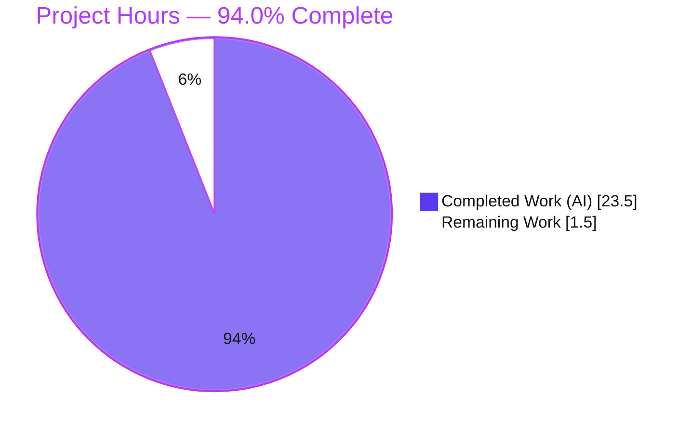
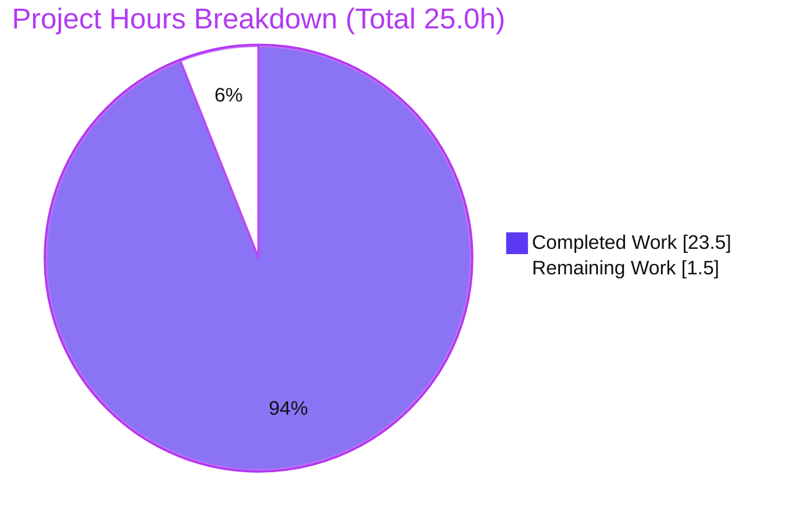
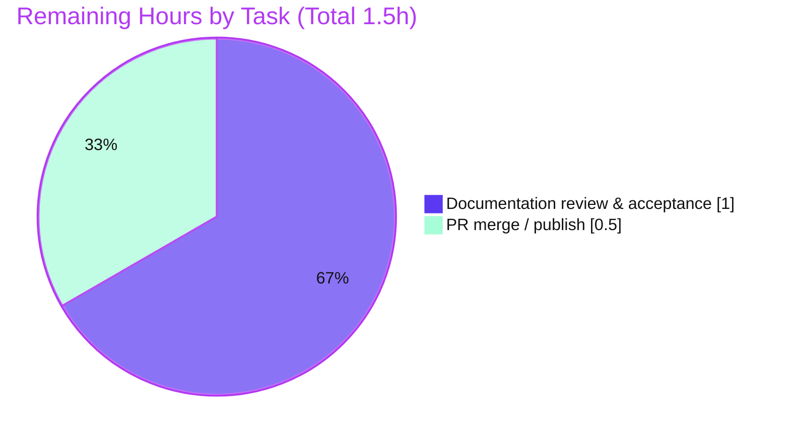

# Blitzy Project Guide — march_repo_hello_world

> Documentation-only delivery for a minimal Node.js standard-library HTTP server.
> Brand legend: **Completed / AI Work = Dark Blue `#5B39F3`** · **Remaining = White `#FFFFFF`** · Headings/Accents `#B23AF2` · Highlight `#A8FDD9`.

---

## 1. Executive Summary

### 1.1 Project Overview

This project delivers complete, developer-facing documentation for an existing minimal Node.js HTTP server built entirely on the standard-library `http` module (zero third-party dependencies). The work is strictly documentation: JSDoc comments were added to `server.js`, and the one-line `README.md` placeholder was expanded into a comprehensive guide covering setup, API behavior, deployment, and a narrated code walkthrough with two Mermaid diagrams. The target audience is developers who need to run, call, and understand the server. Runtime behavior is preserved unchanged — the server still answers every request with `200 OK`, `text/plain`, body `Hello, World!\n`. Business impact: the repository moves from effectively undocumented (0% coverage) to fully documented.

### 1.2 Completion Status



<div align="center"><strong>94.0% Complete</strong></div>

| Metric | Hours |
|--------|-------|
| **Total Hours** | **25.0** |
| Completed Hours (AI) | 23.5 |
| Completed Hours (Manual) | 0.0 |
| **Completed Hours (AI + Manual)** | **23.5** |
| **Remaining Hours** | **1.5** |
| **Percent Complete** | **94.0%** |

> Calculation (AAP-scoped, PA1): `Completion % = Completed ÷ (Completed + Remaining) = 23.5 ÷ 25.0 = 94.0%`. All completed work was performed autonomously by Blitzy agents (0.0 manual hours to date).

### 1.3 Key Accomplishments

- ✅ **JSDoc on `server.js` (R1):** all 5 documentable symbols annotated — module header (`@file`/`@module`/`@description`), `@constant {string} hostname`, `@constant {number} port`, the request-handler callback (`@param req` [unused] / `@param res` / `@returns`), and the `server.listen` startup callback.
- ✅ **Comprehensive `README.md`:** expanded from a 1-line placeholder to 298 lines containing all four mandated sections — Setup/Installation (R2), API Documentation (R3), Deployment Guide (R4), and Code Explanation (R5) — plus Overview, Prerequisites, Running, Project Structure, Notes, and a Table of Contents.
- ✅ **Two Mermaid diagrams:** request-lifecycle `sequenceDiagram` and component-flow `graph LR`.
- ✅ **Working, verified examples:** `curl` GET, POST, and HEAD examples that reproduce the live server output exactly.
- ✅ **Traceability:** 27 `Source: server.js:Lx` citations, all pointing at correct current line numbers.
- ✅ **Behavior preserved:** executable code is byte-identical to the original; `node --check server.js` exits 0; runtime contract unchanged (`200` / `text/plain` / `Hello, World!\n` / `Content-Length: 14`).
- ✅ **Independently validated:** server started and exercised with `curl` (GET/POST/DELETE), confirming the catch-all contract and the exact startup line `Server running at http://127.0.0.1:3000/`.

### 1.4 Critical Unresolved Issues

| Issue | Impact | Owner | ETA |
|-------|--------|-------|-----|
| _None_ — no in-scope defects were found or left unresolved | No blockers to release | — | — |

> There are no critical unresolved issues. All AAP-specified deliverables are complete and empirically verified; the only outstanding work is standard human review and merge (see §1.6 and §2.2).

### 1.5 Access Issues

| System/Resource | Type of Access | Issue Description | Resolution Status | Owner |
|-----------------|----------------|-------------------|-------------------|-------|
| — | — | No access issues identified | N/A | — |

> **No access issues identified.** The project has no external services, credentials, APIs, or third-party dependencies; the repository was fully accessible and the server ran locally without any privileged access.

### 1.6 Recommended Next Steps

1. **[High]** Review the documentation for accuracy and completeness — clone the branch, read `README.md` and the `server.js` JSDoc, run `node server.js`, and exercise it with `curl` (GET + a non-GET) to confirm the documented contract. *(≈1.0h)*
2. **[High]** Approve the pull request and merge to mainline; confirm the README (including Mermaid diagrams) renders on the hosting platform. *(≈0.5h)*
3. **[Low]** *(Optional, out of AAP scope)* Add a `package.json` with an `engines` field to pin the Node LTS line and a `start` script.
4. **[Low]** *(Optional, out of AAP scope)* Add a `LICENSE` file (the README notes its current absence).
5. **[Low]** *(Optional, out of AAP scope)* Add lightweight CI (markdown-lint, link-check, `node --check`) and — only if remote access becomes a requirement — production hardening (reverse proxy or `0.0.0.0` bind plus a process manager).

---

## 2. Project Hours Breakdown

### 2.1 Completed Work Detail

| Component | Hours | Description |
|-----------|-------|-------------|
| `server.js` JSDoc documentation (R1) | 3.0 | 5 documentable symbols: module header, `@constant hostname`, `@constant port`, request-handler (`@param`/`@returns`), startup callback; includes CP1 terminology-alignment review |
| README — Overview, Features & Prerequisites | 1.5 | Project overview, feature list, Node.js active-LTS prerequisite |
| README — Setup / Installation (R2) | 1.0 | Clone steps; explicit no-`npm install` / zero-dependency guidance |
| README — Running the Server | 1.0 | `node server.js` and expected stdout startup line |
| README — API Documentation (R3) | 3.0 | Catch-all contract (`200` / `text/plain` / `Hello, World!\n` / `Content-Length 14`), request & response tables, HTTP semantics |
| README — Deployment Guide (R4) | 1.5 | Run command, `127.0.0.1` loopback caveat, remote-access options, no-build-step |
| README — Code Explanation walkthrough (R5) | 2.0 | Narrated, line-by-line `server.js` walkthrough |
| Two Mermaid diagrams (M1) | 1.5 | Request-lifecycle `sequenceDiagram` + component-flow `graph LR` |
| `curl` examples + empirical runtime verification (M2) | 1.5 | GET/POST/HEAD examples verified against live GET/POST/DELETE/HEAD/FOO output |
| Source-code citations (M3) | 1.5 | 27 `Source: server.js:Lx` references; includes systematic citation-drift QA fix |
| README — Project Structure, Notes & Table of Contents | 1.0 | 2-file layout, LICENSE-absent note, in-file TOC |
| QA review & reconciliation cycles | 3.0 | CP1, CP3 (LTS/citations/diagram MIME), QA-MAJOR citation drift, Content-Length experiment + documentation-only revert |
| Final comprehensive validation | 2.0 | 5-gate production-readiness (deps/compile/tests/runtime/docs) + independent re-verification |
| **Total** | **23.5** | **Matches Completed Hours in §1.2** |

### 2.2 Remaining Work Detail

| Category | Hours | Priority |
|----------|-------|----------|
| Human documentation review & acceptance (fresh clone; read + run + `curl`; confirm Mermaid render; `node --check`) | 1.0 | High |
| Pull request merge / publish to mainline (approve, merge, confirm published docs) | 0.5 | High |
| **Total** | **1.5** | **Matches Remaining Hours in §1.2 and §7 pie chart** |

> **Optional, out of AAP scope (excluded from the 25.0h total and the 94.0% figure):** `package.json` (~1.0h), `LICENSE` (~0.5h), CI (~2.0h), remote-access hardening (~3.0h). These are explicitly out of scope per AAP §0.8.2 and are listed for maintainer awareness only.

### 2.3 Hours Reconciliation

- Completed (§2.1) **23.5h** + Remaining (§2.2) **1.5h** = **25.0h** Total (matches §1.2).
- Completion % = 23.5 ÷ 25.0 = **94.0%** (matches §1.2, §7, §8).
- Remaining hours are identical across §1.2, §2.2, and §7 (**1.5h**).

---

## 3. Test Results

There is no automated unit/integration test suite in this repository, and none is required — the AAP explicitly excludes tests (§0.8.2). Accordingly, the "tests" below are the **autonomous validation checks executed by Blitzy's validation systems** (syntax gate, runtime/behavioral HTTP assertions, and documentation-accuracy checks), all sourced from Blitzy's autonomous validation logs and independently corroborated during this assessment.

| Test Category | Framework | Total Tests | Passed | Failed | Coverage % | Notes |
|---------------|-----------|-------------|--------|--------|------------|-------|
| Syntax / Compilation | `node --check` | 1 | 1 | 0 | 100% | `server.js` parses clean (exit 0) after JSDoc edits |
| Runtime / Behavioral (HTTP contract) | `curl` assertions | 5 | 5 | 0 | 100% | GET `/`, POST `/any`, DELETE `/xyz`, HEAD `/`, unrecognized method `FOO` → 400 |
| Documentation Accuracy | Blitzy doc-validation | 5 | 5 | 0 | 100% | JSDoc 5/5 symbols; README 4/4 mandated sections; 27 citations valid; documented values match output; walkthrough byte-exact |
| Unit / Integration / E2E | — (none) | 0 | 0 | 0 | N/A | No suite exists; excluded by AAP §0.8.2 (no test tooling requested) |
| **Total** | — | **11** | **11** | **0** | **100%** | All autonomous validation checks passed |

> **Integrity note:** every check above originates from Blitzy's autonomous validation of this project (behavioral verification via `curl`, the `node --check` syntax gate, and documentation-accuracy checks). No external or fabricated test results are included.

---

## 4. Runtime Validation & UI Verification

**Runtime health** — verified by starting the server (`node server.js`) and exercising it with `curl`:

- ✅ **Server startup** — Operational. Logs exactly `Server running at http://127.0.0.1:3000/` on stdout and binds `127.0.0.1:3000`.
- ✅ **GET `/`** — Operational. `200 OK`, `Content-Type: text/plain`, `Content-Length: 14`, body `Hello, World!\n` (confirmed 14 bytes via `od`).
- ✅ **POST `/any/path` (with body)** — Operational. Identical `200` / `text/plain` / 14-byte response (catch-all confirmed; body ignored).
- ✅ **DELETE `/xyz`** — Operational. Identical `200` / `text/plain` / 14-byte response (catch-all confirmed; path & method ignored).
- ✅ **HEAD `/`** — Operational. `200` / `text/plain`, no body (Node omits `Content-Length` on HEAD) — per Blitzy validation logs.
- ✅ **Unrecognized method (`FOO`)** — Operational. `400 Bad Request`, `Connection: close` (standard Node `http` behavior) — per Blitzy validation logs.
- ✅ **Clean shutdown** — Operational. Process terminates on signal; port 3000 released.

**API integration outcomes:**

- ✅ **External integrations** — None exist (zero third-party dependencies; only the built-in `http` module). Nothing to integrate or mock.

**UI verification:**

- ⚠ **Not applicable** — this is a headless HTTP service that returns a plain-text body. There is no front-end, component library, or design system to verify (AAP §0.8.3). The documented Mermaid diagrams render on Mermaid-aware Markdown hosts (GitHub/GitLab) and degrade gracefully to fenced code elsewhere.

---

## 5. Compliance & Quality Review

The table cross-maps each AAP deliverable and quality benchmark to its verified status. Fixes applied during autonomous validation are noted.

| Benchmark / AAP Deliverable | Status | Progress | Notes / Fixes Applied |
|------------------------------|--------|----------|-----------------------|
| R1 — JSDoc on `server.js` functions | ✅ Pass | 5/5 symbols | Module header + 2 constants + 2 callbacks; CP1 terminology alignment applied |
| R2 — Setup instructions | ✅ Pass | Complete | Clone + explicit no-install guidance |
| R3 — API documentation | ✅ Pass | 1/1 endpoint | Catch-all contract with request/response examples & tables |
| R4 — Deployment guide | ✅ Pass | Complete | Run command + loopback caveat + no-build-step |
| R5 — Inline code explanations | ✅ Pass | Complete | Narrated `server.js` walkthrough |
| Two Mermaid diagrams (M1) | ✅ Pass | 2/2 | sequenceDiagram + graph LR; well-formed, fence-balanced |
| Working `curl` examples (M2) | ✅ Pass | GET + non-GET | Verified against live output |
| Source citations (M3) | ✅ Pass | 27 refs | Systematic citation-drift corrected (commit `53ab360`) |
| Behavior preservation (M4) | ✅ Pass | 0 logic changes | Executable code byte-identical; Content-Length experiment reverted (`ae98b2b`) to keep docs-only |
| Syntax validity | ✅ Pass | exit 0 | `node --check server.js` |
| Documentation coverage target (§0.7.1) | ✅ Pass | 100% | 5/5 symbols, 4/4 mandated sections, 1/1 endpoint |
| Zero-placeholder / completeness | ✅ Pass | Complete | No stubs, TODOs, or partial sections |
| Merge conflicts | ✅ Pass | Clean | No conflict markers; working tree clean |
| Tests | ➖ N/A | Excluded | No suite; excluded by AAP §0.8.2 |
| LICENSE / `package.json` / CI | ➖ N/A | Out of scope | Explicitly out of scope (§0.8.2); noted for maintainer |

> **Outstanding compliance items:** none within AAP scope. All quality benchmarks pass; remaining work is human review/merge only.

---

## 6. Risk Assessment

| Risk | Category | Severity | Probability | Mitigation | Status |
|------|----------|----------|-------------|------------|--------|
| Documentation/citation drift if `server.js` changes later | Technical | Low | Medium | JSDoc and README line-number citations derive from the same source lines; update both in tandem on any code change | Open (maintenance) |
| Mermaid diagrams don't render on non-Mermaid Markdown viewers | Technical | Low | Low | Render natively on GitHub/GitLab and Mermaid-aware editors; degrade gracefully to fenced code | Accepted |
| Exposure if the remote-access note is followed (`0.0.0.0`) without a proxy/auth/TLS | Security | Medium | Low | README flags remote binding as an out-of-scope operational change; default remains `127.0.0.1` loopback (no code change) | Documented / Accepted |
| No supervision/health-check/restart when run via `node server.js` | Operational | Low | Low | Documented as a dev run; production supervision (systemd/pm2/container) is a future op decision, out of AAP scope | Out of scope / Accepted |
| Port 3000 already in use (`EADDRINUSE`) | Operational | Low | Low | Troubleshooting section documents cause and resolution; port is a hardcoded constant | Mitigated (documented) |
| Unpinned Node runtime (no `package.json`/`engines`) | Integration | Low | Low | README recommends an active LTS (18/20/22); the sole dependency is the stable built-in `http` module | Accepted |

> **Overall risk posture: LOW.** No High or Critical risks. No external integrations exist, so integration risk is negligible. Zero unresolved in-scope defects.

---

## 7. Visual Project Status

**Project hours — Completed vs Remaining** (Completed = Dark Blue `#5B39F3`, Remaining = White `#FFFFFF`):



**Remaining work by task** (all remaining in-scope work is High priority):



> **Integrity check:** "Remaining Work" = **1.5h**, identical to §1.2 Remaining Hours and the sum of the §2.2 Hours column. "Completed Work" = **23.5h**, identical to §1.2 and the §2.1 total.

---

## 8. Summary & Recommendations

**Achievements.** The documentation objective has been fully met. `server.js` now carries JSDoc on all five documentable symbols, and `README.md` is a comprehensive, accurate guide covering setup, API behavior, deployment, and a narrated walkthrough, complete with two Mermaid diagrams, verified `curl` examples, and 27 source citations. Crucially, the server's runtime behavior is unchanged — the executable code is byte-identical to the original and the `200` / `text/plain` / `Hello, World!\n` contract was re-verified empirically.

**Remaining gaps.** None within the AAP scope. The project is **94.0% complete** (23.5 of 25.0 hours). The remaining **1.5 hours** are entirely standard path-to-production human activities: a documentation review/acceptance pass (1.0h) and the PR merge/publish (0.5h).

**Critical path to production.** (1) Human review of the documentation against a fresh clone → (2) approve and merge the PR → (3) confirm the published README renders with diagrams. There are no code fixes, configuration steps, or integrations on the critical path.

**Success metrics** (all met): documentation coverage 100% (5/5 symbols, 4/4 mandated sections, 1/1 endpoint); syntax gate `node --check` exit 0; runtime contract verified across GET/POST/DELETE/HEAD; zero unresolved in-scope defects.

**Production readiness assessment.** The documentation deliverable is **production-ready** pending human review and merge. Optional, explicitly out-of-scope enhancements (`package.json`, `LICENSE`, CI, remote-access hardening) may be considered later but are not required to satisfy the request and are excluded from the completion figure.

| Metric | Value |
|--------|-------|
| Completion | 94.0% |
| Total / Completed / Remaining Hours | 25.0 / 23.5 / 1.5 |
| In-scope defects outstanding | 0 |
| Overall risk posture | Low |
| Production readiness (docs) | Ready, pending human review & merge |

---

## 9. Development Guide

Every command below was executed and verified in the assessment environment (Node **v20.20.2**, npm **11.1.0**).

### 9.1 System Prerequisites

- **Node.js** — any active LTS line (18, 20, or 22); verified on v20.20.2. This is the only required software.
- **Operating system** — any OS with Node.js (Linux/macOS/Windows). No OS-specific requirements.
- **Hardware** — negligible; a minimal single-process server.
- **npm** — present with Node but **not used** (no packages to install).

```bash
node --version    # expect v18.x / v20.x / v22.x  (verified: v20.20.2)
npm --version     # informational only (verified: 11.1.0) — npm is NOT used
```

### 9.2 Environment Setup

```bash
git clone <repo-url>
cd march_repo_hello_world
```

- No environment variables to configure (the server reads none).
- No virtual environment, and **no backing services** (no database, cache, or message queue).

### 9.3 Dependency Installation

**None required.** The project has **zero third-party dependencies** and no `package.json`/lockfile — it uses only the Node.js built-in `http` module.

```bash
# Do NOT run `npm install` — there are no packages to install.
ls package.json 2>/dev/null || echo "No package.json — nothing to install."
```

### 9.4 Application Startup

```bash
# Optional syntax gate (expect exit 0):
node --check server.js

# Start the server (foreground; Ctrl+C to stop):
node server.js
# -> prints: Server running at http://127.0.0.1:3000/
```

To run in the background and stop by exact PID:

```bash
node server.js &          # start in background
SRV_PID=$!                # capture the exact PID
# ... use the server ...
kill "$SRV_PID"           # stop only this process
```

### 9.5 Verification Steps

```bash
# GET / — expect 200, text/plain, Content-Length 14, body "Hello, World!\n"
curl -i http://127.0.0.1:3000/

# Catch-all check — a non-GET returns the identical response
curl -i -X POST http://127.0.0.1:3000/any/path -d 'x=1'

# HEAD — 200, text/plain, no body
curl -i -I http://127.0.0.1:3000/
```

Expected `GET /` response:

```text
HTTP/1.1 200 OK
Content-Type: text/plain
Date: <date>
Connection: keep-alive
Keep-Alive: timeout=5
Content-Length: 14

Hello, World!
```

### 9.6 Example Usage

| Request | Command | Expected Result |
|---------|---------|-----------------|
| GET | `curl -i http://127.0.0.1:3000/` | `200`, `text/plain`, 14 bytes, `Hello, World!\n` |
| POST | `curl -i -X POST http://127.0.0.1:3000/any -d 'x=1'` | Identical `200` / `text/plain` / 14 bytes |
| DELETE | `curl -i -X DELETE http://127.0.0.1:3000/xyz` | Identical `200` / `text/plain` / 14 bytes |
| HEAD | `curl -i -I http://127.0.0.1:3000/` | `200`, `text/plain`, no body |

### 9.7 Troubleshooting

- **`EADDRINUSE` (address already in use, :3000):** another process (often a stray `node server.js`) holds the port. Find and stop it: `pgrep -f 'node server.js'` then `kill <pid>`. The port is a hardcoded constant (`server.js` L33); changing it requires a code edit (out of scope).
- **Mermaid diagrams show as raw code:** the Markdown viewer isn't Mermaid-aware. View on GitHub/GitLab or a Mermaid-enabled editor.
- **Remote clients can't connect:** expected — the server binds loopback `127.0.0.1` (`server.js` L27). Remote access requires binding `0.0.0.0` or a reverse proxy (both out of AAP scope).
- **`node: command not found`:** Node.js isn't installed or isn't on `PATH`. Install an active LTS from nodejs.org and reopen the shell.

---

## 10. Appendices

### Appendix A — Command Reference

| Purpose | Command |
|---------|---------|
| Check Node version | `node --version` |
| Syntax gate | `node --check server.js` |
| Run server | `node server.js` |
| Run in background | `node server.js & ; SRV_PID=$!` |
| Stop background server | `kill "$SRV_PID"` |
| Test GET | `curl -i http://127.0.0.1:3000/` |
| Test non-GET (catch-all) | `curl -i -X POST http://127.0.0.1:3000/any -d 'x=1'` |
| Test HEAD | `curl -i -I http://127.0.0.1:3000/` |

### Appendix B — Port Reference

| Port | Bind Address | Purpose | Configurable? |
|------|--------------|---------|---------------|
| 3000 | `127.0.0.1` (loopback) | HTTP listener | Hardcoded constant (`server.js` L27, L33); requires a code edit to change |

### Appendix C — Key File Locations

| Path | Role | Status |
|------|------|--------|
| `server.js` | Sole code module — HTTP listener, request handler, startup logger (61 lines) | In scope — UPDATED (JSDoc added) |
| `README.md` | Project documentation (298 lines) | In scope — UPDATED (expanded) |
| `blitzy/documentation/Project Guide.md` | Platform-generated artifact | Out of scope — untouched |
| `blitzy/documentation/Technical Specifications.md` | Platform-generated artifact | Out of scope — untouched |

### Appendix D — Technology Versions

| Technology | Version | Notes |
|------------|---------|-------|
| Node.js | v20.20.2 (verified); recommend active LTS 18/20/22 | Runtime |
| npm | 11.1.0 | Present but unused (no dependencies) |
| Node `http` module | Built-in (ships with Node) | The only dependency; not separately versioned |
| Third-party packages | None | Zero dependencies |

### Appendix E — Environment Variable Reference

| Variable | Purpose | Default |
|----------|---------|---------|
| _None_ | The server reads no environment variables, CLI arguments, or config files | Host `127.0.0.1` and port `3000` are hardcoded constants |

### Appendix F — Developer Tools Guide

- **Syntax checking:** `node --check server.js` — parses without executing (used as the compilation gate).
- **Manual API testing:** `curl -i <url>` — the `-i` flag includes response headers; `-X <METHOD>` sets the method; `-I` sends HEAD.
- **Diagram preview:** view `README.md` on a Mermaid-aware host (GitHub/GitLab) or in a Mermaid-enabled editor to render the two diagrams.
- **Optional (not configured, out of scope):** `jsdoc`/`typedoc` for generated HTML API docs; markdown-lint/link-check for README QA.

### Appendix G — Glossary

| Term | Definition |
|------|------------|
| Catch-all response | The server returns the same response for every request regardless of method, path, headers, or body |
| JSDoc | A comment convention (`/** ... */`) for documenting JavaScript code with tags such as `@param`, `@returns`, `@constant` |
| Loopback interface | `127.0.0.1` — accepts connections only from the local machine |
| Mermaid | A text-based diagramming syntax embedded in Markdown and rendered by supporting hosts |
| Path-to-production | Standard activities (here: human review + merge) required to deploy the delivered work |
| AAP | Agent Action Plan — the authoritative, file-level specification of the requested work |