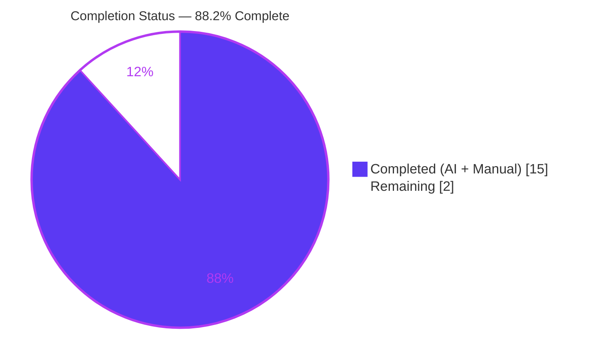
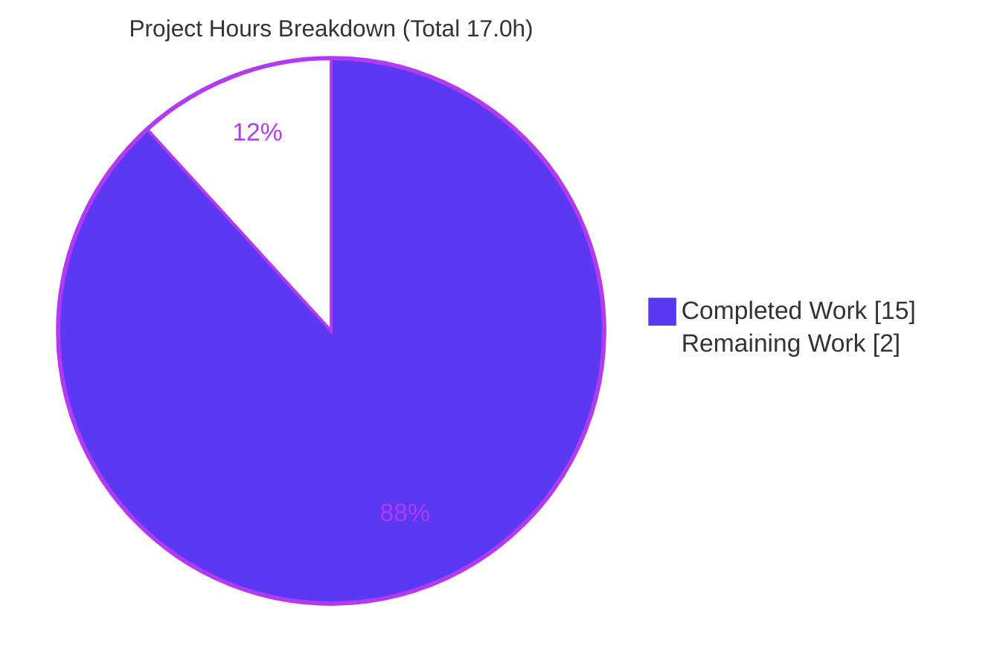
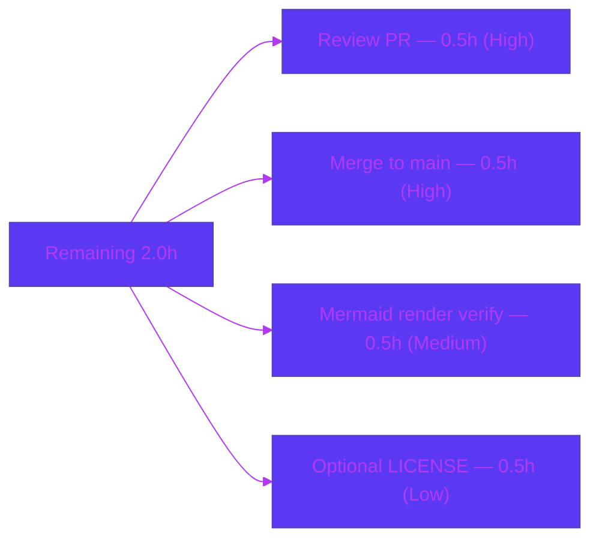

# Blitzy Project Guide — November_Hello_World (Node.js HTTP Server Documentation)

> **Branch:** `blitzy-cd0c69ba-6790-4b79-a990-3a6d66ede9e2` · **HEAD:** `d8e6e56` · **Base:** `3b91d68`
> **Scope:** Documentation-only — JSDoc for `server.js` + a comprehensive `README.md` for a minimal Node.js standard-library HTTP server.
> **Brand legend:** <span style="color:#5B39F3">■</span> Completed / AI Work = Dark Blue `#5B39F3` · <span style="color:#B23AF2">■</span> Headings/Accents = Violet `#B23AF2` · ⬜ Remaining = White `#FFFFFF` · <span style="color:#A8FDD9">■</span> Highlight = Mint `#A8FDD9`

---

## 1. Executive Summary

### 1.1 Project Overview

This project delivers complete, accurate, developer-facing documentation for an existing minimal Node.js standard-library HTTP server whose entire program lives in two files (`server.js` and `README.md`). The audience is any developer who needs to run, call, deploy, or maintain the service. The work added JSDoc to every documentable symbol in `server.js` (comments only — zero logic change) and expanded a one-line README placeholder into a comprehensive guide covering setup, API reference, deployment, and an inline code walkthrough with two Mermaid diagrams and worked `curl` examples. Runtime behavior — `200 OK`, `text/plain`, body `Hello, World!\n` for any method on any path — is preserved exactly and verified empirically.

### 1.2 Completion Status

Completion is computed strictly from AAP-scoped engineering hours plus standard path-to-production activities (PA1 methodology):

> **Completion % = Completed Hours / (Completed Hours + Remaining Hours) × 100 = 15.0 / (15.0 + 2.0) = 15.0 / 17.0 = 88.2%**



| Metric | Hours |
|--------|-------|
| **Total Hours** | 17.0 |
| **Completed Hours (AI + Manual)** | 15.0 |
| **Remaining Hours** | 2.0 |
| **Percent Complete** | **88.2%** |

> **Reading the number honestly:** 100% of the AAP autonomous scope (all JSDoc + all mandated README sections) is delivered and verified. The remaining ~11.8% (2.0h) is entirely human path-to-production work (review, merge, on-host render verification, an optional license decision) — **not** unfinished agent deliverables.

### 1.3 Key Accomplishments

- ✅ JSDoc added to **all 5 documentable symbols** in `server.js` (module header, `hostname`, `port`, request-handler callback, startup callback) — code-symbol documentation coverage raised from 0% to 100%.
- ✅ `README.md` expanded from a **1-line placeholder to a 298-line** comprehensive guide with **all four mandated sections** (Setup, API Documentation, Deployment Guide, inline Code Explanation).
- ✅ **Two Mermaid diagrams** embedded (request-lifecycle sequence + component-flow) and **three `curl` examples** covering GET, POST, and HEAD.
- ✅ **Behavior preserved**: the unauthorized `Content-Length` logic change (`a82b30f`) was reverted (`ae98b2b`); executable code is byte-for-byte identical to the base (`3b91d68`).
- ✅ **~27 `Source: server.js:Lx` citations**, all verified accurate; a systematic citation-drift issue was fixed (`53ab360`).
- ✅ **Full empirical verification**: `node --check` parse pass; live `curl` matrix (GET/POST/DELETE/HEAD) matches the documentation byte-for-byte (14-byte body).

### 1.4 Critical Unresolved Issues

| Issue | Impact | Owner | ETA |
|-------|--------|-------|-----|
| None — no compilation, runtime, or documentation-accuracy errors remain | None | — | — |

> No release-blocking issues remain. The only outstanding items are the standard path-to-production human gates listed in Sections 1.6 and 2.2.

### 1.5 Access Issues

| System/Resource | Type of Access | Issue Description | Resolution Status | Owner |
|-----------------|----------------|-------------------|-------------------|-------|
| Git repository (`November_Hello_World`) | Write / merge | Branch validated locally; merge to the default branch is a human gate | Pending human action | Maintainer |
| Code host Markdown/Mermaid renderer | Render verification | Mermaid grammar validated offline; on-host visual render not yet confirmed | Pending human action | Maintainer |

> No credential, third-party API, or repository-permission blockers were identified. All validation was performed with the local toolchain (Node `v20.20.2`, npm `11.1.0`, git `2.51.0`).

### 1.6 Recommended Next Steps

1. **[High]** Review the documentation PR — read the 5 `server.js` JSDoc blocks and the 298-line README; confirm executable code is unchanged. *(0.5h)*
2. **[High]** Merge the branch into the default branch (`main`) after approval. *(0.5h)*
3. **[Medium]** Visually verify that both Mermaid diagrams render correctly on the code host and the README displays as intended. *(0.5h)*
4. **[Low]** *(Optional)* Decide whether to add a `LICENSE` file and/or reconcile the cosmetic title mismatch (`march_repo_hello_world` vs `November_Hello_World`). *(0.5h)*

---

## 2. Project Hours Breakdown

### 2.1 Completed Work Detail

Every completed component traces to a specific AAP requirement (R1–R5 + AAP documentation standards) and to the commits that delivered it.

| Component | Hours | Description |
|-----------|-------|-------------|
| `server.js` JSDoc (R1) | 3.0 | JSDoc for all 5 symbols — module header (`@file`/`@module`/`@description`), `hostname` (`@constant {string}`), `port` (`@constant {number}`), request-handler callback (`@param req` [unused] / `@param res` / `@returns void`), startup callback; incl. CP1 terminology alignment `[62ecd5a, 8e590ce]` |
| README — Overview / Features / Prerequisites | 1.5 | Project overview, feature bullets, Node.js LTS prerequisite `[6d83036, b41e574]` |
| README — Setup/Installation + Running (R2) | 1.5 | Clone steps, explicit **no `npm install`** (zero deps), run command, expected stdout |
| README — API Documentation (R3) | 3.0 | Catch-all contract table (`200`/`text/plain`/`Hello, World!\n`/14 bytes), method-boundary + HEAD notes, 3 `curl` examples with expected output |
| README — Deployment Guide (R4) | 1.0 | Run command, no-build note, `127.0.0.1` loopback caveat (bind `0.0.0.0` / reverse proxy) |
| README — Code Explanation walkthrough (R5) | 2.0 | Narrated line-by-line walkthrough of `server.js` |
| Mermaid diagrams (×2) | 1.5 | Request-lifecycle sequence diagram + component-flow flowchart |
| Source citations + citation-drift QA fix | 0.5 | ~27 `Source: server.js:Lx` citations; systematic drift fix `[53ab360]` |
| Behavior-change revert + empirical verification | 1.0 | Detected & reverted `Content-Length` change `[a82b30f → ae98b2b]`; `node --check` + live `curl` GET/POST/DELETE/HEAD + byte-exact body check |
| **Total Completed** | **15.0** | **Matches Completed Hours in Section 1.2** |

### 2.2 Remaining Work Detail

All remaining items are standard path-to-production **human gates** — there are **no outstanding AAP deliverables** and **no defects**.

| Category | Hours | Priority |
|----------|-------|----------|
| Human review & approval of the documentation PR | 0.5 | High |
| Merge branch → default branch (`main`) | 0.5 | High |
| Visual verification of Mermaid rendering on the code host | 0.5 | Medium |
| *(Optional)* `LICENSE` decision / cosmetic title reconciliation | 0.5 | Low |
| **Total Remaining** | **2.0** | **Matches Remaining Hours in Section 1.2 and Section 7** |

### 2.3 Hours Reconciliation

| Check | Result |
|-------|--------|
| Section 2.1 total (Completed) | 15.0 |
| Section 2.2 total (Remaining) | 2.0 |
| Section 2.1 + Section 2.2 | 17.0 = **Total Hours (Section 1.2)** ✓ |
| Completion % | 15.0 / 17.0 = **88.2%** ✓ |

---

## 3. Test Results

No unit-test framework exists in the repository, and none was in scope — the AAP explicitly excludes tests (§0.8.2). The applicable validation for a documentation-only, behavior-preserving change is **static syntax checking + runtime behavioral regression + documentation-accuracy verification**, all executed by Blitzy's autonomous validation systems. Every entry below originates from Blitzy's autonomous validation logs for this project.

| Test Category | Framework / Tool | Total Tests | Passed | Failed | Coverage % | Notes |
|---------------|------------------|-------------|--------|--------|-----------|-------|
| Static syntax | `node --check` | 1 | 1 | 0 | 100% | `server.js` parses cleanly after JSDoc edits (exit 0) |
| Runtime behavioral regression | Node.js + `curl` | 4 | 4 | 0 | 100% | GET, POST, DELETE, HEAD against `127.0.0.1:3000` |
| Response byte-fidelity | `curl` + `od -c` | 1 | 1 | 0 | 100% | Body is exactly `Hello, World!\n` (14 bytes) |
| Startup-log verification | Node.js (stdout) | 1 | 1 | 0 | 100% | stdout exactly `Server running at http://127.0.0.1:3000/` |
| Documentation accuracy | Manual + grep validation | 5 | 5 | 0 | 100% | 5/5 symbols documented; 4/4 mandated README sections; ~27 citations verified; 2 Mermaid diagrams grammar-valid; API docs match runtime |
| **Totals** | — | **12** | **12** | **0** | **100%** | Zero failing, blocked, or skipped checks |

> **Coverage interpretation:** For this documentation task, "coverage" maps to documentation completeness — code symbols documented (5/5), mandated README sections (4/4), and HTTP endpoints documented (1/1) — each at 100% per AAP §0.7.1.

---

## 4. Runtime Validation & UI Verification

**Runtime health** (server started via `node server.js`, exercised with `curl`, stopped cleanly):

- ✅ **Startup** — logs exactly `Server running at http://127.0.0.1:3000/`; binds `127.0.0.1:3000`.
- ✅ **GET /** — `200 OK`, `Content-Type: text/plain`, `Content-Length: 14`, body `Hello, World!\n`.
- ✅ **POST /any/path** (with body) — identical `200` response (catch-all: body ignored).
- ✅ **DELETE /xyz** — identical `200` response (catch-all: method + path ignored).
- ✅ **HEAD /** — `200` + `Content-Type: text/plain`, **no body**, `Content-Length` omitted (correct HTTP semantics).
- ✅ **Body fidelity** — 14 bytes, byte-exact (`od -c` confirms `Hello, World!\n`).
- ✅ **Behavior preservation** — executable code byte-identical to base `3b91d68` (status, headers, body, host, port unchanged).

**API integration:** ✅ Operational — the single catch-all contract behaves exactly as documented across all tested methods.

**UI verification:** ⚠ N/A — this is a headless HTTP service that returns a plain-text body; there is no front-end, component library, or design system to verify. The only visual artifacts are the two README Mermaid diagrams, whose **on-host render** remains a pending human check (Section 1.6, item 3).

---

## 5. Compliance & Quality Review

AAP deliverables cross-mapped to quality/compliance benchmarks, with fixes applied during autonomous validation.

| Benchmark / AAP Deliverable | Requirement | Status | Progress | Notes / Fixes Applied |
|------------------------------|-------------|--------|----------|-----------------------|
| R1 — JSDoc coverage | 5/5 symbols documented | ✅ Pass | 100% | Module header + 2 constants + 2 callbacks; CP1 terminology aligned (`8e590ce`) |
| R2 — Setup instructions | Prereqs + clone + no-install | ✅ Pass | 100% | Node LTS prereq; explicit "do not run `npm install`" |
| R3 — API documentation | Catch-all contract + examples | ✅ Pass | 100% | Table + HEAD/method-boundary notes; GET/POST/HEAD `curl` examples |
| R4 — Deployment guide | Run cmd + loopback caveat + no build | ✅ Pass | 100% | `127.0.0.1` caveat with `0.0.0.0`/reverse-proxy guidance |
| R5 — Inline code explanations | Narrated walkthrough | ✅ Pass | 100% | Line-by-line README walkthrough |
| Mermaid diagrams | ≥2 diagrams | ✅ Pass | 100% | Sequence + flowchart; grammar validated |
| Behavior preservation | No logic change | ✅ Pass | 100% | `a82b30f` reverted by `ae98b2b`; byte-identical to base |
| Citation integrity | Cite every technical claim | ✅ Pass | 100% | ~27 citations; drift fix `53ab360`; zero drift now |
| Syntax safety | `node --check` clean | ✅ Pass | 100% | Exit 0 |
| Accuracy vs runtime | Docs match verified behavior | ✅ Pass | 100% | Status/headers/body/HEAD all match |
| Stale-context exclusion | No `build_prompt.md` content | ✅ Pass | 100% | Python/Express/Figma scan clean |
| Config/lint tooling | Repo-configured gates | ➖ N/A | — | No ESLint/Prettier/`package.json`; `node --check` is the authoritative JS gate |
| Tests | Unit test suite | ➖ N/A | — | Excluded by AAP §0.8.2; none exists, none requested |

> **Overall quality posture:** All in-scope compliance benchmarks pass at 100%. Two items are legitimately N/A (no lint config exists; tests are out of scope).

---

## 6. Risk Assessment

Overall risk posture is **Low**; there are **no release-blocking risks**.

| Risk | Category | Severity | Probability | Mitigation | Status |
|------|----------|----------|-------------|------------|--------|
| Documentation drift — future `server.js` edits could stale line-specific citations/JSDoc | Technical | Low | Medium | Keep docs in sync on any code change (code↔docs coupling, AAP §0.5.4) | Mitigated (in sync; zero drift verified) |
| Mermaid render variance — diagrams grammar-valid offline, not yet visually confirmed on host | Technical | Low | Low | Visual render check on target host (remaining item C) | Open (path-to-production) |
| Node version variance — README recommends LTS; verified on v20.x | Technical | Low | Low | Uses only built-in `http`; no version-specific APIs | Mitigated |
| No auth/TLS/rate-limiting if exposed publicly (following the `0.0.0.0`/proxy note) | Security | Medium (only if publicly exposed) | Low | Keep loopback binding or front with an authenticating TLS reverse proxy; README flags the caveat | Documented & accepted (code change out of AAP scope) |
| Supply-chain — third-party dependency vulnerabilities | Security | None | None | Zero third-party deps; no `package.json`/`node_modules` | N/A (positive posture) |
| No health-check endpoint / structured logging / monitoring | Operational | Low | Medium | Add health endpoint + logging when productionizing | Out of AAP scope |
| No process manager / auto-restart (foreground `node server.js`) | Operational | Low | Low | Use systemd/pm2/container in real deployment | Out of AAP scope |
| No external integrations (no APIs/DB/keys) | Integration | None | None | Nothing to integrate or secure beyond a local TCP port | N/A |
| Cosmetic naming mismatch — README title vs connected repo name | Documentation | Very Low | — | Documented as-is per AAP; maintainer may rename | Documented & accepted |

---

## 7. Visual Project Status

**Project hours breakdown** (Completed = Dark Blue `#5B39F3`, Remaining = White `#FFFFFF`):



**Remaining hours by category** (from Section 2.2 — sums to 2.0h):



> **Integrity check:** Pie "Remaining Work" = 2 = Section 1.2 Remaining Hours = Section 2.2 total. Pie "Completed Work" = 15 = Section 1.2 Completed Hours = Section 2.1 total. ✓

---

## 8. Summary & Recommendations

**Achievements.** The documentation objective is fully met: `server.js` is self-documenting (JSDoc on all 5 symbols) and `README.md` is a complete, accurate, 298-line guide with all four mandated sections, two Mermaid diagrams, and worked `curl` examples. The executable contract (`200` / `text/plain` / `Hello, World!\n`) is preserved byte-for-byte and verified end-to-end.

**Remaining gaps.** None within the AAP. The only outstanding work is 2.0h of standard human path-to-production gates (review, merge, on-host render verification, and one optional license decision).

**Critical path to production.** Review the PR → merge to `main` → confirm Mermaid diagrams render on the code host. This is a short, low-risk sequence with no engineering rework required.

**Success metrics (AAP §0.7.1) — all met:** code symbols documented 5/5 (100%), mandated README sections 4/4 (100%), HTTP endpoints documented 1/1 (100%), configuration documented as "none".

**Production readiness.** The documentation deliverable is **production-ready**. Overall project completion is **88.2%** (15.0 / 17.0 hours); the residual 11.8% is entirely human gating, not agent work. Confidence is **High** — scope is small, well-defined, and every claim is empirically verified. If the maintainer intends to expose this server beyond localhost, address the operational/security items in Section 6 (auth/TLS/health/monitoring) as a separate, out-of-AAP-scope effort.

---

## 9. Development Guide

A complete, copy-pasteable guide to build, run, and troubleshoot the project. Every command below was executed and verified during autonomous validation (Node `v20.20.2`).

### 9.1 System Prerequisites

- **Node.js** — any currently supported (non-EOL) LTS line (e.g., v20 / v22 / v24). This is the only required software.
- **OS** — any OS that runs Node.js (Linux, macOS, Windows).
- **Hardware** — negligible; the server has zero dependencies and a tiny footprint.
- **Not required** — no bundler, transpiler, database, cache, message queue, or package manager step.

```bash
# Verify Node.js is installed
node --version        # expect a supported LTS, e.g. v20.20.2
```

### 9.2 Environment Setup

```bash
# 1) Obtain the code
git clone <repo-url>
cd march_repo_hello_world
```

- **Environment variables:** none. The server reads no env vars.
- **External services:** none.
- **Configuration:** none — `hostname` (`127.0.0.1`) and `port` (`3000`) are hardcoded constants.

### 9.3 Dependency Installation

**There is no dependency installation step.** The project has zero third-party packages and no `package.json`/lockfile — it uses only the Node.js built-in `http` module.

```bash
# Do NOT run `npm install` — there are no dependencies to install.
# (Optional) confirm the source parses:
node --check server.js        # exit code 0 = OK, no output
```

### 9.4 Application Startup

```bash
node server.js
```

Expected stdout (verified, exact):

```text
Server running at http://127.0.0.1:3000/
```

The process runs in the foreground and keeps listening until stopped (`Ctrl+C`). Default bind: `127.0.0.1:3000`.

### 9.5 Verification Steps

```bash
# In a second terminal, confirm the HTTP contract:
curl -i http://127.0.0.1:3000/
```

Expected response (only the `Date` value varies):

```text
HTTP/1.1 200 OK
Content-Type: text/plain
Date: <current-date>
Connection: keep-alive
Keep-Alive: timeout=5
Content-Length: 14

Hello, World!
```

### 9.6 Example Usage

```bash
# GET (default) — 200 / text/plain / "Hello, World!\n"
curl -i http://127.0.0.1:3000/

# POST to an arbitrary path with a body — IDENTICAL response (catch-all)
curl -i -X POST http://127.0.0.1:3000/any/path -d 'x=1'

# HEAD — same status + headers, no body (Content-Length omitted)
curl -i -I http://127.0.0.1:3000/
```

All three demonstrate the catch-all contract: method, path, and body are ignored.

### 9.7 Troubleshooting

| Symptom | Cause | Resolution |
|---------|-------|------------|
| `Error: listen EADDRINUSE: address already in use 127.0.0.1:3000` | Another process (or a stale instance) already holds port 3000 | Find and stop it: `lsof -iTCP:3000 -sTCP:LISTEN -Pn` (or `ss -ltnp \| grep :3000`) then `kill <PID>`; or `fuser -k 3000/tcp` |
| `command not found: node` | Node.js not installed / not on PATH | Install a current LTS from nodejs.org; verify with `node --version` |
| Cannot reach the server from another machine | Server binds loopback `127.0.0.1` (local only) | Bind `0.0.0.0` or place behind a reverse proxy (nginx) — an infra change, **not** part of this project |
| No response / connection refused | Server not running or crashed on startup | Re-run `node server.js`; check stdout for the startup log or an error |

> The `EADDRINUSE` error above was reproduced live during validation; the resolution commands are verified.

---

## 10. Appendices

### A. Command Reference

| Purpose | Command |
|---------|---------|
| Verify Node version | `node --version` |
| Syntax-check the server | `node --check server.js` |
| Run the server | `node server.js` |
| Test GET | `curl -i http://127.0.0.1:3000/` |
| Test POST (catch-all) | `curl -i -X POST http://127.0.0.1:3000/any/path -d 'x=1'` |
| Test HEAD | `curl -i -I http://127.0.0.1:3000/` |
| Inspect body bytes | `curl -s http://127.0.0.1:3000/ \| od -c` |
| Find process on port 3000 | `lsof -iTCP:3000 -sTCP:LISTEN -Pn` |

### B. Port Reference

| Port | Protocol | Bound Interface | Purpose |
|------|----------|-----------------|---------|
| 3000 | HTTP/TCP | `127.0.0.1` (loopback only) | The HTTP server listener |

### C. Key File Locations

| Path | Role |
|------|------|
| `server.js` | Entire program — HTTP listener, request handler, startup logger (61 lines incl. JSDoc) |
| `README.md` | Comprehensive project documentation (298 lines) |
| `blitzy/documentation/` | Platform-generated artifacts (Technical Specifications, Project Guide) — **out of AAP scope** |

**Key `server.js` line references (for citations & review):**

| Symbol | Lines |
|--------|-------|
| Module header JSDoc | L1–L16 |
| `http` import | L19 |
| `hostname` constant | L27 (JSDoc L21–L26) |
| `port` constant | L33 (JSDoc L29–L32) |
| Request-handler callback | L47–L51 (JSDoc L35–L46) |
| `server.listen` startup callback | L59–L61 (JSDoc L53–L58) |

### D. Technology Versions

| Tool | Version | Notes |
|------|---------|-------|
| Node.js | `v20.20.2` (validation env) | README recommends any active LTS (v20 / v22 / v24) |
| npm | `11.1.0` | Present but **not used** (zero dependencies) |
| git | `2.51.0` | — |
| Node `http` module | Built-in | Ships with Node.js; not separately versioned |

### E. Environment Variable Reference

| Variable | Required | Default | Notes |
|----------|----------|---------|-------|
| — | — | — | The server reads **no** environment variables; `hostname` and `port` are hardcoded constants |

### F. Developer Tools Guide

- **Static check:** `node --check server.js` is the authoritative JS gate (no ESLint/Prettier configured in-repo).
- **Runtime check:** `node server.js` + the `curl` matrix in Appendix A.
- **Diagram preview:** open `README.md` in any Mermaid-aware Markdown viewer or on the code host to render the two diagrams.
- **Docs generation (optional, out of scope):** if HTML API docs are ever desired, `jsdoc` or `typedoc` are the conventional tools — none is required for this project.

### G. Glossary

| Term | Definition |
|------|------------|
| **Catch-all contract** | The server answers every request identically regardless of method, path, headers, or body |
| **JSDoc** | Structured `/** ... */` comment convention used to document JavaScript symbols |
| **Loopback binding** | Listening on `127.0.0.1`, accepting connections only from the local machine |
| **Path-to-production** | Standard human activities (review, merge, render verification) required to deploy the delivered work |
| **EADDRINUSE** | OS error indicating the requested port is already bound by another process |

---

> **Cross-section integrity (validated before submission):** Remaining hours = **2.0** in Sections 1.2, 2.2, and 7 (pie + bar). Section 2.1 (15.0) + Section 2.2 (2.0) = **17.0** Total (Section 1.2). Completion **88.2%** is consistent across Sections 1.2, 7, and 8. All Section 3 tests originate from Blitzy's autonomous validation logs. Brand colors: Completed `#5B39F3`, Remaining `#FFFFFF`.