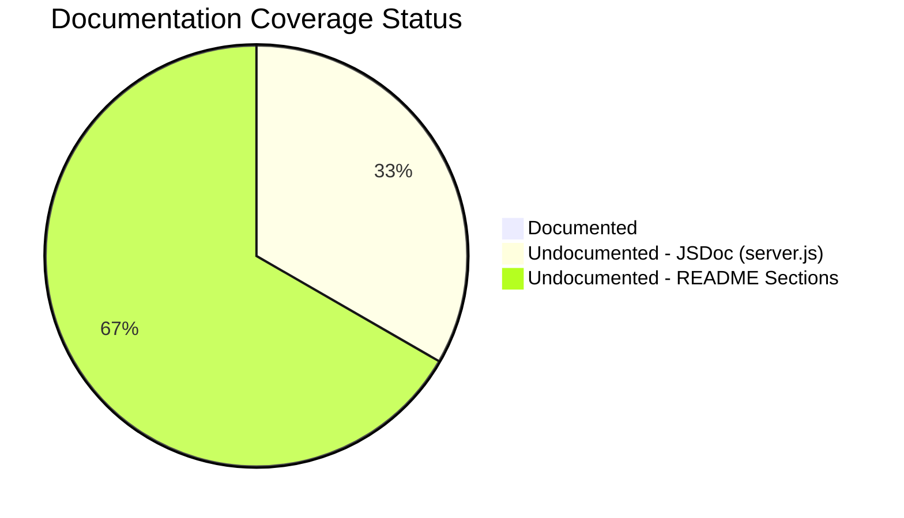

# Technical Specification

# 0. Agent Action Plan

## 0.1 Intent Clarification


### 0.1.1 Core Documentation Objective

Based on the provided requirements, the Blitzy platform understands that the documentation objective is to **comprehensively document the march_repo_hello_world project** by adding structured JSDoc comments to the `server.js` source file and replacing the placeholder `README.md` with a full-featured project documentation file covering setup, API reference, deployment, and code walkthrough.

- **Request Category:** Create new documentation and update existing documentation
- **Documentation Type:** JSDoc inline code documentation, README (setup guide, API documentation, deployment guide, code explanation)

The user's requirements decompose into the following documentation tasks:

- **Requirement 1 — JSDoc Comments:** Add JSDoc comments to all functions, constants, and the module declaration in `server.js`. This includes the `http.createServer()` request handler callback, the `server.listen()` startup callback, and all module-scoped constants (`hostname`, `port`). Each annotated element must use standard JSDoc tags (`@module`, `@const`, `@param`, `@callback`, `@description`, `@type`, `@example`).
- **Requirement 2 — Comprehensive README — Setup Instructions:** Create a setup section in `README.md` documenting prerequisites (Node.js runtime), installation steps, and how to start the server via `node server.js`.
- **Requirement 3 — Comprehensive README — API Documentation:** Document the single HTTP endpoint served by the application, including the request/response contract (method, path, status code, headers, body), with `curl` examples.
- **Requirement 4 — Comprehensive README — Deployment Guide:** Provide deployment guidance covering local execution, environment considerations (loopback binding, port availability), and notes on adapting for network exposure.
- **Requirement 5 — Comprehensive README — Inline Code Explanations:** Include a code walkthrough section in the README that explains each logical block of `server.js` with annotated code snippets and contextual narrative.

### 0.1.2 Special Instructions and Constraints

- No specific style guide or template was provided by the user. Documentation will follow standard JSDoc 3/4 conventions for inline comments and established open-source README conventions for the project documentation file.
- No Figma designs, design systems, or UI components are relevant to this documentation task.
- No user-provided templates or examples to preserve.
- No explicit style preferences mentioned — the platform will apply professional, concise, developer-friendly documentation tone.
- The project has zero external dependencies and no `package.json` — JSDoc comments will be embedded directly in `server.js` without requiring a JSDoc build pipeline, though the `jsdoc` npm package can optionally be used to generate HTML documentation.

### 0.1.3 Technical Interpretation

These documentation requirements translate to the following technical documentation strategy:

- To **add JSDoc comments to server.js functions**, we will **update** `server.js` by inserting `/** ... */` comment blocks immediately before each documentable code element: the module declaration (top of file), the `hostname` constant (line 3), the `port` constant (line 4), the `http.createServer()` call with its inline request handler callback (line 6), and the `server.listen()` call with its startup logger callback (line 12). Each JSDoc block will use appropriate tags (`@module`, `@const`, `@type`, `@description`, `@param`, `@callback`, `@example`).
- To **create a comprehensive README with setup instructions**, we will **update** `README.md` by replacing the single-heading placeholder with a complete project documentation file containing a project overview, prerequisites, installation steps, and server startup instructions.
- To **create API documentation within the README**, we will **add** a dedicated API Reference section documenting the HTTP response contract: `GET` (or any method) to `http://127.0.0.1:3000/` returns `200 OK` with `Content-Type: text/plain` and body `Hello, World!\n`, including `curl` usage examples.
- To **create a deployment guide within the README**, we will **add** a Deployment section covering local execution, port binding considerations, loopback vs. network interface exposure, and process management guidance.
- To **create inline code explanations within the README**, we will **add** a Code Walkthrough section with annotated code snippets from `server.js` explaining each logical unit (module import, configuration, server creation, request handler, listener startup).

### 0.1.4 Inferred Documentation Needs

Based on code and repository analysis, the following implicit documentation needs have been identified:

- **Module-level JSDoc block**: `server.js` currently has no module-level documentation comment. A `@module` tag should be added at the top of the file to describe the application's purpose and entry point behavior.
- **Constant documentation**: The `hostname` and `port` constants (lines 3–4) are hardcoded with no override mechanism (confirmed by tech spec Constraint C-003). JSDoc `@const` and `@type` tags should document their purpose, values, and immutability.
- **Request handler callback documentation**: The inline callback passed to `http.createServer()` is the core application logic. It requires `@param` tags for `req` (http.IncomingMessage) and `res` (http.ServerResponse), plus `@description` explaining the static response behavior.
- **Troubleshooting section in README**: Since the server binds to `127.0.0.1:3000` with hardcoded configuration and no error handling, a troubleshooting section should cover common issues: `EADDRINUSE` (port already in use), verifying Node.js installation, and connectivity verification.
- **Project structure overview**: Although the repository contains only two files, a brief structure section in the README will orient new users.
- **License / Contributing placeholder**: Standard README practice calls for indicating the project's license status and contribution process, even if minimal.


## 0.2 Documentation Discovery and Analysis


### 0.2.1 Existing Documentation Infrastructure Assessment

Repository analysis reveals a **near-complete absence of documentation infrastructure**. The project contains exactly two files at the root level with no subdirectories, no documentation tooling, and no documentation configuration files.

- **README.md** — Exists but is a single-line placeholder containing only `# march_repo_hello_world`. It provides no setup instructions, no usage documentation, no API reference, and no contribution guidelines. This file serves only as a repository title and must be replaced entirely. (Source: `README.md`, line 1)
- **No documentation generator configuration** — No `mkdocs.yml`, `docusaurus.config.js`, `sphinx/conf.py`, `.readthedocs.yml`, `jsdoc.json`, or any equivalent configuration file exists in the repository.
- **No API documentation tooling** — No JSDoc, Swagger/OpenAPI, or any API documentation generator is configured. No `package.json` exists to declare documentation-related dev dependencies.
- **No diagram tooling** — No Mermaid, PlantUML, or other diagram generation tooling is present.
- **No documentation hosting/deployment setup** — No GitHub Pages configuration, no Netlify/Vercel deployment for docs, no CI/CD pipeline of any kind.

Search patterns employed and results:

| Search Pattern | Results |
|---|---|
| `README*` | `README.md` — placeholder only (1 line) |
| `docs/**` | No `docs/` directory exists |
| `*.md` (non-README) | None found |
| `*.mdx`, `*.rst` | None found |
| `wiki/**` | No `wiki/` directory exists |
| `mkdocs.yml`, `docusaurus.config.js`, `sphinx.conf.py` | None found |
| `.jsdoc.json`, `jsdoc.conf.json` | None found |
| `package.json` | Does not exist |
| `CONTRIBUTING.md`, `CHANGELOG.md`, `LICENSE` | None found |
| Style guides or templates | None found |

**Summary:** The repository has zero documentation infrastructure. All documentation must be created from scratch, and the existing `README.md` must be replaced with comprehensive content.

### 0.2.2 Repository Code Analysis for Documentation

The entire application codebase consists of a single file, `server.js` (14 lines, 342 bytes), using the Node.js built-in `http` module with CommonJS syntax.

**Documentable code elements identified in `server.js`:**

| Line(s) | Code Element | Type | Current Documentation | JSDoc Status |
|---|---|---|---|---|
| 1 | `const http = require('http')` | Module import | None | Missing — needs `@module` tag at file level |
| 3 | `const hostname = '127.0.0.1'` | Constant | None | Missing — needs `@const` and `@type` tags |
| 4 | `const port = 3000` | Constant | None | Missing — needs `@const` and `@type` tags |
| 6–10 | `http.createServer((req, res) => {...})` | Server factory + request handler callback | None | Missing — needs `@description`, `@param` tags for `req` and `res` |
| 12–14 | `server.listen(port, hostname, () => {...})` | Server listener + startup logger callback | None | Missing — needs `@description` with listen parameters documented |

**Key observations:**
- **Zero inline comments** exist in `server.js` — not a single `//` or `/* */` block
- **Zero JSDoc blocks** exist — no `/** */` annotations anywhere in the file
- **No exports** — the module has no `module.exports` declarations; it is an imperative entry point script
- **No classes or named functions** — all logic uses `const` declarations and anonymous arrow function callbacks
- **No error handling code** to document — no `try/catch`, no `.on('error')` listeners

### 0.2.3 Web Search Research Conducted

Research was conducted to establish documentation best practices for this task:

- **JSDoc best practices for Node.js**: JSDoc comments must start with `/**` and be placed immediately before the code being documented. For CommonJS modules, a standalone `@module` tag should be included. Constants should use `@const` and `@type` tags. Callback parameters require `@param` with type annotations like `{http.IncomingMessage}` and `{http.ServerResponse}`. (Source: jsdoc.app — official JSDoc documentation)
- **JSDoc latest stable version**: JSDoc 4.0.5 (released October 2025), compatible with Node.js 12.0.0 and later. The installed Node.js v20.20.1 is fully compatible. (Source: npmjs.com/package/jsdoc, grokipedia.com)
- **CommonJS module documentation**: For Node.js modules using `require()`, JSDoc recommends including a `@module` tag at the top of the file. Since `server.js` does not export anything, the `@module` tag serves purely as a file-level documentation block. (Source: jsdoc.app/howto-commonjs-modules)
- **README best practices**: A well-structured README should answer "why should I use this?" and "how can I use this?" — covering project description, prerequisites, installation, usage, API reference, and troubleshooting at minimum. (Source: deno.com/blog/document-javascript-package)


## 0.3 Documentation Scope Analysis


### 0.3.1 Code-to-Documentation Mapping

**Module requiring documentation:**

- **Module: `server.js`** (Entry point — 14 lines, 342 bytes)
  - Public APIs / Documentable Elements:
    - Module declaration (file-level `@module` block)
    - `hostname` constant — `@const {string}`, value `'127.0.0.1'`
    - `port` constant — `@const {number}`, value `3000`
    - `server` — HTTP server instance created via `http.createServer()`
    - Request handler callback `(req, res) => {...}` — `@param {http.IncomingMessage} req`, `@param {http.ServerResponse} res`
    - Listen callback `() => {...}` — startup logger
  - Current documentation: **None** — zero comments of any kind exist in the file
  - Documentation needed: Complete JSDoc annotation for all elements above, plus inline explanatory comments for code clarity

**Configuration options requiring documentation:**

| Config Element | File | Line | Current Status | Documentation Needed |
|---|---|---|---|---|
| `hostname` | `server.js` | 3 | Hardcoded, undocumented | Document value, purpose, loopback restriction |
| `port` | `server.js` | 4 | Hardcoded, undocumented | Document value, purpose, availability requirement |

**Features requiring user guides (README sections):**

| Feature | Current Coverage | Documentation Gap |
|---|---|---|
| Server startup | None | Setup instructions, prerequisites, run command |
| HTTP response serving | None | API documentation with request/response contract |
| Network binding | None | Deployment guide with loopback and port details |
| Code architecture | None | Inline code explanations and walkthrough |
| Error scenarios | None | Troubleshooting for EADDRINUSE, missing Node.js |
| Project overview | Placeholder heading only | Full project description and value proposition |

### 0.3.2 Documentation Gap Analysis

Given the requirements and repository analysis, documentation gaps include:

**Undocumented code elements (JSDoc):**
- `server.js` file-level module documentation — **completely missing**
- `hostname` constant — **completely missing**
- `port` constant — **completely missing**
- `http.createServer()` request handler callback — **completely missing**
- `server.listen()` startup callback — **completely missing**
- Inline explanatory comments — **completely missing** (zero `//` comments in entire file)

**Missing user-facing documentation (README):**
- Project overview and description — **missing** (only a heading exists)
- Prerequisites and system requirements — **missing**
- Installation and setup instructions — **missing**
- Usage guide (how to start and test the server) — **missing**
- API reference (HTTP endpoint documentation) — **missing**
- Deployment guide — **missing**
- Code walkthrough with inline explanations — **missing**
- Troubleshooting guide — **missing**
- Project structure documentation — **missing**
- Contributing guidelines — **missing**
- License information — **missing**

**Outdated documentation:**
- `README.md` heading reads `# march_repo_hello_world` — this is not "outdated" per se, but represents an incomplete placeholder that must be replaced with substantive content

**Documentation coverage summary:**



The current state represents **0% documentation coverage** across both JSDoc annotations and README content. Every element identified above constitutes a gap that must be addressed by this documentation effort.


## 0.4 Documentation Implementation Design


### 0.4.1 Documentation Structure Planning

Given this is a minimal single-file project, the documentation structure is flat and contained within two files rather than a multi-directory documentation site. The planned structure is:

```
/ (repository root)
├── README.md              (comprehensive project documentation)
│   ├── Project Title & Badges
│   ├── Overview / Description
│   ├── Features
│   ├── Prerequisites
│   ├── Installation & Setup
│   ├── Usage
│   ├── API Reference
│   ├── Code Walkthrough
│   ├── Deployment Guide
│   ├── Troubleshooting
│   ├── Project Structure
│   ├── Contributing
│   └── License
└── server.js              (JSDoc-annotated source file)
    ├── @module block       (file-level documentation)
    ├── @const hostname     (configuration constant)
    ├── @const port         (configuration constant)
    ├── Request handler     (callback documentation)
    └── Server listener     (startup documentation)
```

No dedicated `docs/` directory or documentation site generator is warranted for this minimal project. All user-facing documentation will be consolidated in `README.md`, and all code documentation will be embedded as JSDoc comments in `server.js`.

### 0.4.2 Content Generation Strategy

**Information Extraction Approach:**

- Extract HTTP response contract details from `server.js` lines 7–9: status code (`200`), content type (`text/plain`), response body (`Hello, World!\n`)
- Extract network binding configuration from `server.js` lines 3–4, 12: hostname (`127.0.0.1`), port (`3000`)
- Extract module import details from `server.js` line 1: CommonJS `require('http')` usage
- Generate usage examples by constructing `curl` commands targeting the documented endpoint
- Create code walkthrough by segmenting `server.js` into four logical blocks: import, configuration, server/handler creation, and listen/startup

**Documentation Standards:**

- **JSDoc format:** Standard `/** ... */` blocks using JSDoc 3/4 tag syntax
- **README format:** GitHub-Flavored Markdown (GFM) with proper heading hierarchy (`# ## ### ####`)
- **Code examples:** Fenced code blocks with language identifiers (` ```javascript `, ` ```bash `)
- **Source citations:** Inline references to `server.js` line numbers in the code walkthrough
- **Tables:** Used for API reference parameters and response details
- **Consistent terminology:** "server," "request handler," "loopback interface," "startup logger" — consistent with the technical specification

**Template Application:**

No user-provided template exists. The README will follow the widely adopted open-source README structure: Title → Description → Features → Prerequisites → Setup → Usage → API → Walkthrough → Deployment → Troubleshooting → Project Structure → Contributing → License.

### 0.4.3 Diagram and Visual Strategy

**Mermaid diagrams to include in README.md:**

- **Request-Response Flow Diagram** — A sequence diagram showing the HTTP client → server → response cycle to visually explain the API behavior in the API Reference section
- **Application Lifecycle Diagram** — A simple flowchart showing `node server.js` → server starts → listens on port 3000 → handles requests, for the Code Walkthrough section

**Diagram specifications:**

| Diagram | Type | Section | Purpose |
|---|---|---|---|
| Request-Response Flow | Mermaid `sequenceDiagram` | API Reference | Visualize the HTTP request/response cycle |
| Application Lifecycle | Mermaid `flowchart` | Code Walkthrough | Show server startup and request handling flow |

No screenshot or image requirements exist — the project has no UI. All visual documentation will use Mermaid text-based diagrams embedded directly in the Markdown.


## 0.5 Documentation File Transformation Mapping


### 0.5.1 File-by-File Documentation Plan

| Target Documentation File | Transformation | Source Code/Docs | Content/Changes |
|---|---|---|---|
| `README.md` | UPDATE | `README.md`, `server.js` | Replace single-heading placeholder with comprehensive project documentation: overview, features, prerequisites, installation, usage, API reference, code walkthrough with inline explanations, deployment guide, troubleshooting, project structure, contributing, and license sections |
| `server.js` | UPDATE | `server.js` | Add JSDoc comment blocks to all documentable elements: file-level `@module` block, `@const` tags for `hostname` and `port`, `@description`/`@param` tags for the request handler callback, and documentation for the `server.listen()` startup callback. Add inline `//` comments explaining each logical code section |

This is the **complete and exhaustive** list of documentation files affected by this task. The repository contains only these two files, and both require documentation modifications.

### 0.5.2 New Documentation Files Detail

No new documentation files will be created. Both files already exist in the repository and will be updated in place.

### 0.5.3 Documentation Files to Update — Detail

**File: `server.js` — Add JSDoc Comments and Inline Explanations**

```
File: server.js
Type: JSDoc Inline Code Documentation
Source Code: server.js (self-referential — documentation is added to the source)
Sections to Document:
    - File-level @module block (top of file, before line 1)
        Tags: @module, @description, @author, @version, @requires http
    - Constant: hostname (before line 3)
        Tags: @const, @type {string}, @default '127.0.0.1', @description
    - Constant: port (before line 4)
        Tags: @const, @type {number}, @default 3000, @description
    - Server instance and request handler (before line 6)
        Tags: @description, @type {http.Server}
        Callback documentation: @param {http.IncomingMessage} req, @param {http.ServerResponse} res
    - Server listener and startup logger (before/at line 12)
        Tags: @description with inline comment for console.log
    - Inline comments (// style) explaining each code block
Key Citations: server.js lines 1-14
```

**File: `README.md` — Replace Placeholder with Comprehensive Documentation**

```
File: README.md
Type: Project Documentation (README)
Source Code: server.js (primary source for all technical content)
Sections:
    - Title and Badges (project name, Node.js badge)
    - Overview (project description and purpose)
    - Features (bulleted list of capabilities)
    - Prerequisites (Node.js runtime requirement)
    - Installation & Setup (clone, verify Node.js, run)
    - Usage (start server, verify with curl)
    - API Reference (HTTP endpoint contract with table, curl examples, Mermaid diagram)
    - Code Walkthrough (annotated code snippets with line-by-line explanation, flow diagram)
    - Deployment Guide (local execution, network considerations, process management)
    - Troubleshooting (common errors: EADDRINUSE, connection refused, Node.js not found)
    - Project Structure (file tree with descriptions)
    - Contributing (basic contribution guidance)
    - License (license status note)
Diagrams:
    - Mermaid sequence diagram for HTTP request-response flow
    - Mermaid flowchart for application lifecycle
Key Citations: server.js (all lines), existing README.md (line 1 — project name)
```

### 0.5.4 Documentation Configuration Updates

No documentation configuration files need to be created or updated. The project does not use a documentation site generator, and none is warranted for a two-file repository. JSDoc comments are embedded directly in the source code, and the README is a standalone Markdown file rendered natively by GitHub and other repository hosting platforms.

If the optional `jsdoc` npm tool is used to generate HTML documentation from the annotated `server.js`, a `jsdoc.json` configuration file could be introduced. However, this is outside the scope of the current requirements, which specify adding JSDoc *comments* (not generating a documentation site).

### 0.5.5 Cross-Documentation Dependencies

| Dependency | From | To | Nature |
|---|---|---|---|
| Code walkthrough references | `README.md` (Code Walkthrough section) | `server.js` (lines 1–14) | README references specific line numbers and code blocks from server.js |
| API contract details | `README.md` (API Reference section) | `server.js` (lines 6–9) | README documents the response behavior implemented in the request handler |
| Configuration values | `README.md` (Setup, Deployment sections) | `server.js` (lines 3–4) | README references hostname and port values from server.js constants |
| JSDoc descriptions | `server.js` (JSDoc blocks) | `README.md` (Overview, Code Walkthrough) | JSDoc descriptions and README explanations must use consistent terminology |

Both files must maintain terminological consistency — for instance, both should refer to the request handler callback, the loopback interface, and port 3000 using identical phrasing.


## 0.6 Dependency Inventory


### 0.6.1 Documentation Dependencies

The project currently has **zero dependencies** — no `package.json`, no `node_modules/`, and no dependency manifest of any kind. The documentation task itself requires no additional packages to be installed because:

- JSDoc comments are embedded directly in `server.js` as code comments — no build tool is needed
- The README is a standalone Markdown file — no documentation generator is needed
- Mermaid diagrams in the README are rendered natively by GitHub's Markdown renderer

However, for optional HTML documentation generation from JSDoc annotations, the following tool is relevant:

| Registry | Package Name | Version | Purpose |
|---|---|---|---|
| npm | jsdoc | 4.0.5 | Optional: Generate HTML API documentation from JSDoc comments in server.js |

**Important notes:**
- Installing `jsdoc` is **not required** for this documentation task. The user's requirement is to "add JSDoc comments" — not to generate HTML documentation output.
- If `jsdoc` were to be installed, it requires Node.js 12.0.0 or later. The project's practical minimum Node.js version is 4.0.0 (per tech spec Section 3.12), and the installed runtime is v20.20.1 — both are compatible.
- No `package.json` currently exists. If `jsdoc` were to be added as a dev dependency, a `package.json` would first need to be initialized via `npm init`.

### 0.6.2 Runtime Dependencies

The project's runtime dependency profile remains unchanged by this documentation task:

| Dependency | Type | Version | Status |
|---|---|---|---|
| Node.js | Runtime | ≥ 4.0.0 (practical minimum) | Required — pre-installed on host |
| `http` module | Node.js built-in | Bundled with all Node.js versions | Required — no installation needed |

### 0.6.3 Documentation Reference Updates

Since the current `README.md` contains no links, there are no existing links to update. The new comprehensive README will establish all internal references from scratch:

- Code Walkthrough section will reference `server.js` by filename
- API Reference section will reference the server URL `http://127.0.0.1:3000/`
- No cross-file documentation links are needed (the project has only two files)
- No external documentation links require updating


## 0.7 Coverage and Quality Targets


### 0.7.1 Documentation Coverage Metrics

**Current coverage analysis:**

| Category | Documented | Total | Coverage |
|---|---|---|---|
| JSDoc-annotated code elements | 0 | 5 | 0% |
| README sections (setup, API, deployment, walkthrough) | 0 | 4 | 0% |
| Inline code comments in server.js | 0 | 4 (logical blocks) | 0% |
| User-facing features documented | 0 | 4 (F-001 through F-004) | 0% |
| Configuration options documented | 0 | 2 (hostname, port) | 0% |

**Target coverage: 100%** — based on user requirement for "comprehensive" documentation.

**Coverage gaps to address:**

| Element | Current | Target | Action |
|---|---|---|---|
| `server.js` JSDoc: module declaration | 0% | 100% | Add `@module` block |
| `server.js` JSDoc: `hostname` constant | 0% | 100% | Add `@const`/`@type` block |
| `server.js` JSDoc: `port` constant | 0% | 100% | Add `@const`/`@type` block |
| `server.js` JSDoc: request handler callback | 0% | 100% | Add `@description`/`@param` block |
| `server.js` JSDoc: listen/startup callback | 0% | 100% | Add `@description` block |
| `server.js` inline comments | 0% | 100% | Add `//` comments for each logical block |
| `README.md` setup instructions | 0% | 100% | Create Prerequisites + Installation + Usage sections |
| `README.md` API documentation | 0% | 100% | Create API Reference section with endpoint contract |
| `README.md` deployment guide | 0% | 100% | Create Deployment Guide section |
| `README.md` code walkthrough | 0% | 100% | Create Code Walkthrough section with annotated snippets |

### 0.7.2 Documentation Quality Criteria

**Completeness requirements:**
- All five documentable code elements in `server.js` have JSDoc blocks with description, type, and parameter tags as appropriate
- The README includes all four user-requested sections: setup instructions, API documentation, deployment guide, and inline code explanations
- Every JSDoc block includes a human-readable `@description` explaining the element's purpose
- The API Reference section includes request method, URL, status code, headers, body, and at least one `curl` example
- The Deployment Guide covers local execution, loopback binding implications, and port availability
- The Code Walkthrough includes annotated code snippets for each of the four logical blocks in `server.js`

**Accuracy validation:**
- All code examples in the README must be tested and working against the actual `server.js` implementation
- JSDoc `@type` annotations must match the actual JavaScript types (`string` for hostname, `number` for port, `http.IncomingMessage` for `req`, `http.ServerResponse` for `res`)
- API response documentation must exactly match the server's behavior: status `200`, Content-Type `text/plain`, body `Hello, World!\n`
- Line number references in the Code Walkthrough must correspond to the **post-JSDoc-annotation** version of `server.js`

**Clarity standards:**
- Technical accuracy with accessible language — target audience is developers ranging from beginners to intermediate
- Progressive disclosure: README sections flow from simple (overview) to complex (deployment, troubleshooting)
- Consistent terminology: use "request handler," "loopback interface," "startup logger" throughout both files
- JSDoc descriptions should be concise — one to two sentences per element

**Maintainability:**
- Source citations in README reference `server.js` by filename and section, not by line number (since line numbers will shift after adding JSDoc blocks)
- JSDoc annotations are co-located with the code they describe, ensuring they stay synchronized

### 0.7.3 Example and Diagram Requirements

| Requirement | Minimum Count | Location |
|---|---|---|
| `curl` command examples | 2 (basic GET, verbose output) | README — API Reference |
| Code walkthrough snippets | 4 (one per logical block) | README — Code Walkthrough |
| Mermaid diagrams | 2 (request flow, app lifecycle) | README — API Reference, Code Walkthrough |
| JSDoc `@example` tags | 1 (server startup command) | `server.js` — module-level block |

**Diagram verification:** All Mermaid diagrams must render correctly in GitHub-Flavored Markdown. Diagrams will use only standard Mermaid syntax without custom plugins.


## 0.8 Scope Boundaries


### 0.8.1 Exhaustively In Scope

**Documentation file updates:**
- `README.md` — Complete replacement of placeholder content with comprehensive project documentation including all user-requested sections (setup instructions, API documentation, deployment guide, inline code explanations)
- `server.js` — Addition of JSDoc comment blocks (`/** ... */`) before all documentable code elements and inline explanatory comments (`//`) throughout

**Specific JSDoc annotations in scope:**
- `server.js` — File-level `@module` documentation block
- `server.js` — `@const` / `@type` / `@description` for `hostname` constant (line 3)
- `server.js` — `@const` / `@type` / `@description` for `port` constant (line 4)
- `server.js` — `@description` / `@param` for `http.createServer()` request handler callback (lines 6–10)
- `server.js` — `@description` for `server.listen()` and startup logger callback (lines 12–14)
- `server.js` — Inline `//` comments explaining each logical code block

**Specific README sections in scope:**
- Project title, description, and overview
- Features summary
- Prerequisites (Node.js requirement)
- Installation and setup instructions
- Usage guide (running the server, testing)
- API Reference (HTTP endpoint contract, examples, diagram)
- Code Walkthrough (annotated source explanation with diagram)
- Deployment Guide (local execution, network considerations, process management)
- Troubleshooting (common errors and solutions)
- Project Structure (file tree)
- Contributing section (basic guidance)
- License section (status note)

**Documentation assets in scope:**
- Mermaid diagram: HTTP request-response sequence diagram (embedded in README)
- Mermaid diagram: Application lifecycle flowchart (embedded in README)

### 0.8.2 Explicitly Out of Scope

- **Source code functional modifications** — No changes to the runtime behavior of `server.js`. Adding JSDoc comments and inline comments does not alter any executed code. The `hostname`, `port`, server creation, request handler logic, and listen callback must remain functionally identical.
- **New file creation** — No new files (e.g., `docs/`, `CONTRIBUTING.md`, `LICENSE`, `CHANGELOG.md`, `package.json`, `jsdoc.json`) will be created. Documentation is consolidated in the existing two files.
- **Dependency installation** — No `package.json` creation, no `npm init`, no `npm install jsdoc`. The user requested JSDoc comments, not a JSDoc build pipeline.
- **Documentation site generation** — No HTML documentation generation via `jsdoc` CLI. No `mkdocs`, `docusaurus`, or `sphinx` setup.
- **Test file creation or modification** — No test files exist, and none will be created as part of this documentation task.
- **CI/CD pipeline creation** — No GitHub Actions, no automated documentation builds.
- **Containerization** — No `Dockerfile` or deployment infrastructure creation.
- **Feature additions or refactoring** — No routing, middleware, error handling, configuration management, or any functional code changes.
- **API specification files** — No OpenAPI/Swagger YAML/JSON generation. API documentation is included within the README as a Markdown section.
- **Code linting or formatting enforcement** — No `.eslintrc`, `.prettierrc`, or code quality tool configuration.


## 0.9 Execution Parameters


### 0.9.1 Documentation-Specific Instructions

| Parameter | Value |
|---|---|
| **Documentation build command** | Not applicable — no documentation generator is used. JSDoc comments are embedded in source; README is standalone Markdown. |
| **Documentation preview command** | For README: any Markdown renderer (e.g., GitHub web UI, VS Code Markdown preview, `grip README.md`). For JSDoc HTML (optional): `npx jsdoc server.js -d out/` |
| **Diagram generation command** | Not applicable — Mermaid diagrams are embedded as fenced code blocks in README.md and rendered by GitHub/GitLab natively. |
| **Documentation deployment command** | Not applicable — no documentation hosting infrastructure exists. README is rendered automatically by repository hosting. |
| **Default format** | Markdown (GitHub-Flavored Markdown) with embedded Mermaid diagram blocks |
| **Citation requirement** | Every code walkthrough section references `server.js` by filename and code block description |
| **Style guide** | Standard JSDoc 3/4 tag syntax for inline comments; conventional open-source README structure for project documentation |
| **Documentation validation** | Manual review: verify JSDoc syntax correctness, verify README renders correctly in GitHub, verify `curl` examples produce expected output when run against the server |

### 0.9.2 Server Verification Commands

The following commands can be used to verify the documentation's accuracy against the actual server behavior:

- **Start the server:** `node server.js`
- **Verify startup message:** Expect `Server running at http://127.0.0.1:3000/` on stdout
- **Test HTTP response:** `curl http://127.0.0.1:3000/` — expect `Hello, World!`
- **Test with verbose output:** `curl -v http://127.0.0.1:3000/` — expect status `200`, `Content-Type: text/plain`
- **Stop the server:** `Ctrl+C` (sends SIGINT)

### 0.9.3 JSDoc Syntax Validation

After adding JSDoc comments to `server.js`, correctness can be validated by:

- **Visual inspection:** Ensure all `/** ... */` blocks start with `/**` (not `/*` or `/***`)
- **IDE tooltip verification:** Open `server.js` in VS Code or WebStorm — hovering over documented elements should display the JSDoc-generated tooltip
- **Optional HTML generation:** Run `npx jsdoc server.js -d out/` to confirm the JSDoc parser successfully processes all annotations without errors


## 0.10 Rules for Documentation


No explicit documentation-specific rules were provided by the user. The following rules are derived from the user's requirements and established best practices:

- **JSDoc comments must use standard `/** ... */` syntax** — Each JSDoc block must start with `/**` to be recognized by the JSDoc parser and IDE tooling. Comments starting with `/*` or `/***` will be ignored by JSDoc tools.
- **JSDoc comments must be placed immediately before the code being documented** — Per JSDoc convention, each annotation block appears directly above the code element it describes, with no intervening blank lines or code.
- **The README must be comprehensive** — The user explicitly requested "a comprehensive README," indicating that all major sections (setup, API, deployment, code explanation) must be thorough and complete rather than minimal stubs.
- **Inline code explanations must be included** — The user specifically requested "inline code explanations," which means both JSDoc blocks and `//` style inline comments should be added to `server.js` to explain the purpose of each code section.
- **No source code functional changes** — The documentation task must not alter the runtime behavior of `server.js`. All modifications are limited to adding comments (JSDoc blocks and inline comments) that do not affect execution.
- **Documentation must reflect current codebase accurately** — All API response details, configuration values, port numbers, and behavioral descriptions must exactly match the actual implementation in `server.js`.
- **Use consistent terminology** — Terms like "request handler," "loopback interface," "startup logger," and "static response" should be used consistently across both `server.js` JSDoc comments and `README.md` content.


## 0.11 References


### 0.11.1 Repository Files and Folders Searched

| Path | Type | Purpose of Search | Key Findings |
|---|---|---|---|
| `/` (repository root) | Folder | Identify all repository contents | Contains exactly 2 files: `README.md` and `server.js`. Zero subdirectories. No `package.json`, no `node_modules/`, no configuration files, no test files, no documentation directories. |
| `server.js` | File | Analyze source code for JSDoc annotation targets | 14-line Node.js script using built-in `http` module. Contains zero comments of any kind. Five documentable elements identified: module declaration, `hostname` const, `port` const, request handler callback, listen/startup callback. |
| `README.md` | File | Assess existing documentation state | Single-line placeholder: `# march_repo_hello_world`. No substantive content — requires complete replacement. |

**Negative search results (files/patterns confirmed absent):**
- `package.json`, `package-lock.json`, `yarn.lock` — no dependency manifest
- `docs/`, `wiki/` — no documentation directories
- `*.md` (other than README.md), `*.mdx`, `*.rst` — no additional documentation files
- `mkdocs.yml`, `docusaurus.config.js`, `sphinx.conf.py`, `jsdoc.json` — no documentation tooling configuration
- `.nvmrc`, `.node-version` — no Node.js version pinning
- `CONTRIBUTING.md`, `CHANGELOG.md`, `LICENSE` — no standard repository metadata files
- `.eslintrc*`, `.prettierrc*`, `tsconfig.json` — no code quality or TypeScript configuration
- `Dockerfile`, `docker-compose*`, `.github/` — no containerization or CI/CD files

### 0.11.2 Technical Specification Sections Referenced

| Section | Content Retrieved | Relevance |
|---|---|---|
| 1.1 Executive Summary | Project overview, stakeholders, value proposition | Informed README overview content and audience targeting |
| 1.2 System Overview | System capabilities, component inventory, technical approach | Informed code walkthrough structure and API documentation |
| 1.3 Scope | In-scope features, out-of-scope capabilities, excluded items | Defined documentation scope boundaries and feature list |
| 2.1 Feature Catalog | Features F-001 through F-004 with detailed descriptions | Mapped each feature to documentation coverage requirements |
| 3.1 Technology Stack Overview | Stack summary, architecture diagram, design philosophy | Informed prerequisites section and technology context |
| 3.12 Node.js Version Guidance | Minimum compatible version (4.0.0), recommended LTS versions | Informed prerequisites and deployment guide content |
| 4.4 HTTP Request-Response Cycle | Request processing flow, response assembly sequence | Informed API Reference section and request-response diagram |
| 5.2 Component Details | All component descriptions, interaction diagrams, state transitions | Informed JSDoc descriptions and code walkthrough narratives |

### 0.11.3 External Sources Consulted

| Source | URL | Information Retrieved |
|---|---|---|
| JSDoc Official Documentation | https://jsdoc.app/about-getting-started | JSDoc syntax rules, `/**` comment format, tag usage patterns |
| JSDoc CommonJS Modules Guide | https://jsdoc.app/howto-commonjs-modules | `@module` tag usage for CommonJS/Node.js modules |
| JSDoc npm Package | https://www.npmjs.com/package/jsdoc | Latest version (4.0.5), Node.js compatibility (12.0.0+) |
| JSDoc GitHub Repository | https://github.com/jsdoc/jsdoc | Version history, changelog, installation instructions |
| Grokipedia — JSDoc | https://grokipedia.com/page/JSDoc | Confirmed JSDoc 4.0.5 as latest stable (October 2025) |
| Deno Blog — Document JS Package | https://deno.com/blog/document-javascript-package | README best practices, JSDoc best practices |

### 0.11.4 User-Provided Attachments and Metadata

- **Attachments provided:** None (0 attachments)
- **Figma URLs provided:** None
- **Environment files provided:** None
- **Setup instructions provided:** None
- **Implementation rules provided:** None
- **Environment variables provided:** None
- **Secrets provided:** None


