# Technical Specification

# 1. Introduction

## 1.1 EXECUTIVE SUMMARY

### 1.1.1 Project Overview

The `march_repo_hello_world` repository contains a minimal, self-contained Node.js HTTP server that responds to any inbound request with the static plain-text payload `Hello, World!`. The entire system is implemented as a single CommonJS script (`server.js`, 14 lines) that depends exclusively on the Node.js standard library — specifically the built-in `http` module — and requires no installation, build, or dependency-resolution step prior to execution.

The repository is structured as a canonical "Hello, World!" reference artifact rather than a feature-bearing application. It comprises exactly two files at the repository root (`server.js` and `README.md`), zero subdirectories, no package manifest (`package.json` is absent), no lockfile, no third-party dependencies, no test suite, no configuration layer, no containerization assets, and no continuous-integration definitions. The `README.md` file contains a single H1 heading (`# march_repo_hello_world`) and no descriptive prose.

### 1.1.2 Core Problem Addressed

The repository addresses the foundational engineering need for a verifiable, minimum-viable HTTP server that demonstrates the simplest possible Node.js networking workflow. It is intentionally narrow in scope and exists to:

| Concern | How the Repository Addresses It |
|---------|-------------------------------|
| Demonstrating the bare-minimum HTTP server pattern in Node.js | Provides a fully runnable, single-file implementation using only the `http` core module |
| Establishing a clean baseline free of toolchain assumptions | Avoids `package.json`, lockfiles, bundlers, transpilation, and external packages |
| Verifying that a local runtime environment can execute a Node.js HTTP listener | Binds to `127.0.0.1:3000` and emits a `console.log` confirmation on successful startup |
| Serving as a scaffold for future enhancements | Presents a flat, easily extensible structure with no architectural lock-in |

The repository does **not** address any specific commercial, operational, or domain-specific business problem. There is no domain language, no feature naming, no business terminology, and no user-facing functionality beyond the static response.

### 1.1.3 Key Stakeholders and Users

The repository contains no explicit stakeholder declarations, contributor lists, organizational metadata, or maintainer identification. Stakeholder roles below are inferred from the typical lifecycle of a Hello-World scaffold artifact rather than from declared evidence in the source.

| Stakeholder Role | Relationship to the System |
|------------------|---------------------------|
| Developers / Engineers | Primary operators — execute `node server.js` and consume the response for verification or learning |
| Local HTTP Clients (`curl`, browsers, scripts) | Sole runtime consumers — any client capable of issuing an HTTP request to `127.0.0.1:3000` |
| Maintainers of downstream forks/extensions | Inherit the file as a starting point for further development |

No external user groups, customer segments, business units, or end users are identified anywhere in the repository.

### 1.1.4 Value Proposition and Expected Impact

The value proposition is the elimination of friction between an engineer and a running HTTP server. By avoiding all auxiliary tooling, the repository offers immediate executability with the single command `node server.js`, no dependency installation, no environment configuration, and no compilation. The expected impact is bounded to the verification of:

- The presence and functionality of a Node.js runtime on the host
- The availability of TCP port `3000` on the loopback interface
- The correct operation of the Node.js `http` module's request/response cycle

No financial, operational, or strategic business impact is asserted by the repository's contents.

## 1.2 SYSTEM OVERVIEW

### 1.2.1 Project Context

#### Business Context and Market Positioning

The repository carries no business-context artifacts. There is no product description, no target market identification, no competitive positioning statement, no pricing or licensing model (no `LICENSE` file is present), and no roadmap. The project is positioned solely as a technical reference — a canonical example of the minimum code required to serve HTTP responses from a Node.js process.

#### Current System Limitations

The repository does **not** replace, upgrade, or supersede any prior system. There is no migration documentation, no compatibility layer, no deprecation notice, and no reference to predecessor systems within either `server.js` or `README.md`. This is a greenfield artifact with no historical context.

#### Integration with Existing Enterprise Landscape

The system performs no integrations. It does not invoke external APIs, does not consume messages from queues, does not connect to databases, does not authenticate against identity providers, and does not publish telemetry. Its sole network interaction is accepting inbound HTTP requests on the loopback interface (`127.0.0.1`), which is by definition reachable only from the same host. Consequently, in any enterprise landscape this repository represents an isolated, self-contained process with zero outbound coupling.

### 1.2.2 High-Level Description

#### Primary System Capabilities

The system exposes exactly one capability:

| Capability | Description |
|-----------|-------------|
| Static HTTP Response Service | Accepts any HTTP request method on any URL path arriving at `127.0.0.1:3000` and returns HTTP status `200` with `Content-Type: text/plain` and a response body of `Hello, World!\n` |
| Startup Notification | Writes a single line to standard output via `console.log` upon successful binding to the configured host and port, conveying the local URL `http://127.0.0.1:3000/` |

The request handler defined in `server.js` receives the `(req, res)` arguments but never inspects the request object — no URL parsing, no method differentiation, no header inspection, and no body parsing occurs. Every request, irrespective of method, path, headers, or body, produces the identical response.

#### Major System Components

The complete component inventory is shown below. Because the repository contains a single source file with no modular decomposition, "components" here refer to logical responsibilities within `server.js` rather than separate modules.

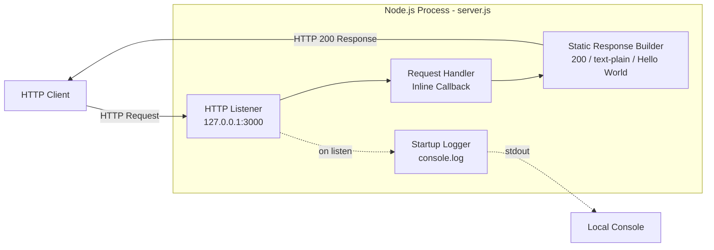

| Logical Component | File / Location | Responsibility |
|-------------------|-----------------|----------------|
| HTTP Listener | `server.js` (via `http.createServer` and `server.listen`) | Binds to host/port and accepts inbound TCP connections speaking HTTP/1.1 |
| Request Handler | `server.js` (inline callback) | Sets the response status code, sets the `Content-Type` header, writes the static body, and ends the response |
| Startup Logger | `server.js` (the `console.log` invocation passed as the `listen` callback) | Emits a single stdout line confirming the bound URL |

#### Core Technical Approach

| Architectural Concern | Implementation Approach |
|----------------------|-------------------------|
| Runtime | Node.js (no minimum version pinned — no `engines` field, no `.nvmrc`, no `.node-version` file) |
| Language | Plain JavaScript with no transpilation, no TypeScript, and no build step |
| Module System | CommonJS (`require('http')`) |
| Dependencies | Zero third-party dependencies; uses only the Node.js standard library |
| Concurrency Model | Single-process, single-threaded event loop as provided by Node.js |
| Network Binding | Loopback interface (`127.0.0.1`) on port `3000` — both hardcoded as constants in `server.js` |
| Response Generation | Synchronous; the handler completes within a single event-loop tick with no I/O, no Promises, and no `async/await` |
| Configuration | None — no environment variables, no config files, no command-line argument parsing |

### 1.2.3 Success Criteria

The repository declares no formal acceptance criteria, no service-level objectives, and no test suite that would codify success. The criteria below are derived from the observable behavior of `server.js` and represent the implicit functional contract of the system.

#### Measurable Objectives

| Objective | Verification Method |
|-----------|---------------------|
| The server process starts without error when launched via `node server.js` | The startup `console.log` line is written to stdout |
| Inbound HTTP requests to `http://127.0.0.1:3000/` receive an HTTP 200 response | Manual inspection via an HTTP client such as `curl` |
| Response payload exactly equals `Hello, World!\n` | Byte-level comparison of the response body |
| Response `Content-Type` header equals `text/plain` | Header inspection on the HTTP client side |

#### Critical Success Factors

- A functioning Node.js runtime on the host machine
- Availability of TCP port `3000` on the loopback interface (no port-conflict resolution exists in `server.js`)
- Network stack permitting binding to `127.0.0.1`

#### Key Performance Indicators (KPIs)

No KPIs are declared in the repository. There is no observability layer, no metrics emission, no health-check endpoint, and no instrumentation. Because the request handler performs no I/O and emits a fixed, in-memory payload, response latency is bounded only by Node's event-loop scheduling and operating-system network stack. No performance targets, throughput requirements, or availability targets are specified.

## 1.3 SCOPE

### 1.3.1 In-Scope Elements

#### Core Features and Functionalities

The complete set of must-have, in-scope capabilities — verified by direct inspection of `server.js` — is enumerated below.

| In-Scope Capability | Evidence in `server.js` |
|--------------------|--------------------------|
| Importing the Node.js `http` core module | `require('http')` on line 1 |
| Defining the bind hostname as `127.0.0.1` | Constant on line 3 |
| Defining the listen port as `3000` | Constant on line 4 |
| Creating an HTTP server with an inline request callback | `http.createServer(...)` on line 6 |
| Setting HTTP response status code `200` | `res.statusCode = 200` on line 7 |
| Setting the `Content-Type` response header to `text/plain` | `res.setHeader('Content-Type', 'text/plain')` on line 8 |
| Writing the static body `Hello, World!\n` and ending the response | `res.end('Hello, World!\n')` on line 9 |
| Starting the listener with a confirmation callback | `server.listen(port, hostname, callback)` on line 12 |
| Emitting a single startup log line to stdout | `console.log` of the local URL on line 13 |

#### Primary User Workflows

There is a single user workflow:

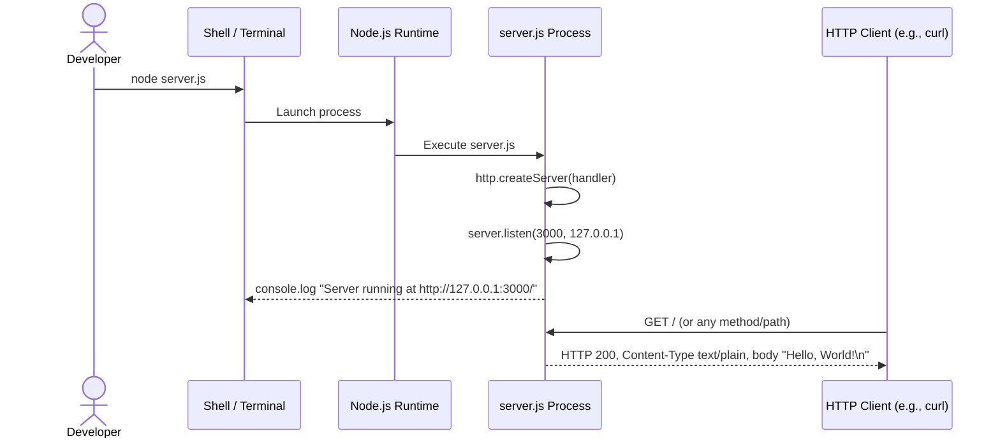

#### Essential Integrations

There are no in-scope integrations with external services, databases, queues, identity providers, or third-party APIs. The only integration point is the inbound HTTP socket on `127.0.0.1:3000`.

#### Key Technical Requirements

| Requirement | In-Scope Position |
|-------------|-------------------|
| Node.js runtime supporting the `http` core module | Required at runtime |
| Available TCP port `3000` on the loopback interface | Required at runtime |
| Operating system supporting loopback networking | Required at runtime |
| Standard output stream availability for startup logging | Required at runtime |

#### Implementation Boundaries

| Boundary Dimension | Defined Scope |
|--------------------|---------------|
| System Boundary | A single Node.js process executing `server.js`; the boundary terminates at the process's stdout stream and its single bound TCP socket on `127.0.0.1:3000` |
| User Groups Covered | Local developers/operators executing the script on the same host as the server |
| Geographic / Market Coverage | Not applicable; the loopback binding prevents reach beyond the local machine |
| Data Domains Included | None — the system handles no user data, no persistent data, and no domain entities; the only data exchanged is the constant outbound string `Hello, World!\n` |

### 1.3.2 Out-of-Scope Elements

#### Explicitly Excluded Features and Capabilities

The following capabilities are explicitly out of scope by virtue of being absent from the source code. Their absence is a deliberate consequence of the repository's purpose as a minimal scaffold.

| Excluded Capability | Confirmation |
|---------------------|--------------|
| URL routing / path-based handling | The request handler does not inspect `req.url` |
| HTTP method differentiation (GET, POST, PUT, DELETE, etc.) | The request handler does not inspect `req.method` |
| Request body parsing | No `data`/`end` event listeners on `req`, no body-parser logic |
| Request header inspection beyond response `Content-Type` | No reads of `req.headers` |
| Authentication and authorization | No credential checks, no tokens, no session validation |
| Session management | No session storage, no cookie handling |
| Database or persistence layer | No database driver, no file-system writes, no caching layer |
| Logging beyond a single startup line | Only one `console.log` call exists |
| Error handling and recovery | No `try/catch`, no `'error'` event listeners on the server or socket |
| HTTPS / TLS / secure transport | Plain HTTP only; no TLS certificate handling |
| Environment-based configuration | Hostname and port are hardcoded; no `process.env` references |
| External API integrations | No outbound HTTP client, no SDK imports |
| Multiple endpoints or content types | Single, uniform response across all requests |
| Static file serving | No file-system reads to serve assets |
| Templating | No template engine, no dynamic content rendering |
| WebSockets or streaming | No `ws` library, no `Transfer-Encoding: chunked` streaming logic |
| Clustering or multi-process scaling | No use of the `cluster` module or worker threads |
| Health checks or readiness probes | No `/health`, `/ready`, or equivalent endpoint |
| Metrics or observability | No metrics exporter, no tracing instrumentation |
| Automated testing infrastructure | No `tests/`, `__tests__/`, or `*.test.js` files; no test runner configured |
| Build or bundling pipeline | No bundler config, no `package.json` scripts |
| Deployment configuration | No `Dockerfile`, no `docker-compose.yml`, no Kubernetes manifests, no CI/CD definitions |
| Linting or code-quality tooling | No `.eslintrc`, no `.prettierrc`, no editor config |
| Dependency management | No `package.json`, no `package-lock.json`, no `yarn.lock` |
| Licensing declaration | No `LICENSE` file |

#### Future Phase Considerations

The repository does not declare any roadmap, milestone list, or future-phase plan. Any subsequent expansion — for example, adding routing, persistence, authentication, configuration, or testing — would be discretionary work by downstream consumers of this scaffold rather than scope deferred from this repository.

#### Integration Points Not Covered

No integration points are covered. The repository defines no contracts with external systems, no message-broker bindings, no database schemas, and no API client libraries. The lone interface is the loopback HTTP socket, which is bidirectional only in the trivial sense of request and response.

#### Unsupported Use Cases

| Use Case | Status |
|----------|--------|
| Production-grade web service | Unsupported; loopback binding, lack of TLS, absence of error handling, no observability |
| Externally accessible API | Unsupported; the server is reachable only from the same host due to `127.0.0.1` binding |
| Multi-tenant or authenticated service | Unsupported; no identity, session, or authorization logic exists |
| Persistent data handling | Unsupported; no storage layer of any kind |
| Horizontally scaled deployment | Unsupported; no clustering, no externalized state, no orchestration manifests |
| Configurable deployment across environments | Unsupported; all parameters are hardcoded literal values in `server.js` |

### 1.3.3 Documentation and Repository Artifact Inventory

For completeness, the following table enumerates every artifact present in the repository and clarifies which artifacts that are conventionally expected in a Node.js project are absent.

| Artifact | Present? | Notes |
|----------|----------|-------|
| `server.js` | Yes | 14-line CommonJS source containing the entire application |
| `README.md` | Yes | Single H1 heading (`# march_repo_hello_world`); no further content |
| `package.json` | No | No npm metadata; no declared name, version, scripts, or engines |
| `package-lock.json` / `yarn.lock` | No | No lockfile (none required given zero dependencies) |
| `node_modules/` | No | No installed third-party packages |
| `.gitignore` | No | No repository-level ignore rules |
| `.env` / `.env.example` | No | No environment-variable templating |
| `Dockerfile` / `docker-compose.yml` | No | No containerization assets |
| `.github/` or other CI config | No | No continuous-integration pipeline definitions |
| Test files (`*.test.js`, `*.spec.js`, `tests/`) | No | No automated tests |
| Source folders (`src/`, `lib/`, `app/`) | No | Application is a single flat file at the repository root |
| `tsconfig.json` | No | Not a TypeScript project |
| Linter configurations | No | No `eslint`, `prettier`, or equivalent configuration |
| `LICENSE` | No | No licensing terms specified |
| `CHANGELOG.md`, `CONTRIBUTING.md` | No | No supplemental project documentation |

#### References

- `server.js` — Sole executable source file (14 lines). Examined in full to derive the system's HTTP listener configuration (`127.0.0.1:3000`), static response semantics (HTTP 200, `Content-Type: text/plain`, body `Hello, World!\n`), startup logging behavior, and the complete absence of routing, error handling, configuration, and external integration.
- `README.md` — Sole documentation file (1 line). Examined in full to confirm that the repository contains no project description, installation instructions, usage notes, or licensing information beyond the H1 heading `# march_repo_hello_world`.
- Repository root (`/`) — Examined to enumerate top-level files and confirm the absence of subdirectories, package manifests, lockfiles, configuration files, containerization assets, CI/CD definitions, test infrastructure, and source folders.

# 2. Product Requirements

## 2.1 FEATURE CATALOG

### 2.1.1 Documentary Conventions and Caveats

The repository declares **no formal product requirements, no user stories, no priorities, no statuses, no acceptance criteria, no SLAs, and no KPIs** of any kind. The two files present (`server.js` and `README.md`) contain no requirement identifiers, no `package.json` description field, no requirements manifest, and no annotations. Consequently, the features catalogued in this section are **logical groupings of observable behavior** extracted by direct inspection of `server.js`, and the metadata fields (Priority, Status, Complexity) are **inferred conservatively** from the source rather than declared in the repository.

| Field | Source of Values in This Section |
|-------|----------------------------------|
| Feature ID | Synthesized in `F-XXX` format for this specification only |
| Feature Name | Synthesized from the behavior implemented in `server.js` |
| Priority / Status / Complexity | Inferred from source; no declarations exist in the repository |
| Acceptance Criteria | Derived from byte-level inspection of `server.js` lines 1–14 |

All three features below collectively constitute the **entirety** of the system's behavior; no additional features are present in the codebase, and the Out-of-Scope inventory in §1.3.2 enumerates capabilities that are demonstrably absent.

---

### 2.1.2 F-001 — HTTP Server Initialization and Binding

#### Feature Metadata

| Attribute | Value |
|-----------|-------|
| Unique ID | F-001 |
| Feature Name | HTTP Server Initialization and Loopback Binding |
| Feature Category | Network Service Bootstrap |
| Priority Level | Critical (inferred — feature is prerequisite to all others) |
| Status | Completed (inferred — implementation present in `server.js`) |

#### Description

**Overview.** This feature imports the Node.js `http` core module, declares the bind hostname `127.0.0.1` and TCP port `3000` as module-scoped constants, instantiates an HTTP server via `http.createServer(...)`, and binds the server by invoking `server.listen(port, hostname, callback)`. Lines 1, 3–4, 6, and 12 of `server.js` collectively implement this feature.

**Business Value.** Provides the verifiable runtime substrate against which any HTTP behavior can be exercised. Without this feature, the process exits immediately and no response can be served. As described in §1.1.4, the value proposition is the elimination of friction between an engineer and a running HTTP server.

**User Benefits.** Local developers obtain a single-command (`node server.js`) means of bringing up an HTTP listener with zero installation, zero configuration, and zero external dependency resolution.

**Technical Context.** Uses CommonJS module loading (`require('http')`), the Node.js standard library exclusively, and a single-process single-threaded event loop. Binding is restricted to the loopback interface, which by definition limits reachability to clients on the same host.

#### Dependencies

| Dependency Type | Specifics |
|-----------------|-----------|
| Prerequisite Features | None — this is the bootstrap feature |
| System Dependencies | Node.js runtime; operating-system loopback networking; availability of TCP port `3000` on `127.0.0.1` |
| External Dependencies | None — zero third-party packages; no `node_modules/`, no `package.json` |
| Integration Requirements | None — no outbound integrations; only inbound HTTP socket |

---

### 2.1.3 F-002 — Static "Hello, World!" HTTP Response Generation

#### Feature Metadata

| Attribute | Value |
|-----------|-------|
| Unique ID | F-002 |
| Feature Name | Static HTTP 200 / text-plain "Hello, World!" Response |
| Feature Category | Request Handling |
| Priority Level | Critical (inferred — represents the system's sole user-facing capability) |
| Status | Completed (inferred — implementation present in `server.js`) |

#### Description

**Overview.** An inline anonymous callback `(req, res) => { ... }` registered with `http.createServer` constitutes the entire request-handling pipeline. The handler sets `res.statusCode = 200`, sets the response header `Content-Type: text/plain`, and writes the static body `Hello, World!\n` via `res.end(...)`. The `req` parameter is accepted but **never inspected** — no reads of `req.url`, `req.method`, `req.headers`, or the request body occur. Lines 6–10 of `server.js` implement this feature.

**Business Value.** Demonstrates a functioning HTTP request/response cycle and supplies the canonical "Hello, World!" payload that confirms end-to-end correctness from TCP accept through response close.

**User Benefits.** Any HTTP client (e.g., `curl`, browsers, custom scripts) issuing a request to `http://127.0.0.1:3000/` receives an identical, deterministic, byte-exact response, simplifying verification.

**Technical Context.** The handler executes synchronously within a single event-loop tick, performs no I/O, uses no Promises and no `async`/`await`, and produces no side effects beyond the response stream.

#### Dependencies

| Dependency Type | Specifics |
|-----------------|-----------|
| Prerequisite Features | F-001 (the listener must be bound before the handler can execute) |
| System Dependencies | Node.js `http` module's response-stream APIs (`res.statusCode`, `res.setHeader`, `res.end`) |
| External Dependencies | None |
| Integration Requirements | None — handler does not read request data, performs no downstream calls |

---

### 2.1.4 F-003 — Startup Confirmation Logging

#### Feature Metadata

| Attribute | Value |
|-----------|-------|
| Unique ID | F-003 |
| Feature Name | Single-Line Startup Confirmation to Standard Output |
| Feature Category | Operational Observability (minimal) |
| Priority Level | Medium (inferred — observability convenience, not gating to request handling) |
| Status | Completed (inferred — implementation present in `server.js`) |

#### Description

**Overview.** A callback passed to `server.listen` invokes `console.log` exactly once upon successful binding, emitting the interpolated string `` `Server running at http://${hostname}:${port}/` ``. Lines 12–13 of `server.js` implement this feature.

**Business Value.** Provides a human-readable confirmation that the listener has bound successfully, allowing the operator to distinguish "server started" from "server failed to start."

**User Benefits.** Developers observing the terminal receive immediate, unambiguous feedback containing the exact URL to which the listener is bound, removing guesswork about host/port resolution.

**Technical Context.** Uses the Node.js global `console.log`, which writes to the process `stdout` stream. There is no log level, no timestamp, no structured payload, and no second log statement anywhere else in the application.

#### Dependencies

| Dependency Type | Specifics |
|-----------------|-----------|
| Prerequisite Features | F-001 (the `console.log` is fired by the `server.listen` success callback) |
| System Dependencies | Standard output stream availability; Node.js `console` global |
| External Dependencies | None |
| Integration Requirements | None — output is local to the launching shell |

---

## 2.2 FUNCTIONAL REQUIREMENTS TABLES

The requirements below decompose each feature into discrete, testable items. Every requirement is traceable to a specific line range in `server.js`. Because no SLAs, latency targets, or throughput targets are declared in the source, the "Performance Criteria" column records "Not declared in source" wherever no measurable target exists.

### 2.2.1 F-001 Functional Requirements

#### Requirement Details

| Requirement ID | Description | Priority |
|----------------|-------------|----------|
| F-001-RQ-001 | Import the Node.js `http` core module via CommonJS `require('http')` and create an HTTP server instance via `http.createServer(...)` | Must-Have |
| F-001-RQ-002 | Bind the HTTP listener exclusively to the loopback hostname `127.0.0.1` | Must-Have |
| F-001-RQ-003 | Bind the HTTP listener to TCP port `3000` | Must-Have |
| F-001-RQ-004 | Invoke `server.listen(port, hostname, callback)` with the callback used by F-003 | Must-Have |

#### Acceptance Criteria and Complexity

| Requirement ID | Acceptance Criteria | Complexity |
|----------------|---------------------|------------|
| F-001-RQ-001 | `node server.js` does not throw a `MODULE_NOT_FOUND` error; a `Server` instance is constructed without exception | Low |
| F-001-RQ-002 | A connection attempt to `127.0.0.1:3000` succeeds; an attempt to bind from a non-loopback address is not supported | Low |
| F-001-RQ-003 | A `netstat`/`ss` listing shows a listening socket on TCP port `3000`; no fallback or auto-selection occurs if the port is occupied | Low |
| F-001-RQ-004 | Process remains alive and accepts connections after `server.listen` returns | Low |

#### Technical Specifications

| Requirement ID | Input Parameters | Output / Response |
|----------------|------------------|-------------------|
| F-001-RQ-001 | None — `http` is the only required module | Server instance object held in module-scoped `server` variable |
| F-001-RQ-002 | None — hostname is the hardcoded constant `'127.0.0.1'` (line 3) | Loopback-bound TCP socket |
| F-001-RQ-003 | None — port is the hardcoded constant `3000` (line 4) | TCP listener on port 3000 |
| F-001-RQ-004 | `port`, `hostname`, success callback | Listener active; success callback fired (see F-003) |

| Requirement ID | Performance Criteria | Data Requirements |
|----------------|----------------------|-------------------|
| F-001-RQ-001 | Not declared in source | None |
| F-001-RQ-002 | Not declared in source | Hostname constant `'127.0.0.1'` |
| F-001-RQ-003 | Not declared in source | Port constant `3000` |
| F-001-RQ-004 | Not declared in source | None |

#### Validation Rules

| Rule Category | Rule |
|---------------|------|
| Business Rules | The listener MUST bind only to the loopback interface; external reachability is explicitly out of scope (see §1.3.2) |
| Data Validation | None applicable — `hostname` and `port` are compile-time literals; no user-supplied input is validated |
| Security Requirements | Loopback-only binding constitutes the sole network-isolation control; no TLS, no auth, no firewalling logic |
| Compliance Requirements | None declared in source |

---

### 2.2.2 F-002 Functional Requirements

#### Requirement Details

| Requirement ID | Description | Priority |
|----------------|-------------|----------|
| F-002-RQ-001 | Register an inline `(req, res)` callback as the request handler passed to `http.createServer` | Must-Have |
| F-002-RQ-002 | Set the HTTP response status code to `200` for every request | Must-Have |
| F-002-RQ-003 | Set the `Content-Type` response header to `text/plain` for every request | Must-Have |
| F-002-RQ-004 | Write the exact byte sequence `Hello, World!\n` as the response body and end the response | Must-Have |
| F-002-RQ-005 | Produce the identical response regardless of request method, URL path, headers, or body | Must-Have |

#### Acceptance Criteria and Complexity

| Requirement ID | Acceptance Criteria | Complexity |
|----------------|---------------------|------------|
| F-002-RQ-001 | Issuing any HTTP request to `127.0.0.1:3000` triggers the inline callback exactly once | Low |
| F-002-RQ-002 | HTTP response status line reads `HTTP/1.1 200 OK` | Low |
| F-002-RQ-003 | Response header `Content-Type` equals `text/plain` (verbatim) | Low |
| F-002-RQ-004 | Byte-level comparison of the response body equals `Hello, World!\n` including the trailing newline | Low |
| F-002-RQ-005 | Requests with methods `GET`, `POST`, `PUT`, `DELETE`, `PATCH`, `HEAD`, `OPTIONS` to paths `/`, `/anything`, `/deep/nested/path` all produce byte-identical responses | Low |

#### Technical Specifications

| Requirement ID | Input Parameters | Output / Response |
|----------------|------------------|-------------------|
| F-002-RQ-001 | `req` (IncomingMessage), `res` (ServerResponse) — `req` is accepted but never inspected | Handler invocation |
| F-002-RQ-002 | None | `res.statusCode = 200` |
| F-002-RQ-003 | None | Response header `Content-Type: text/plain` |
| F-002-RQ-004 | None | Response body `Hello, World!\n` (14 bytes) |
| F-002-RQ-005 | Any HTTP request | Uniform 200 / text-plain / Hello-World response |

| Requirement ID | Performance Criteria | Data Requirements |
|----------------|----------------------|-------------------|
| F-002-RQ-001 | Handler completes synchronously within a single event-loop tick | None |
| F-002-RQ-002 | Not declared in source | Literal integer `200` |
| F-002-RQ-003 | Not declared in source | Literal string `'text/plain'` |
| F-002-RQ-004 | Not declared in source | Literal string `'Hello, World!\n'` (line 9) |
| F-002-RQ-005 | Not declared in source | None |

#### Validation Rules

| Rule Category | Rule |
|---------------|------|
| Business Rules | Response content MUST be deterministic and uniform across all requests; no branching by method, path, or headers exists in `server.js` |
| Data Validation | None — no request data is read, parsed, or validated |
| Security Requirements | No input validation is necessary because no inputs are consumed; no authentication or authorization is enforced |
| Compliance Requirements | None declared in source |

---

### 2.2.3 F-003 Functional Requirements

#### Requirement Details

| Requirement ID | Description | Priority |
|----------------|-------------|----------|
| F-003-RQ-001 | Emit exactly one line to standard output upon successful completion of `server.listen` binding | Must-Have |
| F-003-RQ-002 | The emitted line MUST interpolate the bound hostname and port into the URL form `http://${hostname}:${port}/` | Must-Have |

#### Acceptance Criteria and Complexity

| Requirement ID | Acceptance Criteria | Complexity |
|----------------|---------------------|------------|
| F-003-RQ-001 | Exactly one log line is observed on stdout after process start; no additional log lines are emitted during the application's lifetime | Low |
| F-003-RQ-002 | The line contains the substring `http://127.0.0.1:3000/` (matching the constants defined for F-001) | Low |

#### Technical Specifications

| Requirement ID | Input Parameters | Output / Response |
|----------------|------------------|-------------------|
| F-003-RQ-001 | Triggered by successful `listen` callback | Single stdout line |
| F-003-RQ-002 | `hostname` constant (line 3), `port` constant (line 4) | Interpolated template literal |

| Requirement ID | Performance Criteria | Data Requirements |
|----------------|----------------------|-------------------|
| F-003-RQ-001 | Not declared in source | None |
| F-003-RQ-002 | Not declared in source | Read-only references to the F-001 hostname and port constants |

#### Validation Rules

| Rule Category | Rule |
|---------------|------|
| Business Rules | The log line MUST be emitted only after successful binding; no log line is emitted on bind failure (no `'error'` handler exists) |
| Data Validation | None |
| Security Requirements | No sensitive data is logged (the URL contains no credentials or tokens) |
| Compliance Requirements | None declared in source |

---

## 2.3 FEATURE RELATIONSHIPS

### 2.3.1 Feature Dependencies Map

The following dependency graph captures the relationships that are **directly evident** in `server.js`. No implicit, conjectured, or future-state relationships are included.

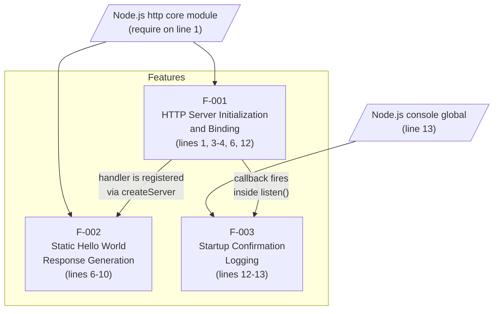

| Edge | Evidence in `server.js` |
|------|--------------------------|
| F-001 → F-002 | The request handler implementing F-002 is supplied as the callback argument to `http.createServer(...)` on line 6, which is the construction step of F-001 |
| F-001 → F-003 | The `console.log` implementing F-003 is the success callback of `server.listen(port, hostname, callback)` on line 12, which is the binding step of F-001 |

### 2.3.2 Integration Points

| Integration Point | Direction | Status |
|-------------------|-----------|--------|
| Inbound HTTP on `127.0.0.1:3000` | Inbound | Sole integration point of the system |
| Standard output stream | Outbound | Used once for the F-003 startup line |
| External APIs / databases / queues / caches | — | **No integration exists** — explicitly absent per §1.2.1 and §1.3.2 |

### 2.3.3 Shared Components and Common Services

All three features reside in the same file (`server.js`) with no module boundaries between them. The following shared elements are observable in source:

| Shared Element | Used By | Evidence |
|----------------|---------|----------|
| Node.js built-in `http` module | F-001, F-002 | `require('http')` on line 1; `http.createServer(...)` on line 6 |
| Node.js global `console` (specifically `console.log`) | F-003 | Line 13 |
| Module-scoped constant `hostname` (`'127.0.0.1'`) | F-001, F-003 | Declared line 3; consumed lines 12 and 13 |
| Module-scoped constant `port` (`3000`) | F-001, F-003 | Declared line 4; consumed lines 12 and 13 |
| Module-scoped variable `server` | F-001 (creates), F-002 (handler bound on creation), F-003 (`listen` invoked on it) | Declared line 6; consumed line 12 |

### 2.3.4 Cross-Reference to Process Diagrams

Two diagrams in earlier sections illustrate the runtime interactions of these features and SHOULD be consulted in conjunction with this section:

| Diagram | Location | Relevance |
|---------|----------|-----------|
| System Components flowchart (`flowchart LR`) | §1.2.2 *Major System Components* | Depicts F-001 (HTTP Listener), F-002 (Request Handler → Static Response Builder), and F-003 (Startup Logger) as nodes within the single Node.js process |
| Primary User Workflow sequence diagram (`sequenceDiagram`) | §1.3.1 *Primary User Workflows* | Shows the temporal sequence: process launch → F-001 binding → F-003 stdout line → F-002 request/response cycle |

---

## 2.4 IMPLEMENTATION CONSIDERATIONS

### 2.4.1 Technical Constraints

| Constraint | Applies To | Source-Level Evidence |
|------------|-----------|------------------------|
| Node.js runtime required; no minimum version pinned | F-001, F-002, F-003 | No `engines` field exists (no `package.json`); no `.nvmrc` |
| CommonJS module system | F-001, F-002 | `require('http')` on line 1; no `import` statements |
| Plain JavaScript, no transpilation | All features | No `tsconfig.json`, no bundler config |
| Hostname hardcoded to `127.0.0.1` | F-001, F-003 | Line 3 — no override mechanism |
| Port hardcoded to `3000` | F-001, F-003 | Line 4 — no override, no fallback |
| No configuration layer | All features | Zero `process.env` references, zero CLI argument parsing, zero config files |
| No error handling | All features | No `try`/`catch`; no `'error'` event listeners attached to the server or socket |

### 2.4.2 Performance Requirements

| Performance Dimension | Stated Requirement | Implementation Posture |
|-----------------------|--------------------|-----------------------|
| Response latency target | **None declared in source** | F-002 handler is synchronous, performs no I/O, and writes a 14-byte body, so latency is bounded only by event-loop scheduling and OS networking |
| Throughput target | **None declared in source** | Single-process, single-threaded; throughput is bounded by Node.js event-loop capacity |
| Availability target | **None declared in source** | No restart logic, no supervision, no readiness probe (see §1.3.2) |
| Startup time target | **None declared in source** | F-003 stdout line provides operator-visible startup confirmation |

### 2.4.3 Scalability Considerations

| Dimension | Posture in Current Implementation |
|-----------|-----------------------------------|
| Vertical scaling | Constrained to a single Node.js event loop; the `cluster` module and worker threads are not used |
| Horizontal scaling | Not supported — loopback binding (`127.0.0.1`) prevents reachability from peer hosts or a load balancer |
| Stateful concerns | None — F-002 returns a constant payload with no per-client state |
| Connection limits | Inherits Node.js defaults; no explicit `maxConnections`, `keep-alive`, or backpressure tuning is configured |

### 2.4.4 Security Implications

| Security Dimension | Implemented Control | Residual Posture |
|--------------------|---------------------|------------------|
| Transport encryption | None (plain HTTP) | TLS/HTTPS is explicitly out of scope per §1.3.2 |
| Authentication / Authorization | None | No identity layer exists; no tokens, sessions, or cookies are handled |
| Network exposure | Loopback-only binding (`127.0.0.1`) | Server is unreachable from any host other than the local machine, which is the system's primary security boundary |
| Input validation | Not applicable | F-002 reads no input fields, so no injection vectors exist on the request side |
| Output encoding | Static literal | Response body is the compile-time constant `'Hello, World!\n'`; no dynamic data is interpolated |
| Logging of secrets | None | The F-003 log line contains no credentials or tokens |
| Rate limiting / abuse controls | None | No rate-limiting middleware is configured |

### 2.4.5 Maintenance Requirements

| Maintenance Aspect | Current State |
|--------------------|---------------|
| Patch surface area | 14 source lines, single file (`server.js`); minimal cognitive load |
| Dependency upkeep | None — zero third-party dependencies; no lockfile to refresh; no transitive vulnerabilities to track |
| Test maintenance | Not applicable — no automated tests exist (no `tests/`, no `*.test.js`, no test runner per §1.3.2) |
| Build / release tooling | Not applicable — no build, no bundling, no `package.json` scripts |
| Linting / formatting | Not applicable — no `.eslintrc`, no `.prettierrc`, no editor config |
| Observability for incident response | Limited to the single F-003 startup line; no runtime telemetry exists |
| Documentation upkeep | `README.md` contains only the H1 heading `# march_repo_hello_world` (see §1.3.3); no usage docs to maintain |

---

## 2.5 TRACEABILITY MATRIX

### 2.5.1 Requirement-to-Source-Evidence Mapping

Every requirement maps deterministically to a specific line span in `server.js`. This matrix supports verification that each requirement is implemented by, and only by, the lines indicated.

| Requirement ID | `server.js` Line(s) | Implementing Construct |
|----------------|--------------------|--------------------------|
| F-001-RQ-001 | 1, 6 | `require('http')`; `http.createServer(...)` |
| F-001-RQ-002 | 3, 12 | `const hostname = '127.0.0.1'`; `server.listen(port, hostname, ...)` |
| F-001-RQ-003 | 4, 12 | `const port = 3000`; `server.listen(port, hostname, ...)` |
| F-001-RQ-004 | 12 | `server.listen(port, hostname, callback)` |
| F-002-RQ-001 | 6 | Inline `(req, res) => { ... }` passed to `createServer` |
| F-002-RQ-002 | 7 | `res.statusCode = 200` |
| F-002-RQ-003 | 8 | `res.setHeader('Content-Type', 'text/plain')` |
| F-002-RQ-004 | 9 | `res.end('Hello, World!\n')` |
| F-002-RQ-005 | 6–10 | Absence of any `req` inspection within the handler body |
| F-003-RQ-001 | 12–13 | `console.log` inside `server.listen` callback |
| F-003-RQ-002 | 13 | Template literal `` `Server running at http://${hostname}:${port}/` `` |

### 2.5.2 Requirement-to-Verification-Method Mapping

| Requirement ID | Verification Method |
|----------------|---------------------|
| F-001-RQ-001 | Static inspection that `require('http')` and `http.createServer` are present; runtime check that `node server.js` exits with no error |
| F-001-RQ-002 | TCP connection attempt from `127.0.0.1` succeeds; binding metadata inspection (`ss`/`netstat`) shows loopback address |
| F-001-RQ-003 | Port enumeration shows TCP `3000` in `LISTEN` state |
| F-001-RQ-004 | Process remains alive; subsequent HTTP requests are accepted |
| F-002-RQ-001 | Issue HTTP request; observe the handler runs (response is produced) |
| F-002-RQ-002 | HTTP client reports status `200` |
| F-002-RQ-003 | HTTP client reports `Content-Type: text/plain` |
| F-002-RQ-004 | Byte-level diff of response body against the literal `Hello, World!\n` |
| F-002-RQ-005 | Repeat request battery across methods `GET`/`POST`/`PUT`/`DELETE`/`PATCH`/`HEAD`/`OPTIONS` and varying paths; confirm byte-identical responses |
| F-003-RQ-001 | Capture stdout during startup; assert exactly one line is emitted |
| F-003-RQ-002 | Substring match against `http://127.0.0.1:3000/` in the captured stdout line |

### 2.5.3 Feature-to-Section Cross-Reference

| Feature ID | Related Documentation |
|------------|------------------------|
| F-001 | §1.2.2 *Major System Components* (HTTP Listener component); §1.3.1 *In-Scope Elements* (binding evidence rows) |
| F-002 | §1.2.2 *Primary System Capabilities* (Static HTTP Response Service row); §1.3.1 *Primary User Workflows* (sequence diagram) |
| F-003 | §1.2.2 *Primary System Capabilities* (Startup Notification row); §1.2.3 *Measurable Objectives* (stdout-line verification row) |

---

## 2.6 ASSUMPTIONS AND CONSTRAINTS

### 2.6.1 Documented Assumptions

The following assumptions underpin the requirements above. None are declared in `server.js` or `README.md`; all are inferred from the runtime behavior the source code exhibits.

| Assumption | Basis |
|------------|-------|
| A Node.js runtime capable of resolving `require('http')` is installed on the host | Line 1 of `server.js` |
| TCP port `3000` on `127.0.0.1` is unoccupied at launch time | No port-conflict resolution exists in `server.js` |
| The process has permission to bind a loopback socket | OS-level prerequisite for `server.listen` |
| Standard output is attached and writable | Required by line 13 (`console.log`) |
| HTTP clients exercising the service originate on the same host | Required because of loopback-only binding |

### 2.6.2 Inherited Constraints

| Constraint | Origin |
|------------|--------|
| Single-process / single-threaded execution model | Node.js event-loop model; no `cluster`/`worker_threads` usage in source |
| No configurability of hostname or port | Hardcoded literals on lines 3–4 |
| No graceful shutdown semantics | No `SIGINT`/`SIGTERM` handlers registered in source |
| No request observability | No middleware, no per-request logging beyond the absent log calls |
| No persistence guarantees | No storage layer of any kind exists |

### 2.6.3 Requirement Versioning

This is the **initial version (v1.0)** of the Product Requirements section. The repository carries no `CHANGELOG.md`, no git tags surfaced in the artifact inventory of §1.3.3, and no version metadata in any file. Subsequent revisions to this section should be tied to commits that modify `server.js`; any change to lines 1–14 of `server.js` necessarily invalidates one or more requirements in the F-001 / F-002 / F-003 catalogue above and requires a corresponding update here.

---

#### References

**Files Examined**
- `server.js` — 14-line CommonJS source file. Read in full to derive features F-001 (HTTP server initialization on lines 1, 3–4, 6, 12), F-002 (request handler on lines 6–10), and F-003 (startup logging on lines 12–13); all requirement-to-line traceability mappings (§2.5.1) reference this file.
- `README.md` — Single-line documentation file containing only `# march_repo_hello_world`. Confirmed to contain no formal requirements, feature lists, priorities, or acceptance criteria, which is the basis for the documentary caveats in §2.1.1.

**Folders Examined**
- Repository root (`/`) — Enumerated to confirm absence of subdirectories, test files, configuration files, manifests, and CI/CD assets; supports the "no integration / no external dependencies" rows throughout §2.3 and §2.4.

**Technical Specification Cross-References**
- §1.1 *Executive Summary* — Source for project framing, stakeholder roles, and value proposition referenced in feature descriptions.
- §1.2 *System Overview* — Source for the *Major System Components* mermaid diagram (referenced in §2.3.4), capability inventory, and the explicit "no KPIs declared" statement underpinning §2.4.2.
- §1.3 *Scope* — Source for the *Primary User Workflow* sequence diagram (referenced in §2.3.4), the in-scope/out-of-scope evidence rows underpinning §2.3.2 and §2.4, and the artifact inventory underpinning §2.4.5.

# 3. Technology Stack

This section enumerates the complete technology stack employed by `march_repo_hello_world`. Because the system is a deliberately minimal Node.js HTTP scaffold (see §1.1.1 and §1.2.2), this technology stack is intentionally austere: it consists of a single programming language executed by a single runtime against a single standard-library module, with no third-party packages, no external services, no persistence layer, and no build or deployment tooling. The subsections below document each technology dimension and provide explicit reconciliation against the categories that would typically appear in a production web-service stack but that are intentionally absent here.

## 3.1 PROGRAMMING LANGUAGES

### 3.1.1 Language Inventory

The complete set of languages present in the repository — derived from the two files comprising the source tree (`server.js` and `README.md`, per §1.3.3) — is enumerated below.

| Component | Language | Version | Source Location | Purpose |
|-----------|----------|---------|-----------------|---------|
| HTTP Server Runtime Script | JavaScript (ECMAScript / CommonJS) | No version pinned | `server.js` (14 lines) | Implements the HTTP listener, request handler, and startup logger |
| Repository Documentation | Markdown (CommonMark) | N/A | `README.md` (1 line) | Contains the H1 heading `# march_repo_hello_world` and no further prose |

#### JavaScript / ECMAScript

JavaScript is the sole executable language in the repository. It is used in its plain, unprocessed form — the source file is executed directly by the Node.js runtime without any transpilation, type-checking, or bundling step.

- **Module system:** CommonJS. The single import statement `require('http')` on line 1 of `server.js` confirms the CommonJS module convention; no ES Module `import` statements appear anywhere in the source.
- **Syntactic posture:** The script uses only standard JavaScript constructs (`const` declarations, arrow function callbacks, template literals in the startup log). No proposal-stage syntax, decorators, JSX, or TypeScript annotations are present.
- **Language version pinning:** No ECMAScript edition is pinned anywhere in the repository. There is no `package.json` (and therefore no `engines.node` field), no `.nvmrc`, and no `.node-version` file, as enumerated in the artifact inventory in §1.3.3.

#### Markdown

Markdown is used solely for the repository's `README.md` file, which contains only a single H1 heading and no additional content. No formal Markdown dialect or linter configuration is declared.

### 3.1.2 Language Selection Rationale

The selection of plain JavaScript on Node.js — to the exclusion of any other language or compile-to-JavaScript variant — is justified by the explicit goals of the repository as documented in §1.1.2:

| Selection Criterion | How JavaScript on Node.js Satisfies It |
|---------------------|----------------------------------------|
| Demonstrate the bare-minimum HTTP server pattern in Node.js | The Node.js `http` core module is the canonical primitive for HTTP servers; using it directly eliminates any abstraction layer |
| Establish a clean baseline free of toolchain assumptions | Plain JavaScript requires no compiler, no transpiler, no type checker, and no bundler — the source file is the runnable artifact |
| Enable immediate executability with a single command | `node server.js` is sufficient because JavaScript executes natively under Node.js without preprocessing (§1.1.4) |
| Avoid lock-in to any architectural style or framework | A single CommonJS script imposes no opinions about routing, middleware, or project layout |

### 3.1.3 Languages and Variants Explicitly Not Used

The following languages and JavaScript variants are explicitly absent from the repository. Their absence is a deliberate consequence of the minimal-scaffold posture documented in §1.2.2 and the artifact inventory in §1.3.3.

| Language / Variant | Status | Evidence of Absence |
|--------------------|--------|---------------------|
| TypeScript | Not used | No `.ts` files; no `tsconfig.json` (§1.3.3) |
| Python | Not used | No `.py` files; no Python interpreter dependency |
| Swift, Kotlin, Objective-C | Not used | No native mobile or desktop targets; no platform-specific source folders |
| Compile-to-JS languages (e.g., CoffeeScript, ReScript) | Not used | No build pipeline; no transpiler configuration |
| Shell scripts | Not used | No `.sh` files; no `bin/` directory |

## 3.2 FRAMEWORKS & LIBRARIES

### 3.2.1 Core Runtime and Standard Library Usage

The system is implemented on top of the Node.js runtime and uses exactly one library: the Node.js `http` core module from the standard library. There are no third-party frameworks of any kind.

## Node.js Runtime

| Attribute | Value |
|-----------|-------|
| Runtime | Node.js |
| Minimum Version | Not pinned — no `engines` field, no `.nvmrc`, no `.node-version` file (§2.4.1) |
| Module Loader | CommonJS (`require`) |
| Concurrency Model | Single-process, single-threaded event loop (§1.2.2) |
| Required Capability | Ability to resolve `require('http')` and bind a loopback TCP socket (§2.6.1) |

The Node.js runtime is the only environmental prerequisite for executing the application. Because no `engines` field exists, any installed Node.js version capable of resolving the `http` core module is acceptable; this assumption is documented in §2.6.1.

## Node.js `http` Core Module

The `http` module is bundled with Node.js and is not a separately versioned dependency. The application invokes the following surface area of the module, as confirmed by direct inspection of `server.js`:

| API Usage | Line in `server.js` | Purpose |
|-----------|---------------------|---------|
| `require('http')` | Line 1 | Imports the core HTTP module |
| `http.createServer(callback)` | Line 6 | Constructs the HTTP server with an inline request handler |
| `res.statusCode = 200` | Line 7 | Sets the HTTP response status (F-002) |
| `res.setHeader('Content-Type', 'text/plain')` | Line 8 | Sets the response content type (F-002) |
| `res.end('Hello, World!\n')` | Line 9 | Writes the static response body and ends the response (F-002) |
| `server.listen(port, hostname, callback)` | Line 12 | Binds the listener to `127.0.0.1:3000` (F-001) |

The request handler defined on line 6 never reads from the `req` object — no URL parsing, no method differentiation, no header inspection, and no body parsing occurs (§1.2.2). This minimal API footprint means the system's coupling to the Node.js `http` module is constrained to the small set of methods listed above.

### 3.2.2 Frameworks Considered Out of Scope

The following framework categories — any of which would typically be present in a production HTTP service — are explicitly absent. Their absence is documented in §1.3.2 and §2.4.5.

| Framework Category | Examples | Status in Repository |
|--------------------|----------|----------------------|
| Backend Web Framework | Express, Fastify, Koa, Hapi, NestJS | None — only the `http` core module is used |
| Frontend Framework | React, Vue, Angular, Svelte | None — no frontend code or build assets exist |
| Mobile / Cross-Platform Framework | React Native, Flutter, Ionic | None — no mobile code exists |
| CSS Framework | TailwindCSS, Bootstrap, Bulma | None — response payload is `text/plain`, no CSS assets |
| AI / LLM Framework | Langchain, LlamaIndex, Haystack | None — no AI components |
| ORM / Query Builder | Sequelize, Prisma, TypeORM, Mongoose | None — no database driver |
| Validation Library | Joi, Zod, Yup, AJV | None — no request fields are read (§2.4.4) |
| Templating Engine | EJS, Handlebars, Pug | None — response body is a hardcoded literal |
| Logging Framework | Winston, Pino, Bunyan | None — single `console.log` invocation only |
| Test Framework | Jest, Mocha, Vitest, Tap | None — no automated tests exist (§2.4.5) |

### 3.2.3 Compatibility Requirements

| Compatibility Dimension | Requirement |
|-------------------------|-------------|
| Node.js Version | Any version supporting `require('http')` and the `server.listen(port, host, callback)` signature — i.e., effectively all modern Node.js releases (§2.6.1) |
| Operating System | Any OS supporting Node.js loopback socket binding (§2.6.1) |
| Network Stack | TCP/IPv4 loopback (`127.0.0.1`) reachable from the local process (§1.3.1) |
| Standard Output | A writable stdout stream attached to the process (§2.6.1) |

No version constraints exist between the application and any third-party library because no third-party libraries are used. The single coupling surface — the Node.js `http` module — is stable across all supported Node.js LTS lines.

## 3.3 OPEN SOURCE DEPENDENCIES

### 3.3.1 Dependency Inventory

The repository contains **zero open-source dependencies**. This is confirmed by the complete absence of every artifact that would typically declare or contain dependencies in a Node.js project.

| Dependency Artifact | Present? | Implication |
|---------------------|----------|-------------|
| `package.json` | No (§1.3.3) | No `dependencies`, `devDependencies`, `peerDependencies`, or `optionalDependencies` are declared |
| `package-lock.json` | No (§1.3.3) | No npm-resolved dependency graph exists |
| `yarn.lock` | No (§1.3.3) | No Yarn-resolved dependency graph exists |
| `pnpm-lock.yaml` | No | No pnpm-resolved dependency graph exists |
| `node_modules/` | No (§1.3.3) | No installed third-party packages on disk |
| Vendored libraries directory | No | No `vendor/` or `lib/` folder containing manually copied source |

### 3.3.2 Package Manager and Registry Posture

| Attribute | Value |
|-----------|-------|
| Package Manager | None configured (no `package.json` exists per §1.3.3) |
| Public Registry Interactions | None — no installation step is required prior to execution (§1.1.1) |
| Private Registry / Scoped Packages | None |
| Lockfile Strategy | Not applicable — no dependencies to lock |
| Dependency Update Cadence | Not applicable — there is nothing to update (§2.4.5: "Dependency upkeep: None") |

### 3.3.3 Rationale for Zero-Dependency Posture

The zero-dependency posture is a deliberate design choice grounded in the repository's stated purpose of "Establishing a clean baseline free of toolchain assumptions" (§1.1.2). The consequences of this choice are:

| Consequence | Effect |
|-------------|--------|
| No supply-chain attack surface | There are no transitive packages to audit, no lockfile to refresh, and no transitive vulnerabilities to track (§2.4.5) |
| No installation step | The repository is immediately executable upon clone; no `npm install` / `yarn install` is required (§1.1.4) |
| No version drift | Behavior is deterministic across hosts that have a compatible Node.js runtime, since the entire functional surface is the Node.js `http` standard library |
| No license compatibility analysis | No third-party licenses are inherited; the only licensing concern is the absent repository `LICENSE` file itself (§1.3.3) |

## 3.4 THIRD-PARTY SERVICES

The system performs **no integrations with external services of any kind**, as explicitly stated in §1.2.1: "It does not invoke external APIs, does not consume messages from queues, does not connect to databases, does not authenticate against identity providers, and does not publish telemetry." The subsections below enumerate, for the avoidance of doubt, each category of third-party service that is typically present in a web-service stack and that is intentionally absent here.

### 3.4.1 External APIs and Outbound Integrations

| Service Category | Status | Evidence |
|------------------|--------|----------|
| REST / GraphQL Clients | Not used | No outbound HTTP client (no `http.request`, no `fetch`, no SDK imports) |
| Webhook Receivers | Not used | The single request handler does no payload-specific dispatch |
| Message Brokers (Kafka, RabbitMQ, SQS, Pub/Sub) | Not used | No broker client libraries; "does not consume messages from queues" (§1.2.1) |
| Email / SMS Providers | Not used | No communication SDKs |
| Payment Processors | Not used | No payment integrations |
| Search Services (Algolia, Elasticsearch) | Not used | No search SDKs |

### 3.4.2 Authentication and Identity Services

| Service Category | Status | Evidence |
|------------------|--------|----------|
| OAuth / OIDC Providers (Auth0, Okta, Cognito) | Not used | "No identity layer exists; no tokens, sessions, or cookies are handled" (§2.4.4) |
| Single Sign-On (SAML) | Not used | No SSO integrations |
| API Key / Token Management | Not used | No secret-management surface area |
| Session Stores | Not used | "No session storage, no cookie handling" (§1.3.2) |

The deliberate omission of an identity layer is consistent with the security posture in §2.4.4, where the loopback `127.0.0.1` binding is identified as the system's primary security boundary — making external identity integration unnecessary for the system's defined scope.

### 3.4.3 Monitoring, Observability, and Logging Services

| Service Category | Status | Evidence |
|------------------|--------|----------|
| APM / Tracing (Datadog, New Relic, Honeycomb) | Not used | "No metrics exporter, no tracing instrumentation" (§1.3.2) |
| Error Tracking (Sentry, Rollbar, Bugsnag) | Not used | No error-handler middleware; no `try`/`catch` blocks (§2.4.1) |
| Centralized Log Aggregation (Splunk, ELK, Loki) | Not used | Single `console.log` to local stdout only (§1.2.2) |
| Synthetic Monitoring / Uptime Probes | Not used | No `/health` or `/ready` endpoint (§1.3.2) |
| Metrics / Time-Series (Prometheus, StatsD) | Not used | No metrics emission |

### 3.4.4 Cloud Platform Services

| Service Category | Status | Evidence |
|------------------|--------|----------|
| AWS Services (Lambda, EC2, S3, ECS, RDS, etc.) | Not used | No AWS SDK imports; no AWS configuration files |
| GCP Services | Not used | No GCP SDK imports |
| Azure Services | Not used | No Azure SDK imports |
| CDN / Edge Networks (CloudFront, Cloudflare, Fastly) | Not used | No static assets to distribute |
| Serverless Platforms | Not used | The application is a long-running process bound to a TCP socket, not a function handler |

## 3.5 DATABASES & STORAGE

The system has **no persistence layer of any kind**. As stated in §2.6.2, "No persistence guarantees — No storage layer of any kind exists." The system handles only a constant outbound payload (`Hello, World!\n`) and therefore has no data to persist, cache, or store. The subsections below enumerate the storage categories that are intentionally absent.

### 3.5.1 Primary and Secondary Databases

| Database Category | Status | Evidence |
|-------------------|--------|----------|
| Relational Databases (PostgreSQL, MySQL, SQLite) | Not used | No database driver; no SQL queries (§1.3.2) |
| Document Databases (MongoDB, CouchDB, DynamoDB) | Not used | No document store driver |
| Key-Value Stores (Redis, etcd) | Not used | No KV client libraries |
| Time-Series / Wide-Column (InfluxDB, Cassandra) | Not used | No specialized database drivers |
| Graph Databases (Neo4j, Neptune) | Not used | No graph drivers |
| Read Replicas / Sharding | Not applicable | No primary database exists |

### 3.5.2 Caching Solutions

| Cache Category | Status | Evidence |
|----------------|--------|----------|
| In-Process Cache | Not used | "F-002 returns a constant payload with no per-client state" (§2.4.3) |
| Distributed Cache (Redis, Memcached) | Not used | "No caching layer" (§1.3.2) |
| HTTP Response Cache | Not used | No `Cache-Control` headers are set in the response |
| CDN Caching | Not used | No CDN integration |

The response payload is a hardcoded literal embedded directly in the source file; consequently, no caching tier is required to amortize storage or computation cost.

### 3.5.3 Object and File Storage

| Storage Category | Status | Evidence |
|------------------|--------|----------|
| Object Storage (S3, GCS, Azure Blob) | Not used | No SDK imports |
| Local File System Writes | Not used | "No file-system writes" (§1.3.2) |
| File System Reads | Not used | No `fs` module imports; static file serving is out of scope (§1.3.2) |
| Network File Systems (NFS, EFS) | Not used | No mount points referenced |

### 3.5.4 Data Persistence Strategy

The data persistence strategy is, by design, **the absence of persistence**. As documented in §1.3.1: "Data Domains Included — None — the system handles no user data, no persistent data, and no domain entities; the only data exchanged is the constant outbound string `Hello, World!\n`." The response body is encoded as a compile-time constant on line 9 of `server.js`, eliminating any need for a storage tier.

## 3.6 DEVELOPMENT & DEPLOYMENT

The repository contains **no development tooling, no build system, no containerization assets, no CI/CD pipeline, and no Infrastructure-as-Code definitions**. The application is executed via the single command `node server.js` (§1.1.4) with no preceding setup steps. The subsections below enumerate the tooling categories that would normally be present in a production-grade Node.js project and that are intentionally absent here.

### 3.6.1 Development Tooling

| Tool Category | Status | Evidence |
|---------------|--------|----------|
| Linter (ESLint, JSHint, StandardJS) | Not configured | "No `.eslintrc`, no `.prettierrc`, no editor config" (§2.4.5) |
| Code Formatter (Prettier) | Not configured | No formatting config files |
| Type Checker (TypeScript, Flow) | Not used | No `tsconfig.json` (§1.3.3) |
| Test Framework (Jest, Mocha, Vitest, Tap) | Not configured | "no automated tests exist (no `tests/`, no `*.test.js`, no test runner)" (§2.4.5) |
| Pre-commit Hooks (Husky, lint-staged) | Not configured | No `.husky/` directory |
| Editor Configuration (`.editorconfig`) | Not present | Not listed in the artifact inventory (§1.3.3) |
| Git Ignore Rules (`.gitignore`) | Not present | "`.gitignore` — No" (§1.3.3) |

### 3.6.2 Build System

| Build Concern | Status | Evidence |
|---------------|--------|----------|
| Bundler (Webpack, Vite, esbuild, Rollup, Parcel) | Not configured | No bundler config files (§1.3.2) |
| Transpiler (Babel, SWC) | Not configured | "no build, no bundling, no `package.json` scripts" (§2.4.5) |
| Task Runner (npm scripts, Gulp, Grunt) | Not configured | No `package.json` (§1.3.3) |
| Asset Pipeline (PostCSS, image optimization) | Not configured | No frontend assets exist |

The execution model is "direct interpretation": Node.js reads `server.js` and executes it without any preceding compilation, transpilation, bundling, or minification step.

### 3.6.3 Containerization and Orchestration

| Containerization Asset | Status | Evidence |
|------------------------|--------|----------|
| `Dockerfile` | Not present | "No `Dockerfile`, no `docker-compose.yml`" (§1.3.2) |
| `docker-compose.yml` | Not present | Same as above |
| Kubernetes Manifests (Deployment, Service, Ingress) | Not present | "no Kubernetes manifests" (§1.3.2) |
| Helm Charts | Not present | No `charts/` directory |
| Container Registry Configuration | Not applicable | No images to publish |

### 3.6.4 CI/CD Pipeline

| CI/CD Asset | Status | Evidence |
|-------------|--------|----------|
| GitHub Actions Workflows (`.github/workflows/`) | Not present | "No `.github/` or other CI config" (§1.3.3) |
| GitLab CI Configuration (`.gitlab-ci.yml`) | Not present | Same as above |
| CircleCI / Travis / Jenkins Definitions | Not present | "no CI/CD definitions" (§1.3.2) |
| Release Automation (semantic-release, changesets) | Not configured | No `CHANGELOG.md`, no release tooling (§1.3.3) |
| Deployment Scripts | Not present | No `scripts/`, no `deploy/` directory |

### 3.6.5 Infrastructure as Code

| IaC Tool | Status | Evidence |
|----------|--------|----------|
| Terraform (`.tf` files) | Not present | No `infrastructure/` or `terraform/` directories |
| Pulumi | Not present | No Pulumi project files |
| AWS CloudFormation | Not present | No CloudFormation templates |
| Ansible / Chef / Puppet | Not present | No configuration-management playbooks |

### 3.6.6 Execution Workflow

Given the absence of all the above tooling, the complete development-to-execution lifecycle reduces to two steps:


| Step | Command / Action | Prerequisite |
|------|------------------|--------------|
| 1 | Obtain the source (e.g., `git clone`) | A reachable copy of the repository |
| 2 | Execute `node server.js` | A Node.js runtime capable of resolving `require('http')` (§2.6.1) |

No `npm install`, no `npm run build`, no `docker build`, no `terraform apply`, and no CI pipeline invocation is required between steps 1 and 2. This satisfies the value proposition documented in §1.1.4: "immediate executability with the single command `node server.js`, no dependency installation, no environment configuration, and no compilation."

## 3.7 TECHNOLOGY STACK ARCHITECTURE

### 3.7.1 Layered Stack View

The technology stack consists of only two conceptual layers: the host's Node.js runtime (with its bundled standard library) and the application source file itself.

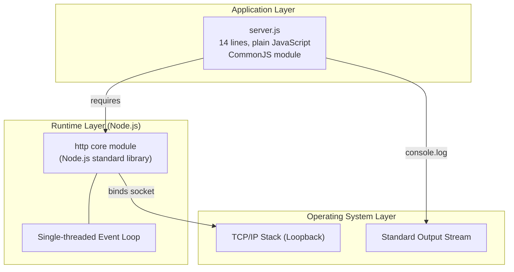

### 3.7.2 Component Interaction Flow

The runtime interaction between the technology-stack components is illustrated below. The diagram emphasizes that no third-party software sits between the application source and the operating system network stack.

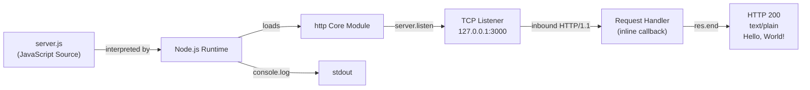

### 3.7.3 Network Configuration Constants

The network-facing configuration of the system is encoded as hardcoded literals within `server.js`. These values are documented here because they constitute part of the deployed surface area of the technology stack and are not overridable through any configuration mechanism (§2.4.1).

| Setting | Value | Source Location | Override Mechanism |
|---------|-------|-----------------|--------------------|
| Bind Hostname | `127.0.0.1` (loopback only) | `server.js` line 3 | None — hardcoded literal (§2.4.1) |
| TCP Port | `3000` | `server.js` line 4 | None — hardcoded literal (§2.4.1) |
| Transport Protocol | HTTP/1.1 (plain, no TLS) | `http.createServer(...)` | TLS explicitly out of scope (§2.4.4) |
| Response Content-Type | `text/plain` | `server.js` line 8 | Hardcoded |
| Response Status Code | `200` | `server.js` line 7 | Hardcoded |
| Response Body | `Hello, World!\n` (14 bytes) | `server.js` line 9 | Hardcoded |

## 3.8 DEFAULT TECHNOLOGY STACK RECONCILIATION

This subsection reconciles the technology categories typically present in an enterprise web-service stack against what is actually present in `march_repo_hello_world`. It is included to make explicit that the absence of each commonly expected category is intentional and grounded in the project's documented scope (§1.3.2), not the result of incomplete documentation.

### 3.8.1 Reconciliation Matrix

| Category | Typical Default Selection | Status in This Repository | Rationale for Absence |
|----------|---------------------------|---------------------------|------------------------|
| Cloud Platform | AWS / GCP / Azure | Not used | Loopback binding precludes external reachability (§1.3.2) |
| Containerization | Docker | Not used | "No `Dockerfile`, no `docker-compose.yml`" (§1.3.2) |
| Infrastructure as Code | Terraform | Not used | No deployable infrastructure exists |
| CI/CD | GitHub Actions | Not used | "No `.github/` or other CI config" (§1.3.3) |
| Primary Backend Language | Python | Not used (JavaScript is used instead) | Repository goal is a Node.js HTTP scaffold (§1.1.1) |
| Backend Framework | Flask | Not used | Only the Node.js `http` core module is used; no framework abstraction |
| Authentication Provider | Auth0 | Not used | "No identity layer exists" (§2.4.4) |
| Primary Database | MongoDB | Not used | "No database driver" (§1.3.2) |
| AI Framework | Langchain | Not used | No AI components |
| Frontend Web Framework | React + TypeScript | Not used | No frontend code; response is `text/plain` |
| CSS Framework | TailwindCSS | Not used | No CSS assets |
| Cross-Platform Mobile | React Native + TypeScript | Not used | No mobile code |
| iOS Native | Swift | Not used | No iOS targets |
| Android Native | Kotlin | Not used | No Android targets |
| macOS Native | Objective-C | Not used | No macOS targets |
| Desktop | ElectronJS | Not used | No desktop targets |

### 3.8.2 Justification Summary

The minimal stack is the correct stack for this repository because the system's value proposition — as documented in §1.1.4 — is precisely the elimination of dependencies, configuration, and toolchain assumptions. Adding any element from the default stack would directly contradict the design objective of "Establishing a clean baseline free of toolchain assumptions" (§1.1.2). If downstream consumers fork this repository to build production services, they may incrementally add framework, persistence, observability, containerization, and CI/CD layers as their use cases require; however, those additions fall outside the scope of `march_repo_hello_world` itself, as confirmed in §1.3.2 under "Future Phase Considerations."

### 3.8.3 Forward Compatibility Considerations

Because the technology stack contains no version-pinned components, no lockfile, and no third-party software, there are no forward-compatibility risks of the kind typically managed in a Node.js project (transitive vulnerability remediation, semver-major upgrades, breaking API changes in third-party packages). The only compatibility surface is the Node.js `http` core module, which has maintained API stability across all Long-Term Support releases of Node.js. This stack profile is consistent with the "Dependency upkeep: None" statement in §2.4.5.

## 3.9 References

#### Files Examined

- `server.js` — 14-line CommonJS source file; sole executable artifact. Examined in full to enumerate the language (plain JavaScript), module system (CommonJS via `require`), the only library used (`http` core module), the hardcoded network configuration (`127.0.0.1:3000`), and the response semantics (HTTP 200, `text/plain`, `Hello, World!\n`).
- `README.md` — Single-line documentation file containing only the H1 heading `# march_repo_hello_world`. Examined in full to confirm the absence of any technology-stack documentation, build instructions, dependency lists, or licensing terms.
- Repository root (`/`) — Enumerated to confirm the complete artifact inventory: only `server.js` and `README.md` are present at the root, with zero subdirectories and zero supporting files (no `package.json`, no `node_modules/`, no `.github/`, no `Dockerfile`, no `tsconfig.json`, no `.eslintrc`, no `LICENSE`, etc.).

#### Technical Specification Cross-References

- §1.1 *Executive Summary* — Source for the project framing (single-file Node.js HTTP server), the explicit enumeration of absent artifacts (§1.1.1), the design rationale for a toolchain-free baseline (§1.1.2), and the value proposition of immediate executability (§1.1.4).
- §1.2 *System Overview* — Source for the *Core Technical Approach* table in §1.2.2 documenting the runtime, language, module system, dependencies, concurrency model, network binding, response generation strategy, and configuration posture; also source for the "no integrations" assertion in §1.2.1.
- §1.3 *Scope* — Source for the in-scope capability inventory (§1.3.1), the out-of-scope feature enumeration (§1.3.2), and the comprehensive artifact inventory table (§1.3.3) confirming the absence of every typical Node.js project artifact.
- §2.4 *Implementation Considerations* — Source for the technical constraints (§2.4.1), security posture (§2.4.4), and maintenance state (§2.4.5) referenced throughout this section.
- §2.6 *Assumptions and Constraints* — Source for the inferred runtime assumptions in §2.6.1 (Node.js runtime, port availability, loopback binding permission, stdout availability) and inherited constraints in §2.6.2 (single-process model, no configurability, no persistence guarantees).

# 4. Process Flowchart

## 4.1 Section Overview and Scope Boundary updatesss

### 4.1.1 Purpose of This Section

This section consolidates all observable process flows of the `march_repo_hello_world` system into a single normative reference. It documents the end-to-end lifecycle of the Node.js process, the request/response cycle implemented by `server.js`, the lifecycle state transitions of the listening server, the integration surface exposed by the process, and the error-handling posture (including the explicit absence of conventional recovery mechanisms). All diagrams in this section are grounded in direct evidence from the 14 source lines of `server.js`; no behaviors are extrapolated or invented.

### 4.1.2 Applicability of Section-Prompt Categories

The standard section template for Process Flowchart anticipates a broad set of enterprise-grade workflow concerns: authorization checkpoints, business-rule evaluations, transaction boundaries, retry strategies, fallback paths, batch sequences, event-driven flows, validation gates, caching tiers, and external integration choreography. The system documented here is a deliberately minimal HTTP scaffold (§1.1.1, §1.2.2) and therefore exhibits **none** of those concerns in its source code. Rather than fabricate hypothetical flows, this section documents what actually exists and explicitly enumerates which categories are absent by design, with citations to the source evidence elsewhere in this specification.

The table below summarizes the section-prompt categories and their applicability:

| Section-Prompt Category | Applicable to This System? | Evidence / Reference |
| --- | --- | --- |
| Core business processes (end-to-end user journeys) | Yes (one user journey: developer launches process → observes startup → client issues HTTP request) | §1.3.1 Primary User Workflows |
| System interactions | Yes (inbound HTTP socket, outbound stdout) | §2.3.2 Integration Points |
| Decision points / branching logic | No — request handler contains no conditional logic | §1.3.2 (no req.url/req.method/req.headers reads); §2.1.3 |
| Error handling paths | No code-level paths exist — only default Node.js / OS behaviors | §2.4.1 (no try/catch; no 'error' listeners) |
| Integration workflows (APIs, queues, batch) | No — no outbound integrations of any kind | §1.2.1, §2.3.2, §3.4 |
| Validation rules | No — request data is never consumed | §2.4.4 (Input validation: Not applicable) |
| Authorization checkpoints | No — no identity, tokens, or permissions logic | §2.4.4 |
| Regulatory compliance checks | No — none declared in source | §2.4.4 |
| State transitions | Only at the process/server lifecycle level | §4.5 below |
| Data persistence points | None — no storage layer | §3.5 |
| Caching requirements | None | §3.5 |
| Transaction boundaries | Not applicable — no transactional resources are touched | §3.5 |
| Retry mechanisms / fallback processes | None — no recovery logic in source | §2.4.1 |
| Timing and SLA considerations | None declared in source | §1.2.3, §2.4.2 |

### 4.1.3 Reading Guide

The flow diagrams in this section are arranged from coarsest to finest granularity. §4.3 presents the unified high-level workflow. §4.4 decomposes the workflow into two feature-aligned process flows (Startup → F-001 + F-003; Request Handling → F-002). §4.5 frames the same behavior through a state-machine lens. §4.6 documents the integration surface. §4.7 enumerates the error posture, including diagrams of what is *not* present. §4.8 and §4.9 cover validation/decision points and timing posture. §4.10 lists pre-existing diagrams in earlier sections that should be consulted alongside this section.

---

## 4.2 System Boundaries and Actor Inventory

### 4.2.1 Process Boundary

The process boundary is identical to the boundary documented in §1.3.1: a single Node.js process executing `server.js`, terminating at the process's stdout stream and its single bound TCP socket on `127.0.0.1:3000`. Because the listener is bound to the loopback interface, all flow diagrams in this section depict actors and clients that must reside on the same host as the running process (§2.6.1).

### 4.2.2 Realistic Actor and Swim Lane Inventory updated versionnnn

The full inventory of actors and systems with which `server.js` interacts — and which therefore appear as swim lanes in the sequence diagrams below — is:

| Swim Lane / Actor | Role | Evidence |
| --- | --- | --- |
| Developer / Operator | Human actor; initiates node server.js; observes stdout | §1.1.3, §1.3.1 |
| Shell / Terminal | Spawns the Node.js process; routes stdout to the developer's console | §1.3.1 |
| Node.js Runtime | Interprets server.js; manages the event loop; loads the http core module | §3.7.1 |
| server.js (Application) | The 14-line source under inspection | server.js |
| OS Kernel (TCP Stack) | Allocates and binds the loopback socket; delivers inbound TCP segments | §3.7.1 |
| Standard Output Stream | Destination of the one-time startup log line | §2.1.4, §3.7.1 |
| HTTP Client (e.g., curl, browser) | Issues HTTP requests to 127.0.0.1:3000; consumes the static response | §1.3.1 |

### 4.2.3 Out-of-Scope Actor Categories

The diagrams in this section deliberately omit the following actor categories because no corresponding code paths or configuration exist in the repository:

| Omitted Actor / System | Rationale |
| --- | --- |
| Database / persistence service | No storage layer of any kind exists (§3.5) |
| Cache (e.g., Redis, Memcached) | No caching layer (§3.5) |
| Authentication / Identity provider | No identity layer (§2.4.4) |
| Message broker / event bus | No outbound or inbound messaging (§2.3.2) |
| External REST or GraphQL API | No outbound HTTP client (§1.3.2, §3.4) |
| Email / SMS / notification provider | No notification logic (§3.4) |
| Monitoring / APM agent | No instrumentation (§1.2.3) |
| Load balancer / reverse proxy | Loopback binding precludes upstream routing (§2.4.3) |
| Batch processor / scheduler | No batch or scheduled job logic (§1.3.2) |

---

## 4.3 High-Level System Workflow

### 4.3.1 End-to-End Workflow Diagram

The diagram below traces the complete observable lifecycle of the system, from process invocation through indefinite request servicing through process termination. It combines features F-001, F-002, and F-003 into a single end-to-end view. The only decision diamond present in the entire system is whether the initial TCP bind succeeds; the request-handling path itself contains **zero decision points** (§4.8.1).

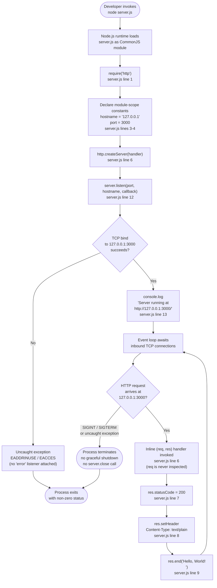

### 4.3.2 Step-by-Step Trace

| # | Step | server.js Line(s) | Feature |
| --- | --- | --- | --- |
| 1 | Node.js executes server.js; CommonJS evaluation begins | — | — |
| 2 | require('http') resolves the core http module | 1 | F-001 |
| 3 | hostname and port constants are declared | 3–4 | F-001 |
| 4 | http.createServer(handler) returns a Server object; the inline handler is registered but not yet invoked | 6 | F-001 (+ F-002 registration) |
| 5 | server.listen(port, hostname, callback) requests an OS bind | 12 | F-001 |
| 6 | OS kernel completes bind on 127.0.0.1:3000 (success path) | (kernel) | F-001 |
| 7 | The listen callback fires; console.log writes the startup line to stdout | 12–13 | F-003 |
| 8 | Node's event loop awaits inbound connections | (implicit) | F-001 |
| 9 | An HTTP request arrives; Node parses headers and invokes the handler | 6 | F-002 |
| 10 | Handler sets res.statusCode = 200 | 7 | F-002 |
| 11 | Handler sets Content-Type: text/plain | 8 | F-002 |
| 12 | Handler writes Hello, World!\n and ends the response | 9 | F-002 |
| 13 | Control returns to the event loop; the process awaits the next request | (implicit) | F-002 |
| 14 | Process eventually terminates via signal or uncaught exception | (external) | — |

### 4.3.3 Cross-References

This high-level workflow is consistent with the higher-level depictions in §1.2.2 *Major System Components*, §1.3.1 *Primary User Workflows*, §3.6.6 *Execution Workflow*, and §3.7.2 *Component Interaction Flow*. Those four diagrams collectively portray the same flow at different abstraction levels — system components, user-actor sequence, deployment-step view, and stack-component view, respectively. See §4.10 for the complete cross-reference list.

---

## 4.4 Core Process Flows

The system has exactly two observable process flows: **Process Startup** (combining F-001 and F-003) and **Request Handling** (F-002). Each is documented below as a swim-laned sequence diagram followed by a step-by-step trace and decision-point analysis.

updates made here….

### 4.4.1 Process Startup Flow (F-001 + F-003)

#### 4.4.1.1 Sequence Diagram

```mermaid
sequenceDiagram
    actor Developer
    participant Shell as Shell / Terminal
    participant Node as Node.js Runtime
    participant App as server.js
    participant Kernel as OS Kernel (TCP Stack)
    participant Stdout as Standard Output

    Developer->>Shell: node server.js
    Shell->>Node: Spawn process
    Node->>App: Begin CommonJS evaluation
    App->>Node: require('http') [line 1]
    Node-->>App: http module reference
    App->>App: Declare hostname & port [lines 3-4]
    App->>Node: http.createServer(handler) [line 6]
    Node-->>App: server instance
    App->>Node: server.listen(3000, '127.0.0.1', cb) [line 12]
    Node->>Kernel: bind(127.0.0.1:3000)
    alt bind succeeds
        Kernel-->>Node: bind OK
        Node->>App: invoke listen callback
        App->>Stdout: console.log('Server running at http://127.0.0.1:3000/') [line 13]
        Stdout-->>Developer: Visible startup confirmation
        Node->>Node: Enter event loop, await connections
    else bind fails (EADDRINUSE / EACCES)
        Kernel-->>Node: error
        Note over Node,App: No 'error' listener attached to server<br/>(see §2.4.1 and §4.7.3);<br/>error becomes uncaught exception
        Node-->>Shell: Process exits non-zero
    end
```

#### 4.4.1.2 Step-Level Trace

| # | Source Reference | Action | Side Effect |
| --- | --- | --- | --- |
| 1 | line 1 | require('http') | http core module bound to local variable |
| 2 | line 3 | const hostname = '127.0.0.1' | Module-scope immutable constant |
| 3 | line 4 | const port = 3000 | Module-scope immutable constant |
| 4 | line 6 | http.createServer((req, res) => { ... }) | Server object instantiated; handler registered but not yet invoked |
| 5 | line 12 | server.listen(port, hostname, callback) | Bind requested from OS kernel; call returns immediately (asynchronous completion) |
| 6 | line 12 (callback) | Listen callback fires upon successful bind | Marks transition from Binding → Listening (§4.5) |
| 7 | line 13 | console.log(\Server running at http://${hostname}:${port}/`)` | Single stdout line; F-003 satisfied |
| 8 | (implicit) | Process enters event loop | Awaits inbound connections; no further synchronous work |

#### 4.4.1.3 Startup Decision Points

There is exactly one decision point in the startup flow: whether `server.listen(...)` succeeds at the kernel level. Because no `'error'` listener is attached to the `server` object in `server.js` (§2.4.1), the negative branch is not a programmed recovery path but rather the default Node.js uncaught-exception behavior leading to process termination.

### 4.4.2 Request Handling Flow (F-002)

#### 4.4.2.1 Sequence Diagram

```mermaid
sequenceDiagram
    participant Client as HTTP Client<br/>(local host only)
    participant Kernel as OS Kernel (TCP Stack)
    participant Parser as Node http Parser
    participant Handler as Inline Handler<br/>server.js lines 6-10
    participant Loop as Node Event Loop

    Client->>Kernel: TCP SYN to 127.0.0.1:3000
    Kernel-->>Client: SYN-ACK / ACK (handshake complete)
    Client->>Kernel: HTTP/1.1 request bytes (any method, any path)
    Kernel->>Parser: Deliver bytes
    Parser->>Parser: Construct IncomingMessage (req)<br/>and ServerResponse (res)
    Parser->>Loop: Schedule handler invocation
    Loop->>Handler: handler(req, res)
    Note over Handler: req.url, req.method, req.headers,<br/>and request body are NOT read<br/>(see §1.3.2 and §2.1.3)
    Handler->>Handler: res.statusCode = 200 [line 7]
    Handler->>Handler: res.setHeader('Content-Type', 'text/plain') [line 8]
    Handler->>Handler: res.end('Hello, World!\n') [line 9]
    Handler-->>Parser: Response stream closed
    Parser-->>Kernel: HTTP/1.1 200 + 14-byte body
    Kernel-->>Client: Response payload
    Loop->>Loop: Return to idle, await next request
```

#### 4.4.2.2 Step-Level Trace

| # | Source Reference | Action | Notes |
| --- | --- | --- | --- |
| 1 | (kernel) | Client TCP handshake to 127.0.0.1:3000 | Loopback-only connectivity |
| 2 | (Node http parser) | Request line, headers, and body parsed into IncomingMessage | Application code is not yet involved |
| 3 | line 6 | Inline (req, res) => { ... } handler invoked on the event loop | Single event-loop tick; fully synchronous |
| 4 | line 7 | res.statusCode = 200 | Hard-coded; no method/path branching (§2.4.4) |
| 5 | line 8 | res.setHeader('Content-Type', 'text/plain') | Static content type |
| 6 | line 9 | res.end('Hello, World!\n') | 14-byte body; response finalized |
| 7 | (kernel) | Socket closed or kept alive per HTTP/1.1 default | Implementation detail of http module |

#### 4.4.2.3 Decision Point Inventory for Request Handling

The request handler is a strictly linear sequence of four statements (status → header → body → end). It contains **zero decision diamonds**. The complete enumeration of conditional logic that is **absent** from the request path is documented in §4.8.1.

---

## 4.5 Server Lifecycle State Transitions

The system has no application-level state machine (no orders, no sessions, no workflow entities); however, the Node.js process and its embedded HTTP server do exhibit a small, well-defined lifecycle state machine, depicted below.

### 4.5.1 State Diagram

```mermaid
stateDiagram-v2
    [*] --> Initializing: node server.js invoked
    Initializing --> Binding: server.listen() called<br/>(server.js line 12)
    Binding --> Listening: bind succeeds;<br/>listen callback fires;<br/>console.log emitted (line 13)
    Binding --> Terminated: bind fails<br/>(EADDRINUSE / EACCES,<br/>uncaught exception)
    Listening --> Listening: HTTP request arrives;<br/>handler runs (lines 7-9);<br/>returns to idle
    Listening --> Terminated: SIGINT / SIGTERM received<br/>OR uncaught exception<br/>(no server.close() in source)
    Terminated --> [*]

    note right of Initializing
        require('http') executed (line 1)
        Constants declared (lines 3-4)
        http.createServer() called (line 6)
    end note

    note right of Listening
        Stateless idle:
        no per-request state mutation,
        no session storage,
        no in-memory accumulation
    end note

    note right of Terminated
        No graceful drain;
        no Shutting Down intermediate state
        (no SIGINT/SIGTERM handlers
        in server.js)
    end note
```

### 4.5.2 State Definitions and Transition Triggers

| State | Entry Trigger | Exit Trigger | Source Evidence |
| --- | --- | --- | --- |
| Initializing | Process spawn; CommonJS module evaluation begins | server.listen(...) invoked | Lines 1, 3–4, 6 |
| Binding | server.listen(...) invoked | Listen callback fires (success) or uncaught error (failure) | Line 12 |
| Listening | Bind callback fires; startup log written | SIGINT/SIGTERM, uncaught exception, or external kill | Lines 12–13 |
| Listening (self-loop) | HTTP request received | Response completed via res.end(...); loop returns to idle | Lines 6–10 |
| Terminated | External signal or unhandled error | (terminal) | No in-source transition; default Node.js termination |

### 4.5.3 Data Persistence Points

There are no data persistence points. The system writes no data to disk, no data to a database, no data to a cache, and no data to a message queue (§3.5). The only outbound write is the single stdout line emitted on startup (§2.1.4). The response body is a compile-time string literal and is not stored or buffered beyond the duration of a single `res.end(...)` call.

### 4.5.4 Caching, Transactions, and Concurrency Boundaries

| Concern | Posture |
| --- | --- |
| Caching layer | None — no in-memory cache structures, no Redis/Memcached client, no HTTP response caching headers (§3.5) |
| Transaction boundaries | Not applicable — no transactional resource (database, broker) is touched (§3.5) |
| Concurrency control | Single-threaded event loop (§2.4.3); no locks, no mutexes, no semaphores — and none required because no shared mutable state exists |
| Idempotency | Trivially guaranteed — every request produces a byte-identical response regardless of method, path, headers, body, or invocation count (§2.5.2 F-002-RQ-005) |

---

## 4.6 Integration Workflows

### 4.6.1 Integration Surface Inventory

Per §2.3.2 and §3.4, the system's integration surface is exhausted by two endpoints:

| Endpoint | Direction | Protocol | Source |
| --- | --- | --- | --- |
| 127.0.0.1:3000 HTTP listener | Inbound | HTTP/1.1 over TCP (plain) | server.js lines 6, 12 |
| Standard output stream | Outbound | Local I/O (stdout) | server.js line 13 |

### 4.6.2 Integration Surface Diagram

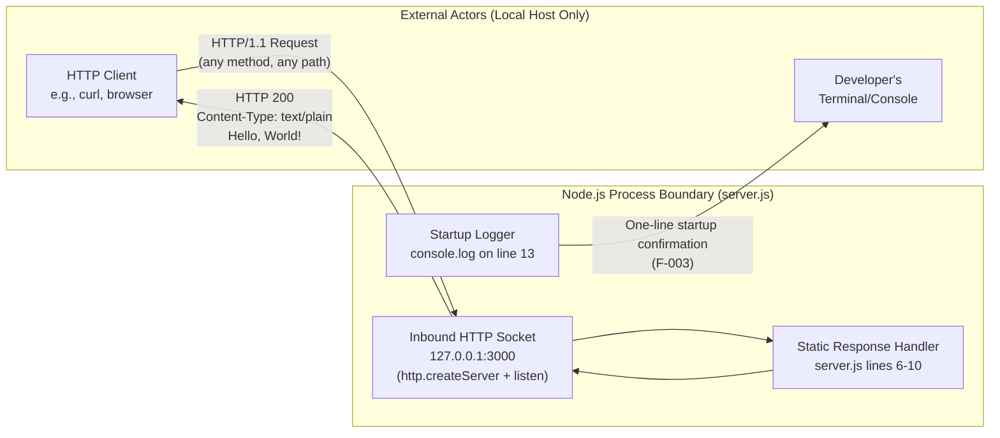

### 4.6.3 Inbound HTTP Integration

The inbound HTTP integration sequence is fully documented in the §4.4.2.1 sequence diagram. Key properties:

- **Contract**: The endpoint accepts any HTTP method on any path; no negotiation, validation, or routing occurs.
- **Response shape**: Status `200`, header `Content-Type: text/plain`, body `Hello, World!\n` (14 bytes).
- **Transport security**: None — plain HTTP only; TLS is explicitly out of scope (§2.4.4, §1.3.2).
- **Reach**: Loopback only; the integration is not addressable from any host other than the one running the process (§2.4.3).

### 4.6.4 Outbound Stdout Integration

The outbound stdout integration fires exactly once during process startup (line 13). No further stdout or stderr writes occur during the lifetime of the process. There is no log level, no timestamp, no structured payload, and no second log statement anywhere in the application (§2.1.4).

### 4.6.5 Integration Categories That Are Absent by Design

The section-prompt categories of "Data flow between systems," "API interactions," "Event processing flows," and "Batch processing sequences" do not exist in this repository. The following table enumerates the absent integration categories with citations:

| Absent Category | Source Evidence |
| --- | --- |
| Outbound REST / GraphQL / SOAP API client | No HTTP client SDK imported (§3.2, §3.3) |
| Database driver / ORM | No database client (§3.5) |
| Cache client (Redis, Memcached) | No cache client (§3.5) |
| Message broker (Kafka, RabbitMQ, NATS, SQS, Pub/Sub) | No broker client (§3.4) |
| Webhook receiver beyond the static HTTP listener | No conditional handler logic (§4.4.2.3) |
| Identity provider (OAuth/OIDC/SAML) | No identity layer (§2.4.4) |
| Email / SMS / notification provider | No notification SDK (§3.4) |
| Object storage (S3, GCS, Blob Storage) | No storage client (§3.4) |
| File-system reads or writes (beyond stdout) | No fs usage in server.js |
| Scheduled / batch processing | No cron, scheduler, or job queue (§1.3.2) |
| Event streaming / pub-sub | No event-bus client (§3.4) |
| External configuration provider (Consul, Vault, AWS Parameter Store) | No process.env reads, no SDK imports (§2.4.1) |
| Distributed tracing exporter (OpenTelemetry, Jaeger) | No instrumentation (§1.2.3) |

---

## 4.7 Error Handling Flow

### 4.7.1 Comprehensive Error Posture

The defining characteristic of the system's error posture is the **complete absence of in-source error handling**. Per §2.4.1: there is no `try`/`catch`; no `'error'` event listeners are attached to the `server` or socket. Per §2.6.2: no `SIGINT`/`SIGTERM` handlers are registered. Consequently, every conceivable error path falls through to the default Node.js or operating-system behavior. This section documents that posture diagrammatically so that operators and downstream maintainers can reason about failure modes without expecting recovery mechanisms that the source does not provide.

### 4.7.2 Error Posture Flowchart

The diagram below illustrates the disposition of every error class against the absence of corresponding listeners or guards in `server.js`. The "Absent Handlers" subgraph deliberately documents the *non-existence* of error code paths.

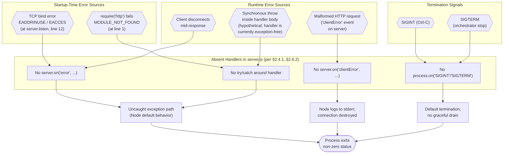

### 4.7.3 Startup-Time Errors

| Failure Mode | Disposition |
| --- | --- |
| require('http') resolution fails | MODULE_NOT_FOUND-class exception is thrown synchronously at line 1; no try/catch in source; process terminates immediately |
| Port 3000 already in use on 127.0.0.1 | EADDRINUSE emitted asynchronously on the server object; with no 'error' listener attached, Node raises an uncaught exception and exits |
| Insufficient permission to bind loopback socket | EACCES follows the same path as EADDRINUSE |

§2.6.1 explicitly enumerates these as runtime assumptions, not as conditions the application can recover from.

### 4.7.4 Request-Time Errors

| Failure Mode | Disposition |
| --- | --- |
| Malformed HTTP request (invalid request line / headers) | Node's http parser handles at the protocol level and emits a 'clientError' event on the server; no listener is attached, so Node's default action (log to stderr and destroy the connection) applies. Application code is never invoked. |
| Client disconnects mid-response | Default Node.js behavior; no listener attached to req or res; no custom cleanup |
| Handler throws synchronously (currently impossible given the handler body) | The throw would propagate to Node's uncaught-exception handler and terminate the process |
| Request body parsing failure | Not applicable — the handler never reads the request body (§2.1.3) |

### 4.7.5 Process-Termination Errors

| Signal / Cause | Disposition |
| --- | --- |
| SIGINT (Ctrl-C) | Default Node.js termination; no server.close(...) invoked anywhere in source; no graceful drain |
| SIGTERM (orchestrator-initiated stop) | Same as SIGINT |
| Uncaught exception | Node exits the process with the exception printed to stderr |
| External kill -9 / forced termination | OS terminates the process immediately |

### 4.7.6 Absent Retry, Fallback, Notification, and Recovery Mechanisms

The section-prompt categories of "Retry mechanisms," "Fallback processes," "Error notification flows," and "Recovery procedures" do **not** exist in this repository. The table below makes this explicit:

| Category | Status in Source |
| --- | --- |
| Retry strategy (immediate, backoff, jittered) | None — no retry primitives anywhere in server.js |
| Circuit breaker / bulkhead pattern | None — no circuit-breaker library imported (§3.2, §3.3) |
| Fallback response (cached, default, degraded) | None — only the static Hello, World!\n response exists |
| Dead-letter queue | Not applicable — no message queues exist (§3.4) |
| Error notification (email, paging, webhook) | None — no outbound notification client (§3.4) |
| Health-check / readiness probe | None — no /health or /ready endpoint (§1.3.2) |
| Self-restart / supervision | None — no PM2, systemd unit, or supervisor configuration (§3.6) |
| Recovery procedure documentation | None — README.md contains only the H1 heading (§1.3.3) |

---

## 4.8 Validation Rules and Decision Points

### 4.8.1 Decision Point Inventory

A line-by-line audit of `server.js` identifies the following conditional / decision points across the entire codebase:

| Decision Type | Present in Source? | Evidence |
| --- | --- | --- |
| URL/path routing | No | req.url never read |
| HTTP method dispatch | No | req.method never read |
| Header-based branching | No | req.headers never read |
| Content negotiation | No | Single static Content-Type: text/plain on line 8 |
| Authentication check | No | No token, cookie, or credential inspection (§2.4.4) |
| Authorization / RBAC check | No | No permission logic |
| Input validation | No | Request body never consumed (§2.4.4) |
| Business rule evaluation | No | Response is a compile-time literal (line 9) |
| Rate limiting | No | No rate-limiter middleware (§2.4.4) |
| Conditional error response | No | Only HTTP 200 is ever set (§2.5.2 F-002-RQ-002) |
| Startup bind success/failure | Yes (kernel-side) | The single decision diamond in the entire system flow (§4.3.1) |

### 4.8.2 Validation Rule Inventory

Per the F-001 / F-002 / F-003 functional-requirement validation tables in §2.2 and the cross-feature evidence in §2.4.4:

| Feature | Business Rules | Data Validation | Notes |
| --- | --- | --- | --- |
| F-001 — HTTP Server Initialization | Listener MUST bind only to loopback (§2.4.4) | None — hostname/port are compile-time literals on lines 3–4 | No configurability (§2.4.1) |
| F-002 — Static Response | Response MUST be byte-identical across all requests (§2.5.2 F-002-RQ-005) | None — no request data is read, parsed, or validated | No input validation necessary because no inputs are consumed |
| F-003 — Startup Logging | Log line MUST be emitted only after successful bind | None | No sensitive data is logged (§2.4.4) |

### 4.8.3 Authorization Checkpoints

There are no authorization checkpoints in this system. The request path bypasses any concept of identity, role, scope, tenancy, or permission. This is the deliberate posture documented in §2.4.4 and the Unsupported Use Cases table in §1.3.2 ("Multi-tenant or authenticated service — Unsupported").

### 4.8.4 Regulatory Compliance Checks

No regulatory compliance gates exist in source. The repository contains no GDPR / CCPA data-handling logic, no PCI-DSS controls, no HIPAA safeguards, no audit-log emissions, and no consent management. Per §2.4.4, no compliance regime is declared in the repository, and per §1.3.2 the system handles no user data, no persistent data, and no domain entities.

---

## 4.9 Timing and SLA Considerations

### 4.9.1 Declared Timing Requirements

Per §1.2.3 and §2.4.2, **no SLAs, KPIs, latency targets, throughput targets, or availability targets are declared anywhere in the repository**. The Process Flowchart cannot annotate timing constraints onto flow steps because no such constraints exist as authoritative requirements.

### 4.9.2 Observable Timing Properties

In the absence of declared targets, the following observable timing properties of the implementation may be useful for downstream consumers:

| Timing Dimension | Observed Behavior | Source |
| --- | --- | --- |
| Startup duration | Bounded by require('http') resolution time + OS bind call duration | Lines 1, 12 |
| Request-handling latency | Bounded only by event-loop scheduling and OS networking; handler body is purely synchronous and writes a 14-byte response | §2.4.2; lines 6–10 |
| Throughput ceiling | Bounded by Node.js event-loop capacity on a single thread | §2.4.3 |
| Time to first byte (TTFB) | Approximately equal to event-loop dispatch + socket write | §2.4.2 |
| Process uptime | Indefinite until external signal or uncaught exception | §4.5 |

These properties are descriptive of the implementation, not normative SLAs.

---

## 4.10 Cross-References to Pre-Existing Diagrams

To prevent duplication, the diagrams below — already present in earlier sections of this specification — should be consulted alongside the new diagrams in §4.3 through §4.7:

| Diagram | Location | Type | Topic |
| --- | --- | --- | --- |
| Major System Components | §1.2.2 | flowchart LR | Logical components inside the Node.js process (Listener, Handler, Response Builder, Startup Logger) |
| Primary User Workflow | §1.3.1 | sequenceDiagram | Developer → Shell → Node → server.js → HTTP client temporal sequence |
| Feature Dependencies Map | §2.3.1 | flowchart TD | F-001 / F-002 / F-003 dependencies on the http module and console global |
| Execution Workflow | §3.6.6 | flowchart LR | Clone → run → listen → log deployment-step view |
| Layered Stack View | §3.7.1 | flowchart TB | Application Layer → Runtime Layer → OS Layer stack decomposition |
| Component Interaction Flow | §3.7.2 | flowchart LR | Source → Node runtime → http core → listener → handler → response chain |

When reasoning about the system end-to-end, the recommended reading order is: §1.2.2 (components) → §3.7.1 (layered stack) → §3.7.2 (component interactions) → §4.3 (high-level workflow with decisions) → §4.4 (feature-aligned process flows) → §4.5 (state machine) → §4.6 (integration surface) → §4.7 (error posture).

---

#### References

**Files Examined**

- `server.js` — Sole executable source file (14 lines). Examined in full to derive every step in the high-level workflow (§4.3), the Process Startup Flow (§4.4.1, lines 1, 3–4, 6, 12–13), the Request Handling Flow (§4.4.2, lines 6–10), the state-transition triggers (§4.5), the integration surface (§4.6), and the comprehensive enumeration of absent error handlers, decision points, and validation rules (§4.7, §4.8). Confirmed: no `try`/`catch`, no `'error'` listeners, no `'clientError'` listener, no `SIGINT`/`SIGTERM` handlers, no `req.url`/`req.method`/`req.headers`/body reads, and no conditional response logic.
- `README.md` — Sole documentation file (single line: `# march_repo_hello_world`). Examined to confirm absence of any documented process flows, operational runbooks, SLA declarations, error-handling guidance, or recovery procedures that might supplement the source-level findings.

**Folders Examined**

- Repository root (`/`) — Enumerated to confirm the complete artifact inventory (only `server.js` and `README.md`; no subdirectories, no manifests, no configuration files, no test infrastructure). This null inventory is the structural basis for the "absent by design" enumerations throughout §4.1.2, §4.2.3, §4.6.5, §4.7.6, §4.8.3, and §4.8.4.

**Technical Specification Cross-References**

- §1.1 *Executive Summary* — Source of the project framing ("minimal HTTP scaffold") that justifies the §4.1.2 applicability matrix and the "absent by design" framing throughout this section.
- §1.2 *System Overview* — Source of the *Major System Components* `flowchart LR` cross-referenced in §4.10; provided the capability inventory underpinning §4.3 and §4.6, and the explicit "no KPIs declared" statement underpinning §4.9.1.
- §1.3 *Scope* — Source of the *Primary User Workflow* `sequenceDiagram` cross-referenced in §4.10; the in-scope evidence rows (§1.3.1) traced into the §4.3 step table; the out-of-scope inventory (§1.3.2) underpinning §4.6.5, §4.7.6, §4.8.3.
- §2.1 *Feature Catalog* — Source of the F-001 / F-002 / F-003 feature definitions and line-level traceability underpinning §4.4.
- §2.2 *Functional Requirements Tables* — Source of the validation-rule inventory in §4.8.2 ("None — request data is never consumed").
- §2.3 *Feature Relationships* — Source of the *Feature Dependencies Map* `flowchart TD` cross-referenced in §4.10; integration-point inventory underpinning §4.6.1.
- §2.4 *Implementation Considerations* — Source of the "no error handling" constraint (§2.4.1) underpinning §4.7; the "no SLA declared" performance posture (§2.4.2) underpinning §4.9; the security posture (§2.4.4) underpinning §4.8.3 and §4.8.4.
- §2.5 *Traceability Matrix* — Source of the line-level requirement-to-source mapping referenced throughout the step tables in §4.3.2, §4.4.1.2, and §4.4.2.2.
- §2.6 *Assumptions and Constraints* — Source of the runtime assumptions (§2.6.1) referenced in §4.7.3 and the inherited constraints (§2.6.2) — including "no graceful shutdown semantics" — referenced in §4.5 and §4.7.5.
- §3.4 *Third-Party Services* — Source of the comprehensive "no integrations" enumeration in §4.6.5.
- §3.5 *Databases & Storage* — Source of the "no persistence layer" finding underpinning §4.5.3, §4.5.4, and §4.6.5.
- §3.6 *Development & Deployment* — Source of the *Execution Workflow* `flowchart LR` cross-referenced in §4.10 and the "no self-restart / supervision" finding in §4.7.6.
- §3.7 *Technology Stack Architecture* — Source of the *Layered Stack View* `flowchart TB` and the *Component Interaction Flow* `flowchart LR` cross-referenced in §4.10.

# 5. System Architecture

This section consolidates the architectural view of the `march_repo_hello_world` system into a single authoritative reference. The system is a deliberately minimal Node.js HTTP server consisting of two artifacts at the repository root: a 14-line executable (`server.js`) and a single-line `README.md`. Consequently, this section documents both what is present in the architecture *and* — equally importantly — the categories of architectural concern that are explicitly absent by design, because those absences are themselves load-bearing architectural decisions traceable to the project's stated value proposition (§1.1) and scope (§1.3).

---

## 5.1 HIGH-LEVEL ARCHITECTURE

### 5.1.1 System Overview

#### Architectural Style and Rationale

The system implements a **single-process, single-threaded, monolithic CommonJS script** that exposes one HTTP endpoint via Node.js's `http` core module. There is no modular decomposition: all behavior — module import, configuration constants, server instantiation, request handling, and startup logging — is contained within the same 14-line source file. The runtime concurrency model is the **event-driven, non-blocking I/O loop** that ships with Node.js; no `cluster`, worker threads, or external process supervisor is employed.

The rationale for this style is grounded directly in the project's documented objectives:

- **Minimum-viable demonstration:** The repository exists to demonstrate the bare-minimum code required to serve HTTP responses from a Node.js process. Any layering, abstraction, or framework would dilute this purpose.
- **Toolchain neutrality:** Per §3.8.2, the design objective is "Establishing a clean baseline free of toolchain assumptions." Zero third-party dependencies, zero build steps, and zero configuration files preserve this neutrality.
- **Immediate executability:** A single command (`node server.js`) produces a running server, with no `npm install`, no compilation, no environment setup, and no orchestration.

#### Key Architectural Principles

- **Zero-dependency:** The implementation uses only the Node.js standard library; no `package.json`, no `node_modules/`, no lockfile exist anywhere in the repository.
- **Statelessness:** The request handler holds no per-request, per-session, or per-client state; every invocation produces a byte-identical response.
- **Synchronous handler:** The handler completes within a single event-loop tick using only synchronous calls — no Promises, no `async`/`await`, no I/O — eliminating concurrency hazards.
- **Hardcoded configuration:** Both the bind hostname (`127.0.0.1`) and TCP port (`3000`) are inline literal constants in source; no environment variable reads, no CLI argument parsing, no configuration files exist.
- **Single-direction integration:** The system accepts inbound HTTP on one socket and writes one line to stdout; it issues no outbound calls of any kind.

#### System Boundaries

The architectural boundary of the system is a single Node.js process executing `server.js`. The process's external surface consists of exactly two interfaces:

| Interface Class | Endpoint | Direction |
|-----------------|----------|-----------|
| HTTP listener | `127.0.0.1:3000` (loopback IPv4, TCP) | Inbound |
| Standard output stream | `stdout` of the spawning shell | Outbound |

Because the listener is bound to the loopback interface, the system is **only reachable from clients running on the same host**. This single design choice is the system's primary network-isolation control and is documented as the residual security boundary in §2.4.4.

#### Major Interfaces

- **Inbound HTTP/1.1 over TCP** on `127.0.0.1:3000`, plain (no TLS). The endpoint accepts any HTTP method on any URL path and ignores all request fields (method, URL, headers, body) when producing its response.
- **Outbound stdout** via `console.log`, emitting exactly one line at startup: `Server running at http://127.0.0.1:3000/`. No further stdout or stderr writes occur during the lifetime of the process.

#### High-Level Boundary Diagram

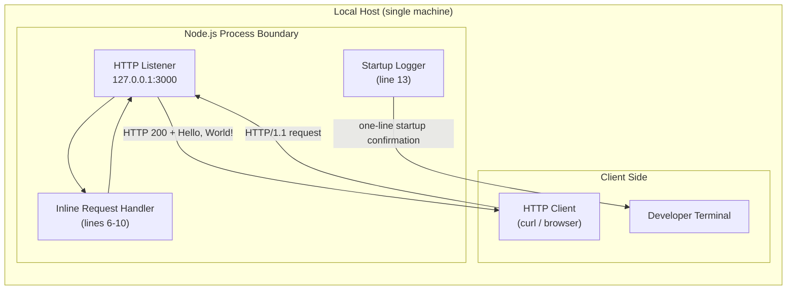

### 5.1.2 Core Components

The repository contains a single source file with no modular decomposition. The three components below are **logical responsibilities** within `server.js`, not separate modules or files. Each maps directly to one or more lines of source.

| Component Name | Primary Responsibility | Key Dependencies |
|----------------|------------------------|------------------|
| HTTP Listener (F-001) | Loads the `http` core module, declares hostname/port constants, instantiates the server, and binds it to `127.0.0.1:3000`. | Node.js `http` core module; OS TCP/IPv4 loopback stack |
| Request Handler (F-002) | Inline `(req, res)` callback that sets HTTP status `200`, sets `Content-Type: text/plain`, and writes the 14-byte body `Hello, World!\n`. Never inspects the request. | Node.js `http` `ServerResponse` API (`res.statusCode`, `res.setHeader`, `res.end`) |
| Startup Logger (F-003) | Emits exactly one stdout line — `Server running at http://127.0.0.1:3000/` — when the listen callback fires after successful bind. | Node.js global `console`; writable stdout stream; depends on F-001's `listen` success callback |

| Component Name | Integration Points | Critical Considerations |
|----------------|--------------------|--------------------------|
| HTTP Listener (F-001) | Accepts inbound TCP connections on `127.0.0.1:3000`; never opens outbound connections. | Loopback binding precludes horizontal scaling (§2.4.3); no error listener attached, so a bind failure becomes an uncaught exception (§4.7.3). |
| Request Handler (F-002) | Internal only — invoked by the `http` module on each parsed request; produces a `ServerResponse` payload back to the listener. | Strictly synchronous, single-tick execution; no method/path branching; trivially idempotent — every request returns a byte-identical 14-byte response. |
| Startup Logger (F-003) | Writes to the host's `stdout` stream exactly once during the process lifetime. | No log level, no timestamp, no structured payload; constitutes the entirety of the system's observability surface. |

### 5.1.3 Data Flow Description

#### Primary Data Flows

The system has exactly two observable data flows: a one-time **startup flow** and a per-request **request/response flow**. Both are linear and contain no branching beyond the single startup bind-success decision.

**Startup flow (executed once per process):**

1. The Node.js runtime begins CommonJS evaluation of `server.js`.
2. Line 1 loads the `http` core module via `require('http')`.
3. Lines 3–4 declare immutable module-scope constants `hostname = '127.0.0.1'` and `port = 3000`.
4. Line 6 calls `http.createServer(handler)`, which registers the inline callback but does not yet invoke it.
5. Line 12 calls `server.listen(port, hostname, callback)`, which asynchronously requests the OS kernel to bind the loopback socket.
6. On successful bind, the listen callback fires; line 13 emits the single stdout startup confirmation line.
7. The event loop enters idle, awaiting inbound connections.

**Request/response flow (executed once per inbound HTTP request):**

1. A TCP handshake completes between the local client and the kernel on `127.0.0.1:3000`.
2. Request bytes are delivered to Node's `http` parser, which constructs `IncomingMessage` (`req`) and `ServerResponse` (`res`) objects.
3. The event loop schedules an invocation of the inline handler with `(req, res)`.
4. The handler executes four synchronous statements in linear order: assign status code 200, set `Content-Type: text/plain`, call `res.end('Hello, World!\n')`, and return.
5. The `http` module flushes the response bytes back through the kernel to the client.
6. The event loop returns to idle, awaiting the next request.

#### Integration Patterns and Protocols

- **Inbound:** Synchronous, blocking request/response over HTTP/1.1 atop TCP. The protocol contract is unconditional — any method, any path, any headers, any body produces the same 14-byte response with status 200 and `Content-Type: text/plain`.
- **Outbound:** Synchronous fire-and-forget plain-text emit to stdout, executed exactly once at startup. There are no other outbound channels.
- **No asynchronous messaging:** No event streams, no pub/sub, no queues, no webhooks beyond the single inbound listener.

#### Data Transformation Points

There are **no data transformation points**. The response body is a compile-time string literal embedded directly in source (`server.js` line 9). No parsing, validation, serialization, deserialization, mapping, or enrichment occurs anywhere in the request path. The request object is constructed by Node's `http` parser but is never read by application code.

#### Data Stores and Caches

There are **no data stores and no caches** in this system. Per §3.5 and §4.5.3: no database client is imported; no in-memory cache structure is allocated; no `fs` reads or writes (beyond the single stdout line) occur; no HTTP response caching headers are set. The response payload is a static literal and there is no data variance that would make caching meaningful.

### 5.1.4 External Integration Points

The system's integration surface is exhausted by two endpoints. The table below enumerates them in full.

| System Name | Integration Type | Data Exchange Pattern |
|-------------|------------------|------------------------|
| HTTP Client (local host only) | Inbound HTTP listener at `127.0.0.1:3000` | Synchronous request/response over HTTP/1.1; any method on any path produces an identical response |
| Developer's Console (stdout sink) | Outbound stdout stream | One-shot fire-and-forget emit of a single plain-text line on successful startup |

| System Name | Protocol / Format | SLA Requirements |
|-------------|--------------------|-------------------|
| HTTP Client (local host only) | HTTP/1.1 over TCP, plain (no TLS); response body `Hello, World!\n`, header `Content-Type: text/plain` | **None declared in source.** No latency, throughput, or availability targets exist anywhere in the repository (§2.4.2, §4.9). |
| Developer's Console (stdout sink) | Plain text via `console.log`; no structured format, no log level, no timestamp | **None declared.** Observable behavior: exactly one line emitted on successful bind. |

#### Explicitly Absent Integrations

The following integration categories are absent by design and are documented here to delineate the architectural perimeter:

- Outbound REST, GraphQL, or SOAP API clients
- Database drivers or ORMs (no MongoDB, Postgres, MySQL, SQLite, etc.)
- Cache clients (no Redis, Memcached)
- Message brokers (no Kafka, RabbitMQ, NATS, SQS, Pub/Sub)
- Identity providers (no OAuth, OIDC, SAML)
- Email, SMS, or notification providers
- Object storage clients (no S3, GCS, Azure Blob)
- Distributed tracing exporters (no OpenTelemetry, Jaeger, Honeycomb)
- External configuration providers (no Consul, Vault, AWS Parameter Store)
- File-system reads or writes beyond the single stdout emit

---

## 5.2 COMPONENT DETAILS

### 5.2.1 HTTP Listener Component

| Attribute | Value |
|-----------|-------|
| Source location | `server.js` lines 1, 3–4, 6, 12 |
| Purpose | Bootstrap the Node.js HTTP server and bind it to the loopback interface |
| Technology / framework | Node.js `http` core module; CommonJS module system |
| Key interfaces / APIs | `require('http')`, `http.createServer(callback)`, `server.listen(port, hostname, callback)` |
| Data persistence | None — no file, database, cache, or queue writes |
| Scaling considerations | Single-process, single-threaded event loop; horizontal scaling is precluded because loopback binding (`127.0.0.1`) prevents reachability from peer hosts or a load balancer (§2.4.3) |

The listener is created via `http.createServer(handler)` and bound asynchronously via `server.listen(port, hostname, callback)`. The bind call returns immediately; the listen callback fires only on successful kernel-level bind. No `'error'` event listener is attached to the server object, so a bind failure (e.g., `EADDRINUSE`, `EACCES`) propagates as an uncaught exception (see §5.4.3).

### 5.2.2 Request Handler Component

| Attribute | Value |
|-----------|-------|
| Source location | `server.js` lines 6–10 (inline arrow function passed to `http.createServer`) |
| Purpose | Produce the deterministic static HTTP response for every inbound request |
| Technology / framework | Inline `(req, res) => { ... }` arrow function; uses Node's `ServerResponse` API |
| Key interfaces / APIs | `res.statusCode`, `res.setHeader('Content-Type', 'text/plain')`, `res.end('Hello, World!\n')` |
| Data persistence | None — the response body is a compile-time literal |
| Scaling considerations | Stateless and trivially idempotent — every invocation produces a byte-identical 14-byte response regardless of method, path, headers, or body |

The handler is a strictly linear sequence of three statements (status → header → body+end) with **zero conditional branches**. It performs no I/O, allocates no Promises, and executes entirely within a single event-loop tick. Although the handler receives `req` as its first argument, it never reads `req.url`, `req.method`, `req.headers`, or the request body — confirming a non-negotiating, non-routing contract.

### 5.2.3 Startup Logger Component

| Attribute | Value |
|-----------|-------|
| Source location | `server.js` lines 12–13 (the `listen` callback) |
| Purpose | Provide operator-visible confirmation that the server bound successfully |
| Technology / framework | Node.js global `console.log`; writes to the spawning process's stdout stream |
| Key interfaces / APIs | `console.log` with template literal `` `Server running at http://${hostname}:${port}/` `` |
| Data persistence | None — stdout is not redirected, captured, or retained by the application |
| Scaling considerations | N/A — fires exactly once per process lifetime, contingent on F-001's bind success |

The logger has no log level, no timestamp, no structured payload, no log rotation, and no second log statement anywhere in the application. It constitutes the entirety of the system's observability surface.

### 5.2.4 Component Interaction Diagram

The diagram below depicts the relationships between the three logical components and their external interfaces. Solid arrows indicate runtime data flow; dotted arrows indicate one-time control transitions (registration and startup confirmation).

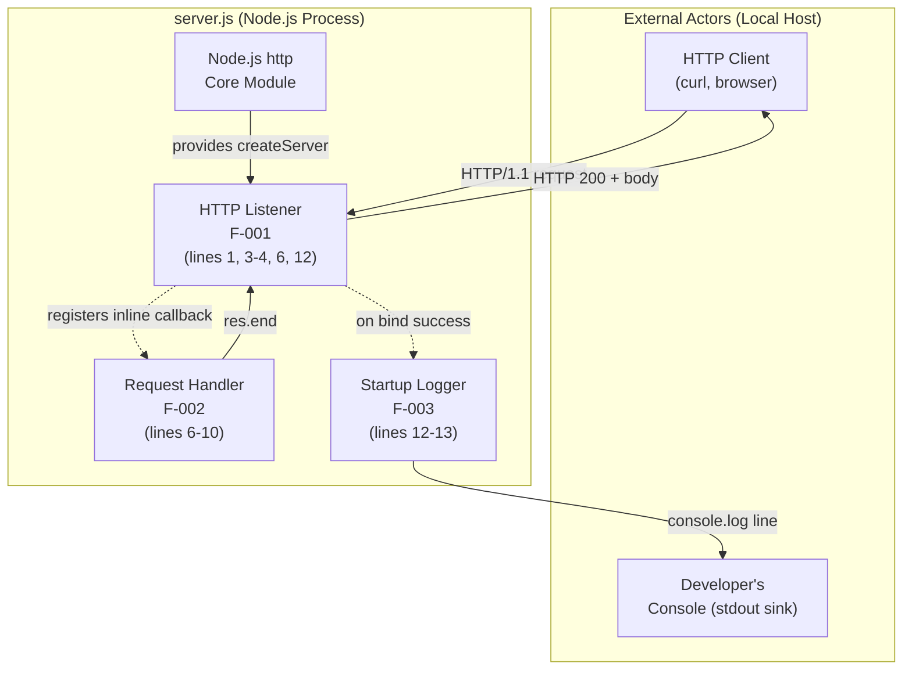

### 5.2.5 Server Lifecycle State Diagram

The system has no application-level state machine (no sessions, orders, or workflow entities). However, the Node.js process and its embedded HTTP server exhibit a small, well-defined lifecycle state machine, reproduced here for the System Architecture view.

```mermaid
stateDiagram-v2
    [*] --> Initializing: node server.js invoked
    Initializing --> Binding: server.listen() called<br/>(line 12)
    Binding --> Listening: bind succeeds;<br/>listen callback fires;<br/>console.log emitted (line 13)
    Binding --> Terminated: bind fails<br/>(EADDRINUSE / EACCES)<br/>uncaught exception
    Listening --> Listening: HTTP request arrives;<br/>handler runs (lines 7-9);<br/>returns to idle
    Listening --> Terminated: SIGINT / SIGTERM<br/>OR uncaught exception<br/>(no server.close in source)
    Terminated --> [*]
```

| State | Entry Trigger | Exit Trigger |
|-------|---------------|--------------|
| Initializing | Process spawn; CommonJS evaluation begins | `server.listen(...)` invoked (line 12) |
| Binding | `server.listen(...)` invoked | Listen callback fires (success) or uncaught error (failure) |
| Listening | Bind callback fires; startup log written | SIGINT/SIGTERM, uncaught exception, or external kill |
| Listening (self-loop) | HTTP request received | `res.end(...)` completes; loop returns to idle |
| Terminated | External signal or unhandled error | (terminal) |

Notable lifecycle properties:

- **Stateless idle:** While in `Listening`, no per-request state mutation occurs; no session storage or in-memory accumulation exists.
- **No graceful drain:** Because `server.close()` is never called in source and no SIGINT/SIGTERM handler is registered, the `Listening → Terminated` transition has no intermediate "Shutting Down" state.
- **Idempotency:** The self-loop on `Listening` is trivially idempotent — every request produces a byte-identical response.

### 5.2.6 Request-Handling Sequence Diagram

The sequence below traces a single inbound HTTP request from TCP handshake through response transmission and return to event-loop idle. The handler completes in a single synchronous tick with no I/O.

```mermaid
sequenceDiagram
    participant Client as HTTP Client<br/>(local host only)
    participant Kernel as OS Kernel<br/>(TCP Stack)
    participant Parser as Node http Parser
    participant Handler as Inline Handler<br/>(lines 6-10)
    participant Loop as Node Event Loop

    Client->>Kernel: TCP SYN to 127.0.0.1:3000
    Kernel-->>Client: SYN-ACK / ACK
    Client->>Kernel: HTTP/1.1 request (any method, any path)
    Kernel->>Parser: Deliver bytes
    Parser->>Parser: Construct IncomingMessage and ServerResponse
    Parser->>Loop: Schedule handler invocation
    Loop->>Handler: handler(req, res)
    Note over Handler: req.url, req.method, req.headers,<br/>and body are NOT read
    Handler->>Handler: res.statusCode = 200 (line 7)
    Handler->>Handler: res.setHeader('Content-Type', 'text/plain') (line 8)
    Handler->>Handler: res.end('Hello, World!\n') (line 9)
    Handler-->>Parser: Response stream closed
    Parser-->>Kernel: HTTP/1.1 200 + 14-byte body
    Kernel-->>Client: Response payload
    Loop->>Loop: Return to idle
```

### 5.2.7 Process-Startup Sequence Diagram

The sequence below traces the one-time process bootstrap from shell invocation through entry into the event loop. The single decision point — bind success vs. failure — is shown as an `alt` branch.

```mermaid
sequenceDiagram
    actor Developer
    participant Shell as Shell / Terminal
    participant Node as Node.js Runtime
    participant App as server.js
    participant Kernel as OS Kernel (TCP Stack)
    participant Stdout as Standard Output

    Developer->>Shell: node server.js
    Shell->>Node: Spawn process
    Node->>App: Begin CommonJS evaluation
    App->>Node: require('http') (line 1)
    Node-->>App: http module reference
    App->>App: Declare hostname and port (lines 3-4)
    App->>Node: http.createServer(handler) (line 6)
    Node-->>App: server instance
    App->>Node: server.listen(3000, '127.0.0.1', cb) (line 12)
    Node->>Kernel: bind(127.0.0.1:3000)
    alt bind succeeds
        Kernel-->>Node: bind OK
        Node->>App: invoke listen callback
        App->>Stdout: console.log startup line (line 13)
        Stdout-->>Developer: Visible startup confirmation
        Node->>Node: Enter event loop, await connections
    else bind fails (EADDRINUSE / EACCES)
        Kernel-->>Node: error
        Note over Node,App: No 'error' listener attached;<br/>error becomes uncaught exception
        Node-->>Shell: Process exits non-zero
    end
```

---

## 5.3 TECHNICAL DECISIONS

This subsection documents and justifies each architectural decision present in `server.js`. Every decision is grounded in observable source-level evidence or in the explicit scope statement of the project (§1.3).

### 5.3.1 Architecture Style Decisions

| Decision | Implementation Evidence | Rationale |
|----------|--------------------------|-----------|
| Monolithic single-file script | All 14 lines reside in `server.js`; no `src/`, no modules, no separate handler files | Demonstrates the bare minimum; eliminates layout opinions |
| Plain JavaScript, no TypeScript | No `.ts` files, no `tsconfig.json`, no build/transpile step | Avoids a toolchain dependency; preserves direct executability |
| CommonJS module system | `require('http')` on line 1; no ESM `import` statements | Directly executable by `node server.js` with no module-resolution configuration |
| Zero third-party dependencies | No `package.json`, no `package-lock.json`, no `node_modules/` | Establishes a "clean baseline free of toolchain assumptions" (§3.8.2) |
| Node.js `http` core module only (no framework) | No Express, Fastify, Koa, Hapi, or other framework imports | Uses the canonical primitive for HTTP servers in Node.js |
| Single-threaded, synchronous handler | No `cluster`, no worker threads, no Promises, no `async`/`await` | Eliminates concurrency complexity; aligns with the static-response contract |
| Hardcoded configuration | `hostname` (line 3) and `port` (line 4) are literal constants; zero `process.env` reads | No configuration layer is needed for a demonstration scaffold |
| Loopback-only binding (`127.0.0.1`) | Line 3 | Acts as the system's sole network-isolation control (§2.4.4) |
| Plain HTTP (no TLS) | No `https` module, no certificates, no TLS configuration | TLS explicitly out of scope (§1.3.2) |

### 5.3.2 Communication Pattern Choices

| Channel | Pattern Choice | Justification |
|---------|----------------|---------------|
| Inbound HTTP | Synchronous request/response over HTTP/1.1, plain TCP | Canonical web-service primitive; handler completes in one event-loop tick with no I/O, making request/response the natural fit |
| Outbound logging | Fire-and-forget single-line emit to stdout | Operator-visible startup confirmation without coupling to any log aggregator |
| Async messaging | **Not used** | No queues, brokers, or event buses exist; the system has no work to defer (§4.6.5) |
| Streaming responses | **Not used** | Response is a fixed 14-byte literal; `res.end(...)` writes the entire payload in one call |
| Server-Sent Events / WebSockets | **Not used** | No upgrade handler is registered; only the default HTTP/1.1 request/response cycle is supported |

### 5.3.3 Data Storage Solution Rationale

The system has **no persistence layer**, and this absence is itself a deliberate architectural decision. The justification is:

- **The data is the literal:** The response body `Hello, World!\n` is a compile-time string constant embedded in source (line 9). No variable, dynamic, or user-derived data exists that would require storage.
- **No state to durably retain:** With no sessions, no users, no resources, and no events, there is nothing for a database to manage.
- **No transactional resource:** Per §4.5.4, transaction boundaries are not applicable because no transactional resource (database, broker) is touched.
- **Dependency-cost rationale:** Per §3.8.2, "Adding any element from the default stack would directly contradict the design objective." A database driver, schema, and lifecycle management would constitute precisely such an addition.

### 5.3.4 Caching Strategy Justification

No caching layer exists. The decision rests on:

- **Static payload:** The response is byte-identical for every request. There is no data variance to cache.
- **No upstream latency to absorb:** Because the handler performs no I/O, no remote calls, and no computation beyond three property assignments and one function call, no expensive operation exists whose result would benefit from caching.
- **No HTTP cache headers set:** The handler does not set `Cache-Control`, `ETag`, `Last-Modified`, or `Expires`. Downstream HTTP-layer caching by clients or proxies is neither encouraged nor forbidden; it is simply unaddressed.

### 5.3.5 Security Mechanism Selection

The architectural security posture is anchored in a single primary control with no defense-in-depth layers:

| Security Concern | Mechanism Selected | Rationale |
|------------------|--------------------|-----------|
| Network exposure | Loopback-only binding (`127.0.0.1`) | The system is unreachable from any host other than the local machine; this is the primary security boundary |
| Transport encryption | None (plain HTTP) | TLS explicitly out of scope (§1.3.2); loopback transport does not traverse untrusted networks |
| Authentication | None | No identity layer exists; no tokens, sessions, or cookies are handled |
| Authorization | None | All requests receive the same response regardless of caller identity (which is not inspected) |
| Input validation | Not applicable | The handler reads no request fields; no injection vectors exist on the input side |
| Output encoding | Static literal | The response body is a compile-time constant; no dynamic data is interpolated, so no XSS/injection risk on the output side |
| Logging of secrets | Not applicable | The single log line contains only the hostname and port — no credentials, no tokens |
| Rate limiting / abuse controls | None | No middleware is configured; reliance is solely on the loopback boundary |

### 5.3.6 Architecture Decision Records

The four most consequential architectural decisions are recorded below in abbreviated ADR form.

#### ADR-001 — Adopt Zero Third-Party Dependencies

- **Status:** Accepted (in force)
- **Context:** A Node.js HTTP server can be built with frameworks (Express, Fastify, Koa) that simplify routing, middleware, and error handling.
- **Decision:** Use only the Node.js `http` core module; do not introduce any third-party package.
- **Consequences:** No `package.json`, no `node_modules/`, no lockfile; zero transitive vulnerabilities to manage; no version-upgrade burden; in exchange, no routing, middleware, or framework affordances exist out of the box.

#### ADR-002 — Bind Exclusively to the Loopback Interface

- **Status:** Accepted (in force)
- **Context:** A Node.js HTTP server can bind to `0.0.0.0` (all interfaces), a specific NIC, or the loopback. Each choice has different reachability and threat-model implications.
- **Decision:** Hardcode the bind hostname to `127.0.0.1`.
- **Consequences:** The server is reachable only from local processes; no firewall, TLS, or auth layer is required to keep external traffic out; horizontal scaling and load balancing are precluded.

#### ADR-003 — Hardcode All Configuration

- **Status:** Accepted (in force)
- **Context:** Configuration could be supplied via environment variables, CLI arguments, or a configuration file.
- **Decision:** Hardcode `hostname` and `port` as inline literal constants; do not read `process.env`; do not parse CLI arguments.
- **Consequences:** Zero configuration-layer complexity; the deployed surface area is the source code itself; in exchange, the values can be changed only by editing source.

#### ADR-004 — Omit In-Source Error Handling

- **Status:** Accepted (in force)
- **Context:** Node.js servers typically attach `'error'` and `'clientError'` listeners, wrap handlers in `try`/`catch`, and register SIGINT/SIGTERM handlers for graceful shutdown.
- **Decision:** Do not implement any in-source error handling; rely on default Node.js behavior for every failure mode.
- **Consequences:** Bind failures, parser errors, and termination signals all propagate to default Node.js handling, resulting in immediate process exit; no graceful drain occurs; in exchange, the source is maximally minimal and free of recovery logic.

### 5.3.7 Decision Tree — Why Each "Default Enterprise Layer" Was Omitted

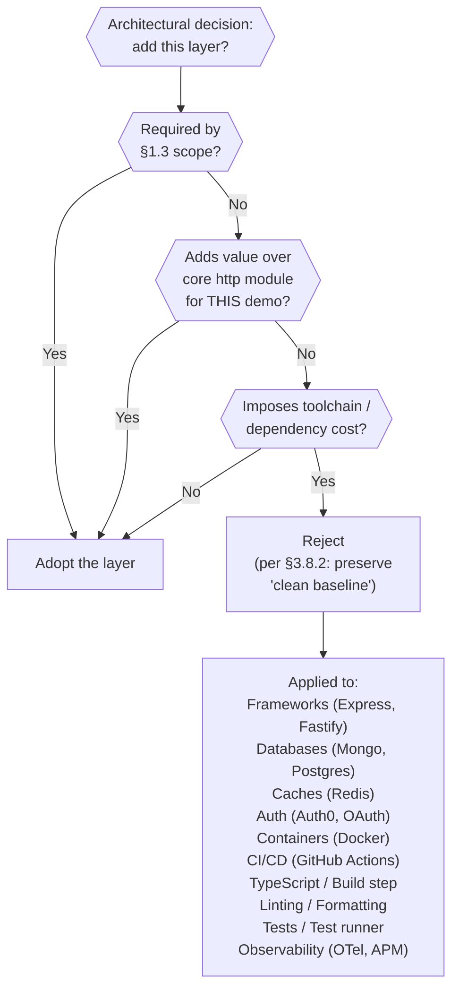

---

## 5.4 CROSS-CUTTING CONCERNS

The defining architectural characteristic of this system is the **deliberate, documented absence of most cross-cutting concerns** that would typically be present in an enterprise web service. This subsection records the system's posture for each concern, including the absences, because operators and downstream maintainers must be able to reason about failure modes and operational properties without expecting features that the source does not provide.

### 5.4.1 Monitoring and Observability Approach

The complete observability surface of the system is a single `console.log` line emitted at startup. There is no metrics emission, no distributed tracing, no APM agent, no health endpoint, and no error tracking integration.

| Observability Concern | Posture |
|------------------------|---------|
| Metrics (Prometheus, StatsD, OpenTelemetry) | None — no instrumentation, no exporter |
| Distributed tracing (Jaeger, Honeycomb, OTel) | None |
| Application Performance Monitoring (Datadog, New Relic) | None |
| Health / readiness endpoints (`/health`, `/ready`) | None — only a single route handler exists, which ignores the path |
| Error tracking (Sentry, Rollbar) | None |
| Startup confirmation | Single stdout line via `console.log` (line 13) |

### 5.4.2 Logging and Tracing Strategy

- **Logging:** Exactly one `console.log` invocation occurs during the entire process lifetime (line 13). No log level, no timestamp, no structured (JSON) payload, no second log statement.
- **Log routing:** Logs go to the stdout stream of the spawning shell; capture, aggregation, retention, and rotation are externalities of the operator's invocation environment.
- **Tracing:** No tracing of any kind is implemented; no trace context propagation occurs because no outbound calls exist.

### 5.4.3 Error Handling Patterns

The defining feature of error handling in this system is the **complete absence of in-source error handling**. There is no `try`/`catch`, no `'error'` event listener on the server or sockets, no `'clientError'` listener, and no SIGINT/SIGTERM handler. Every conceivable error path falls through to the default Node.js or OS behavior.

| Error Source | Disposition |
|--------------|-------------|
| `require('http')` resolution failure (`MODULE_NOT_FOUND`) | Synchronous throw at line 1; no `try`/`catch`; process terminates immediately |
| TCP bind failure (`EADDRINUSE`, `EACCES`) | `'error'` event emitted on server; no listener attached; raised as uncaught exception; process exits non-zero |
| Malformed HTTP request (`'clientError'` event) | No listener attached; Node default action — log to stderr and destroy the connection; application code is not invoked |
| Client disconnects mid-response | Default Node.js behavior; no listener attached to `req` or `res`; no custom cleanup |
| Synchronous throw in handler (currently impossible — handler is throw-free) | Would propagate to Node's uncaught-exception handler and terminate the process |
| `SIGINT` (Ctrl-C) / `SIGTERM` | No handler registered; default Node termination; `server.close()` is **not** called — no graceful drain |
| External `kill -9` | OS terminates the process immediately |

#### Absent Recovery Mechanisms

The following recovery primitives are confirmed absent across the codebase:

- Retry strategies (immediate, exponential backoff, jittered)
- Circuit-breaker or bulkhead patterns
- Fallback or degraded-mode responses
- Dead-letter queues
- Error notifications (email, paging, webhooks)
- Self-restart or process supervision (no PM2, no systemd unit, no Kubernetes liveness probe)

#### Error Handling Flow Diagram

The diagram below maps every error class to the absent listener that would normally handle it and, ultimately, to the default Node.js disposition.

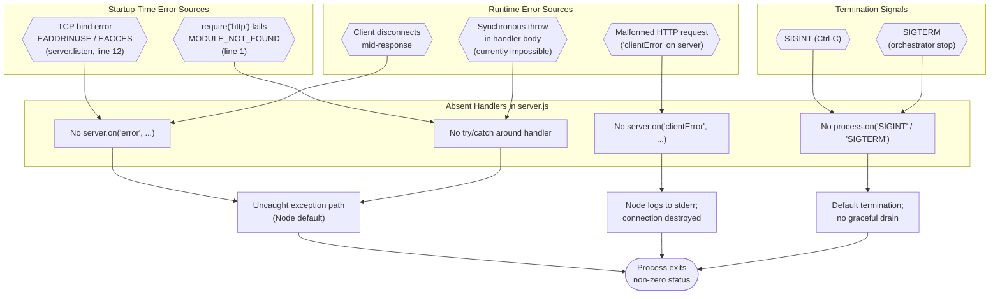

### 5.4.4 Authentication and Authorization Framework

The system implements **no authentication and no authorization framework**:

- No identity layer (no users, no roles, no permissions)
- No tokens (no JWT, no OAuth bearer, no API keys)
- No sessions or cookies
- No integration with identity providers (no Auth0, Okta, Cognito, Keycloak)
- No federation (no SAML, no OIDC)

The architectural justification is twofold. First, the system has no resources that require protection — every request produces the same public 14-byte response. Second, the loopback-only network boundary (§5.3.5) ensures that only processes running on the same host can reach the server in the first place, making the host's process-isolation primitives the effective access-control mechanism.

The system is **explicitly unsuitable** for any use case requiring per-caller identity, including any multi-tenant or authenticated service.

### 5.4.5 Performance Requirements and SLAs

No performance requirements, service-level objectives, or service-level agreements are declared anywhere in the repository. Per §2.4.2 and §4.9, no latency target, throughput target, availability target, or startup-time target exists. The table below records only the **observable** performance properties derived from the source.

| Dimension | Observable Property |
|-----------|---------------------|
| Response latency | Bounded only by event-loop scheduling and OS networking; the handler performs no I/O and writes a 14-byte body in a single synchronous call |
| Throughput ceiling | Bounded by the capacity of a single Node.js event loop on the host; no `cluster`, worker threads, or external scaling exist |
| Startup latency | Bounded by `require('http')` cost plus OS bind duration; no other initialization occurs |
| Connection limits | Inherits Node.js defaults; no explicit `maxConnections` or keep-alive tuning is configured |
| Uptime | Indefinite until external signal, uncaught exception, or host termination; no restart loop, no supervision |

### 5.4.6 Disaster Recovery Procedures

There are **no disaster recovery procedures** in this repository, and the architecture inherently does not support classical DR patterns:

- **No backups:** Nothing in the system requires backing up — no database, no file storage, no configuration files, no secrets.
- **No failover:** The system is single-process and single-host by design; loopback binding precludes a peer to fail over to.
- **No restart logic:** No process supervisor (PM2, systemd unit, Kubernetes Deployment) is referenced in source or in the repository's deployment surface, which is empty per §1.3.3.
- **No state to recover:** Because no state is persisted, no recovery procedure for state is meaningful.
- **No runbook:** `README.md` contains only the H1 heading; no operational documentation exists.

The recovery strategy for the system, by default, is for the operator to re-invoke `node server.js`.

---

## 5.5 References

#### Files Examined

- `server.js` — Sole executable artifact (14 lines, plain JavaScript, CommonJS). Provides the entire system implementation: `require('http')` on line 1; hardcoded `hostname='127.0.0.1'` and `port=3000` constants on lines 3–4; `http.createServer` with inline handler on lines 6–10 setting status 200, header `Content-Type: text/plain`, and body `Hello, World!\n`; `server.listen` with `console.log` startup callback on lines 12–13.
- `README.md` — Single-line file containing only the H1 heading `# march_repo_hello_world`; no architectural notes, no usage instructions.

#### Folder Explored

- Repository root (`/`) — Confirmed exactly two files at the root with zero subdirectories. No `src/`, no `tests/`, no `node_modules/`, no `.github/`, no `package.json`, no Dockerfile, no `LICENSE`.

#### Technical Specification Sections Cross-Referenced

- §1.1 Executive Summary — Project framing and value proposition (zero-dependency baseline rationale)
- §1.2 System Overview — Major System Components diagram; core technical-approach table; capability inventory
- §1.3 Scope — In-scope/out-of-scope inventory; artifact inventory (absent files); Primary User Workflow
- §2.1 Feature Catalog — Detailed descriptions of features F-001 (HTTP Listener), F-002 (Request Handler), F-003 (Startup Logger)
- §2.3 Feature Relationships — Feature dependency map; integration-point inventory
- §2.4 Implementation Considerations — Technical constraints (§2.4.1); performance requirements (§2.4.2); scalability posture (§2.4.3); security implications (§2.4.4); maintenance requirements (§2.4.5)
- §2.5 Traceability Matrix — Requirement-to-line mappings (F-002-RQ-005 idempotency)
- §2.6 Assumptions and Constraints — Runtime assumptions; inherited constraints
- §3.1 Programming Languages — JavaScript / CommonJS selection
- §3.2 Frameworks & Libraries — Sole library: Node.js `http` core module
- §3.3 Open Source Dependencies — Confirmed zero third-party dependencies
- §3.4 Third-Party Services — Confirmed no external service integrations
- §3.5 Databases & Storage — Confirmed no persistence layer
- §3.7 Technology Stack Architecture — Layered stack view; component interaction flow; network configuration constants
- §3.8 Default Technology Stack Reconciliation — Reconciliation matrix vs. typical enterprise defaults
- §4.2 System Boundaries and Actor Inventory — Process-boundary delineation
- §4.3 High-Level System Workflow — End-to-end workflow with the single bind-success decision point
- §4.4 Core Process Flows — Process Startup Flow and Request Handling Flow sequence diagrams
- §4.5 Server Lifecycle State Transitions — State diagram; persistence/caching/transactions/concurrency posture
- §4.6 Integration Workflows — Integration surface inventory; inbound HTTP; outbound stdout; absent integrations
- §4.7 Error Handling Flow — Error posture flowchart; startup/request/termination errors; absent recovery mechanisms
- §4.8 Validation Rules and Decision Points — Decision-point inventory (confirms absence of validation logic)
- §4.9 Timing and SLA Considerations — Confirmed no SLAs declared

# 6. SYSTEM COMPONENTS DESIGN

## 6.1 Core Services Architecture

# 6. SYSTEM COMPONENTS DESIGN

## 6.1 Core Services Architecture

### 6.1.1 Applicability Determination

**Core Services Architecture is not applicable for this system.**

The repository under specification implements a single-process, single-threaded, monolithic Node.js script consisting of 14 lines of source code in a single file (`server.js`) with zero third-party dependencies. The system has no microservices, no distributed components, no service-to-service communication, no service mesh, no orchestration layer, and no externalized state. Every architectural property typically discussed under "Core Services Architecture" — service boundaries, inter-service communication, service discovery, load balancing, circuit breakers, retry/fallback, horizontal scaling, auto-scaling, disaster recovery, failover, and data redundancy — is either inapplicable or explicitly absent from the codebase by deliberate design.

This determination is anchored in the foundational architectural statement that the system is a "single-process, single-threaded, monolithic CommonJS script" that "exposes one HTTP endpoint via Node.js's `http` core module" with "no modular decomposition" and where "no `cluster`, worker threads, or external process supervisor is employed." The subsections below itemize each "Core Services" sub-topic from the section prompt and demonstrate, with source-level evidence, why each one does not apply.

#### 6.1.1.1 System Shape Summary

The table below crystallizes the architectural shape that drives the "not applicable" determination.

| Architectural Dimension | Observed Posture |
|--------------------------|------------------|
| Process topology | Single Node.js process executing `server.js`; no `cluster`, no worker threads, no process supervisor |
| Module topology | Monolithic CommonJS script; all behavior contained in one 14-line file with no submodules |
| Dependency footprint | Zero third-party dependencies; no `package.json`, no `node_modules/`, no lockfile |
| Network surface | One inbound TCP socket bound to `127.0.0.1:3000`; zero outbound network calls |

The four Architecture Decision Records ratified for this system (ADR-001 through ADR-004) collectively preclude the existence of a Core Services Architecture. ADR-001 adopts zero third-party dependencies, eliminating service-mesh clients, circuit-breaker libraries, and service-discovery SDKs. ADR-002 binds the listener exclusively to the loopback interface (`127.0.0.1`), precluding load balancing, horizontal scaling, and multi-host deployment. ADR-003 hardcodes all configuration as inline literal constants, precluding runtime service discovery or environment-driven service binding. ADR-004 omits in-source error handling, precluding application-layer retry, fallback, and circuit-breaker patterns.

#### 6.1.1.2 Process-Boundary Diagram

The following diagram illustrates the architectural boundary of the system. The single-process containment shown here is the structural reason that "Core Services Architecture" does not apply: there are no peer services to discover, no inter-service edges to balance, and no failover targets to configure.

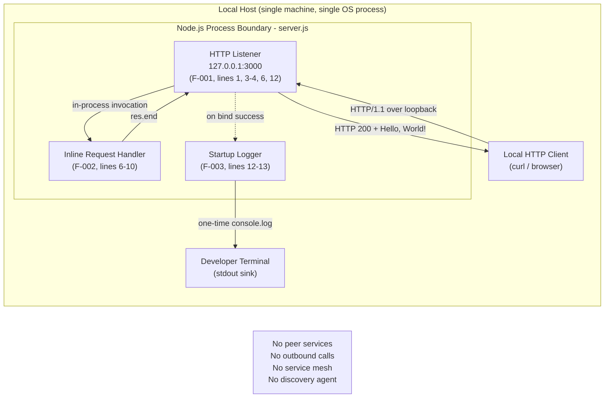

### 6.1.2 Service Components — Not Applicable

The section-prompt sub-topics under "Service Components" presuppose a multi-service or distributed deployment. Because this system contains only one Node.js process with no outbound coupling, each sub-topic resolves to "not applicable." The three logical responsibilities identified in `server.js` — HTTP Listener (F-001), Request Handler (F-002), and Startup Logger (F-003) — are **inline code sections within a single CommonJS module**, sharing a single event loop and a single process address space; they are not services in any architectural sense.

#### 6.1.2.1 Service Boundaries and Responsibilities

There are no service boundaries. The three logical responsibilities are colocated in a single source file with no inter-module contracts, no IPC channels, and no network edges between them. Their interactions occur entirely as function-call invocations within the same JavaScript event loop.

| Required Sub-Topic | Applicability | Evidence |
|---------------------|---------------|----------|
| Service boundaries | Not applicable | Single process, single file; logical components are inline blocks within `server.js`, not separate services |
| Service responsibilities | Demarcated as logical roles only | F-001 binds the listener; F-002 produces the static response; F-003 emits the startup line — all within one event loop |
| Multi-service decomposition | Not applicable | "There is no modular decomposition: all behavior — module import, configuration constants, server instantiation, request handling, and startup logging — is contained within the same 14-line source file" |
| Bounded contexts / domains | Not applicable | The system has no domain model; the response body is a compile-time literal with no entities |

#### 6.1.2.2 Inter-Service Communication Patterns

There is no inter-service communication. The system performs no integrations: it does not invoke external APIs, does not consume messages from queues, does not connect to databases, does not authenticate against identity providers, and does not publish telemetry. Its only outbound channel is a single `console.log` invocation that emits one line to stdout during startup.

| Communication Pattern | Posture in This System |
|------------------------|------------------------|
| Synchronous service-to-service (REST/gRPC) | Not present; no outbound HTTP client, no gRPC stub, no SDK imports |
| Asynchronous messaging (queue/broker) | Not present; no Kafka, RabbitMQ, NATS, SQS, or Pub/Sub client |
| Event streaming / pub-sub | Not present; no event-bus client |
| Webhooks / callbacks | Not present; no outbound HTTP callback logic |

#### 6.1.2.3 Service Discovery Mechanisms

No service discovery exists. The system has no peer services to discover, and configuration is hardcoded rather than resolved at runtime. There is no Consul agent, no etcd client, no DNS-SD usage, no Kubernetes Service object, and no environment-variable lookup. The bind hostname (`127.0.0.1`) and TCP port (`3000`) are inline literal constants in source code (lines 3–4 of `server.js`), with zero `process.env` references and zero configuration files.

#### 6.1.2.4 Load Balancing Strategy

No load balancing strategy exists. Horizontal scaling is precluded because loopback binding (`127.0.0.1`) prevents reachability from peer hosts or a load balancer. With only one process bound to a non-routable interface, no upstream load balancer can route traffic to the server, and no second instance could be reached if one were started.

#### 6.1.2.5 Circuit Breaker, Retry, and Fallback Mechanisms

All three resilience primitives are explicitly absent. The cross-cutting-concerns section enumerates "Absent Recovery Mechanisms" including "Retry strategies (immediate, exponential backoff, jittered)," "Circuit-breaker or bulkhead patterns," and "Fallback or degraded-mode responses." Because no outbound calls are made, there is no failure mode that retry or circuit-breaker logic could mitigate; because the response is a single compile-time literal, there is no degraded payload that a fallback could substitute.

| Recovery Primitive | Status | Architectural Reason |
|--------------------|--------|----------------------|
| Retry (immediate / backoff / jittered) | Absent | No outbound calls exist to retry |
| Circuit breaker | Absent | No remote dependency exists to isolate |
| Bulkhead | Absent | No resource pool to partition; single event loop |
| Fallback / degraded mode | Absent | Single static response; no alternative payload defined |

### 6.1.3 Scalability Design — Not Applicable

The section-prompt sub-topics under "Scalability Design" assume the existence of multiple instances, an orchestrator, and a metrics pipeline to inform auto-scaling decisions. None of these exist in this repository. The implementation is constrained to a single Node.js event loop with no capacity-management surface.

#### 6.1.3.1 Horizontal and Vertical Scaling Approach

Vertical scaling is constrained to a single Node.js event loop; the `cluster` module and worker threads are not used. Horizontal scaling is not supported because loopback binding (`127.0.0.1`) prevents reachability from peer hosts or a load balancer. Combined, these two constraints mean that the system cannot be scaled out across cores, hosts, or zones using only the mechanisms present in source.

```mermaid
flowchart TB
    subgraph SingleHost["Single Host - Sole Deployment Topology"]
        subgraph SingleProc["Single Node.js Process"]
            EventLoop["Single Event Loop<br/>(no cluster, no worker threads)"]
            BoundSocket["Loopback Socket<br/>127.0.0.1:3000"]
            EventLoop --- BoundSocket
        end
    end
    PeerHost["Any Peer Host"] -. blocked by loopback bind .-> BoundSocket
    LoadBalancer["External Load Balancer"] -. blocked by loopback bind .-> BoundSocket
    SecondCore["Additional CPU Cores"] -. unused by event loop .-> EventLoop
    NoteAbsent["Auto-scaling triggers: NONE<br/>Cluster module: NOT USED<br/>Worker threads: NOT USED<br/>Process supervisor: NOT PRESENT"]
```

#### 6.1.3.2 Auto-Scaling Triggers and Rules

No auto-scaling triggers, rules, or controllers exist. The repository contains no Kubernetes manifests, no Horizontal Pod Autoscaler definition, no AWS Auto Scaling configuration, no Cloud Run scaling parameters, and no equivalent infrastructure-as-code artifact. The deployment surface is empty: there is no `Dockerfile`, no `docker-compose.yml`, no Kubernetes manifests, and no CI/CD definitions. Furthermore, no metrics are emitted by the application that could feed a scaling controller: there is no metrics exporter, no tracing instrumentation, and no health endpoint.

#### 6.1.3.3 Resource Allocation Strategy

No resource allocation strategy is declared. Connection limits inherit Node.js defaults; no explicit `maxConnections`, `keep-alive`, or backpressure tuning is configured. No CPU or memory bounds are declared in source, no container resource requests or limits are present, and no ulimit settings are configured.

| Resource Dimension | Declared Allocation | Effective Posture |
|---------------------|---------------------|--------------------|
| CPU cores | None declared | Bounded to a single event loop on whichever CPU the OS schedules |
| Memory | None declared | Inherits Node.js V8 defaults |
| TCP connections | None declared | Inherits Node.js `http` server defaults |
| File descriptors | None declared | Inherits OS process defaults |

#### 6.1.3.4 Performance Optimization Techniques

No application-layer performance optimization techniques are implemented. No response cache, no compression middleware, no keep-alive tuning, no content-encoding negotiation, and no preallocated response buffer exist. The handler is already maximally minimal: it performs three property assignments and one `res.end` call on a 14-byte compile-time literal, completing within a single event-loop tick with no I/O.

| Optimization Technique | Status | Reason |
|------------------------|--------|--------|
| Response caching | Not present | Payload is a static literal with no variance |
| Compression (gzip/br) | Not present | No middleware; 14-byte payload is below any meaningful threshold |
| Connection keep-alive tuning | Default only | No explicit `keepAliveTimeout` or socket tuning configured |
| Asynchronous offload (worker_threads) | Not present | Handler is synchronous and CPU-trivial |

#### 6.1.3.5 Capacity Planning Guidelines

No capacity-planning guidelines are declared in source. The repository contains no latency target, no throughput target, no availability target, and no startup-time target. No Key Performance Indicators are declared: there is no observability layer, no metrics emission, no health-check endpoint, and no instrumentation. Because no measurable objectives exist, no capacity-planning calculus is meaningful at the artifact level. The only observable performance properties are those naturally bounded by the Node.js event loop and OS networking stack.

### 6.1.4 Resilience Patterns — Not Applicable

The section-prompt sub-topics under "Resilience Patterns" require failure-handling primitives that are explicitly absent. The defining feature of error handling in this system is the complete absence of in-source error handling: there is no `try`/`catch`, no `'error'` event listener on the server or sockets, no `'clientError'` listener, and no SIGINT/SIGTERM handler.

#### 6.1.4.1 Fault Tolerance Mechanisms

No application-layer fault tolerance is implemented. Every conceivable error path falls through to default Node.js or OS behavior, resulting in immediate process termination.

| Error Source | Application-Layer Handling | Effective Disposition |
|--------------|----------------------------|------------------------|
| TCP bind failure (`EADDRINUSE`, `EACCES`) | None — no `'error'` listener attached | Uncaught exception; process exits non-zero |
| Malformed HTTP request (`'clientError'`) | None — no listener attached | Node default: logs to stderr, destroys connection |
| Client disconnects mid-response | None — no listeners on `req` / `res` | Default Node behavior; no custom cleanup |
| `SIGINT` / `SIGTERM` | None — no handler registered | Default termination; no graceful drain |

#### 6.1.4.2 Disaster Recovery Procedures

There are no disaster recovery procedures in this repository, and the architecture inherently does not support classical DR patterns. There are no backups (nothing requires backing up — no database, no file storage, no configuration files, no secrets); no failover (the system is single-process and single-host by design); no restart logic (no process supervisor — PM2, systemd unit, Kubernetes Deployment — is referenced in source or in the repository's deployment surface, which is empty); no state to recover (because no state is persisted); and no runbook (`README.md` contains only the H1 heading, so no operational documentation exists).

The recovery strategy for the system, by default, is for the operator to re-invoke `node server.js`.

#### 6.1.4.3 Data Redundancy Approach

No data redundancy approach exists, because the system has no persistent data. The data is the literal: the response body `Hello, World!\n` is a compile-time string constant embedded in source on line 9 of `server.js`. There are no data stores and no caches: no database client is imported, no in-memory cache structure is allocated, and no file-system reads or writes (beyond the single stdout line) occur. There is no replica set, no read replica, no write-ahead log, no snapshot schedule, and no cross-region storage replication — because there is no datum that could be lost.

#### 6.1.4.4 Failover Configurations

No failover configuration exists. The system is single-process and single-host by design; loopback binding precludes a peer to fail over to. There is no active-passive pair, no active-active fleet, no leader election, and no health probe that a load balancer could use to make a failover decision.

#### 6.1.4.5 Service Degradation Policies

No graceful-degradation or service-degradation policy exists. The handler has zero conditional branches: it always returns the same HTTP 200 response with the same 14-byte body. There is no graceful drain: because `server.close()` is never called in source and no SIGINT/SIGTERM handler is registered, the `Listening → Terminated` transition has no intermediate "Shutting Down" state. The system therefore has only two effective behavioral modes — fully operational or fully terminated — with no middle ground.

#### 6.1.4.6 Resilience Pattern Implementation Diagram (Absence Map)

The diagram below maps every conceivable error source to the absent handler that would normally manage it, terminating in the default Node.js process-exit path. This is the "resilience pattern implementation" required by the section prompt: in this system, every pattern resolves to absence.

```mermaid
flowchart TD
    subgraph ErrorSources["Error Sources"]
        BindErr{{"TCP bind failure<br/>EADDRINUSE / EACCES"}}
        ClientErr{{"Malformed HTTP request<br/>('clientError')"}}
        MidDisc{{"Client disconnects<br/>mid-response"}}
        SigInt{{"SIGINT (Ctrl-C)"}}
        SigTerm{{"SIGTERM<br/>(orchestrator stop)"}}
    end
    subgraph AbsentResiliencePatterns["Absent Resilience Patterns (per ADR-004)"]
        NoTryCatch["No try/catch in source"]
        NoErrListener["No server.on('error', ...)"]
        NoClientErr["No server.on('clientError', ...)"]
        NoSignal["No process.on('SIGINT' / 'SIGTERM')"]
        NoRetry["No retry strategy"]
        NoCircuit["No circuit breaker"]
        NoFallback["No fallback / degraded response"]
        NoSupervisor["No process supervisor<br/>(no PM2, systemd, K8s probe)"]
    end
    BindErr --> NoErrListener
    ClientErr --> NoClientErr
    MidDisc --> NoErrListener
    SigInt --> NoSignal
    SigTerm --> NoSignal
    NoErrListener --> DefaultExit
    NoClientErr --> ConnDestroy["Node default:<br/>stderr log + destroy socket"]
    NoTryCatch --> DefaultExit
    NoSignal --> DefaultExit
    NoRetry -.-> NoOutbound["No outbound calls<br/>nothing to retry"]
    NoCircuit -.-> NoOutbound
    NoFallback -.-> StaticBody["Static 14-byte body<br/>no alternative payload"]
    NoSupervisor -.-> ManualRestart["Operator re-invokes<br/>node server.js"]
    DefaultExit(["Process exits<br/>non-zero status"])
    ConnDestroy --> ContinueListening["Server continues<br/>listening for new requests"]
```

### 6.1.5 Operational Recovery Posture

The system's effective operational posture is summarized below for completeness. None of these constitute a Core Services Architecture; they describe the default behavior of a single-process Node.js script.

| Operational Concern | Effective Posture |
|----------------------|--------------------|
| Restart strategy | Manual: operator re-invokes `node server.js` |
| Failure detection | Operator observation of absent stdout line or non-zero exit |
| Health verification | Manual HTTP probe by the operator (e.g., `curl http://127.0.0.1:3000/`) |
| State recovery | Not applicable — no state is persisted |

### 6.1.6 Cross-References to Related Sections

Because the Core Services Architecture section is not applicable, readers seeking the actual (minimal) operational behavior of the system should consult the following sections:

| Topic | Authoritative Section |
|-------|------------------------|
| Architectural style, principles, and boundary | §5.1 High-Level Architecture |
| Logical component details and lifecycle | §5.2 Component Details |
| Architecture Decision Records (ADR-001 to ADR-004) | §5.3 Technical Decisions |
| Cross-cutting concerns (observability, errors, security) | §5.4 Cross-Cutting Concerns |
| Scalability constraints and security posture | §2.4 Implementation Considerations |
| Integration surface and absent integration categories | §4.6 Integration Workflows |
| Scope inclusions and exclusions | §1.3 Scope |

### 6.1.7 References

#### Files Examined

- `server.js` — Sole executable source file (14 lines). Confirmed: zero third-party dependencies, single inline request handler, hardcoded `127.0.0.1:3000` bind, no `'error'` listener, no `'clientError'` listener, no SIGINT/SIGTERM handler, no `server.close()` invocation, single `console.log` line, no `cluster` module, no worker threads.
- `README.md` — Sole documentation file (1 line). Confirmed: no operational guidance, no service-related architecture notes, no runbook content.

#### Repository Structure

- Repository root — Confirmed only `server.js` and `README.md` exist at the root with no subdirectories. No `src/`, `lib/`, `app/`, `services/`, `microservices/`, `infra/`, `k8s/`, `docker/`, `tests/`, or other architectural folders are present.

#### Technical Specification Sections Cross-Referenced

- §1.2 System Overview — Confirms "The system performs no integrations" and the single-capability shape.
- §1.3 Scope — Enumerates out-of-scope items including clustering, multi-process scaling, health checks, deployment configuration, automated tests, and TLS.
- §2.4 Implementation Considerations — Provides explicit scalability constraints (§2.4.3), performance posture (§2.4.2), and technical constraints (§2.4.1).
- §4.6 Integration Workflows — Documents the integration surface inventory and enumerates the categories absent by design.
- §5.1 High-Level Architecture — Establishes the "single-process, single-threaded, monolithic CommonJS script" architectural style and the single-direction integration property.
- §5.2 Component Details — Documents the three logical components (HTTP Listener, Request Handler, Startup Logger), their attributes, and the server-lifecycle state machine.
- §5.3 Technical Decisions — Records ADR-001 through ADR-004, which collectively preclude a Core Services Architecture.
- §5.4 Cross-Cutting Concerns — Provides the "Absent Recovery Mechanisms" inventory and the disaster-recovery non-applicability rationale.

## 6.2 Database Design

### 6.2.1 Applicability Determination

**Database Design is not applicable to this system.**

The repository under specification has **no database, no persistent storage, and no data persistence layer of any kind**. As recorded in §3.5, "The system has no persistence layer of any kind," and as recorded in §2.6.2, "No persistence guarantees — No storage layer of any kind exists." The system handles only a single 14-byte compile-time string literal (`Hello, World!\n`) embedded on line 9 of `server.js`; it therefore has no data to model, no schema to design, no records to index, no tables to partition, no replicas to configure, and no rows to back up.

Every architectural property typically discussed under "Database Design" — entity-relationship modeling, indexing strategy, partitioning, replication, backup architecture, migration tooling, versioning, archival, retention, audit, query optimization, connection pooling, read/write splitting, and batch processing — is either inapplicable or explicitly absent from the codebase by deliberate design. The subsections below itemize each sub-topic from the section prompt and demonstrate, with source-level evidence, why each one does not apply.

#### 6.2.1.1 Repository Composition Anchoring the Determination

The repository contains exactly two artifacts at the root level and zero subdirectories. Neither artifact contains a database driver, a schema definition, a migration file, a connection string, or any equivalent persistence-layer construct.

| Artifact | Size | Persistence-Layer Content |
|----------|------|----------------------------|
| `server.js` | 14 lines | None — only `require('http')` is imported; no database driver, no `fs` operations, no `process.env` reads |
| `README.md` | 1 line | None — file contains only the H1 heading `# march_repo_hello_world` |
| Subdirectories (`db/`, `migrations/`, `models/`, `schemas/`, `seeds/`) | Absent | None — no such folders exist anywhere in the repository |
| Dependency manifests (`package.json`, lockfile) | Absent | None — zero third-party dependencies; no ORM, driver, or client library can be present |

#### 6.2.1.2 Source-Level Evidence of Persistence Absence

The complete behavior of `server.js` precludes any data persistence:

- **Line 1** imports only the Node.js `http` core module. No `mongodb`, `pg`, `mysql`, `mysql2`, `sqlite3`, `redis`, `ioredis`, `mongoose`, `sequelize`, `prisma`, or `typeorm` import exists.
- **The `fs` module is never imported.** No file-system reads or writes occur (beyond the single `console.log` stdout emit at startup, which is not a persistence operation).
- **Lines 3–4** hardcode `hostname` and `port` as inline literal constants. No `process.env` reads are performed; therefore no database connection string, no DSN, and no credential is ever resolved at runtime.
- **Lines 6–10** contain the inline request handler, which never reads `req.url`, `req.method`, `req.headers`, or any request body. The response body is a compile-time string literal on line 9.
- **No module-scope mutable state exists.** No array, map, object, or other in-memory data structure accumulates data across requests; the handler is byte-deterministic across every invocation.

#### 6.2.1.3 Persistence-Layer Absence Map

Because Database Design is not applicable, the customary database schema diagram is replaced with an **absence map** that visualizes every database concern from the section prompt and the absent artifact that would normally implement it. This convention follows the precedent established in §6.1.4.6 (Resilience Pattern Absence Map).

```mermaid
flowchart TB
    subgraph ProcessBoundary["Node.js Process Boundary - server.js (14 lines)"]
        OnlyImport["require('http')<br/>only core module imported<br/>(line 1)"]
        StaticBody["Response body literal<br/>'Hello, World!\n'<br/>(line 9, 14 bytes)"]
        Handler["Inline request handler<br/>(lines 6-10)<br/>no state, no I/O"]
        OnlyImport --> Handler
        Handler --> StaticBody
    end
    subgraph AbsentSchemaConstructs["Absent Schema Constructs"]
        NoEntities["No entities<br/>No domain model"]
        NoTables["No tables / collections<br/>No documents"]
        NoIndexes["No indexes<br/>No constraints"]
        NoKeys["No primary keys<br/>No foreign keys"]
    end
    subgraph AbsentStorageDrivers["Absent Storage Drivers"]
        NoSQL["No relational driver<br/>(pg, mysql, sqlite3)"]
        NoDoc["No document driver<br/>(mongodb, mongoose)"]
        NoKV["No key-value client<br/>(redis, ioredis)"]
        NoORM["No ORM / ODM<br/>(sequelize, prisma, typeorm)"]
    end
    subgraph AbsentOperationalConstructs["Absent Operational Constructs"]
        NoMigration["No migration files<br/>No schema version"]
        NoBackup["No backup pipeline<br/>No snapshot job"]
        NoReplica["No replica<br/>No read replica"]
        NoPool["No connection pool<br/>No DSN"]
    end
    Handler -. would normally bind .-> AbsentSchemaConstructs
    OnlyImport -. would normally include .-> AbsentStorageDrivers
    StaticBody -. would normally derive from .-> AbsentOperationalConstructs
    Note["Determination: Database Design is NOT APPLICABLE<br/>per §3.5, §2.6.2, §5.1.3, §5.4.6"]
```

### 6.2.2 Schema Design — Not Applicable

The section-prompt sub-topics under "Schema Design" presuppose the existence of a data model and a backing store. Because this system has neither, every sub-topic resolves to "not applicable." This subsection itemizes each required sub-topic and provides the source-level justification for non-applicability.

#### 6.2.2.1 Entity Relationships

No entity relationships exist. The system has no domain model: per §1.3.1, "Data Domains Included — None — the system handles no user data, no persistent data, and no domain entities." There are no entities to relate, no parent-child relationships, no many-to-many associations, and no aggregate roots. A canonical Entity-Relationship Diagram is therefore not constructible; the schema is empty.

| ERD Construct | Presence in This System | Reason |
|---------------|--------------------------|--------|
| Entities | None | No domain model implemented; no nouns are persisted |
| Attributes | None | No fields, columns, or properties are defined |
| Relationships | None | No entities exist that could participate in a relationship |
| Cardinalities (1:1, 1:N, M:N) | None | No relationships to constrain |

#### 6.2.2.2 Data Models and Structures

No data models or structures exist. The only piece of "data" handled by the system is the response body — a compile-time 14-byte string literal `Hello, World!\n` embedded directly on line 9 of `server.js`. This literal is not a model: it has no schema, no fields, no validation rules, and no transformation logic. Per §5.1.3, "The response body is a compile-time string literal embedded directly in source; no parsing, validation, serialization, deserialization, mapping, or enrichment occurs anywhere in the request path."

| Data Modeling Construct | Status | Evidence |
|--------------------------|--------|----------|
| Logical model | None | No conceptual entities defined |
| Physical model | None | No tables, collections, or documents declared |
| Data types / domains | None | No typed fields beyond the JavaScript `string` literal |
| Serialization format (JSON, Protobuf, Avro) | None | The response is raw bytes with `Content-Type: text/plain` |

#### 6.2.2.3 Indexing Strategy

No indexing strategy exists. There is no data store to index, no query patterns to optimize, and no read/write profile to balance. No primary key indexes, secondary indexes, composite indexes, full-text indexes, geospatial indexes, or unique constraints are declared anywhere in the codebase. The repository contains zero `CREATE INDEX` statements, zero index definitions in any declarative form, and zero indexing libraries.

| Index Type | Status | Reason |
|------------|--------|--------|
| Primary key index | Not applicable | No tables or collections exist |
| Secondary (B-tree, hash) indexes | Not applicable | No queryable data set exists |
| Composite / covering indexes | Not applicable | No multi-column lookups occur |
| Full-text / geospatial / specialized indexes | Not applicable | No search or spatial query surface |

#### 6.2.2.4 Partitioning Approach

No partitioning approach exists. Per §3.5.1, "Read Replicas / Sharding: Not applicable — No primary database exists." There is no horizontal partitioning (sharding by tenant, by key range, or by hash), no vertical partitioning (column-family splits), and no time-based partitioning. The system has no concept of "rows" that could be partitioned and no growth model that would require partitioning.

#### 6.2.2.5 Replication Configuration

No replication is configured. There is no primary/replica topology, no multi-leader cluster, no leaderless quorum (Dynamo-style), no Change Data Capture pipeline, and no log-based replication. The system is, per §5.1.1, "a single-process, single-threaded, monolithic CommonJS script" bound to `127.0.0.1:3000` — a loopback interface that precludes peer reachability. Even at the process level there is no replica: no `cluster` module is used, no worker threads are spawned, and no process supervisor (PM2, systemd, Kubernetes Deployment) exists in the repository's deployment surface, which is empty.

| Replication Construct | Status | Evidence |
|------------------------|--------|----------|
| Primary / replica pair | None | No data store; loopback binding precludes peer reachability (§5.1.1) |
| Multi-leader / leaderless cluster | None | Single-process, single-host architecture (§6.1.3.1) |
| Synchronous (semi-sync) vs. asynchronous replication | Not applicable | No replication stream exists |
| Change Data Capture (Debezium, logical decoding) | None | No upstream data store to capture changes from |

#### 6.2.2.6 Backup Architecture

No backup architecture exists. As stated in §5.4.6, "**No backups: Nothing in the system requires backing up — no database, no file storage, no configuration files, no secrets.**" There is no snapshot schedule, no point-in-time recovery (PITR) configuration, no Write-Ahead Log archive, no off-host backup target, and no cross-region backup replication. The closest analog to a "backup" in this system is the source code itself, which is preserved by the developer's version control mechanism (outside the application's scope).

| Backup Construct | Status | Reason |
|------------------|--------|--------|
| Snapshot / dump schedule | None | No data exists to snapshot |
| Point-in-Time Recovery (PITR) | None | No transactional log to replay |
| Backup retention window | Not applicable | No backups produced |
| Backup storage target (S3, GCS, Azure Blob) | None | No object storage client imported (§5.1.4) |

#### 6.2.2.7 Replication Architecture Diagram — Single-Process Topology

Because there is no data tier and no replica set, the customary "Replication Architecture" diagram is replaced with the **single-process topology** that describes the system's actual deployment shape. This diagram intentionally shows the absence of every replication construct: there is no primary, no replica, no failover target, and no data layer at any tier.

```mermaid
flowchart LR
    subgraph SingleHost["Single Host - Sole Deployment Topology"]
        subgraph SoleProcess["Sole Node.js Process - server.js"]
            EventLoop["Single Event Loop<br/>(no cluster, no worker threads)"]
            InlineLiteral["Response body: compile-time literal<br/>'Hello, World!\n' on line 9"]
            LoopbackSocket["Loopback socket<br/>127.0.0.1:3000"]
            EventLoop --- LoopbackSocket
            EventLoop --- InlineLiteral
        end
    end
    AbsentPrimary["Absent: Primary database"] -. would replicate to .-> AbsentReplica["Absent: Read replica(s)"]
    AbsentReplica -. would synchronize via .-> AbsentWAL["Absent: WAL / replication stream"]
    AbsentBackup["Absent: Backup pipeline"] -. would snapshot from .-> AbsentPrimary
    AbsentFailover["Absent: Failover target"] -. would promote via .-> AbsentReplica
    SoleProcess -. neither produces nor consumes .-> AbsentPrimary
    SoleProcess -. neither produces nor consumes .-> AbsentBackup
    Note["No peers, no replicas, no shards.<br/>The 'data' is the inline string literal on line 9."]
```

### 6.2.3 Data Management — Not Applicable

The section-prompt sub-topics under "Data Management" presuppose a managed lifecycle for stored data. Because no data is ever stored, every sub-topic resolves to "not applicable." Each required sub-topic is addressed below.

#### 6.2.3.1 Migration Procedures

No migration procedures exist. There is no schema to migrate, no migration tool (Flyway, Liquibase, Alembic, Knex migrations, Sequelize migrations, Prisma Migrate, TypeORM migrations), no `migrations/` directory in the repository, and no migration scripts in any form. Schema evolution is not a concept that applies, because no schema exists in the first place.

| Migration Concern | Status | Evidence |
|--------------------|--------|----------|
| Forward migrations | Not applicable | No schema to evolve |
| Rollback migrations | Not applicable | No prior schema state to revert to |
| Migration tooling | None | No migration library imported; no `package.json` exists |
| Migration history table | None | No metadata store exists |

#### 6.2.3.2 Versioning Strategy

No data versioning strategy exists. There is no schema-versioning column, no record-versioning approach (event-sourced, append-only, temporal tables), no entity-tag or `If-Match`-style optimistic concurrency control, and no API-level data contract version. The response body is a static literal whose content is fixed at compile time; the concept of "data versioning" is therefore vacuous in this system.

#### 6.2.3.3 Archival Policies

No archival policies exist. No data is generated, accumulated, or aged out, because no data is ever stored. There is no cold-tier storage target, no archive bucket lifecycle policy, no retention window after which data is moved to archive, and no archival format (Parquet, ORC, Avro snapshot). The repository contains zero archival tooling and zero references to long-term storage.

#### 6.2.3.4 Data Storage and Retrieval Mechanisms

No data storage or retrieval mechanisms exist. Per §5.1.3, "There are **no data stores and no caches** in this system... no database client is imported; no in-memory cache structure is allocated; no `fs` reads or writes (beyond the single stdout line) occur." The response body is retrieved by referencing a compile-time string literal at line 9; this is a JavaScript constant lookup, not a data retrieval operation in any meaningful sense.

| Retrieval Mechanism | Status | Evidence |
|---------------------|--------|----------|
| SQL `SELECT` queries | None | No SQL engine; no driver |
| Document `find` operations | None | No document database client |
| Key-value `GET` operations | None | No KV store client |
| File-system reads | None | `fs` module is not imported |
| HTTP-API reads of remote resources | None | No outbound HTTP client (§5.1.4) |

#### 6.2.3.5 Caching Policies

No caching policies exist. Per §3.5.2, every caching tier is "Not used": in-process cache, distributed cache (Redis, Memcached), HTTP response cache (no `Cache-Control` header is set), and CDN caching. The 14-byte response body is already minimal and statically embedded in source; per §3.5.2, "The response payload is a hardcoded literal embedded directly in the source file; consequently, no caching tier is required to amortize storage or computation cost."

| Cache Tier | Status | Evidence |
|------------|--------|----------|
| In-process LRU / TTL cache | None | No `Map`, `Set`, or cache library allocated at module scope (§3.5.2) |
| Distributed cache (Redis, Memcached) | None | No client library imported (§5.1.4) |
| HTTP response cache headers | None | No `Cache-Control`, `ETag`, or `Last-Modified` set in handler |
| CDN caching | None | No CDN integration; loopback-only deployment (§3.5.2) |

#### 6.2.3.6 Effective Data Flow Diagram

Because the system has no persistence layer, the customary "Data Flow Diagram" depicts the **actual** minimal data flow: an HTTP request entering the loopback socket, being processed by a stateless inline handler that references a compile-time literal, and producing an HTTP response. **No database interaction occurs at any point in this flow**, as confirmed by §5.1.3.

```mermaid
flowchart LR
    subgraph LocalHostBoundary["Local Host"]
        Client["Local HTTP Client<br/>(curl / browser)"]
        subgraph ServerProcess["Node.js Process - server.js"]
            Socket["Loopback TCP socket<br/>127.0.0.1:3000"]
            Parser["Node http parser<br/>builds req / res"]
            HandlerFn["Inline (req, res) handler<br/>4 synchronous statements<br/>req fields never read"]
            Literal["Compile-time literal<br/>'Hello, World!\n'<br/>line 9 of server.js"]
            Socket --> Parser
            Parser --> HandlerFn
            HandlerFn --> Literal
            Literal --> HandlerFn
            HandlerFn --> Socket
        end
        Stdout["Developer terminal<br/>(stdout)"]
    end
    Client -->|HTTP/1.1 request<br/>any method, any path| Socket
    Socket -->|HTTP 200 + 14 bytes| Client
    ServerProcess -. one-time startup line .-> Stdout
    NoDB["Absent at every step:<br/>No SQL, no document store,<br/>no KV cache, no file I/O,<br/>no ORM, no migration"]
```

### 6.2.4 Compliance Considerations — Not Applicable

The section-prompt sub-topics under "Compliance Considerations" presuppose the existence of regulated, sensitive, or auditable data. The system handles none. Per §1.3.1, the system has no "user data, no persistent data, and no domain entities; the only data exchanged is the constant outbound string `Hello, World!\n`." Each required sub-topic is addressed below.

#### 6.2.4.1 Data Retention Rules

No data retention rules exist. No data is collected, processed, or stored — therefore no retention window, no minimum-retention obligation (regulatory), and no maximum-retention obligation (privacy) applies. The system is outside the scope of data-retention frameworks such as GDPR Article 5(1)(e), HIPAA §164.530(j), or PCI-DSS Requirement 3.1, because none of these regimes have a subject of regulation in this system.

#### 6.2.4.2 Backup and Fault Tolerance Policies

No backup or fault tolerance policies exist. As recorded in §5.4.6, "No backups: Nothing in the system requires backing up — no database, no file storage, no configuration files, no secrets." Fault tolerance for stored data is vacuous because no data is stored; the only "data" — the compile-time literal on line 9 — is preserved by the source code itself, which is outside the application's runtime scope. Per §6.1.4.3, "no replica set, no read replica, no write-ahead log, no snapshot schedule, and no cross-region storage replication — because there is no datum that could be lost."

#### 6.2.4.3 Privacy Controls

No privacy controls exist, because the system collects, processes, and stores **no personal data**. There is no PII, no PHI, no payment data, no biometric data, no behavioral data, and no telemetry. The request body is never read; request headers are never logged; the source IP is never recorded; and no cookies, session identifiers, or tracking tokens are set. The system is, by construction, privacy-neutral: it cannot violate a privacy regime because it does not interact with any subject of one.

| Privacy Control Surface | Posture |
|--------------------------|---------|
| PII collection | None — `req.url`, `req.headers`, and request body are never read (§5.1.3) |
| PII storage | None — no persistence layer of any kind (§3.5) |
| Encryption at rest | Not applicable — no data at rest |
| Encryption in transit | None at the application layer — no TLS termination in source; mitigated by loopback-only binding (§5.4.4) |

#### 6.2.4.4 Audit Mechanisms

No data-access audit mechanisms exist. There is no audit log table, no append-only audit ledger, no integration with an audit-log sink (e.g., CloudTrail, Cloud Audit Logs, Splunk), and no per-request access log. The system's complete observability surface is a single `console.log` line at startup (§5.4.2), which records server startup — not data access — because no data accesses occur. Per §5.4.2, "Exactly one `console.log` invocation occurs during the entire process lifetime."

| Audit Construct | Status | Evidence |
|------------------|--------|----------|
| Per-request access log | None — request fields are never read (§5.1.3) | No `req.url`, `req.method`, `req.headers` references in source |
| Data-modification audit | Not applicable | No data exists to modify |
| Audit log immutability / WORM storage | None | No audit destination configured |
| External audit sink integration | None | No outbound integrations (§5.1.4) |

#### 6.2.4.5 Access Controls

No data-access controls exist. Per §5.4.4, the system implements "no authentication and no authorization framework" — there is no identity layer, no tokens, no sessions, no role-based access control, no attribute-based access control, no row-level security, and no column masking. The architectural justification is twofold: (1) the system has no data resources that require protection — every request produces the same public 14-byte response, and (2) the loopback-only network boundary ensures that only processes running on the same host can reach the server, making the host's process-isolation primitives the effective access-control mechanism.

| Access-Control Construct | Status | Evidence |
|---------------------------|--------|----------|
| Authentication (passwords, tokens, MFA) | None | No identity layer (§5.4.4) |
| Authorization (RBAC, ABAC) | None | No protected resources to authorize |
| Row-level / column-level security | Not applicable | No tables, no rows, no columns |
| Network-level access boundary | Loopback binding `127.0.0.1` | Effective ACL is host process boundary (§5.4.4) |

### 6.2.5 Performance Optimization — Not Applicable

The section-prompt sub-topics under "Performance Optimization" presuppose a data tier that must be tuned for throughput, latency, and concurrency. Because no data tier exists, each performance-optimization concern resolves to "not applicable." The handler is already maximally minimal — per §6.1.3.4, it "performs three property assignments and one `res.end` call on a 14-byte compile-time literal, completing within a single event-loop tick with no I/O."

#### 6.2.5.1 Query Optimization Patterns

No query optimization patterns apply. There are no queries — neither SQL, nor MQL (MongoDB Query Language), nor Cypher (Neo4j), nor any other query language. There are no `EXPLAIN` plans to inspect, no slow-query logs to analyze, no covering indexes to design, no join-order heuristics to tune, no statistics to collect, and no query planners to influence. The "response generation" path is a fixed-cost dereference of a JavaScript string literal followed by a write to a TCP socket.

#### 6.2.5.2 Caching Strategy

No caching strategy exists. Per §3.5.2, every caching tier — in-process, distributed, HTTP response, and CDN — is "Not used." There is no read-through cache, no write-through cache, no write-behind cache, no cache-aside pattern, and no TTL/eviction policy. Per §6.1.3.4, "Response caching: Not present — Payload is a static literal with no variance." Caching is structurally meaningless when the source data is already a compile-time constant.

#### 6.2.5.3 Connection Pooling

No connection pooling exists. The system establishes no outbound connections of any kind: no database connection, no cache connection, no message-broker connection, no upstream HTTP connection. There is therefore no pool to size, no minimum/maximum connection count to configure, no pool-acquisition timeout to tune, and no connection-leak detection to implement. The only sockets the system touches are inbound HTTP connections terminated by Node's `http` server, whose lifecycle is managed by the Node.js core runtime using its built-in defaults (§6.1.3.3).

| Pool Dimension | Status | Reason |
|----------------|--------|--------|
| Database connection pool | None | No outbound database connection (§5.1.4) |
| Cache client pool | None | No outbound cache connection |
| HTTP-client (outbound) pool | None | No outbound HTTP client (§5.1.4) |
| Inbound socket configuration | Node.js defaults | No explicit `maxConnections` or keep-alive tuning (§6.1.3.3) |

#### 6.2.5.4 Read/Write Splitting

No read/write splitting exists. There are no reads to direct to a replica and no writes to direct to a primary, because there is no data store. The system performs zero CRUD operations of any kind: no `INSERT`, `UPDATE`, `DELETE`, or `SELECT`; no `db.collection.insertOne` or `find`; no `SET` or `GET`. The "operation" on each inbound HTTP request is a pure compute: emit a 14-byte literal — neither a read nor a write against any persistent system.

#### 6.2.5.5 Batch Processing Approach

No batch processing approach exists. There is no batch ingestion job, no nightly ETL pipeline, no scheduled cron task, no message-batch consumer, and no map-reduce computation. The system processes inbound HTTP requests one at a time, in the order they are dispatched by the Node.js event loop; there is no batching boundary, no flush interval, and no batch size. Per §1.2 and §5.1.4, the system has no integration with any batch-processing infrastructure (no SQS/SNS batches, no Kafka consumer groups, no AWS Batch jobs, no Spark jobs).

### 6.2.6 Cross-References to Related Sections

Because the Database Design section is not applicable, readers seeking authoritative documentation of the system's actual (minimal) data-handling behavior should consult the following sections:

| Topic | Authoritative Section |
|-------|------------------------|
| Persistence absence inventory (all DB / cache / file categories) | §3.5 Databases & Storage |
| In-scope and out-of-scope data domains | §1.3 Scope |
| Inherited "no persistence guarantees" constraint | §2.6 Assumptions and Constraints |
| Data flow description (no data stores, no transformations) | §5.1 High-Level Architecture |
| Per-component "Data persistence: None" attestation | §5.2 Component Details |
| Disaster recovery — "no backups: nothing requires backing up" | §5.4 Cross-Cutting Concerns |
| Data-redundancy non-applicability rationale | §6.1 Core Services Architecture |
| Explicitly absent integration categories (drivers, ORMs, cache clients) | §5.1 High-Level Architecture (§5.1.4) |

### 6.2.7 References

#### Files Examined

- `server.js` — Sole executable source file (14 lines). Confirmed: only `require('http')` is imported (line 1); no database driver, no ORM, no cache client, no `fs` module reference; `process.env` is never read; `req` fields are never inspected; response body is a compile-time string literal `'Hello, World!\n'` on line 9; no module-scope mutable state; no persistence operation of any kind.
- `README.md` — Sole documentation file (1 line containing only the H1 heading `# march_repo_hello_world`). Confirmed: no schema documentation, no migration guide, no data-model notes, no operational data-handling guidance.

#### Repository Structure

- Repository root — Confirmed only `server.js` and `README.md` exist at the root with no subdirectories. No `db/`, `migrations/`, `models/`, `schemas/`, `seeds/`, `prisma/`, `sequelize/`, or any other database-related folder exists. No `package.json`, lockfile, or `node_modules/` is present, precluding the indirect presence of any database driver.

#### Technical Specification Sections Cross-Referenced

- §1.2 System Overview — Confirms "does not connect to databases" as part of the integration posture.
- §1.3 Scope — Enumerates "Data Domains Included: None" and explicitly lists "Database or persistence layer: No database driver, no file-system writes, no caching layer" as out-of-scope.
- §2.6 Assumptions and Constraints — Documents the inherited constraint "No persistence guarantees — No storage layer of any kind exists."
- §3.5 Databases & Storage — Provides the exhaustive enumeration of every database category (relational, document, key-value, time-series, graph), every caching tier (in-process, distributed, HTTP response, CDN), and every object/file storage option, all marked "Not used" with source-level evidence; states that "the data persistence strategy is, by design, the absence of persistence."
- §5.1 High-Level Architecture — Provides the data flow description confirming "no data stores and no caches" and "no data transformation points"; enumerates explicitly absent integrations including database drivers, ORMs, cache clients, and object-storage clients.
- §5.2 Component Details — Per-component confirmation that each of the three logical components (HTTP Listener, Request Handler, Startup Logger) has "Data persistence: None."
- §5.4 Cross-Cutting Concerns — Provides the disaster-recovery non-applicability rationale: "No backups: Nothing in the system requires backing up — no database, no file storage, no configuration files, no secrets"; confirms the absence of an authentication/authorization framework.
- §6.1 Core Services Architecture — Provides the immediate precedent pattern for "Not Applicable" sections, including §6.1.4.3 "Data Redundancy Approach" which states "No data redundancy approach exists, because the system has no persistent data."

## 6.3 Integration Architecture

### 6.3.1 Applicability Determination

**Integration Architecture is not applicable for this system.**

The repository under specification implements a single-process, single-threaded, monolithic Node.js script consisting of 14 lines of source code in a single file (`server.js`) with zero third-party dependencies. Per §1.2.1, "It does not invoke external APIs, does not consume messages from queues, does not connect to databases, does not authenticate against identity providers, and does not publish telemetry." The system therefore has no API gateway, no authentication layer, no authorization framework, no rate-limiting middleware, no API versioning surface, no API documentation artifact, no message broker, no stream processor, no batch processor, no third-party SDK, no legacy interface, and no external service contract.

Every architectural property typically discussed under "Integration Architecture" — protocol specifications, authentication methods, authorization frameworks, rate-limiting strategies, API versioning, documentation standards, event processing patterns, message queue architectures, stream processing designs, batch processing flows, integration error handling, third-party patterns, legacy interfaces, API gateways, and external service contracts — is either inapplicable or explicitly absent from the codebase by deliberate design. The subsections below itemize each sub-topic from the section prompt and demonstrate, with source-level evidence, why each one does not apply. This determination follows the precedent established in §6.1 (Core Services Architecture — Not Applicable) and §6.2 (Database Design — Not Applicable).

#### 6.3.1.1 Repository Composition and Architectural Decisions

The repository contains exactly two artifacts at the root level and zero subdirectories. Neither artifact contains a client SDK, an OpenAPI specification, a broker driver, a gateway configuration file, or any equivalent integration construct.

| Artifact | Size | Integration-Layer Content |
|----------|------|---------------------------|
| `server.js` | 14 lines | Only `require('http')` is imported (line 1); no outbound HTTP client, no SDK, no broker driver, no auth library |
| `README.md` | 1 line | None — file contains only the H1 heading `# march_repo_hello_world` |
| Subdirectories (`api/`, `routes/`, `middleware/`, `integrations/`, `clients/`, `gateway/`) | Absent | No such folders exist anywhere in the repository |
| Dependency manifests (`package.json`, lockfile) | Absent | Zero third-party dependencies; no HTTP client, no auth library, no broker client can be present |

Four Architecture Decision Records ratified for this system collectively preclude the existence of an Integration Architecture (§5.3.6):

| ADR | Decision | Integration-Layer Impact |
|-----|----------|---------------------------|
| ADR-001 | Adopt zero third-party dependencies | Eliminates HTTP clients, SDKs, broker drivers, OAuth libraries, gateway middleware |
| ADR-002 | Bind exclusively to the loopback interface `127.0.0.1` | Precludes external reachability; no upstream load balancer or API gateway can route traffic |
| ADR-003 | Hardcode all configuration | No service-discovery DSNs, no API base URLs, no broker connection strings |
| ADR-004 | Omit in-source error handling | No retry logic, no circuit breakers, no dead-letter routing |

#### 6.3.1.2 Source-Level Evidence of Integration Absence

The complete behavior of `server.js` precludes any classical integration pattern:

- **Line 1** imports only the Node.js `http` core module. No `https`, no `fetch` polyfill, no SDK, no broker client, no OAuth library, no `fs`, no `process.env` access exists anywhere in source.
- **The handler (lines 6–10) never inspects `req`.** Per §5.1.3 and §2.4.4, `req.url`, `req.method`, `req.headers`, and the request body are never read. There is therefore no URL routing, no method differentiation, no content negotiation, no authentication header processing, no body parsing, and no request validation.
- **No outbound network call is made.** Per §3.4.1, every category of outbound integration — REST clients, GraphQL clients, webhooks, message brokers, email/SMS providers, payment processors, search services — is marked "Not used" with source-level evidence.
- **No middleware is configured.** Per §5.3.5, "No middleware is configured; reliance is solely on the loopback boundary." There is no router, no auth middleware, no rate limiter, no logger middleware.
- **The response is byte-identical for every request.** Per §5.3.5, "All requests receive the same response regardless of caller identity (which is not inspected)."

#### 6.3.1.3 Integration Surface Inventory

Per §4.6.1, the entire integration surface of the system is exhausted by exactly two endpoints:

| Endpoint | Direction | Protocol |
|----------|-----------|----------|
| `127.0.0.1:3000` HTTP listener | Inbound | HTTP/1.1 over TCP (plain, no TLS) |
| Standard output stream | Outbound | Local I/O (`stdout`) |

#### 6.3.1.4 Integration Flow Diagram

The diagram below is the canonical Integration Surface Diagram (§4.6.2). It satisfies the "Integration flow diagram" requirement of the section prompt by illustrating the only two external interactions the process performs.

```mermaid
flowchart LR
    subgraph ExternalActors["External Actors (Local Host Only)"]
        HttpClient["HTTP Client<br/>e.g., curl, browser"]
        DevConsole["Developer's<br/>Terminal/Console"]
    end
    subgraph ProcessBoundary["Node.js Process Boundary (server.js)"]
        InboundSocket["Inbound HTTP Socket<br/>127.0.0.1:3000<br/>(http.createServer + listen)"]
        HandlerLogic["Static Response Handler<br/>server.js lines 6-10"]
        StdoutStream["Startup Logger<br/>console.log on line 13"]
        InboundSocket --> HandlerLogic
        HandlerLogic --> InboundSocket
    end
    HttpClient -- "HTTP/1.1 Request<br/>(any method, any path)" --> InboundSocket
    InboundSocket -- "HTTP 200<br/>Content-Type: text/plain<br/>Hello, World!" --> HttpClient
    StdoutStream -- "One-line startup confirmation<br/>(F-003)" --> DevConsole
```

### 6.3.2 API Design — Not Applicable

The section-prompt sub-topics under "API Design" presuppose a deliberately designed and documented application programming interface intended for diverse consumers, with negotiated protocols, identity-bound access, and managed evolution. This system exposes only an unauthenticated, undifferentiated, monolithic HTTP endpoint that ignores every aspect of every incoming request. Each required sub-topic is itemized below.

#### 6.3.2.1 Protocol Specifications

The single transport protocol is **plain HTTP/1.1 over TCP**, delivered by the Node.js `http` core module via `http.createServer(...)` (line 6) and `server.listen(port, hostname, ...)` (line 12). No additional protocol surface exists or is configurable in source:

| Protocol Concern | Status | Source Evidence |
|------------------|--------|-----------------|
| HTTPS / TLS | Not present | No `https` module is imported; per §5.3.5, TLS is explicitly out of scope (§1.3.2) |
| HTTP/2 / HTTP/3 | Not present | `http.createServer` produces an HTTP/1.1 server only |
| WebSocket / SSE | Not present | Per §5.3.2, "no upgrade handler is registered; only the default HTTP/1.1 request/response cycle is supported" |
| gRPC / Thrift / GraphQL | Not present | No `grpc`, `apollo`, or equivalent module imported |

The HTTP/1.1 "contract" exposed by the listener is unconditional: per §4.6.3, "The endpoint accepts any HTTP method on any path; no negotiation, validation, or routing occurs," and the response is always status `200` with header `Content-Type: text/plain` and body `Hello, World!\n` (14 bytes).

#### 6.3.2.2 Authentication Methods

**No authentication method is implemented.** Per §5.4.4, the system implements "no authentication and no authorization framework"; there is "no identity layer (no users, no roles, no permissions)," "no tokens (no JWT, no OAuth bearer, no API keys)," and "no sessions or cookies." The handler never reads `req.headers`, so even if a client presented an `Authorization` header, a bearer token, an API key, or a session cookie, no application code would inspect or act upon it.

| Authentication Mechanism | Status | Evidence |
|--------------------------|--------|----------|
| HTTP Basic / Digest | Absent | `req.headers` never read |
| Bearer token (JWT, opaque) | Absent | No token-validation library imported; no signing keys present |
| API key (header or query) | Absent | No key-management surface area (§3.4.2) |
| OAuth 2.0 / OIDC client | Absent | "No identity layer exists; no tokens, sessions, or cookies are handled" (§2.4.4) |
| Mutual TLS (mTLS) | Absent | No `https` module; no certificate material |
| Session cookies | Absent | "No session storage, no cookie handling" (§3.4.2) |

The architectural justification, per §5.4.4, is twofold: (1) "the system has no resources that require protection — every request produces the same public 14-byte response," and (2) "the loopback-only network boundary ensures that only processes running on the same host can reach the server."

#### 6.3.2.3 Authorization Framework

**No authorization framework is implemented.** Per §5.3.5, "All requests receive the same response regardless of caller identity (which is not inspected)." There is no role-based access control, no attribute-based access control, no scopes, no permissions, no policy engine, no decision point, and no enforcement point.

| Authorization Construct | Status | Reason |
|--------------------------|--------|--------|
| Role-Based Access Control (RBAC) | Absent | No roles defined; no identity to attach roles to |
| Attribute-Based Access Control (ABAC) | Absent | No attribute resolver; no policy engine |
| OAuth scopes / claims | Absent | No token introspection or validation |
| Resource-level permissions | Absent | No protected resources — single static response |

#### 6.3.2.4 Rate Limiting Strategy

**No rate-limiting strategy is implemented.** Per §5.3.5, "No middleware is configured; reliance is solely on the loopback boundary." No token-bucket algorithm, no leaky-bucket throttler, no fixed-window counter, no sliding-window log, no client-IP-based quota, and no per-API-key quota exists. The only effective traffic ceiling is whatever a single Node.js event loop can service on the host (§5.4.5), bounded by inherited defaults rather than declared limits.

| Rate-Limiting Construct | Status | Evidence |
|--------------------------|--------|----------|
| Application-layer middleware | Absent | No middleware registered on the server |
| Token / leaky bucket | Absent | No quota library imported |
| Distributed quota (Redis-backed) | Absent | No cache client (§3.4.1) |
| Reverse-proxy throttling | Absent | No proxy or gateway in front of the listener |

#### 6.3.2.5 Versioning Approach

**No versioning approach is implemented.** The handler ignores `req.url` entirely, so URL-prefix versioning schemes (`/v1`, `/v2`) are not realizable; the handler ignores `req.headers`, so `Accept` header versioning and custom `X-API-Version` headers are not realizable; and no schema-version field exists in the response payload, which is a fixed 14-byte literal.

| Versioning Mechanism | Status | Reason |
|----------------------|--------|--------|
| URL-prefix (`/v1`, `/v2`) | Absent | `req.url` never read; same response for every path |
| Header-based (`Accept`, `X-API-Version`) | Absent | `req.headers` never read |
| Media-type (`application/vnd.x.v1+json`) | Absent | Response media type is fixed `text/plain` |
| Schema-versioning field in payload | Absent | Payload is the 14-byte literal `'Hello, World!\n'` |

#### 6.3.2.6 Documentation Standards

**No API documentation standard is followed.** The repository contains no OpenAPI/Swagger document, no GraphQL Schema Definition Language (SDL) file, no API Blueprint, no Postman collection, no RAML specification, no AsyncAPI document, and no Markdown-based reference. The sole documentation artifact is `README.md`, which contains only the H1 heading `# march_repo_hello_world` (§2.4.5).

| Documentation Artifact | Status | Evidence |
|------------------------|--------|----------|
| OpenAPI 3.x / Swagger 2.0 | Absent | No `openapi.yaml`, no `swagger.json` in repository |
| GraphQL SDL (`*.graphql`) | Absent | No GraphQL surface exists |
| API Blueprint / RAML | Absent | No `.apib` or `.raml` files |
| Postman collection | Absent | No `*.postman_collection.json` |
| Markdown API reference | Absent | `README.md` contains only the H1 heading |

#### 6.3.2.7 API Architecture Absence Map

Because API Design is not applicable, the customary "API architecture diagram" is replaced with an **absence map** that visualizes every API concern from the section prompt and the absent artifact that would normally implement it. This convention follows the precedent established in §6.1.4.6 (Resilience Pattern Absence Map) and §6.2.1.3 (Persistence-Layer Absence Map).

```mermaid
flowchart TB
    subgraph SoleSurface["Sole API Surface - server.js"]
        InboundHTTP["Inbound HTTP Socket<br/>127.0.0.1:3000<br/>plain HTTP/1.1<br/>(lines 6, 12)"]
        StaticHandler["Inline Handler<br/>(lines 6-10)<br/>req fields never read"]
        StaticBody["Static body literal<br/>'Hello, World!\n'<br/>(line 9, 14 bytes)"]
        InboundHTTP --> StaticHandler
        StaticHandler --> StaticBody
    end
    subgraph AbsentProtocols["Absent Protocol Layers"]
        NoTLS["No HTTPS / TLS<br/>(no https module)"]
        NoHTTP2["No HTTP/2 or HTTP/3"]
        NoWS["No WebSocket / SSE<br/>(no upgrade handler)"]
        NoGRPC["No gRPC / GraphQL"]
    end
    subgraph AbsentAPIGateway["Absent API Gateway Constructs"]
        NoRouter["No URL router<br/>(req.url not read)"]
        NoMethod["No method matcher<br/>(req.method not read)"]
        NoRateLimit["No rate limiter"]
        NoAuthMW["No auth middleware"]
    end
    subgraph AbsentAuthZ["Absent AuthN / AuthZ"]
        NoJWT["No JWT validation"]
        NoOAuth["No OAuth / OIDC"]
        NoAPIKey["No API key check"]
        NoRBAC["No RBAC / ABAC"]
    end
    subgraph AbsentVersioning["Absent Versioning Surface"]
        NoURLVer["No /v1 URL prefix"]
        NoHdrVer["No header versioning"]
        NoMediaVer["No vendor media types"]
    end
    subgraph AbsentDocs["Absent API Documentation"]
        NoOpenAPI["No OpenAPI / Swagger"]
        NoSDL["No GraphQL SDL"]
        NoPostman["No Postman collection"]
        NoBlueprint["No API Blueprint / RAML"]
    end
    InboundHTTP -. would normally negotiate via .-> AbsentProtocols
    InboundHTTP -. would normally route through .-> AbsentAPIGateway
    StaticHandler -. would normally enforce .-> AbsentAuthZ
    StaticBody -. would normally be versioned by .-> AbsentVersioning
    InboundHTTP -. would normally be described by .-> AbsentDocs
```

### 6.3.3 Message Processing — Not Applicable

The section-prompt sub-topics under "Message Processing" presuppose asynchronous, broker-mediated or batch-mediated movement of messages between system components. The system performs no such movement: per §5.3.2, asynchronous messaging is "Not used — No queues, brokers, or event buses exist; the system has no work to defer." The only "message" passing through the system is a synchronous HTTP request/response pair that completes inside a single event-loop tick (§5.1.3). Each required sub-topic is itemized below.

#### 6.3.3.1 Event Processing Patterns

**No event processing patterns are implemented.** There is no event-sourced model, no Command Query Responsibility Segregation (CQRS) layer, no domain-event publisher, no event-driven workflow engine, and no event-store. Per §4.6.5, no event-bus client is imported, and per §3.4.1, no message-broker library is present. The Node.js event loop processes HTTP requests using its built-in event-driven I/O model, but the application contributes no custom event emitters, subscribers, or handlers beyond the single inline request callback.

| Event Pattern | Status | Evidence |
|---------------|--------|----------|
| Event sourcing | Absent | No append-only event store; no domain model (§6.2.2.1) |
| CQRS (separate read/write models) | Absent | No persistence layer to split (§6.2.1) |
| Domain events / saga orchestration | Absent | No domain entities; no orchestrator |
| Reactive streams / Rx subscriptions | Absent | No `rxjs` or equivalent imported |

#### 6.3.3.2 Message Queue Architecture

**No message queue architecture exists.** Per §3.4.1 and §4.6.5, no broker client library is present. The system neither produces nor consumes messages.

| Broker Family | Status | Evidence |
|---------------|--------|----------|
| Apache Kafka / Confluent | Absent | No `kafkajs`, `node-rdkafka`, or equivalent imported |
| RabbitMQ / AMQP | Absent | No `amqplib` imported |
| AWS SQS / SNS | Absent | No AWS SDK imported (§3.4.4) |
| GCP Pub/Sub | Absent | No GCP SDK imported (§3.4.4) |
| NATS / ActiveMQ / Redis Streams | Absent | No corresponding client libraries; no cache client (§3.4.1) |

#### 6.3.3.3 Stream Processing Design

**No stream processing design exists.** There is no Kafka Streams topology, no Apache Flink job, no Apache Spark Streaming pipeline, no AWS Kinesis Data Streams consumer, and no in-process windowed aggregation. The handler emits a 14-byte literal in a single `res.end(...)` call rather than producing a stream of records (§5.3.2: "Streaming responses: Not used — Response is a fixed 14-byte literal; `res.end(...)` writes the entire payload in one call").

| Stream Processor | Status | Reason |
|------------------|--------|--------|
| Kafka Streams / ksqlDB | Absent | No Kafka client (§3.4.1) |
| Apache Flink | Absent | Not a JVM application; no Flink SDK |
| Spark Streaming / Structured Streaming | Absent | No Spark integration |
| Kinesis Client Library (KCL) | Absent | No AWS SDK (§3.4.4) |

#### 6.3.3.4 Batch Processing Flows

**No batch processing flows exist.** Per §6.2.5.5, "There is no batch ingestion job, no nightly ETL pipeline, no scheduled cron task, no message-batch consumer, and no map-reduce computation." The system processes inbound HTTP requests one at a time, in the order they are dispatched by the Node.js event loop; there is no batching boundary, no flush interval, and no batch size.

| Batch Construct | Status | Evidence |
|-----------------|--------|----------|
| Cron / system scheduler | Absent | No crontab, no `node-cron`; no scheduled hooks in `server.js` |
| ETL / ELT pipeline | Absent | No data source, no transformation logic, no sink |
| AWS Batch / Step Functions | Absent | No AWS SDK (§3.4.4) |
| Spark / Hadoop MapReduce | Absent | No JVM job submission integration |

#### 6.3.3.5 Integration Error Handling Strategy

**No integration-layer error handling strategy exists.** Per §5.4.3, "the defining feature of error handling in this system is the complete absence of in-source error handling." The "Absent Recovery Mechanisms" inventory in §5.4.3 confirms the absence of retry strategies, circuit-breaker or bulkhead patterns, fallback or degraded-mode responses, dead-letter queues, error notifications, and self-restart/process supervision. Because no outbound calls and no broker interactions exist, there is no failure mode that any of these primitives could mitigate.

| Resilience Primitive | Status | Reason |
|----------------------|--------|--------|
| Retry (immediate / backoff / jittered) | Absent | No outbound calls exist to retry (§5.4.3) |
| Circuit breaker | Absent | No remote dependency to isolate |
| Dead-letter queue (DLQ) | Absent | No broker, no DLQ destination |
| Error notification (email, paging, webhooks) | Absent | No notification SDK (§3.4.1) |
| Idempotency key / deduplication | Not applicable | No state-changing operation occurs |

#### 6.3.3.6 Message Processing Absence Map

The diagram below depicts the sole message flow that exists (a synchronous HTTP request producing a synchronous static reply) and visualizes every absent broker, stream processor, batch construct, and integration-error mechanism. This satisfies the "Message flow diagram" requirement of the section prompt.

```mermaid
flowchart TB
    subgraph SoleMsgFlow["Sole 'Message Flow' - server.js"]
        ReqArrives["HTTP request arrives<br/>at 127.0.0.1:3000"]
        SyncHandler["Synchronous handler<br/>single event-loop tick<br/>(lines 6-10)"]
        StaticReply["Static 14-byte reply<br/>'Hello, World!\n'<br/>(line 9)"]
        ReqArrives --> SyncHandler
        SyncHandler --> StaticReply
    end
    subgraph AbsentEventPatterns["Absent Event Patterns"]
        NoES["No event sourcing"]
        NoCQRS["No CQRS"]
        NoDomainEvt["No domain events"]
        NoSaga["No saga orchestrator"]
    end
    subgraph AbsentBrokers["Absent Message Brokers"]
        NoKafka["No Kafka client"]
        NoRabbit["No RabbitMQ client"]
        NoSQS["No SQS / SNS client"]
        NoNATS["No NATS / Pub-Sub"]
    end
    subgraph AbsentStreams["Absent Stream Processing"]
        NoKStreams["No Kafka Streams"]
        NoFlink["No Apache Flink"]
        NoSparkStream["No Spark Streaming"]
        NoKinesis["No Kinesis KCL"]
    end
    subgraph AbsentBatch["Absent Batch Processing"]
        NoCron["No cron / scheduler"]
        NoETL["No ETL pipeline"]
        NoAWSBatch["No AWS Batch"]
        NoMapReduce["No Spark / MapReduce"]
    end
    subgraph AbsentErrPolicy["Absent Integration Error Policies"]
        NoRetry["No retry strategy"]
        NoCB["No circuit breaker"]
        NoDLQ["No dead-letter queue"]
        NoNotify["No error notification"]
    end
    SyncHandler -. neither emits nor subscribes to .-> AbsentEventPatterns
    SyncHandler -. neither produces nor consumes via .-> AbsentBrokers
    SyncHandler -. neither processes nor windows .-> AbsentStreams
    SyncHandler -. neither schedules nor ingests .-> AbsentBatch
    SyncHandler -. has no recovery via .-> AbsentErrPolicy
```

### 6.3.4 External Systems — Not Applicable

The section-prompt sub-topics under "External Systems" presuppose collaboration with third-party services, legacy backends, or front-door gateways. The system collaborates with none. Per §1.2.1, "The system performs no integrations." Each required sub-topic is itemized below.

#### 6.3.4.1 Third-Party Integration Patterns

**No third-party integration patterns are implemented.** Per §3.4.1, every category of external API integration is marked "Not used": REST/GraphQL clients, webhook receivers, message brokers, email/SMS providers, payment processors, and search services. Per §3.4.4, every cloud-platform SDK (AWS, GCP, Azure) and every CDN/edge-network integration is marked "Not used."

| Integration Pattern | Status | Evidence |
|---------------------|--------|----------|
| Synchronous HTTP client (REST / GraphQL) | Absent | No `http.request`, no `fetch`, no SDK imports (§3.4.1) |
| Webhook outbound publisher | Absent | No conditional handler logic; no outbound caller |
| SDK-based integration (AWS, GCP, Azure, Stripe, Twilio, etc.) | Absent | No SDK imports of any provider (§3.4.4) |
| Backend-for-Frontend (BFF) aggregator | Absent | No upstream services to aggregate |
| Adapter / Anti-Corruption Layer | Absent | No external system to translate against |

#### 6.3.4.2 Legacy System Interfaces

**No legacy system interfaces exist.** The repository is greenfield: per §1.2 and the project's documented scope, it does not replace, upgrade, augment, or interoperate with any prior system. There is no SOAP client, no XML-RPC client, no JDBC/ODBC adapter, no fixed-width file parser, no EDI translator, no CORBA bridge, no IBM MQ client, and no legacy file-transfer (SFTP/FTP) integration.

| Legacy Interface Class | Status | Reason |
|------------------------|--------|--------|
| SOAP / XML-RPC client | Absent | No SOAP library imported |
| JDBC / ODBC bridge | Absent | Not a JVM application; no database client (§6.2.1) |
| EDI / fixed-width batch interchange | Absent | No file I/O beyond stdout (§4.6.5) |
| Mainframe (CICS, MQ Series) connector | Absent | No mainframe SDK imported |
| SFTP / FTP transfer | Absent | No `fs` usage, no SFTP/FTP client |

#### 6.3.4.3 API Gateway Configuration

**No API gateway is present, configured, or required.** The repository contains no Kong configuration, no AWS API Gateway definition, no Apigee artifact, no Azure API Management policy, no Tyk configuration, no NGINX reverse-proxy config, no Envoy/Istio definition, and no Express Gateway file. The system's loopback-only binding (ADR-002) structurally precludes a gateway from being placed in front of it: per §6.1.3.1, "loopback binding (`127.0.0.1`) prevents reachability from peer hosts or a load balancer."

| Gateway Construct | Status | Evidence |
|-------------------|--------|----------|
| Cloud-managed gateway (AWS API Gateway, Apigee, Azure APIM) | Absent | No cloud SDK; no IaC (§3.4.4) |
| Self-hosted gateway (Kong, Tyk, Express Gateway) | Absent | Zero third-party dependencies (ADR-001) |
| Reverse proxy (NGINX, HAProxy, Envoy) | Absent | No proxy config in repository |
| Service-mesh sidecar (Istio, Linkerd) | Absent | No mesh; single-process architecture (§6.1) |

#### 6.3.4.4 External Service Contracts

**No external service contracts exist.** There are no client schemas, no OpenAPI client stubs, no protobuf `.proto` files, no GraphQL client queries, no Avro schemas, no JSON Schema documents describing remote payloads, no SLAs negotiated with upstream providers, and no consumer-driven contract tests (Pact). The repository defines no outbound dependency to which a contract would apply.

| Contract Artifact | Status | Reason |
|-------------------|--------|--------|
| OpenAPI client stub (`*.openapi.yaml`) | Absent | No outbound HTTP calls |
| Protobuf `.proto` definitions | Absent | No gRPC integration |
| Avro / JSON Schema for messages | Absent | No broker (§6.3.3.2) |
| Consumer-driven contract (Pact, Spring Cloud Contract) | Absent | No counterparty service |
| SLA / Service Level Objective (SLO) document | Absent | No upstream SLAs declared (§5.4.5) |

### 6.3.5 Actual (Minimal) Integration Surface

For operational completeness — and to satisfy the section prompt's requirement to "document all external dependencies" — this subsection records the system's actual minimal integration surface. The answer to "all external dependencies" is: **zero open-source or third-party dependencies and exactly two locally observable interfaces** (the inbound HTTP socket and the outbound stdout stream). Neither interface meets the architectural criteria of an "integration" in the enterprise sense addressed by sections 6.3.2 through 6.3.4.

#### 6.3.5.1 Inbound HTTP Endpoint Contract

The inbound HTTP endpoint cannot be described meaningfully in API-design terms because the handler never inspects `req`. The contract is the response, not the request.

| Property | Value | Source |
|----------|-------|--------|
| Bind address | `127.0.0.1` (loopback IPv4) | `server.js` line 3 |
| TCP port | `3000` | `server.js` line 4 |
| Transport | Plain HTTP/1.1 over TCP (no TLS) | §4.6.3 |
| Method/path acceptance | Any method, any path, any headers, any body | §4.6.3, §5.1.3 |
| Response status | `200` (set on line 7) | `server.js` line 7 |
| Response `Content-Type` | `text/plain` (set on line 8) | `server.js` line 8 |
| Response body | `Hello, World!\n` (14 bytes) | `server.js` line 9 |
| Reachability | Loopback only — unreachable from any peer host | §2.4.3, §5.3.5 |

#### 6.3.5.2 Outbound Stdout Stream

The outbound stdout integration fires exactly once during process startup (line 13). No further stdout or stderr writes occur during the lifetime of the process (§4.6.4).

| Property | Value | Source |
|----------|-------|--------|
| Transport | Local I/O (`stdout`) via `console.log` | §4.6.1 |
| Emission count | Exactly one line per process lifetime | §5.4.2 |
| Format | Plain text; no level, no timestamp, no structured payload | §5.4.2 |
| Message content | `Server running at http://127.0.0.1:3000/` | `server.js` line 13 |
| Aggregation / capture | None; behavior of the spawning shell | §5.4.2 |

#### 6.3.5.3 Sole Message Flow — Inbound HTTP Request Sequence

The diagram below is the canonical request/response sequence for the system's only inbound integration. It satisfies the "sequence diagrams for key flows" requirement of the section prompt. The sequence reveals that the inline handler never reads any field of `req`, confirming the architectural assertions made throughout §6.3.2 and §6.3.4.

```mermaid
sequenceDiagram
    participant Client as HTTP Client<br/>(local host only)
    participant Kernel as OS Kernel<br/>(TCP stack)
    participant Parser as Node http parser
    participant Handler as Inline handler<br/>(lines 6-10)
    participant Loop as Node event loop

    Client->>Kernel: TCP SYN to 127.0.0.1:3000
    Kernel-->>Client: SYN-ACK / ACK
    Client->>Kernel: HTTP/1.1 request (any method, any path)
    Kernel->>Parser: Deliver bytes
    Parser->>Parser: Construct IncomingMessage and ServerResponse
    Parser->>Loop: Schedule handler invocation
    Loop->>Handler: handler(req, res)
    Note over Handler: req.url, req.method, req.headers,<br/>and body are NOT read
    Handler->>Handler: res.statusCode = 200 (line 7)
    Handler->>Handler: res.setHeader('Content-Type', 'text/plain') (line 8)
    Handler->>Handler: res.end('Hello, World!\n') (line 9)
    Handler-->>Parser: Response stream closed
    Parser-->>Kernel: HTTP/1.1 200 + 14-byte body
    Kernel-->>Client: Response payload
    Loop->>Loop: Return to idle
```

### 6.3.6 Cross-References to Related Sections

Because the Integration Architecture section is not applicable, readers seeking authoritative documentation of the system's actual (minimal) integration surface and the architectural reasons for its minimality should consult the following sections:

| Topic | Authoritative Section |
|-------|------------------------|
| Foundational "no integrations" statement | §1.2 System Overview |
| Out-of-scope items (auth, API gateway, integrations) | §1.3 Scope |
| Per-feature integration requirements (all "None") | §2.1 Feature Catalog |
| Integration points table ("No integration exists") | §2.3 Feature Relationships |
| Implementation constraints (no error handling, no auth) | §2.4 Implementation Considerations |
| Zero open-source dependencies confirmation | §3.3 Open Source Dependencies |
| Exhaustive third-party-service absence catalog | §3.4 Third-Party Services |
| Persistence-layer absence (no DB / cache / file I/O) | §3.5 Databases & Storage |
| Integration Surface Inventory and absence catalog | §4.6 Integration Workflows |
| Default-disposition error handling (no retry, no DLQ) | §4.7 Error Handling Flow |
| Architectural style and external integration points | §5.1 High-Level Architecture |
| Component-level integration attributes | §5.2 Component Details |
| Architecture Decision Records (ADR-001 to ADR-004) | §5.3 Technical Decisions |
| Authentication/authorization framework absence | §5.4 Cross-Cutting Concerns |
| Precedent "Not Applicable" structural pattern | §6.1 Core Services Architecture |
| Precedent absence-map diagram convention | §6.2 Database Design |

### 6.3.7 References

#### Files Examined

- `server.js` — Sole executable source file (14 lines). Confirmed: only `require('http')` is imported (line 1); zero outbound HTTP client; zero SDK imports; zero broker drivers; zero authentication libraries; `req.url`, `req.method`, `req.headers`, and request body are never read by the inline handler (lines 6–10); response is byte-identical for every request; the only outbound channel is a single `console.log` invocation at line 13; no `https` module; no `fs` module; no `process.env` access; no signal handlers; no `'error'` or `'clientError'` listeners; no middleware registration.
- `README.md` — Sole documentation file (1 line containing only the H1 heading `# march_repo_hello_world`). Confirmed: no OpenAPI reference, no API documentation, no integration runbook, no client-onboarding instructions, no SLA documentation.

#### Repository Structure

- Repository root — Confirmed only `server.js` and `README.md` exist at the root with no subdirectories. No `api/`, `routes/`, `middleware/`, `integrations/`, `clients/`, `gateway/`, `services/`, `messaging/`, `events/`, `consumers/`, `publishers/`, `proto/`, or `schemas/` directory is present anywhere in the repository. No `package.json`, lockfile, or `node_modules/` is present, precluding the indirect presence of any client SDK, broker driver, authentication library, or gateway middleware.

#### Technical Specification Sections Cross-Referenced

- §1.2 System Overview — Confirms "The system performs no integrations" and enumerates the categories of external systems with which the system does not interact.
- §1.3 Scope — Enumerates out-of-scope items including authentication, authorization, external integrations, API design (no routing/method differentiation), API gateway, TLS, and observability integrations.
- §2.1 Feature Catalog — Confirms each of the three logical features (F-001, F-002, F-003) carries "Integration Requirements: None."
- §2.3 Feature Relationships — Provides the "Integration Points" table with the explicit assertion that "no integration exists."
- §2.4 Implementation Considerations — Documents the technical constraints (no error handling), security posture (no authentication/authorization, no rate limiting), and scalability constraints (loopback binding precludes load balancer and API gateway).
- §3.3 Open Source Dependencies — Confirms zero open-source dependencies; no `package.json`, no `node_modules/`, no lockfile.
- §3.4 Third-Party Services — Provides the exhaustive enumeration of every external integration category (REST/GraphQL clients, webhooks, brokers, identity providers, monitoring, cloud SDKs) marked "Not used" with source-level evidence.
- §3.5 Databases & Storage — Confirms no persistence layer; relevant for "no DLQ, no event store" assertions in §6.3.3.
- §4.6 Integration Workflows — Central authoritative source: provides the Integration Surface Inventory (§4.6.1), the Integration Surface Diagram reused in §6.3.1.4 (§4.6.2), the inbound HTTP integration properties (§4.6.3), the outbound stdout integration (§4.6.4), and the 13-row catalog of absent integration categories (§4.6.5).
- §4.7 Error Handling Flow — Confirms absence of retry, circuit-breaker, notification, and health-check mechanisms relevant to "Integration Error Handling Strategy" (§6.3.3.5).
- §5.1 High-Level Architecture — Provides the "External Integration Points" table (§5.1.4) and the "Explicitly Absent Integrations" list reused throughout §6.3.
- §5.2 Component Details — Provides per-component "Data persistence: None" attestation and the sequence-diagram conventions reused in §6.3.5.3.
- §5.3 Technical Decisions — Documents ADR-001 through ADR-004, which collectively preclude every classical integration pattern.
- §5.4 Cross-Cutting Concerns — Confirms the complete absence of an authentication/authorization framework (§5.4.4), the complete absence of observability integrations (§5.4.1, §5.4.2), and the "Absent Recovery Mechanisms" inventory (§5.4.3).
- §6.1 Core Services Architecture — Provides the immediate precedent pattern for "Not Applicable" sections, including the absence-map diagram convention (§6.1.4.6) reused in §6.3.2.7 and §6.3.3.6.
- §6.2 Database Design — Provides the parallel structural template for "Not Applicable" sections, including the Persistence-Layer Absence Map (§6.2.1.3) whose stylistic conventions are mirrored throughout §6.3.

## 6.4 Security Architecture

### 6.4.1 Applicability Determination

**Detailed Security Architecture is not applicable for this system.**

The repository under specification implements a single-process, single-threaded, monolithic Node.js script consisting of 14 lines of source code in a single file (`server.js`) with zero third-party dependencies. The system has no users, no accounts, no credentials, no protected resources, no persistent data, no secrets, no certificates, no signing keys, no session state, no tokens, no cookies, no integration with any identity provider, no transport-layer encryption, and no compliance scope. Every architectural property typically discussed under "Security Architecture" — authentication frameworks, multi-factor authentication, session management, token handling, password policies, role-based access control, permission management, resource authorization, policy enforcement points, audit logging, encryption standards, key management, data masking, secure communication, and compliance controls — is either inapplicable or explicitly absent from the codebase by deliberate design.

This determination follows the precedent pattern established in §6.1 (Core Services Architecture — Not Applicable), §6.2 (Database Design — Not Applicable), and §6.3 (Integration Architecture — Not Applicable). The system's effective security posture is anchored in **a single primary control — loopback-only binding (`127.0.0.1`)** — which serves as the sole network-isolation boundary and substitutes for the absent authentication, authorization, transport-encryption, and rate-limiting layers. This section enumerates each sub-topic from the section prompt, demonstrates with source-level evidence why it does not apply, and documents the standard security practices that this minimal posture nonetheless honors through deliberate design choices.

#### 6.4.1.1 Security Posture Summary

The table below crystallizes the security posture that drives the "not applicable" determination. Every dimension is anchored in either the absence of an attack surface or the loopback boundary that substitutes for an application-layer control.

| Security Dimension | Implemented Control | Effective Posture |
|--------------------|---------------------|-------------------|
| Network exposure | Loopback-only binding (`127.0.0.1`) | Unreachable from any peer host; primary security boundary |
| Transport encryption | None (plain HTTP) | TLS explicitly out of scope (§1.3.2); loopback transport does not traverse untrusted networks |
| Authentication | None | No identity layer; no tokens, sessions, or cookies are handled |
| Authorization | None | All requests receive the same response regardless of caller identity |
| Input validation | Not applicable | Handler reads no request fields; no injection vectors on the input side |
| Output encoding | Static literal | Response body is a compile-time constant; no XSS/injection risk on output |
| Secret logging | Not applicable | Single log line contains only hostname and port — no credentials |
| Rate limiting / abuse controls | None | No middleware configured; reliance solely on the loopback boundary |

#### 6.4.1.2 Architecture Decisions Driving the Security Posture

The four Architecture Decision Records ratified for this system (per §5.3.6) collectively define and constrain its security architecture. Each ADR has a direct security consequence that is either an explicit control or an explicit absence.

| ADR | Decision | Security Consequence |
|-----|----------|---------------------|
| ADR-001 | Adopt zero third-party dependencies | Eliminates supply-chain vulnerability surface; no CVE backlog; no token validators, hashing libraries, or auth middleware exist |
| ADR-002 | Bind exclusively to the loopback interface `127.0.0.1` | **Sole network-isolation control**; precludes external reachability; substitutes for firewall, TLS, and auth layers |
| ADR-003 | Hardcode all configuration | No secret-management surface; no `.env`, no Vault integration; no credentials can leak through misconfigured environment |
| ADR-004 | Omit in-source error handling | Default Node.js termination on errors; no verbose error messages can leak stack traces or sensitive information |

#### 6.4.1.3 Source-Level Evidence of Security-Layer Absence

The complete behavior of `server.js` precludes any classical security pattern:

- **Line 1** imports only the Node.js `http` core module. No `https`, no `crypto`, no `fs`, no `process.env` access; no authentication library, no hashing library, no JWT validator, no OAuth client, no rate-limiter, no cookie parser, no session store.
- **The handler (lines 6–10) never inspects `req`.** Per §5.1.3 and §2.4.4, `req.url`, `req.method`, `req.headers`, and the request body are never read. There is therefore no `Authorization` header processing, no bearer-token extraction, no API-key validation, no cookie parsing, and no body-content inspection.
- **No middleware is configured.** Per §5.3.5, "No middleware is configured; reliance is solely on the loopback boundary." There is no auth middleware, no rate limiter, no helmet/CSP layer, no CSRF protector, no logger middleware.
- **The response is byte-identical for every caller.** Per §5.3.5, "All requests receive the same response regardless of caller identity (which is not inspected)."
- **No certificates, keys, or secrets are present.** Per ADR-003, all configuration is hardcoded; there are no `.env` files, no key files, no certificate stores, and no secrets-management integrations.

---

### 6.4.2 Authentication Framework — Not Applicable

The section-prompt sub-topics under "Authentication Framework" presuppose an identity layer that issues, validates, and renews credentials on behalf of distinct callers. This system has no identity layer of any kind. Per §5.4.4, the system implements "no authentication and no authorization framework"; there are "no users, no roles, no permissions," "no tokens (no JWT, no OAuth bearer, no API keys)," and "no sessions or cookies." Each required sub-topic is itemized below with source-level evidence.

#### 6.4.2.1 Identity Management

**No identity management subsystem exists.** There are no user accounts, no service accounts, no user directories, no LDAP integration, no Active Directory binding, and no SCIM provisioning. The repository contains no user model, no account schema, no registration endpoint, no password reset flow, and no profile management surface. Because the handler never reads `req.headers` or the request body, no caller identity is ever discoverable by the application, regardless of what credentials a client might present.

| Identity Construct | Status | Evidence |
|--------------------|--------|----------|
| User database / directory | Absent | No persistence layer (§6.2.1); no LDAP/AD client imported |
| Identity provider (Auth0, Okta, Cognito, Keycloak) | Absent | Per §3.4.2, all identity services marked "Not used" |
| Federation (SAML, OIDC) | Absent | No federation SDK imported; no metadata documents in repo |
| User registration / lifecycle | Absent | No endpoints; handler ignores all input |
| Service account / machine identity | Absent | No client credentials, no service principals |

#### 6.4.2.2 Multi-Factor Authentication

**No multi-factor authentication mechanism exists.** Because no primary authentication exists, there is no first factor against which to layer additional factors. The repository contains no TOTP generator, no WebAuthn integration, no SMS/email OTP delivery client, no push-notification authenticator, no hardware-token interface, and no FIDO2/U2F binding.

| MFA Factor Class | Status | Reason |
|------------------|--------|--------|
| Knowledge (password, PIN) | Absent | No password store; no user accounts exist |
| Possession (TOTP, hardware key, push) | Absent | No `speakeasy`, no WebAuthn library, no push SDK |
| Inherence (biometric) | Absent | No biometric capture surface; no FIDO2 binding |
| Risk-based / adaptive MFA | Absent | No risk engine, no behavioral analytics |

#### 6.4.2.3 Session Management

**No session management is implemented.** Per §5.4.4 and §3.4.2, the system has "no sessions or cookies" and "no session storage, no cookie handling." The handler does not set `Set-Cookie` headers, does not read incoming `Cookie` headers (since `req.headers` is never read), and does not maintain any module-scope in-memory map keyed by session identifier. The system is fully stateless at the application layer with respect to caller identity.

| Session Construct | Status | Evidence |
|-------------------|--------|----------|
| In-memory session store | Absent | No module-scope mutable state in `server.js` |
| External session store (Redis, Memcached) | Absent | No cache client (§3.4.1); no persistence layer (§6.2.1) |
| Cookie issuance / parsing | Absent | `Set-Cookie` never set; `Cookie` header never read |
| Session timeout / idle expiration | Not applicable | No session lifecycle to expire |

#### 6.4.2.4 Token Handling

**No token handling is implemented.** Per §5.4.4, the system handles "no tokens (no JWT, no OAuth bearer, no API keys)." No token-issuance authority is present, no token-validation step occurs, no signing keys exist in the repository, and no token-revocation list is maintained. Even if a client presents a token of any format, the application code never inspects `req.headers` and therefore cannot read the `Authorization` header.

| Token Class | Status | Evidence |
|-------------|--------|----------|
| JWT (signed / encrypted) | Absent | No `jsonwebtoken`, `jose`, or equivalent library imported |
| Opaque bearer tokens | Absent | No token store; no introspection endpoint |
| OAuth 2.0 / OIDC tokens | Absent | No OAuth/OIDC client imported (§3.4.2) |
| API keys (header or query) | Absent | No key-management surface area exists |
| Refresh tokens | Absent | No refresh flow; no token lifecycle exists |

#### 6.4.2.5 Password Policies

**No password policies exist because no passwords exist.** There are no user accounts, no credential store, no password hashing (no `bcrypt`, no `argon2`, no `scrypt` imports), no password complexity rules, no rotation policy, no breach-list checking (no HaveIBeenPwned integration), and no account-lockout mechanism. The `crypto` module itself is not imported, so no random salt or password-derivation function is available to the application.

| Password Policy Concern | Status | Reason |
|-------------------------|--------|--------|
| Hashing algorithm (bcrypt, argon2, scrypt) | Absent | No `crypto` module imported; no hashing library imported |
| Complexity rules (length, character classes) | Absent | No passwords exist to evaluate |
| Rotation / expiration policy | Absent | No credential lifecycle |
| Breach-list / dictionary checks | Absent | No external integrations (§3.4.2) |
| Account lockout / throttling on failed attempts | Absent | No authentication path to throttle |

#### 6.4.2.6 Authentication Flow — Absence Map

Because authentication is not applicable, the customary "Authentication flow diagram" is replaced with an **absence map** showing how every authentication checkpoint typically present in an enterprise HTTP server is bypassed because no such checkpoint is registered or invoked. This convention follows the precedent established in §6.1.4.6 (Resilience Pattern Absence Map), §6.2.1.3 (Persistence-Layer Absence Map), and §6.3.2.7 (API Architecture Absence Map).

```mermaid
flowchart LR
    Client["HTTP Client<br/>(local host only)"]
    subgraph ProcessBoundary["Node.js Process - server.js"]
        Socket["Inbound HTTP Socket<br/>127.0.0.1:3000<br/>(lines 6, 12)"]
        Handler["Inline Handler<br/>(lines 6-10)<br/>req.headers NEVER read"]
        Response["Static 200 OK<br/>'Hello, World!\n'<br/>(lines 7-9)"]
        Socket --> Handler
        Handler --> Response
    end
    subgraph AbsentAuthChain["Absent Authentication Chain"]
        NoTLSCheck["No TLS termination<br/>(no https module)"]
        NoAuthHeader["No Authorization<br/>header parsing"]
        NoBasic["No HTTP Basic / Digest"]
        NoBearer["No Bearer / JWT<br/>validation"]
        NoAPIKey["No API key check"]
        NoCookie["No session cookie<br/>extraction"]
        NoMFA["No MFA challenge"]
        NoIdP["No identity provider<br/>callback (OIDC / SAML)"]
    end
    Client -->|"HTTP/1.1 request<br/>(any method, any path,<br/>any headers, any body)"| Socket
    Response -->|"HTTP 200 + 14-byte body"| Client
    Handler -. would normally invoke .-> AbsentAuthChain
    AbsentAuthChain -. all bypassed; .-> Handler
    LoopbackBoundary["Loopback Boundary (ADR-002):<br/>127.0.0.1 bind is the<br/>SOLE access control"]
    LoopbackBoundary -. effective access control .-> Socket
```

---

### 6.4.3 Authorization System — Not Applicable

The section-prompt sub-topics under "Authorization System" presuppose that callers are identified and that policies map identities (or attributes) to permitted operations on resources. This system identifies no caller and protects no resource. Per §5.3.5, "All requests receive the same response regardless of caller identity (which is not inspected)." Each required sub-topic is itemized below.

#### 6.4.3.1 Role-Based Access Control

**No role-based access control is implemented.** Per §6.3.2.3, "No roles defined; no identity to attach roles to." The repository contains no role model, no role-assignment map, no role-hierarchy definition, no Casbin/Cerbos/OPA policy file, and no role-introspection logic. The application has no concept of "admin," "user," "guest," or any other principal class.

| RBAC Construct | Status | Evidence |
|----------------|--------|----------|
| Role model / role catalog | Absent | No identity layer (§5.4.4); no roles exist to define |
| User-to-role binding | Absent | No users exist; no binding can be made |
| Role hierarchy / inheritance | Absent | No roles exist to compose |
| Policy engine (Casbin, Cerbos, OPA) | Absent | Zero third-party dependencies (ADR-001) |

#### 6.4.3.2 Permission Management

**No permission management subsystem exists.** There are no permission grants, no permission revocations, no permission scopes, no permission-effective-resolution logic, and no permission cache. The handler executes the same three lines (set status, set header, end response) for every request, with no branch keyed on permitted actions.

| Permission Construct | Status | Reason |
|----------------------|--------|--------|
| Permission catalog | Absent | No protected operations exist |
| Permission-grant / revocation API | Absent | No admin endpoint; handler ignores `req` |
| Effective-permission resolution | Absent | No identity to resolve permissions for |
| Permission cache | Absent | No state in module scope |

#### 6.4.3.3 Resource Authorization

**No resource authorization is implemented.** Per §6.3.2.3, the system has "No protected resources — single static response." The "resource" exposed by the system is a 14-byte compile-time literal whose disclosure carries no confidentiality, integrity, or availability sensitivity. There are no per-resource access-control lists, no resource owners, no resource taxonomies, and no resource-level guards.

| Resource-Authz Construct | Status | Evidence |
|--------------------------|--------|----------|
| Access Control Lists (ACLs) | Absent | No persistence layer (§6.2.1); no resource model |
| Resource-owner attribution | Absent | No identity; no owner can be recorded |
| Per-resource permission grants | Absent | Single static endpoint; no resources beyond the literal |
| Attribute-Based Access Control (ABAC) | Absent | No attribute resolver; no policy engine |

#### 6.4.3.4 Policy Enforcement Points

**No policy enforcement points exist.** Per §6.3.2.3, the system has "no policy engine, no decision point, and no enforcement point." The customary XACML triplet of Policy Information Point (PIP), Policy Decision Point (PDP), and Policy Enforcement Point (PEP) is wholly absent. The handler executes unconditionally; there is no place in source where a policy decision is consulted before producing the response.

| Policy Component | Status | Reason |
|------------------|--------|--------|
| Policy Information Point (PIP) | Absent | No attribute source; no directory query |
| Policy Decision Point (PDP) | Absent | No OPA, no Cerbos, no XACML engine imported |
| Policy Enforcement Point (PEP) | Absent | Handler has no conditional logic; always returns 200 |
| Policy Administration Point (PAP) | Absent | No policies exist to administer |

#### 6.4.3.5 Audit Logging

**No audit logging is implemented.** Per §6.2.4.4, the system performs "no data-access audit (request fields never read)." Per §5.4.2, "Exactly one `console.log` invocation occurs during the entire process lifetime (line 13)"; that single startup line contains "only the hostname and port — no credentials, no tokens" (§5.3.5) and no request-derived data whatsoever. Because the handler does not read `req.url`, `req.method`, `req.headers`, or the request body, there is no per-request information available to record, even if a logger were attached.

| Audit Concern | Status | Evidence |
|---------------|--------|----------|
| Per-request access log | Absent | `req` fields never read; no request-level logger |
| Authentication audit trail | Not applicable | No authentication events occur |
| Authorization decision log | Not applicable | No decisions are made |
| Tamper-evident log storage | Absent | No persistence layer; stdout is volatile |
| SIEM integration | Absent | No log shipping; no Splunk/ELK/Datadog client (§3.4.1) |

#### 6.4.3.6 Authorization Flow — Absence Map

Because authorization is not applicable, the customary "Authorization flow diagram" is replaced with an absence map showing how every policy-evaluation node typically present between request ingress and response egress is bypassed because no such node is registered. The diagram below visualizes the unconditional path that every request follows, regardless of who sent it or what they sent.

```mermaid
flowchart TD
    ReqIn["Inbound HTTP Request<br/>(any caller, any method,<br/>any path, any payload)"]
    SocketAccept["Socket accepts at<br/>127.0.0.1:3000"]
    HandlerEntry["Handler invoked<br/>(lines 6-10)"]
    StatusSet["res.statusCode = 200<br/>(line 7)"]
    HeaderSet["res.setHeader<br/>Content-Type: text/plain<br/>(line 8)"]
    BodyEnd["res.end('Hello, World!\n')<br/>(line 9)"]
    ReqOut["HTTP 200 + 14-byte body<br/>to caller"]
    
    ReqIn --> SocketAccept
    SocketAccept --> HandlerEntry
    HandlerEntry --> StatusSet
    StatusSet --> HeaderSet
    HeaderSet --> BodyEnd
    BodyEnd --> ReqOut
    
    subgraph AbsentPolicyChain["Absent Authorization Chain"]
        NoIdentity["No identity resolution<br/>(req.headers not read)"]
        NoRBAC["No role lookup"]
        NoABAC["No attribute evaluation"]
        NoScope["No OAuth scope check"]
        NoResourceCheck["No resource ownership<br/>verification"]
        NoPDP["No Policy Decision Point<br/>(no OPA / Cerbos / XACML)"]
        NoPEP["No Policy Enforcement Point<br/>(handler has no branches)"]
        NoAudit["No audit log emission"]
    end
    
    HandlerEntry -. would normally consult .-> AbsentPolicyChain
    AbsentPolicyChain -. unconditional bypass .-> StatusSet
```

---

### 6.4.4 Data Protection — Not Applicable

The section-prompt sub-topics under "Data Protection" presuppose data that requires confidentiality, integrity, or availability protections — typically because it represents user information, payment instruments, health records, intellectual property, or regulated material. This system collects, processes, stores, and transmits **none** of these. The only datum the system produces is the 14-byte literal `Hello, World!\n` — a compile-time constant that is, by construction, public.

#### 6.4.4.1 Encryption Standards

**No application-layer encryption is implemented.** Per §5.3.5, transport encryption is "None (plain HTTP)" with the rationale that "TLS explicitly out of scope (§1.3.2); loopback transport does not traverse untrusted networks." The `crypto` module is not imported anywhere in source; the `https` module is not imported; no TLS certificates exist in the repository; and no envelope-encryption, field-level encryption, or at-rest encryption is performed (because no data is persisted).

| Encryption Domain | Status | Evidence |
|-------------------|--------|----------|
| Transport (TLS 1.2 / 1.3) | Absent | No `https` module; plain HTTP/1.1 only |
| At-rest (disk, database) | Not applicable | No persistence layer (§6.2.1); no data to protect |
| Field-level / application encryption | Not applicable | Response body is a public 14-byte literal |
| End-to-end encryption (E2EE) | Not applicable | No multi-party data flow |

#### 6.4.4.2 Key Management

**No key management subsystem exists.** There are no symmetric keys, no asymmetric keypairs, no certificates, no signing keys, no master keys, and no Key Encryption Keys (KEKs) anywhere in the repository. Consequently, there is no key-rotation schedule, no Hardware Security Module (HSM) integration, no Key Management Service (KMS) client (no AWS KMS, no Google Cloud KMS, no Azure Key Vault SDK per §3.4.4), no HashiCorp Vault integration, and no Public Key Infrastructure (PKI) of any kind. Per ADR-003, all configuration is hardcoded, so even the secret-management surface that would typically hold keys is non-existent.

| Key Management Concern | Status | Reason |
|------------------------|--------|--------|
| HSM / KMS integration | Absent | No cloud SDKs imported (§3.4.4); zero dependencies (ADR-001) |
| Secrets manager (Vault, AWS Secrets Manager) | Absent | No secret resolution path; hardcoded config (ADR-003) |
| Certificate authority (CA) / PKI | Absent | No certificates; no TLS surface |
| Key rotation schedule | Not applicable | No keys exist to rotate |
| Cryptographic random source | Absent | `crypto` module never imported |

#### 6.4.4.3 Data Masking Rules

**No data masking rules exist because no data is collected, processed, or stored.** Per §6.2.4.3, the system is "privacy-neutral by construction" — no PII (no names, emails, addresses, identifiers), no PHI (no health records), no PCI data (no payment instruments), no biometric data, and no behavioral telemetry. The response payload is a hardcoded literal with no fields that could require masking, redaction, tokenization, or pseudonymization.

| Masking Concern | Status | Evidence |
|-----------------|--------|----------|
| PII redaction in logs | Not applicable | Single startup log contains hostname and port only (§5.3.5) |
| Field-level tokenization | Not applicable | Response payload is a static literal |
| Pseudonymization / anonymization | Not applicable | No personal data collected |
| Format-preserving encryption | Not applicable | No structured data fields exist |

#### 6.4.4.4 Secure Communication

**No application-layer secure-communication protocol is implemented.** Per §5.3.5, the rationale is that "loopback transport does not traverse untrusted networks." The OS kernel routes packets bound to `127.0.0.1` through the loopback interface, which is a virtual device that never emits frames onto a physical network. Combined with the loopback bind (ADR-002), this means the threat models that motivate TLS — eavesdropping by network observers, machine-in-the-middle attackers, and untrusted intermediate hops — do not apply because no untrusted hop exists between client and server.

| Secure-Communication Construct | Status | Compensating Posture |
|---------------------------------|--------|----------------------|
| TLS 1.2 / 1.3 | Absent | Loopback transport stays within OS kernel; no wire transit |
| Mutual TLS (mTLS) | Absent | No certificates; no peer identity model |
| HSTS / Strict-Transport-Security | Absent | No HTTPS surface to advertise |
| Certificate pinning | Absent | No outbound TLS calls; no upstream to pin |
| Encrypted message envelopes (JWE, COSE) | Absent | No message-broker surface (§6.3.3.2) |

#### 6.4.4.5 Compliance Controls

**No compliance controls are implemented because the system is outside the scope of every major data-protection regime.** Per §6.2.4.1, the system is outside the scope of GDPR Article 5(1)(e), HIPAA §164.530(j), and PCI-DSS Requirement 3.1. Detailed compliance applicability is itemized in §6.4.7 below.

| Control Category | Status | Reason |
|------------------|--------|--------|
| Data-classification labeling | Not applicable | Only public, compile-time literal exists |
| Data-retention enforcement | Not applicable | No data persisted (§6.2.4.1) |
| Right-to-erasure (GDPR Art. 17) workflow | Not applicable | No personal data collected |
| Breach-notification process | Not applicable | No data to breach |
| Data Processing Agreement (DPA) artifacts | Not applicable | No processor / sub-processor relationships |

---

### 6.4.5 Standard Security Practices Followed

Although a detailed Security Architecture is not applicable, the system nonetheless honors a recognizable set of de facto security best practices through deliberate design choices. These practices are direct consequences of the four ADRs and the deliberately minimal source surface. They are documented here to satisfy the section-prompt requirement to "explain which standard security practices will be followed instead."

#### 6.4.5.1 Standard Practices Matrix

| Standard Practice | How It Is Honored | Evidence |
|-------------------|-------------------|----------|
| Principle of Least Privilege (Network) | Loopback-only bind to `127.0.0.1` | `server.js` line 3; ADR-002 |
| Minimal Attack Surface (Dependencies) | Zero third-party dependencies; no transitive vulnerability surface | No `package.json`; ADR-001 |
| Minimal Attack Surface (Input) | Handler never reads `req.url`, `req.method`, `req.headers`, or body | `server.js` lines 6–10; §5.1.3 |
| No Sensitive Data in Logs | Single startup log emits only hostname and port — no credentials | `server.js` line 13; §5.3.5 |
| XSS / Injection Safety on Output | Response body is a compile-time literal; no dynamic interpolation | `server.js` line 9 |
| OS Process Isolation as Access Control | Host's process-isolation primitives are the effective ACL | §5.4.4 |
| Stateless / No Credential Storage | No module-scope state; no secret persistence | `server.js` complete file; §5.4 |
| Fail-Closed on Errors (No Information Disclosure) | Default Node.js termination; no verbose error pages, no stack-trace leakage | ADR-004; §5.4.3 |
| Configuration as Code (No Runtime Secret Resolution) | Hardcoded constants; no `process.env`; no `.env` file | ADR-003; §3.7.3 |
| Defense by Construction (Not by Configuration) | Security properties follow from source structure, not configurable toggles | All ADRs |

#### 6.4.5.2 Threat-Model Implications

The combination of loopback binding and dependency-free source has specific threat-model consequences that are documented below for operators reasoning about the system's residual risk.

| Threat Class | Mitigation Mechanism | Residual Risk |
|--------------|----------------------|---------------|
| Remote network attacker | Loopback bind precludes external reachability | Zero, by construction of the bind interface |
| Supply-chain compromise (dependency CVE) | Zero third-party dependencies | Zero transitive packages; only Node.js runtime + `http` core remain |
| Credential leakage (env, logs, error pages) | No credentials exist; no environment access; no error rendering | Not applicable — no secret surface |
| Code-injection via request body / headers | Request fields never read; no `eval`, no template rendering | Not applicable — no input is processed |
| Local-host attacker with code-execution rights | Out of scope — OS process isolation is the effective ACL | Inherited from operating system |

---

### 6.4.6 Security Zone Diagram

The diagram below depicts the single security zone defined by this system: the local host. The loopback interface acts as the sole perimeter; the OS process-isolation primitives constitute the effective access-control mechanism. This satisfies the "Security zone diagram" requirement of the section prompt.

```mermaid
flowchart TB
    subgraph ExternalUntrusted["External Network - Untrusted (UNREACHABLE)"]
        RemoteAttacker["Remote Network Attacker<br/>Any non-localhost peer"]
        ExternalLB["External Load Balancer<br/>Any upstream proxy"]
        InternetClient["Internet HTTP Client<br/>Any remote browser/curl"]
    end
    subgraph LocalHost["Local Host - Sole Trust Zone"]
        subgraph LocalUserland["Local Userland - Trusted by OS"]
            LocalClient["Local HTTP Client<br/>(curl, browser, test script)"]
            DevShell["Developer Shell<br/>(stdout consumer)"]
        end
        subgraph NodeProcess["Node.js Process - server.js"]
            BoundSocket["Bound Socket<br/>127.0.0.1:3000<br/>(line 3, 4, 12)"]
            Handler["Static Response Handler<br/>(lines 6-10)<br/>req fields never read"]
            StaticBody["14-byte literal<br/>'Hello, World!\n'<br/>(line 9)"]
            StartupLog["Startup Log Line<br/>(line 13)<br/>no secrets emitted"]
            BoundSocket --> Handler
            Handler --> StaticBody
        end
    end
    
    LocalClient -->|"HTTP/1.1 over loopback<br/>(in-kernel, never on wire)"| BoundSocket
    StaticBody -->|"HTTP 200 + body"| LocalClient
    StartupLog -->|"single console.log"| DevShell
    
    RemoteAttacker -. BLOCKED by 127.0.0.1 bind .-x BoundSocket
    ExternalLB -. BLOCKED by 127.0.0.1 bind .-x BoundSocket
    InternetClient -. BLOCKED by 127.0.0.1 bind .-x BoundSocket
    
    LoopbackBoundary{{"Loopback Boundary (ADR-002):<br/>SOLE security perimeter<br/>Substitutes for firewall + TLS + auth"}}
    OSProcessIso{{"OS Process Isolation:<br/>Effective ACL within local host"}}
    
    LoopbackBoundary -.->|"primary control"| BoundSocket
    OSProcessIso -.->|"effective ACL"| NodeProcess
```

#### 6.4.6.1 Zone Inventory

The system defines exactly one trust zone and one perimeter control. The table below crystallizes the zone model.

| Zone | Trust Level | Constituents | Perimeter Control |
|------|-------------|--------------|-------------------|
| Local Host | Trusted | Node.js process; local userland clients; developer shell | Loopback bind on `127.0.0.1` (ADR-002) |
| External Network | Untrusted | Any non-localhost host; load balancers; internet clients | Unreachable — blocked by bind interface choice |

#### 6.4.6.2 Trust Boundary Crossings

The system has exactly two trust boundary crossings, both of which remain within the local host. The table below enumerates them for completeness.

| Crossing | Direction | Mechanism | Security Property |
|----------|-----------|-----------|-------------------|
| Local HTTP client → bound socket | Inbound | HTTP/1.1 over loopback (in-kernel) | Never traverses physical network; eavesdropping moot |
| Node.js process → developer shell | Outbound | `console.log` to stdout (line 13) | Hostname/port only; no credential exposure |

---

### 6.4.7 Compliance Considerations

The section prompt requires documentation of "compliance requirements." Per §6.2.4 (Compliance Considerations — already determined not applicable), the system is outside the scope of every major data-protection regime. The table below records the applicability determination for the principal regimes and notes the regulatory citation that establishes the out-of-scope finding.

#### 6.4.7.1 Regulatory Applicability

| Regime | Applicability | Rationale |
|--------|---------------|-----------|
| GDPR (EU 2016/679) | Outside scope | No personal data collected; Article 5(1)(e) retention provisions do not engage |
| HIPAA (US) | Outside scope | No Protected Health Information processed; §164.530(j) record-retention does not engage |
| PCI-DSS v4.0 | Outside scope | No cardholder data processed; Requirement 3.1 data-retention does not engage |
| CCPA / CPRA (California) | Outside scope | No personal information collected from consumers |
| SOC 2 (Trust Services Criteria) | Not pursued | Project is a demonstration scaffold (§1.1); no service-organization claims made |
| ISO/IEC 27001 | Not pursued | No Information Security Management System (ISMS) is constituted by this scaffold |

#### 6.4.7.2 Compliance Control Posture

Even where a regime does not apply, the system's design choices coincidentally honor several principles that those regimes codify. This is documented for operators who may wish to embed the scaffold inside a larger compliant system.

| Control Family | Compliance Principle | How It Coincidentally Aligns |
|----------------|----------------------|------------------------------|
| Data Minimization (GDPR Art. 5(1)(c)) | Process only data necessary for the purpose | Handler reads no input fields; collects zero data |
| Storage Limitation (GDPR Art. 5(1)(e)) | Retain personal data no longer than necessary | No persistence layer; zero retention by construction |
| Confidentiality (HIPAA §164.312(e)(1)) | Protect transmissions of ePHI | No PHI exists; loopback transport never leaves host |
| Integrity (ISO 27001 A.8.3) | Preserve accuracy and completeness of information | Response is compile-time literal; bit-identical for every request |
| Audit Logging (PCI-DSS Req. 10) | Track and monitor access to system components | No data access to track; startup log contains hostname/port only |

#### 6.4.7.3 Out-of-Scope Compliance Items

The following compliance artifacts are explicitly not produced by this system and are not present in the repository. Operators integrating this scaffold into a regulated context must produce these artifacts themselves outside the scope of `server.js`.

| Artifact | Status | Reason |
|----------|--------|--------|
| Data Protection Impact Assessment (DPIA) | Absent | No personal data processing triggers a DPIA threshold |
| Records of Processing Activities (GDPR Art. 30) | Absent | No processing of personal data to record |
| Vulnerability Disclosure Policy | Absent | Out of scope; repository contains only `server.js` and `README.md` |
| Penetration-Test Reports / Attestations | Absent | Not pursued for a demonstration scaffold |
| SBOM (Software Bill of Materials) | Trivially producible | Only the Node.js runtime and `http` core appear in the bill |

---

### 6.4.8 Cross-References to Related Sections

Because Security Architecture is not applicable, readers seeking authoritative documentation of the security-relevant properties of the system should consult the following sections. The cross-references below enumerate the canonical sources for each topic.

| Topic | Authoritative Section |
|-------|------------------------|
| Foundational "no integrations" statement | §1.2 System Overview |
| Out-of-scope items (auth, TLS, secrets, deployment) | §1.3 Scope |
| Per-feature security requirements (all "None") | §2.4.4 Implementation Considerations — Security Implications |
| Loopback-binding assumption | §2.6 Assumptions and Constraints |
| Identity-service absence catalog | §3.4.2 Third-Party Services |
| Monitoring/audit service absence | §3.4.3 Third-Party Services |
| Network configuration constants | §3.7.3 Technology Stack Architecture |
| Authentication-provider listed as out-of-scope actor | §4.2 System Boundaries and Actor Inventory |
| Absent OAuth/OIDC/SAML integration categories | §4.6 Integration Workflows |
| Error-handling absence (no verbose error disclosure) | §4.7 Error Handling Flow |
| Loopback as primary network-isolation control | §5.1 High-Level Architecture |
| Per-component security attributes | §5.2 Component Details |
| Architecture Decision Records (ADR-001 through ADR-004) | §5.3.6 Technical Decisions |
| Security Mechanism Selection control matrix | §5.3.5 Technical Decisions |
| Authentication and Authorization Framework absence | §5.4.4 Cross-Cutting Concerns |
| Compliance non-applicability (GDPR, HIPAA, PCI-DSS) | §6.2.4 Compliance Considerations |
| Authentication / authorization absence in API design | §6.3.2.2, §6.3.2.3 Integration Architecture |
| Rate-limiting absence | §6.3.2.4 Integration Architecture |
| Precedent "Not Applicable" structural pattern | §6.1, §6.2, §6.3 |

---

### 6.4.9 References

#### 6.4.9.1 Files Examined

- `server.js` — Sole executable source file (14 lines). Confirmed: only `require('http')` is imported (line 1); no `https` module, no `crypto` module, no `fs` module imported; no `process.env` reads; `req.url`, `req.method`, `req.headers`, and request body are never read by the inline handler (lines 6–10); response is byte-identical for every request; loopback-only bind to `127.0.0.1` (line 3); hardcoded port `3000` (line 4); single `console.log` invocation at line 13 emits hostname and port only; no `'error'` listener, no `'clientError'` listener, no SIGINT/SIGTERM handler, no middleware registration, no third-party dependencies of any kind.
- `README.md` — Sole documentation file (1 line containing only the H1 heading `# march_repo_hello_world`). Confirmed: no security policy, no compliance documentation, no operational security guidance, no vulnerability-disclosure statement.

#### 6.4.9.2 Repository Structure

- Repository root — Confirmed only `server.js` and `README.md` exist at the root with no subdirectories. No `package.json`, no `package-lock.json`, no `node_modules/`, no `.env`, no `.gitignore`, no `Dockerfile`, no `.github/`, no `tests/`, no `security/`, no `policies/`, no `certs/`, and no `keys/` directory or file exists. The absence of these artifacts confirms the absence of every security-relevant configuration surface (secret resolution, dependency manifest, container hardening, CI/CD security gates, test coverage, security policy declarations, certificate storage, key storage).

#### 6.4.9.3 Technical Specification Sections Cross-Referenced

- §1.1 Executive Summary — Project framing as a minimal demonstration scaffold; no business security drivers exist.
- §1.2 System Overview — Confirms "The system performs no integrations" and enumerates the categories of external systems with which the system does not interact (including identity providers).
- §1.3 Scope — Enumerates out-of-scope items including authentication, sessions, TLS, secret management, and observability.
- §2.4 Implementation Considerations — §2.4.4 Security Implications provides the per-feature security control matrix that anchors the determination in §6.4.1.
- §2.6 Assumptions and Constraints — Documents the loopback-binding assumption as an inherited constraint.
- §3.4 Third-Party Services — §3.4.2 explicitly catalogs the absence of all identity-service integrations (Auth0, Okta, Cognito, Keycloak, SAML, OIDC, session stores, API-key management).
- §3.7 Technology Stack Architecture — §3.7.3 records the network configuration constants (`127.0.0.1`, port `3000`, plain HTTP).
- §4.2 System Boundaries and Actor Inventory — Lists authentication providers among "Out-of-Scope Actor Categories."
- §4.6 Integration Workflows — Explicit absence of integration categories including OAuth, OIDC, and SAML.
- §5.1 High-Level Architecture — Establishes loopback binding as the system's "primary network-isolation control."
- §5.2 Component Details — Documents per-component data-persistence attribute as `None`.
- §5.3 Technical Decisions — §5.3.5 Security Mechanism Selection provides the canonical 8-row security control matrix reused in §6.4.1.1; §5.3.6 documents ADR-001 through ADR-004 which collectively shape the security posture.
- §5.4 Cross-Cutting Concerns — §5.4.4 Authentication and Authorization Framework provides the authoritative absence statement reused throughout §6.4.2 and §6.4.3.
- §6.1 Core Services Architecture — Structural precedent for the "Not Applicable" pattern and the absence-map diagram convention.
- §6.2 Database Design — Structural precedent for "Not Applicable" sections; §6.2.4 Compliance Considerations provides the GDPR/HIPAA/PCI-DSS out-of-scope determinations reused in §6.4.7.
- §6.3 Integration Architecture — Structural precedent and direct authority for §6.3.2.2 (Authentication Methods absence catalog) and §6.3.2.3 (Authorization Framework absence catalog) reused in §6.4.2 and §6.4.3.

## 6.5 Monitoring and Observability

### 6.5.1 Applicability Determination

**Detailed Monitoring Architecture is not applicable for this system.**

The repository under specification implements a single-process, single-threaded, monolithic Node.js script consisting of 14 lines of source code in a single file (`server.js`) with zero third-party dependencies. The complete observability surface of the system is a single `console.log` line emitted at startup (`server.js` line 13). There is no metrics emission, no distributed tracing, no Application Performance Monitoring (APM) agent, no health endpoint, no error tracking integration, no log aggregation pipeline, no alert manager, no dashboard layer, and no incident-response infrastructure. Every architectural property typically discussed under "Monitoring and Observability" — metrics collection, log aggregation, distributed tracing, alert management, dashboard design, health checks, performance metrics, business metrics, SLA monitoring, capacity tracking, alert routing, escalation procedures, runbooks, post-mortem processes, and improvement tracking — is either inapplicable or explicitly absent from the codebase by deliberate design.

This determination follows the precedent pattern established in §6.1 (Core Services Architecture — Not Applicable), §6.2 (Database Design — Not Applicable), §6.3 (Integration Architecture — Not Applicable), and §6.4 (Security Architecture — Not Applicable). The system's effective observability posture is anchored in **a single primary signal — one `console.log` invocation at process startup** — which serves as the sole telemetry emission and substitutes for the absent metrics, tracing, health-check, and alerting layers. This section enumerates each sub-topic from the section prompt, demonstrates with source-level evidence why it does not apply, and documents the standard monitoring practices that this minimal posture nonetheless honors through deliberate design choices.

#### 6.5.1.1 Observability Posture Summary

The table below crystallizes the observability posture that drives the "not applicable" determination. Every dimension is anchored in the absence of an instrumentation surface in the source.

| Observability Concern | Implemented Surface | Effective Posture |
|------------------------|---------------------|-------------------|
| Metrics (Prometheus, StatsD, OpenTelemetry) | None | No instrumentation, no exporter, no counter or gauge defined |
| Distributed tracing (Jaeger, Honeycomb, OTel) | None | No tracer; no trace context propagation; no outbound calls to trace |
| Application Performance Monitoring (Datadog, New Relic) | None | No APM agent; no auto-instrumentation hook |
| Health / readiness endpoints (`/health`, `/ready`) | None | Single route handler ignores `req.url`; every path returns the same body |
| Error tracking (Sentry, Rollbar) | None | No error listeners; no try/catch; nothing to capture and forward |
| Startup confirmation | One `console.log` line | Single unstructured stdout emission at line 13 — sole telemetry signal |

#### 6.5.1.2 Architecture Decisions Driving the Observability Posture

The four Architecture Decision Records ratified for this system (per §5.3.6) collectively define and constrain its observability architecture. Each ADR has a direct observability consequence that is either an explicit signal or an explicit absence.

| ADR | Decision | Observability Consequence |
|-----|----------|---------------------------|
| ADR-001 | Adopt zero third-party dependencies | Eliminates metrics libraries, APM agents, log shippers, tracing exporters, OTel SDKs |
| ADR-002 | Bind exclusively to the loopback interface `127.0.0.1` | No upstream monitor, probe, or scrape target can reach the server externally |
| ADR-003 | Hardcode all configuration | No `process.env` for log level, no APM endpoint URL, no metrics destination address |
| ADR-004 | Omit in-source error handling | No error events to capture; no instrumentation hooks; default Node.js termination on errors |

#### 6.5.1.3 Source-Level Evidence of Observability-Layer Absence

The complete behavior of `server.js` precludes any classical observability pattern:

- **Line 1** imports only the Node.js `http` core module. No `prom-client`, no `@opentelemetry/api`, no `dd-trace`, no `newrelic`, no `@sentry/node`, no `winston`, no `pino`, no `bunyan`, no `morgan`, no log-shipper SDK is imported.
- **The handler (lines 6–10) emits no telemetry.** No counter increment, no histogram observation, no span creation, no per-request log line, no `process.hrtime` timing, no `performance.now()` measurement. The handler executes three property assignments and one `res.end` call with no side effects beyond the HTTP response.
- **There is no second `console.log`.** Per §5.4.2, "Exactly one `console.log` invocation occurs during the entire process lifetime (line 13). No log level, no timestamp, no structured (JSON) payload, no second log statement."
- **No middleware is configured.** There is no logger middleware, no request-id propagator, no tracing middleware, no metrics-collection middleware, no audit-trail emitter.
- **No health-check route handler exists.** The handler ignores `req.url` entirely; there is no conditional dispatch on path, so a request to `/health`, `/ready`, `/livez`, `/metrics`, or any other conventional probe endpoint returns the same 14-byte `Hello, World!\n` body as any other path.

#### 6.5.1.4 Monitoring Architecture — Absence Map

Because monitoring architecture is not applicable, the customary "Monitoring architecture diagram" required by the section prompt is replaced with an **absence map** showing how every monitoring component typically present in an enterprise observability stack is unrepresented in the source. This convention follows the precedent established in §6.1.4.6 (Resilience Pattern Absence Map), §6.2.1.3 (Persistence-Layer Absence Map), §6.3.2.7 (API Architecture Absence Map), §6.4.2.6 (Authentication Flow Absence Map), and §6.4.3.6 (Authorization Flow Absence Map).

```mermaid
flowchart TB
    subgraph NodeProcess["Node.js Process - server.js (Sole Existing Surface)"]
        Handler["Inline Request Handler<br/>(lines 6-10)<br/>Emits NO telemetry"]
        StartupLog["Single console.log<br/>(line 13)<br/>Sole observability signal"]
        Handler -. emits nothing .-> SinkVoid["(no metric, span,<br/>or log emission)"]
        StartupLog --> Stdout["Process stdout<br/>(operator's shell)"]
    end
    subgraph AbsentMetricsPipeline["Absent Metrics Pipeline"]
        NoCounter["No counter / gauge /<br/>histogram defined"]
        NoExporter["No /metrics endpoint<br/>(Prometheus scrape)"]
        NoPush["No StatsD / OTLP<br/>push exporter"]
        NoTSDB["No time-series<br/>backend (Prometheus,<br/>InfluxDB, Datadog)"]
    end
    subgraph AbsentLogAggregation["Absent Log Aggregation"]
        NoStructLog["No structured logger<br/>(no winston / pino)"]
        NoShipper["No log shipper<br/>(Fluentd, Vector,<br/>Filebeat)"]
        NoCentralStore["No centralized store<br/>(ELK, Splunk, Loki,<br/>CloudWatch Logs)"]
        NoRotation["No rotation /<br/>retention policy"]
    end
    subgraph AbsentTracingBackend["Absent Tracing Backend"]
        NoTracer["No OpenTelemetry<br/>tracer / SDK"]
        NoSpan["No span creation;<br/>no trace context<br/>propagation"]
        NoTraceCollector["No collector<br/>(Jaeger, Tempo,<br/>Honeycomb)"]
    end
    subgraph AbsentAlerting["Absent Alerting Layer"]
        NoAlertRule["No alert rules<br/>(Alertmanager,<br/>Datadog monitors)"]
        NoPager["No paging integration<br/>(PagerDuty, Opsgenie,<br/>VictorOps)"]
        NoNotify["No notification<br/>channels (email,<br/>Slack, webhook)"]
    end
    subgraph AbsentDashboardLayer["Absent Dashboard Layer"]
        NoDashboard["No dashboards<br/>(Grafana, Datadog,<br/>Kibana, Cloud Console)"]
        NoPanel["No panels / queries /<br/>visualizations"]
        NoSLO["No SLO board /<br/>error budget tracker"]
    end
    Handler -. would normally feed .-> AbsentMetricsPipeline
    Handler -. would normally feed .-> AbsentLogAggregation
    Handler -. would normally feed .-> AbsentTracingBackend
    AbsentMetricsPipeline -. would normally feed .-> AbsentAlerting
    AbsentLogAggregation -. would normally feed .-> AbsentAlerting
    AbsentTracingBackend -. would normally feed .-> AbsentDashboardLayer
    AbsentMetricsPipeline -. would normally feed .-> AbsentDashboardLayer
    AbsentAlerting -. would normally page .-> NoOnCall["No on-call rotation;<br/>no runbook;<br/>no escalation"]
```

---

### 6.5.2 Monitoring Infrastructure — Not Applicable

The section-prompt sub-topics under "Monitoring Infrastructure" presuppose a telemetry pipeline that collects, transports, stores, queries, and visualizes operational signals. This system has no such pipeline at any tier. Each required sub-topic is itemized below with source-level evidence.

#### 6.5.2.1 Metrics Collection

**No metrics collection is implemented.** Per §5.4.1, metrics are recorded as "None — no instrumentation, no exporter." The application defines no counters, no gauges, no histograms, no summaries, and no meters. The Node.js `process.hrtime`, `process.cpuUsage`, `process.memoryUsage`, and `performance.now` primitives are never invoked. No `/metrics` route is registered (because the handler ignores `req.url`), so a Prometheus scrape against any path returns the same 14-byte `Hello, World!\n` body that every other request receives. Per §3.4.3, all time-series/metrics service categories (Prometheus, StatsD) are marked "Not used" with the justification "no metrics emission."

| Metric Class | Status | Evidence |
|--------------|--------|----------|
| Counters (request count, error count) | Absent | No counter library imported; ADR-001 |
| Gauges (in-flight requests, memory) | Absent | `process.memoryUsage` never invoked |
| Histograms / summaries (latency distributions) | Absent | No timing instrumentation in handler |
| Runtime metrics (event-loop lag, GC pauses) | Absent | No runtime metrics collector registered |

#### 6.5.2.2 Log Aggregation

**No log aggregation infrastructure is configured.** Per §5.4.2, "Logs go to the stdout stream of the spawning shell; capture, aggregation, retention, and rotation are externalities of the operator's invocation environment." The single `console.log` invocation at line 13 emits one unstructured plain-text line — `Server running at http://127.0.0.1:3000/` — with no log level, no timestamp prefix, no JSON structure, no correlation identifier, and no source-line annotation. Per §3.4.3, centralized log aggregation services (Splunk, ELK, Loki) are marked "Not used" with the justification "Single `console.log` to local stdout only."

| Log Aggregation Concern | Status | Evidence |
|-------------------------|--------|----------|
| Structured logging (JSON) | Absent | Single unstructured plain-text line |
| Log levels (DEBUG/INFO/WARN/ERROR) | Absent | No log-level concept; only `console.log` |
| Centralized log store (ELK, Loki, Splunk) | Absent | No log shipper; no destination configured |
| Log rotation / retention | Absent | Externality of operator's shell environment |

#### 6.5.2.3 Distributed Tracing

**No distributed tracing is implemented.** Per §5.4.2, "No tracing of any kind is implemented; no trace context propagation occurs because no outbound calls exist." Per §5.1, "Distributed tracing exporters" are explicitly listed among the "Explicitly Absent Integrations." No tracer is initialized, no span is created, no `traceparent` / `tracestate` header is propagated, and no W3C Trace Context or B3 propagator is configured. Because the system makes zero outbound network calls (no database, no message broker, no upstream API), there is no distributed transaction whose causal chain could be traced even if a tracer were attached.

| Tracing Concern | Status | Evidence |
|-----------------|--------|----------|
| Tracer SDK (OpenTelemetry, OpenTracing) | Absent | No SDK imported; ADR-001 |
| Trace context propagation (W3C, B3) | Absent | No propagator configured; no outbound calls |
| Span creation in request handler | Absent | Handler creates no span (lines 6–10) |
| Trace collector (Jaeger, Tempo, Honeycomb) | Absent | No collector endpoint configured (§3.4.3) |

#### 6.5.2.4 Alert Management

**No alert management exists.** Per §5.4.3, the "Absent Recovery Mechanisms" inventory explicitly enumerates "Error notifications (email, paging, webhooks)" as absent from the codebase. There are no alert rules, no alert manager, no notification routes, no paging integrations (PagerDuty, Opsgenie, VictorOps), no on-call schedules, no severity classifications, no alert grouping or deduplication policies, and no silencing or maintenance-window mechanisms. Because no metrics are emitted (§6.5.2.1) and no error events are captured (§5.4.3), there are no signals available against which an alert rule could be evaluated even if an alert manager were attached.

| Alert Management Concern | Status | Evidence |
|--------------------------|--------|----------|
| Alert rule definitions (PromQL, monitor expressions) | Absent | No rule files; no metrics to query |
| Alert manager (Alertmanager, Datadog monitors) | Absent | No alerting backend integrated |
| Notification channels (email, Slack, webhook) | Absent | No notification SDK imported |
| Paging integration (PagerDuty, Opsgenie) | Absent | No on-call routing configured |

#### 6.5.2.5 Dashboard Design

**No dashboards exist.** The repository contains no Grafana dashboard JSON, no Datadog dashboard definitions, no Kibana saved searches or visualizations, no CloudWatch dashboard templates, and no equivalent infrastructure-as-code dashboard artifact. The deployment surface is empty: there is no `dashboards/`, `grafana/`, `monitoring/`, or `observability/` directory anywhere in the repository. Because no metrics are emitted and no logs are aggregated, there is no data source to which a dashboard could connect even if one were authored.

| Dashboard Concern | Status | Evidence |
|-------------------|--------|----------|
| Dashboard definitions (Grafana, Datadog, Kibana) | Absent | No dashboard files in repository |
| Visualization panels (graphs, heatmaps, tables) | Absent | No panel queries defined |
| SLO / error-budget board | Absent | No SLOs declared (see §6.5.3.4) |
| Real-time operations console | Absent | No operations UI exists |

#### 6.5.2.6 Alert Flow — Absence Map

Because alert management is not applicable, the customary "Alert flow diagram" required by the section prompt is replaced with an absence map showing how every step in a typical alert pipeline — from signal source to acknowledgment — is unrepresented in this system. The diagram below visualizes the path that an alert *would* traverse in an instrumented system, with every node marked as absent.

```mermaid
flowchart LR
    subgraph SourceSignals["Signal Sources - All Absent in server.js"]
        SrcMetric["Metric threshold breach<br/>(no metrics exist)"]
        SrcLog["Log pattern match<br/>(no error logs)"]
        SrcTrace["Trace anomaly<br/>(no spans)"]
        SrcSynth["Synthetic probe failure<br/>(no /health endpoint)"]
        SrcExit["Process exit signal<br/>(no supervisor monitors it)"]
    end
    subgraph EvaluationLayer["Evaluation Layer - Absent"]
        NoRuleEngine["No alert rule engine<br/>(no Prometheus<br/>Alertmanager, no<br/>Datadog monitors)"]
        NoDedup["No deduplication /<br/>grouping policy"]
        NoSilence["No silencing /<br/>maintenance windows"]
    end
    subgraph RoutingLayer["Routing Layer - Absent"]
        NoRouter["No routing tree<br/>(severity, team,<br/>service-based)"]
        NoChannel["No channels<br/>(email, Slack,<br/>webhook, SMS)"]
        NoPaging["No paging service<br/>(PagerDuty, Opsgenie,<br/>VictorOps)"]
    end
    subgraph ResponseLayer["Response Layer - Absent"]
        NoOnCall["No on-call rotation /<br/>schedule"]
        NoAck["No acknowledgment /<br/>ownership tracking"]
        NoEscalate["No escalation policy<br/>(timeout-driven)"]
        NoRunbook["No runbook /<br/>response playbook<br/>(README only contains H1)"]
        NoPostmortem["No post-mortem<br/>or improvement<br/>tracking"]
    end
    SrcMetric -. would feed .-> NoRuleEngine
    SrcLog -. would feed .-> NoRuleEngine
    SrcTrace -. would feed .-> NoRuleEngine
    SrcSynth -. would feed .-> NoRuleEngine
    SrcExit -. would feed .-> NoRuleEngine
    NoRuleEngine -. would route via .-> NoRouter
    NoDedup -. would group via .-> NoRouter
    NoSilence -. would suppress via .-> NoRouter
    NoRouter -. would deliver via .-> NoChannel
    NoChannel -. would page via .-> NoPaging
    NoPaging -. would notify .-> NoOnCall
    NoOnCall -. would consult .-> NoRunbook
    NoOnCall -. would ack via .-> NoAck
    NoAck -. would escalate via .-> NoEscalate
    NoRunbook -. would feed .-> NoPostmortem
    EffectiveFallback{{"EFFECTIVE PATH: Operator notices<br/>absent stdout line or non-zero exit;<br/>manually re-invokes node server.js<br/>(per §6.1.5)"}}
```

---

### 6.5.3 Observability Patterns — Not Applicable

The section-prompt sub-topics under "Observability Patterns" presuppose application-layer signals (health, performance, business KPIs, SLAs, capacity) that are continuously emitted and continuously consumed. None of these signals are emitted by this system, and no corresponding consumers are configured.

#### 6.5.3.1 Health Checks

**No health-check endpoint or readiness probe is implemented.** Per §5.4.1, health/readiness endpoints (`/health`, `/ready`) are recorded as "None — only a single route handler exists, which ignores the path." Because the handler does not branch on `req.url`, requests to `/health`, `/ready`, `/livez`, `/readyz`, or any other conventional probe path return HTTP 200 with the 14-byte `Hello, World!\n` body. While this incidentally satisfies a naïve liveness probe (the process responded with 200), it is **not** a true health check: the response does not indicate that the application has verified any dependency, computed any internal status, or established readiness for traffic — because there are no dependencies and no internal status to verify.

| Health-Check Construct | Status | Evidence |
|------------------------|--------|----------|
| Dedicated `/health` or `/ready` endpoint | Absent | No path dispatch; handler ignores `req.url` |
| Liveness probe (process responding) | Implicit only | Any HTTP 200 indicates the event loop is alive |
| Readiness probe (dependencies ready) | Not applicable | No dependencies exist to check |
| Deep health (downstream verification) | Not applicable | No downstream services exist |

#### 6.5.3.2 Performance Metrics

**No performance metrics are emitted.** Per §5.4.5, no latency, throughput, or availability targets are declared anywhere in the repository. No `process.hrtime` measurement is taken around the handler body; no `performance.now()` boundary is captured; no event-loop-lag probe is registered; no GC-pause meter is attached; no memory-usage gauge is sampled. The only **observable** performance properties (per §5.4.5) are those naturally bounded by the Node.js event loop and the OS networking stack; these are descriptive properties, not measured signals.

| Performance Metric | Status | Observable Property (per §5.4.5) |
|--------------------|--------|----------------------------------|
| Request latency (p50/p95/p99) | Not measured | Handler is synchronous; writes 14-byte body in one event-loop tick |
| Throughput (requests/second) | Not measured | Bounded by single Node.js event-loop capacity |
| Event-loop lag | Not measured | Inherits Node.js V8 defaults |
| Memory / heap usage | Not measured | Inherits Node.js V8 defaults |

#### 6.5.3.3 Business Metrics

**No business metrics are emitted because the system has no business domain.** Per §1.1.2, the system is a "minimal demonstration scaffold" with no business logic, no domain model, no user journeys, no funnels, no conversion events, and no commercial outcomes to measure. The response payload is a compile-time literal (`Hello, World!\n`) with no fields, no identifiers, and no semantic content that could constitute a business event. There are no domain entities to count, no transactions to track, no revenue to attribute, and no user actions to instrument.

| Business Metric Class | Status | Reason |
|-----------------------|--------|--------|
| Domain events (user signup, purchase) | Not applicable | No business domain (§1.1.2) |
| Funnel / conversion metrics | Not applicable | No multi-step user journey exists |
| Revenue / transaction metrics | Not applicable | No commercial transactions occur |
| Custom KPI counters | Not applicable | No KPIs declared (§1.2.3, §2.4.2, §4.9) |

#### 6.5.3.4 SLA Monitoring

**No SLAs, SLOs, or SLIs are declared or monitored.** Per §4.9, "no SLAs, KPIs, latency targets, throughput targets, or availability targets are declared anywhere in the repository." Per §5.4.5, "No performance requirements, service-level objectives, or service-level agreements are declared anywhere in the repository." Because no objectives are declared, no Service Level Indicator can be defined against them, no error budget can be computed, no burn rate can be tracked, and no SLA-violation alert can fire. The table below documents the absence of every SLA dimension required by the section prompt.

| SLA Dimension | Declared Target | Source Justification |
|---------------|------------------|----------------------|
| Response latency target | None declared | §4.9, §5.4.5 |
| Throughput target | None declared | §4.9, §5.4.5 |
| Availability target (uptime %) | None declared | §4.9, §5.4.5 |
| Startup-time target | None declared | §4.9, §5.4.5 |

#### Alert Threshold Matrix

The section prompt requires an alert threshold matrix. Because no metrics are emitted, no thresholds are defined, and no alerts are configured, the matrix below documents the **structural absence** of every threshold category that would normally be present.

| Signal Category | Warning Threshold | Critical Threshold | Configured? |
|-----------------|-------------------|---------------------|-------------|
| Request latency (p99) | Not defined | Not defined | No — no latency metric emitted |
| Error rate (5xx %) | Not defined | Not defined | No — no error counter emitted |
| Availability (uptime %) | Not defined | Not defined | No — no uptime SLO declared |
| Event-loop lag | Not defined | Not defined | No — no runtime metric emitted |
| Memory usage | Not defined | Not defined | No — no resource gauge emitted |
| Health-check failures | Not defined | Not defined | No — no `/health` endpoint exists |

#### 6.5.3.5 Capacity Tracking

**No capacity tracking exists.** Per §6.1.3.5, "no capacity-planning guidelines are declared in source" and "because no measurable objectives exist, no capacity-planning calculus is meaningful at the artifact level." No connection-count metric, no CPU-utilization gauge, no memory-pressure indicator, no file-descriptor counter, and no event-loop-saturation probe is emitted. The repository contains no auto-scaling rules, no load-testing harness, no capacity-modeling spreadsheet, and no resource-budget declarations. Per §6.1.3.3, all resource dimensions (CPU, memory, TCP connections, file descriptors) inherit Node.js or OS defaults with no explicit declaration.

| Capacity Dimension | Tracking Status | Effective Posture |
|--------------------|------------------|--------------------|
| CPU utilization | Not tracked | Inherits OS scheduler; no `process.cpuUsage` sampled |
| Memory / heap | Not tracked | Inherits V8 defaults; no `process.memoryUsage` sampled |
| Concurrent connections | Not tracked | Inherits Node.js `http` defaults |
| Event-loop saturation | Not tracked | No event-loop-lag probe registered |

#### 6.5.3.6 Dashboard Layout — Absence Map

Because no dashboards exist, the customary "Dashboard layout diagram" required by the section prompt is replaced with an absence map showing the **single de facto "dashboard"** that the system does present: the developer's terminal receiving one stdout line. The diagram below contrasts the typical multi-panel observability console (entirely absent) with the actual single-line emission that operators observe.

```mermaid
flowchart TB
    subgraph EffectiveDashboard["Effective 'Dashboard' (The Operator's Terminal)"]
        TerminalLine["Single stdout line:<br/>'Server running at<br/>http://127.0.0.1:3000/'<br/>(server.js line 13)"]
        OperatorEye["Operator visually<br/>confirms presence<br/>of the line"]
        TerminalLine --> OperatorEye
    end
    subgraph AbsentTopRow["Absent: Top-Row Health & SLO Panels"]
        NoUptime["No uptime % gauge"]
        NoSLOBurn["No SLO burn-rate panel"]
        NoErrorBudget["No error-budget remainder"]
        NoHealth["No health-check status grid"]
    end
    subgraph AbsentMiddleRow["Absent: Performance Panels"]
        NoLatencyHist["No latency histogram<br/>(p50 / p95 / p99)"]
        NoThroughput["No requests-per-second<br/>time series"]
        NoErrorRate["No error-rate<br/>time series"]
        NoApdex["No Apdex / satisfaction<br/>score"]
    end
    subgraph AbsentBottomRow["Absent: Resource & Capacity Panels"]
        NoCPU["No CPU utilization"]
        NoMem["No memory / heap"]
        NoConn["No connection-count<br/>gauge"]
        NoLoop["No event-loop-lag<br/>time series"]
    end
    subgraph AbsentSidePanel["Absent: Alert & Incident Panels"]
        NoActiveAlerts["No active-alerts list"]
        NoIncidentTimeline["No incident timeline"]
        NoOnCallWidget["No on-call rotation<br/>widget"]
    end
    AbsentTopRow -. would render in .-> AbsentDashboard["Absent dashboard surface<br/>(no Grafana, no Datadog,<br/>no Kibana, no Cloud Console)"]
    AbsentMiddleRow -. would render in .-> AbsentDashboard
    AbsentBottomRow -. would render in .-> AbsentDashboard
    AbsentSidePanel -. would render in .-> AbsentDashboard
    AbsentDashboard -. replaced by .-> EffectiveDashboard
```

---

### 6.5.4 Incident Response — Not Applicable

The section-prompt sub-topics under "Incident Response" presuppose the existence of an alert pipeline, an on-call rotation, documented response procedures, and a continuous-improvement loop. None of these exist in this repository. Each required sub-topic is itemized below.

#### 6.5.4.1 Alert Routing

**No alert routing is configured.** As established in §6.5.2.4, there are no alert rules, no alert manager, and no notification channels. Without an alert source, there is no alert to route. The conventional routing primitives — severity-based fan-out, team-based dispatch, service-tagged filtering, on-hours/off-hours differentiation, and follow-the-sun rotation — are all unrepresented because the upstream signal does not exist.

| Routing Construct | Status | Reason |
|-------------------|--------|--------|
| Severity-based routing tree | Absent | No alert manager exists (§6.5.2.4) |
| Team / service tagging | Absent | No service catalog; single-component system |
| On-hours / off-hours policy | Absent | No on-call schedule defined |
| Webhook / API integration | Absent | No outbound HTTP client imported |

#### 6.5.4.2 Escalation Procedures

**No escalation procedures are documented.** The repository contains no on-call schedule, no escalation policy matrix, no acknowledgment-timeout rules, no secondary or tertiary responder definitions, and no incident commander designation. Per §5.4.6, no operational documentation exists; `README.md` contains only the H1 heading `# march_repo_hello_world`. There is no PagerDuty, Opsgenie, or VictorOps integration that would automate timeout-driven escalation even if responders were nominated.

| Escalation Construct | Status | Evidence |
|----------------------|--------|----------|
| On-call rotation (primary, secondary) | Absent | No schedule; no roster |
| Acknowledgment-timeout policy | Absent | No paging service integrated |
| Incident commander designation | Absent | No incident-management policy |
| Cross-team escalation paths | Absent | No team catalog; single-script repository |

#### 6.5.4.3 Runbooks

**No runbooks exist.** Per §5.4.6 and §6.1.5, the sole documentation file (`README.md`) contains only a single H1 heading and no operational guidance. There are no documented procedures for restart, recovery, log inspection, troubleshooting, dependency-failure handling, capacity exhaustion, or any other operational scenario. The implicit "runbook" inherited from the system's design is a single action: per §6.1.5, "the operator re-invokes `node server.js`."

| Runbook Topic | Documented? | Effective Procedure |
|---------------|-------------|----------------------|
| Process restart | Not documented | Operator manually runs `node server.js` (§6.1.5) |
| Bind-failure recovery (`EADDRINUSE`) | Not documented | Operator frees port 3000 and re-invokes |
| Log inspection | Not documented | Operator reads the single stdout line in shell |
| Health verification | Not documented | Operator manually issues `curl http://127.0.0.1:3000/` |

#### 6.5.4.4 Post-Mortem Processes

**No post-mortem process exists.** The repository contains no incident-management infrastructure, no post-mortem template, no root-cause-analysis (RCA) procedure, no blameless-review guidelines, no incident-classification taxonomy, and no historical-incident database. Because no alerts are emitted (§6.5.2.4) and no incident records can be opened (§6.5.4.1), there is no upstream event that would trigger a post-mortem cycle.

| Post-Mortem Construct | Status | Reason |
|------------------------|--------|--------|
| Post-mortem template / checklist | Absent | No incident-management policy documented |
| Root-cause analysis (5-whys, fishbone) | Absent | No incident records to analyze |
| Blameless-review guidelines | Absent | No team or culture artifact captured |
| Historical incident database | Absent | No issue tracker integrated with repository |

#### 6.5.4.5 Improvement Tracking

**No improvement-tracking mechanism exists.** Per §1.3.2, the system declares no roadmap, no backlog, no defect tracker, and no continuous-improvement cycle. Because no metrics are emitted (§6.5.2.1), no baseline measurement exists against which improvement could be quantified. Because no SLOs are defined (§6.5.3.4), no error-budget consumption can drive prioritization decisions. The system's deliberate minimality (per ADR-001 through ADR-004) precludes the typical improvement-tracking surface area.

| Improvement Construct | Status | Reason |
|------------------------|--------|--------|
| Defect / issue tracker integration | Absent | No tracker referenced in repository |
| Trend analysis (week-over-week metrics) | Absent | No metrics emitted to trend |
| Error-budget-driven prioritization | Absent | No SLOs declared (§6.5.3.4) |
| Continuous-improvement retrospectives | Absent | No team process documented |

---

### 6.5.5 Standard Monitoring Practices Followed

Although a detailed Monitoring Architecture is not applicable, the system nonetheless honors a recognizable set of de facto monitoring best practices through deliberate design choices. These practices are direct consequences of the four ADRs and the deliberately minimal source surface. They are documented here to satisfy the section-prompt requirement to "explain which basic monitoring practices will be followed instead." This follows the structural precedent established in §6.4.5 (Standard Security Practices Followed).

#### 6.5.5.1 Standard Practices Matrix

| Standard Practice | How It Is Honored | Evidence |
|-------------------|-------------------|----------|
| Startup confirmation signal | Single stdout line emitted on bind success | `server.js` line 13 |
| Fail-loud on bind failure | No silent error swallow; bind failures terminate process via Node default | ADR-004; §5.4.3 |
| Operator-visible failure mode | Default Node.js behavior: exit code + stderr message on uncaught exception | §5.4.3 |
| Manual health verification | `curl http://127.0.0.1:3000/` returns HTTP 200 on success | §6.1.5 |
| No secret leakage in logs | Startup log contains only hostname and port — no credentials, tokens, or PII | `server.js` line 13; §5.3.5 |
| Minimal observability surface | One log statement minimizes operational noise and attack surface | §5.4.2 |
| Process exit code as primary signal | Non-zero exit propagates to spawning shell as failure indicator | §5.4.3 |
| Deterministic startup ordering | Log line emits only after successful `listen` callback (line 12) | `server.js` lines 12–13 |

#### 6.5.5.2 Effective Operational Loop

The diagram below depicts the **complete observability loop that does exist** in the system. This is the positive complement to the absence maps in §6.5.1.4, §6.5.2.6, and §6.5.3.6. It mirrors the convention established in similar "positive flow" diagrams in prior sections and shows that — even with no formal observability — a coherent (if minimal) operational feedback loop is present.

```mermaid
flowchart LR
    subgraph LocalHost["Local Host"]
        subgraph NodeProcess["Node.js Process - server.js"]
            ProcStart(["Process start<br/>node server.js"])
            HTTPModule["require('http')<br/>(line 1)"]
            CreateServer["http.createServer(handler)<br/>(line 6)"]
            Listen["server.listen(3000, '127.0.0.1', cb)<br/>(line 12)"]
            BindOK{"Bind successful?"}
            StartupLog["console.log<br/>'Server running at<br/>http://127.0.0.1:3000/'<br/>(line 13)"]
            UncaughtPath["Uncaught exception<br/>(no 'error' listener)"]
            ExitNonZero(["Process exits<br/>non-zero status"])
            Handler["Inline Handler<br/>(lines 6-10)<br/>Static 200 + 14-byte body"]
        end
        OperatorShell["Operator's Terminal<br/>(stdout sink)"]
        LocalClient["Local HTTP Client<br/>(e.g., curl, browser)"]
        OperatorEye["Operator visually<br/>confirms / monitors"]
    end
    ProcStart --> HTTPModule
    HTTPModule --> CreateServer
    CreateServer --> Listen
    Listen --> BindOK
    BindOK -- "yes" --> StartupLog
    BindOK -- "no (EADDRINUSE, EACCES)" --> UncaughtPath
    UncaughtPath --> ExitNonZero
    StartupLog -->|"single console.log"| OperatorShell
    OperatorShell --> OperatorEye
    ExitNonZero -.->|"non-zero exit visible<br/>in shell"| OperatorEye
    LocalClient -->|"HTTP/1.1 over loopback"| Handler
    Handler -->|"HTTP 200 + 'Hello, World!'"| LocalClient
    LocalClient -.->|"manual probe by operator<br/>(per §6.1.5)"| OperatorEye
    OperatorEye -.->|"if absent line OR<br/>non-zero exit"| ManualRestart["Operator re-invokes<br/>node server.js<br/>(per §6.1.5)"]
    ManualRestart --> ProcStart
```

#### 6.5.5.3 SLA Documentation

Per the section prompt's requirement to "document SLA requirements," the table below records the system's SLA posture explicitly. Every dimension resolves to "none declared," consistent with the authoritative statements in §4.9 and §5.4.5.

| SLA Dimension | Declared Requirement | Source Authority |
|---------------|----------------------|------------------|
| Availability (uptime %) | None declared in source | §4.9 Timing and SLA Considerations |
| Response latency (p50 / p95 / p99) | None declared in source | §4.9 Timing and SLA Considerations |
| Throughput (requests per second) | None declared in source | §4.9 Timing and SLA Considerations |
| Startup time | None declared in source | §4.9 Timing and SLA Considerations |
| Mean Time To Recovery (MTTR) | None declared in source | §5.4.6 Disaster Recovery Procedures |
| Mean Time Between Failures (MTBF) | None declared in source | §5.4.6 Disaster Recovery Procedures |
| Error budget / SLO burn-rate policy | None declared in source | §5.4.5 Performance Requirements and SLAs |

The system's design deliberately avoids declaring SLAs because, per §1.1.2, the project is a "minimal demonstration scaffold" rather than a production service. Operators integrating this scaffold into a context that requires service-level commitments must define SLAs externally and engineer the supporting observability layers (metrics, alerts, dashboards, runbooks) outside the scope of `server.js`.

---

### 6.5.6 Cross-References to Related Sections

Because a Detailed Monitoring Architecture is not applicable, readers seeking authoritative documentation of the observability-relevant properties of the system should consult the following sections. The cross-references below enumerate the canonical sources for each topic.

| Topic | Authoritative Section |
|-------|------------------------|
| Foundational "no integrations" statement | §1.2 System Overview |
| Out-of-scope: metrics, health checks, observability | §1.3 Scope |
| No KPIs declared | §1.2.3 System Overview; §2.4.2 Implementation Considerations |
| "Observability for incident response — Limited to the single F-003 startup line" | §2.4.5 Implementation Considerations — Maintenance Requirements |
| Inherited constraint "No request observability" | §2.6.2 Assumptions and Constraints |
| Monitoring service absence catalog (APM, error tracking, log aggregation, synthetic, metrics) | §3.4.3 Third-Party Services |
| Identity-service absence (relevant to audit-log absence) | §3.4.2 Third-Party Services |
| No timing requirements, SLAs, KPIs, or availability targets | §4.9 Timing and SLA Considerations |
| Error handling absence (no alerts, no notification flows) | §4.7 Error Handling Flow |
| Server lifecycle state machine (only two effective states) | §4.5 Server Lifecycle State Transitions |
| Server lifecycle component (Startup Logger as sole observability surface) | §5.2 Component Details |
| **Authoritative observability posture statement** | **§5.4.1 and §5.4.2 Cross-Cutting Concerns** |
| Error handling patterns and Absent Recovery Mechanisms inventory | §5.4.3 Cross-Cutting Concerns |
| Performance posture and observable properties | §5.4.5 Cross-Cutting Concerns |
| Disaster Recovery Procedures (no backups, failover, restart logic, runbook) | §5.4.6 Cross-Cutting Concerns |
| ADR-001 through ADR-004 driving observability absence | §5.3.6 Technical Decisions |
| High-level architecture (lists "Distributed tracing exporters" as Explicitly Absent Integration) | §5.1 High-Level Architecture |
| Capacity planning non-applicability | §6.1.3.5 Core Services Architecture |
| Operational Recovery Posture (manual restart, manual probe) | §6.1.5 Core Services Architecture |
| Precedent "Not Applicable" structural pattern | §6.1, §6.2, §6.3, §6.4 |
| Absence-map diagram convention | §6.1.4.6, §6.2.1.3, §6.3.2.7, §6.4.2.6, §6.4.3.6 |
| Standard Practices Followed precedent | §6.4.5 Security Architecture |

---

### 6.5.7 References

#### 6.5.7.1 Files Examined

- `server.js` — Sole executable source file (14 lines). Confirmed: only `require('http')` is imported (line 1); no observability or telemetry library is imported (no `prom-client`, `@opentelemetry/api`, `dd-trace`, `newrelic`, `@sentry/node`, `winston`, `pino`, `bunyan`, `morgan`); the inline handler (lines 6–10) emits no telemetry — no counter increment, no span creation, no per-request log, no timing measurement; exactly one `console.log` invocation occurs at line 13, emitting only the unstructured plain-text string `Server running at http://127.0.0.1:3000/`; no `/health`, `/ready`, `/livez`, `/readyz`, or `/metrics` endpoint exists because the handler does not branch on `req.url`; no `'error'` listener, no `'clientError'` listener, no SIGINT/SIGTERM handler is registered; no `process.hrtime`, `process.cpuUsage`, `process.memoryUsage`, or `performance.now` invocation occurs anywhere; no middleware is configured.
- `README.md` — Sole documentation file (1 line containing only the H1 heading `# march_repo_hello_world`). Confirmed: no operational guidance, no runbook content, no monitoring or alerting documentation, no on-call schedule, no escalation policy, no post-mortem template, no troubleshooting procedure.

#### 6.5.7.2 Repository Structure

- Repository root — Confirmed only `server.js` and `README.md` exist at the root with no subdirectories. No `monitoring/`, `metrics/`, `observability/`, `dashboards/`, `grafana/`, `alerts/`, `runbooks/`, `playbooks/`, `incidents/`, `oncall/`, `slo/`, or any observability-related folder structure exists. No `Dockerfile`, no `docker-compose.yml`, no Kubernetes manifests, no Prometheus configuration, no Alertmanager rules, no Datadog or Grafana JSON, no `package.json`, no `.env`, no CI/CD definitions, and no infrastructure-as-code artifacts of any kind exist. The absence of these artifacts confirms the absence of every observability configuration surface (metrics exporter, log shipper, tracing collector, alert rule registry, dashboard definition, runbook archive).

#### 6.5.7.3 Technical Specification Sections Cross-Referenced

- §1.1 Executive Summary — Project framing as a minimal demonstration scaffold; no business observability drivers exist.
- §1.2 System Overview — Confirms "The system performs no integrations" and explicitly catalogs the categories of external systems the system does not interact with, including telemetry sinks.
- §1.3 Scope — Enumerates out-of-scope items including "Health checks or readiness probes," "Metrics or observability," and "Logging beyond a single startup line."
- §2.4 Implementation Considerations — §2.4.5 confirms "Observability for incident response — Limited to the single F-003 startup line; no runtime telemetry exists."
- §2.6 Assumptions and Constraints — Records inherited constraint "No request observability."
- §3.4 Third-Party Services — §3.4.3 provides the exhaustive catalog of monitoring/observability/logging service categories all marked "Not used" (APM/Tracing, Error Tracking, Log Aggregation, Synthetic Monitoring, Metrics).
- §4.7 Error Handling Flow — Documents the complete absence of error notification, health-check, and recovery procedures.
- §4.9 Timing and SLA Considerations — Authoritative statement that "no SLAs, KPIs, latency targets, throughput targets, or availability targets are declared anywhere in the repository."
- §5.1 High-Level Architecture — Lists "Distributed tracing exporters" among "Explicitly Absent Integrations."
- §5.2 Component Details — Documents the Startup Logger component, confirming it "constitutes the entirety of the system's observability surface."
- §5.3 Technical Decisions — §5.3.6 records ADR-001 through ADR-004, which collectively preclude the existence of an observability architecture.
- §5.4 Cross-Cutting Concerns — **Primary authoritative source.** §5.4.1 (Monitoring and Observability Approach) provides the verbatim posture matrix reused in §6.5.1.1; §5.4.2 (Logging and Tracing Strategy) provides the authoritative single-line logging statement reused in §6.5.2.2; §5.4.3 (Error Handling Patterns) provides the "Absent Recovery Mechanisms" inventory reused in §6.5.2.4; §5.4.5 (Performance Requirements and SLAs) anchors the SLA non-applicability in §6.5.3.4; §5.4.6 (Disaster Recovery Procedures) anchors the runbook absence in §6.5.4.3.
- §6.1 Core Services Architecture — Structural precedent for the "Not Applicable" pattern and the absence-map diagram convention; §6.1.3.5 (Capacity Planning) anchors the capacity-tracking non-applicability in §6.5.3.5; §6.1.5 (Operational Recovery Posture) anchors the manual restart and manual-probe practices in §6.5.5.1.
- §6.2 Database Design — Structural precedent for "Not Applicable" sections; §6.2.1.3 (Persistence-Layer Absence Map) establishes the absence-map diagram convention.
- §6.3 Integration Architecture — Structural precedent; §6.3.2.7 (API Architecture Absence Map) reinforces the absence-map convention.
- §6.4 Security Architecture — Immediate precedent "Not Applicable" section; §6.4.5 (Standard Security Practices Followed) is the direct structural model for §6.5.5 (Standard Monitoring Practices Followed).

## 6.6 Testing Strategy

### 6.6.1 Applicability Determination

**Detailed Testing Strategy is not applicable for this system.**

The repository under specification implements a single-process, single-threaded, monolithic Node.js script consisting of 14 lines of source code in a single file (`server.js`) with zero third-party dependencies. The repository contains no development tooling, no build system, no containerization assets, no CI/CD pipeline, and no Infrastructure-as-Code definitions. The application is executed via the single command `node server.js` with no preceding setup steps. Every architectural property typically discussed under "Testing Strategy" — testing frameworks, mocking libraries, code-coverage tooling, CI/CD test orchestration, test environments, performance test harnesses, cross-browser grids, quality gates, flaky-test management, and test-reporting infrastructure — is either inapplicable or explicitly absent from the codebase by deliberate design.

This determination follows the precedent pattern established in §6.1 (Core Services Architecture — Not Applicable), §6.2 (Database Design — Not Applicable), §6.3 (Integration Architecture — Not Applicable), §6.4 (Security Architecture — Not Applicable), and §6.5 (Monitoring and Observability — Not Applicable). The system's effective verification posture is anchored in **manual operator confirmation** — invoking `node server.js`, observing the single startup log line, and issuing an HTTP request to `127.0.0.1:3000` — which serves as the sole quality assurance loop and substitutes for the absent unit-test, integration-test, and end-to-end-test layers. This section enumerates each sub-topic from the section prompt, demonstrates with source-level evidence why it does not apply, and documents the standard testing practices that this minimal posture nonetheless honors through deliberate design choices, including a recommended basic testing approach that operators may adopt using only Node.js built-in primitives.

#### 6.6.1.1 Testing Posture Summary

The table below crystallizes the testing posture that drives the "not applicable" determination. Every dimension is anchored in the absence of a corresponding artifact in the source.

| Testing Concern | Implemented Surface | Effective Posture |
|------------------------|---------------------|-------------------|
| Test framework (Jest, Mocha, Vitest, Tap) | None | Not configured — "no automated tests exist (no `tests/`, no `*.test.js`, no test runner)" |
| Test directory layout (`tests/`, `__tests__/`, `test/`) | None | No directories beyond repository root |
| Assertion library (Chai, Should, Expect) | None | Zero third-party dependencies (ADR-001) |
| Mocking / stubbing library (sinon, nock, jest mocks) | None | No dependencies to mock; handler reads nothing |
| Coverage tool (nyc, c8, istanbul) | None | No coverage configuration; no `.nycrc` |
| CI/CD test orchestration | None | "No `.github/` or other CI config"; no GitLab CI, CircleCI, Travis, Jenkins definitions |
| Effective verification | Manual operator probe | Spawn process → observe stdout → `curl` → byte-diff |

#### 6.6.1.2 Architecture Decisions Driving the Testing Posture

The four Architecture Decision Records ratified for this system (per §5.3.6) collectively define and constrain its testing architecture. Each ADR has a direct testing consequence that is either an explicit signal or an explicit absence.

| ADR | Decision | Testing Consequence |
|-----|----------|---------------------|
| ADR-001 | Adopt zero third-party dependencies; use only the Node.js `http` core module | Precludes every test framework, assertion library, HTTP test client, coverage tool, mocking library |
| ADR-002 | Bind exclusively to the loopback interface; hardcode the bind hostname to `127.0.0.1` | Test clients must originate on the same host; precludes external test grids and cloud-based runners |
| ADR-003 | Hardcode all configuration; do not read `process.env`; do not parse CLI arguments | Tests cannot vary hostname/port; no test-vs-production configuration profiles possible |
| ADR-004 | Omit in-source error handling; rely on default Node.js behavior for every failure mode | No error paths exist to test; no recovery flows to validate |

#### 6.6.1.3 Source-Level Evidence of Testing Infrastructure Absence

The complete repository state precludes any classical testing topology:

- No `package.json`, no `package-lock.json` / `yarn.lock`, no `node_modules/`, no `.gitignore`, no `.env`/`.env.example`, no `Dockerfile`/`docker-compose.yml`, no `.github/` or other CI config exists in the repository.
- Test files (`*.test.js`, `*.spec.js`, `tests/`) are absent — "No automated tests".
- Source folders (`src/`, `lib/`, `app/`) are absent — the application is a single flat file at the repository root; no `tsconfig.json`; no linter configurations (no `eslint`, `prettier`, or equivalent).
- No `.eslintrc`/`.prettierrc`/editor config; no formatting config files; no `tsconfig.json`; no `.husky/` directory; no `.editorconfig` for pre-commit gating.
- No bundler config files; "no build, no bundling, no `package.json` scripts"; no `package.json`; no frontend assets exist.
- No `Dockerfile`/`docker-compose.yml`; no Kubernetes manifests; no `charts/` directory; no images to publish.
- "Test maintenance | Not applicable — no automated tests exist (no `tests/`, no `*.test.js`, no test runner per §1.3.2)".
- The repository contains no `coverage/`, no `dist/`, no `build/`, no `infra/`, no `docker/`, no `test/`, no `__tests__/`, no `spec/`, no `cypress/`, no `playwright.config.js`, no `karma.conf.js`, and no `protractor.conf.js` of any kind.

#### 6.6.1.4 Test Pipeline — Absence Map

Because a Detailed Testing Strategy is not applicable, the customary "Test execution flow diagram" required by the section prompt is replaced with an **absence map** showing how every stage of a typical CI test pipeline — from source-control trigger to deployment gate — is unrepresented in this system. This convention follows the precedent established in §6.1.4.6 (Resilience Pattern Absence Map), §6.2.1.3 (Persistence-Layer Absence Map), §6.3.2.7 (API Architecture Absence Map), §6.4.2.6 (Authentication Flow Absence Map), §6.4.3.6 (Authorization Flow Absence Map), §6.5.1.4 (Monitoring Architecture Absence Map), §6.5.2.6 (Alert Flow Absence Map), and §6.5.3.6 (Dashboard Layout Absence Map).

```mermaid
flowchart TB
    subgraph SourceTriggers["Source Triggers - All Absent"]
        NoCommit["No commit hook<br/>(no .husky/ directory)"]
        NoPR["No PR pipeline<br/>(no .github/workflows/)"]
        NoSchedule["No scheduled run<br/>(no cron CI trigger)"]
        NoManualCI["No manual CI trigger<br/>(no CI exists)"]
    end
    subgraph StaticGates["Static Quality Gates - All Absent"]
        NoLint["No lint stage<br/>(no .eslintrc)"]
        NoFormat["No format check<br/>(no .prettierrc)"]
        NoTypeCheck["No type check<br/>(no tsconfig.json)"]
        NoAudit["No vulnerability scan<br/>(no package.json)"]
    end
    subgraph TestStages["Test Execution Stages - All Absent"]
        NoUnit["No unit tests<br/>(no *.test.js files)"]
        NoIntegration["No integration tests<br/>(no test runner)"]
        NoE2E["No E2E tests<br/>(no spec files)"]
        NoPerf["No performance tests<br/>(no SLAs declared)"]
        NoSec["No security tests<br/>(no SAST/DAST)"]
    end
    subgraph Reporting["Test Reporting - All Absent"]
        NoCoverage["No coverage report<br/>(no nyc/c8/istanbul)"]
        NoTAP["No TAP/JUnit output<br/>(no test reporter)"]
        NoArtifacts["No test artifacts<br/>(no upload step)"]
    end
    subgraph QualityGates["Merge/Deploy Gates - All Absent"]
        NoRequired["No required check<br/>(no PR protections)"]
        NoBlock["No blocking failure<br/>(nothing to block)"]
        NoDeploy["No deployment step<br/>(direct execution model)"]
    end
    NoCommit -. would trigger .-> StaticGates
    NoPR -. would trigger .-> StaticGates
    NoSchedule -. would trigger .-> TestStages
    NoManualCI -. would trigger .-> TestStages
    StaticGates -. would feed .-> TestStages
    TestStages -. would feed .-> Reporting
    Reporting -. would inform .-> QualityGates
    QualityGates -. would gate .-> NoDeploy
    EffectivePath{{"EFFECTIVE PATH: Operator invokes<br/>node server.js, observes stdout line,<br/>issues curl http://127.0.0.1:3000/,<br/>byte-diffs response (per §6.1.5)"}}
```

---

### 6.6.2 Testing Approach — Not Applicable

The section-prompt sub-topics under "Testing Approach" presuppose a tiered test pyramid (unit → integration → end-to-end) implemented by named frameworks against named environments. This system has no test pyramid at any tier. Each required sub-topic is itemized below with source-level evidence.

#### 6.6.2.1 Unit Testing

**No unit testing infrastructure is implemented.** The repository contains no unit-test files, no test-framework configuration, no assertion library, no mocking library, no coverage tool, and no test-naming convention. Each sub-topic from the section prompt is addressed below.

| Unit Testing Concern | Status | Evidence |
|----------------------|--------|----------|
| Testing frameworks and tools | Not configured | Zero third-party dependencies (ADR-001); no Jest/Mocha/Vitest/Tap |
| Test organization structure | Absent | No source folders (`src/`, `lib/`, `app/`); application is a single flat file at the repository root |
| Mocking strategy | Not applicable | Handler has no dependencies to mock (no DB, no API client, no FS I/O) |
| Code coverage requirements | None declared | No `.nycrc`; no `c8`/`nyc`/`istanbul` configuration; no coverage threshold defined |
| Test naming conventions | None declared | No naming convention exists for an empty test corpus |
| Test data management | Not applicable | Response body is the compile-time constant `'Hello, World!\n'`; no dynamic data is interpolated |

The handler logic that would conventionally be unit-tested consists, per §2.5.1, of three property assignments and one function call: `res.statusCode = 200` (line 7); `res.setHeader('Content-Type', 'text/plain')` (line 8); `res.end('Hello, World!\n')` (line 9). Because each "unit" is a single property mutation against the response object — with no branching, no input dependency, and no return value to assert — conventional unit-test isolation provides essentially zero incremental verification value over an integration test against the running server.

#### 6.6.2.2 Integration Testing

**No integration testing infrastructure is implemented.** Per §1.2, "The system performs no integrations" — there are no databases, no message brokers, no upstream APIs, no identity providers, no caches, and no external services to integrate against. Each sub-topic from the section prompt is addressed below.

| Integration Testing Concern | Status | Evidence |
|-----------------------------|--------|----------|
| Service integration test approach | Not applicable | No services to integrate with; "No external API integrations — No outbound HTTP client, no SDK imports" |
| API testing strategy | Subprocess-spawn only | Single endpoint at `127.0.0.1:3000`; any HTTP client suffices |
| Database integration testing | Not applicable | Per §6.2, no database exists; no persistence layer |
| External service mocking | Not applicable | No outbound integrations exist; nothing to mock externally |
| Test environment management | Not applicable | Application is executed via the single command `node server.js` with no preceding setup steps — only one environment exists |

The only integration boundary in the system is the inbound HTTP socket. Any "integration test" therefore reduces to: spawn the server as a subprocess, issue an HTTP request against `127.0.0.1:3000`, and assert response properties. This is documented in §6.6.5.3 as the recommended basic testing pattern.

#### 6.6.2.3 End-to-End Testing

**No end-to-end testing infrastructure is implemented.** There is no Cypress, no Playwright, no Selenium, no Puppeteer, no WebDriverIO, no TestCafe, and no Robot Framework configuration. Each sub-topic from the section prompt is addressed below.

| End-to-End Testing Concern | Status | Evidence |
|----------------------------|--------|----------|
| E2E test scenarios | Single scenario only | The sole user workflow per §1.3.1 (developer runs `node server.js`; client issues request; receives `Hello, World!\n`) |
| UI automation approach | Not applicable | Response is plain HTTP `text/plain`; no UI exists; no browser-rendered content |
| Test data setup/teardown | Trivially minimal | Spawn process → assert → `child.kill()`; no fixtures, no migrations, no seeds |
| Performance testing requirements | None declared | "None declared in source" for response latency, throughput, availability, and startup-time targets |
| Cross-browser testing strategy | Not applicable | Response is `Content-Type: text/plain`; no rendered HTML/CSS/JS to evaluate across browsers |

The complete "E2E" sequence diagram, per §1.3.1, depicts: Developer issues `node server.js` to Shell; Shell launches Node.js process; Node.js executes server.js; Server calls `http.createServer(handler)` and `server.listen(3000, 127.0.0.1)`; Server emits `console.log "Server running at http://127.0.0.1:3000/"`; Client issues GET / (or any method/path); Server responds with HTTP 200, Content-Type text/plain, body "Hello, World!\n". This is the entire system behavior and the entire E2E surface.

#### 6.6.2.4 Test Environment Architecture — Minimal Absence Map

Because no test environment infrastructure exists, the customary "Test environment architecture diagram" required by the section prompt is rendered as a minimal absence map. The diagram below contrasts the hypothetical minimal test process (which an operator could construct using Node.js built-ins) with the absent multi-environment tiers and absent supporting infrastructure that production-grade systems typically maintain.

```mermaid
flowchart TB
    subgraph LocalHost["Local Host - Sole Possible Test Environment"]
        subgraph HypotheticalTest["Hypothetical Test Process (operator-constructed)"]
            NodeRunner["node --test invocation<br/>(node:test runner)"]
            SpawnedServer["spawn('node', ['server.js'])<br/>subprocess"]
            HTTPClient["http.request to<br/>127.0.0.1:3000<br/>(node:http client)"]
            AssertModule["node:assert/strict<br/>assertions"]
        end
        subgraph SubjectProcess["Subject Under Test - server.js"]
            ServerBind["Bound 127.0.0.1:3000<br/>(line 3, 4, 12)"]
            StaticHandler["Static handler<br/>(lines 6-10)"]
        end
    end
    subgraph AbsentEnvTiers["Absent Test Environment Tiers"]
        NoDev["No 'dev' environment<br/>(no env profiles - ADR-003)"]
        NoStaging["No 'staging' environment<br/>(loopback-only - ADR-002)"]
        NoQA["No QA environment<br/>(no env config)"]
        NoPerfEnv["No performance environment<br/>(no SLAs - §4.9)"]
        NoCanary["No canary environment<br/>(no deployment model)"]
    end
    subgraph AbsentInfra["Absent Supporting Infrastructure"]
        NoDB["No test database<br/>(no persistence - §6.2)"]
        NoFixture["No fixture files<br/>(no test/fixtures/)"]
        NoSeed["No seed scripts<br/>(no data to seed)"]
        NoMockServer["No mock services<br/>(no integrations to mock)"]
        NoBrowserGrid["No browser grid<br/>(no UI to test)"]
        NoLoadGen["No load generator<br/>(k6/JMeter/Gatling)"]
        NoTestDBContainer["No DB containers<br/>(no testcontainers)"]
    end
    NodeRunner --> SpawnedServer
    SpawnedServer --> ServerBind
    HTTPClient --> ServerBind
    ServerBind --> StaticHandler
    StaticHandler --> AssertModule
    HypotheticalTest -. would deploy to .-> NoDev
    HypotheticalTest -. would deploy to .-> NoStaging
    HypotheticalTest -. would deploy to .-> NoQA
    HypotheticalTest -. would consume .-> AbsentInfra
```

---

### 6.6.3 Test Automation — Not Applicable

The section-prompt sub-topics under "Test Automation" presuppose a CI/CD pipeline that schedules, parallelizes, reports on, and gates the merge or deployment of code changes based on test outcomes. This system has no CI pipeline, no PR workflow, no scheduled test runs, and no automated quality gates. Each required sub-topic is itemized below.

#### 6.6.3.1 CI/CD Integration

**No CI/CD integration exists.** Per §3.6.4, the following are all absent: GitHub Actions Workflows (`.github/workflows/`) — Not present; GitLab CI Configuration (`.gitlab-ci.yml`) — Not present; CircleCI / Travis / Jenkins Definitions — Not present ("no CI/CD definitions"); Release Automation (semantic-release, changesets) — Not configured (no `CHANGELOG.md`, no release tooling); Deployment Scripts — Not present (no `scripts/`, no `deploy/` directory).

| CI/CD Construct | Status | Evidence |
|-----------------|--------|----------|
| Workflow definition files (`.yml`/`.yaml`) | Absent | No `.github/`, no `.gitlab-ci.yml`, no `.circleci/`, no `Jenkinsfile`, no `.travis.yml` |
| Pipeline orchestration | Absent | No CI provider integration of any kind |
| Build agent / runner configuration | Absent | No runners declared; no self-hosted agents documented |
| Deployment pipeline | Absent | Execution model is "direct interpretation": Node.js reads `server.js` and executes it without any preceding compilation, transpilation, bundling, or minification step |

#### 6.6.3.2 Automated Test Triggers

**No automated test triggers exist.** Because no CI pipeline is configured (§6.6.3.1), no event source — push, pull-request, scheduled cron, manual dispatch, release tag, or webhook — is wired to a test execution. The conventional trigger primitives are wholly absent.

| Trigger Type | Status | Evidence |
|--------------|--------|----------|
| Push-on-branch trigger | Absent | No workflow files defined |
| Pull-request trigger | Absent | No PR-validation workflow |
| Scheduled / cron trigger | Absent | No periodic-run definitions |
| Manual / workflow_dispatch | Absent | No manually invokable workflows |
| Pre-commit hook (Husky) | Absent | No `.husky/` directory |

#### 6.6.3.3 Parallel Test Execution

**No parallel test execution is configured.** Because no test suite exists (§6.6.2), there are no test files to distribute across workers, no shards to partition, and no concurrency strategy to declare. The Node.js built-in test runner (`node:test`) supports the `--test-concurrency` flag if adopted; this is documented in §6.6.5.2 as part of the recommended basic testing approach.

| Parallelization Concern | Status | Note |
|--------------------------|--------|------|
| Test sharding across CI agents | Absent | No CI agents (§6.6.3.1) |
| Worker-level concurrency | Absent | No test suite to parallelize |
| Isolated test sandboxes | Not applicable | Single-environment, single-host model |
| Cross-suite ordering / dependencies | Not applicable | No suites exist |

#### 6.6.3.4 Test Reporting

**No test reporting infrastructure is configured.** No TAP reporter, no JUnit XML emitter, no HTML dashboard, no Allure integration, no test-results upload, and no flaky-test database is present. Because no test runner is configured, there is no input from which a report could be generated.

| Reporting Concern | Status | Note |
|-------------------|--------|------|
| Console-format reporter (spec, dot, tap) | Absent | No runner to produce output |
| JUnit XML / NUnit XML emission | Absent | No CI consumer to ingest |
| HTML coverage report (lcov, html) | Absent | No coverage tool configured |
| Trend dashboard / historical view | Absent | No CI artifact storage |

#### 6.6.3.5 Failed Test Handling

**No failed-test handling protocol is defined.** Because no tests exist, no failure can occur, no failure-classification taxonomy is needed, no retry policy is applicable, no quarantine procedure is required, and no failure-notification routing is configured. The conventional handling primitives — retry-on-failure, quarantine-and-flag, fail-fast vs. continue-on-error, automatic issue creation — are wholly absent.

| Failure Handling Concern | Status | Note |
|---------------------------|--------|------|
| Retry-on-failure policy | Absent | No tests; no failures to retry |
| Test quarantine mechanism | Absent | No suite to quarantine from |
| Failure-classification taxonomy | Absent | No failure history to classify |
| Automatic issue / ticket creation | Absent | No tracker integration |

#### 6.6.3.6 Flaky Test Management

**No flaky-test management is required because the system has no flakiness sources.** The request handler is fully deterministic: it executes synchronously within a single event-loop tick, performs no I/O, uses no Promises, uses no `async`/`await`, contains no time-of-day dependencies, contains no random-number generation, contains no concurrent state mutation, and produces no side effects beyond the response stream. The handler executes synchronously within a single event-loop tick, performs no I/O, uses no Promises and no `async`/`await`, and produces no side effects beyond the response stream. Any test against this handler should yield byte-identical results on every invocation; any observed flakiness would necessarily originate in the test harness, not in the system under test.

| Flakiness Source Class | Present in `server.js`? | Reason |
|------------------------|--------------------------|--------|
| Asynchronous race conditions | No | Handler is synchronous |
| Time-of-day / clock dependencies | No | No `Date.now()`, no `setTimeout`, no `setInterval` |
| Random-number generation | No | `Math.random` and `crypto.randomBytes` not invoked |
| Network jitter on external calls | No | Zero outbound network calls |
| Database / cache eventual consistency | No | No persistence layer |
| Shared mutable global state | No | No module-scope mutable state |

---

### 6.6.4 Quality Metrics — Not Applicable

The section-prompt sub-topics under "Quality Metrics" presuppose declared numerical targets (coverage percentages, success-rate thresholds, latency budgets) against which automated tests evaluate the system. This system declares no such targets and emits no metrics from which they could be computed.

#### 6.6.4.1 Code Coverage Targets

**No code coverage targets are declared.** No coverage tool (`c8`, `nyc`, `istanbul`, `jest --coverage`) is configured, no coverage threshold (line, branch, function, statement) is documented, no coverage report is generated, and no coverage trend is tracked. Per §2.4.5, "Test maintenance | Not applicable — no automated tests exist (no `tests/`, no `*.test.js`, no test runner per §1.3.2)".

| Coverage Dimension | Declared Target | Configured Tool |
|--------------------|-----------------|-----------------|
| Line coverage | None declared | No tool |
| Branch coverage | None declared | No tool |
| Function coverage | None declared | No tool |
| Statement coverage | None declared | No tool |

#### 6.6.4.2 Test Success Rate Requirements

**No test success rate requirements are declared.** Because no tests exist, no pass-rate threshold can be defined and no rolling success-rate metric can be computed. The conventional gates — "100% on `main`," "≥95% on PR," "no new regressions" — are all absent.

| Success Rate Construct | Status | Reason |
|------------------------|--------|--------|
| Required pass rate on `main` | None declared | No tests to evaluate |
| Required pass rate on PR | None declared | No PR workflow (§6.6.3.1) |
| Rolling success-rate dashboard | Absent | No CI history |
| Regression-tracking baseline | Absent | No prior runs to compare |

#### 6.6.4.3 Performance Test Thresholds

**No performance test thresholds are declared.** Per §4.9 and §5.4.5, "None declared in source" applies uniformly to response latency target, throughput target, availability target, and startup time target. Because no service-level objective exists, no performance test can fail against a threshold, and no performance regression can be detected against a baseline.

| Performance Threshold | Declared Value | Source Authority |
|-----------------------|----------------|------------------|
| Request latency budget (p50/p95/p99) | None declared | §2.4.2; §4.9; §5.4.5 |
| Throughput minimum (requests/second) | None declared | §2.4.2; §4.9; §5.4.5 |
| Availability target (uptime %) | None declared | §2.4.2; §4.9; §5.4.5 |
| Startup-time budget | None declared | §2.4.2; §4.9; §5.4.5 |
| Memory ceiling | None declared | Inherits Node.js V8 defaults |

#### 6.6.4.4 Quality Gates

**No quality gates exist.** No required PR checks, no merge protections, no pre-commit hooks, no pre-push hooks, no SonarQube/Codacy/Code Climate integration, no security-vulnerability gate, no license-compliance gate, and no manual approval gate is configured. The repository imposes no automated gate of any kind on commits, pull requests, or releases.

| Quality Gate | Status | Evidence |
|--------------|--------|----------|
| Required PR check (status check) | Absent | "No `.github/` or other CI config"; no GitHub branch protection metadata |
| Pre-commit / pre-push hook | Absent | No `.husky/`; no Git hooks |
| Code-quality gate (SonarQube, Codacy) | Absent | No `sonar-project.properties`, no `.codacy.yml` |
| Security/vulnerability gate (Snyk, Dependabot) | Absent | No `package.json` to scan; no `dependabot.yml` |
| License-compliance gate (FOSSA, license-checker) | Absent | No `LICENSE` file |

#### 6.6.4.5 Documentation Requirements

**No testing-documentation requirements are declared.** Per §2.4.5, "Documentation upkeep — `README.md` contains only the H1 heading `# march_repo_hello_world`". There is no testing guide, no contributor-onboarding document, no test-writing convention, no test-coverage-reporting policy, and no test-naming standard documented anywhere in the repository.

| Documentation Concern | Status | Note |
|------------------------|--------|------|
| Testing guide / how-to | Absent | `README.md` has H1 only |
| Test-writing conventions | Absent | No convention documented |
| Coverage-reporting policy | Absent | No coverage tooling |
| Contributor onboarding for tests | Absent | No `CHANGELOG.md`, `CONTRIBUTING.md` |

#### 6.6.4.6 Test Data Flow — Minimal Absence Map

Because no test corpus exists, the customary "Test data flow diagram" required by the section prompt is rendered as a minimal absence map. The diagram contrasts the trivially minimal data flow that does exist (a single hardcoded literal flowing through the handler) with the absent fixture/factory/seed pipeline that production-grade test suites typically maintain.

```mermaid
flowchart LR
    subgraph TestInputDomain["Test Input Domain - Trivially Minimal"]
        StaticURL["URL literal:<br/>http://127.0.0.1:3000/<br/>(any path equivalent)"]
        AnyMethod["HTTP method:<br/>GET/POST/PUT/DELETE/<br/>PATCH/HEAD/OPTIONS<br/>(all equivalent)"]
        AnyBody["Request body:<br/>any/none<br/>(never read by handler)"]
    end
    subgraph SystemUnderTest["System Under Test - server.js"]
        HandlerSUT["Inline handler<br/>(lines 6-10)<br/>req fields NEVER read"]
        StaticLiteral["Compile-time literal:<br/>'Hello, World!\n'<br/>(line 9)"]
        StatusAssign["res.statusCode = 200<br/>(line 7)"]
        HeaderAssign["Content-Type: text/plain<br/>(line 8)"]
    end
    subgraph TestOutputDomain["Test Output Domain - Byte-Identical"]
        Status200["statusCode: 200"]
        ContentTypeOut["Content-Type: text/plain"]
        BodyOut["body: 'Hello, World!\n'<br/>(14 bytes)"]
    end
    subgraph AssertionDomain["Assertion Domain - Trivially Verifiable"]
        AssertStatus["assert.equal<br/>(res.statusCode, 200)"]
        AssertCT["assert.equal<br/>(headers['content-type'],<br/>'text/plain')"]
        AssertBody["assert.equal<br/>(body, 'Hello, World!\n')"]
    end
    subgraph AbsentDataSources["Absent Test Data Pipeline"]
        NoFixture["No fixture files<br/>(no test/fixtures/)"]
        NoFactory["No data factories<br/>(no faker / factory-bot)"]
        NoDBSeed["No DB seed scripts<br/>(no persistence - §6.2)"]
        NoExternalMock["No external API mocks<br/>(no integrations - §1.2)"]
        NoSnapshot["No snapshot fixtures<br/>(no snapshot testing)"]
        NoTestcontainer["No testcontainers<br/>(no DB containers)"]
    end
    StaticURL --> HandlerSUT
    AnyMethod --> HandlerSUT
    AnyBody --> HandlerSUT
    HandlerSUT --> StatusAssign
    HandlerSUT --> HeaderAssign
    HandlerSUT --> StaticLiteral
    StatusAssign --> Status200
    HeaderAssign --> ContentTypeOut
    StaticLiteral --> BodyOut
    Status200 --> AssertStatus
    ContentTypeOut --> AssertCT
    BodyOut --> AssertBody
    AbsentDataSources -. would normally feed .-> TestInputDomain
```

---

### 6.6.5 Standard Testing Practices Followed

Although a detailed Testing Strategy is not applicable, the system nonetheless honors a recognizable set of de facto testing best practices through deliberate design choices, and a basic testing approach can be applied using only Node.js built-in primitives without violating any ADR. These practices and recommendations are documented here to satisfy the section-prompt requirement to "document only the basic unit testing approach that will be used." This follows the structural precedent established in §6.4.5 (Standard Security Practices Followed) and §6.5.5 (Standard Monitoring Practices Followed).

#### 6.6.5.1 Standard Practices Matrix

| Standard Practice | How It Is Honored | Evidence |
|-------------------|-------------------|----------|
| Verifiability through determinism | Handler is fully synchronous; bit-identical output on every request | `server.js` lines 6–10; §6.6.3.6 |
| Minimal test-surface area | Three observable properties (status, content-type, body) per request | `server.js` lines 7–9 |
| Byte-level expected output | Response body is a 14-byte compile-time literal | `server.js` line 9; "Response body is a compile-time constant" |
| Documented verification methods | Each requirement has an explicit verification method per §2.5.2 | §2.5.2 Requirement-to-Verification-Method Mapping |
| Zero hidden state to verify | No module-scope mutable state; no caches; no session store | `server.js` complete file; §6.4.5.1 |
| Fail-loud on startup failure | Bind failures terminate process via Node.js default (ADR-004) | "in exchange, the source is maximally minimal and free of recovery logic" |
| Manual verification loop is sufficient | `node server.js` + `curl` + byte-diff exercises every requirement | §6.1.5; §6.6.5.4 |
| Trivial reproducibility | No environment setup; no fixture loading; no migrations | "executed via the single command `node server.js` with no preceding setup steps" |

#### 6.6.5.2 Recommended Basic Testing Approach (Node.js Built-Ins Only)

Per the section prompt, the basic testing approach that operators may adopt is documented below. This approach uses **only Node.js built-in capabilities**, preserving ADR-001 (zero third-party dependencies) and ADR-002 (loopback-only operation). Operators who wish to introduce test infrastructure must do so without violating these ADRs or must explicitly amend them.

#### Recommended Built-In Primitives

| Built-In Primitive | Purpose | Availability |
|--------------------|---------|--------------|
| `node:test` module | Built-in test runner (`node --test`) with `describe`/`it`/`test` API | Stable since Node.js 20.x; experimental in 18.x |
| `node:assert/strict` | Built-in strict-equality assertion library | All Node.js versions |
| `node:http` (client APIs) | Issue HTTP requests against the running server | All Node.js versions |
| `node:child_process` (`spawn`/`fork`) | Launch `server.js` as a subprocess for integration verification | All Node.js versions |
| Subprocess `stdio` capture | Verify F-003 startup-log emission | All Node.js versions |

Per §2.4.1, "Node.js runtime required; no minimum version pinned — No `engines` field exists (no `package.json`); no `.nvmrc`". Operators adopting `node:test` must therefore confirm the Node.js version available in their environment supports the runner as a stable feature (Node.js 20 LTS or later).

#### Recommended Verification Mapping (Reusing §2.5.2)

The verification methods already documented in §2.5.2 translate directly into test cases that an operator could codify. The table below maps each requirement to a concrete test action.

| Requirement ID | Verification Method (Concrete Test Action) |
|----------------|--------------------------------------------|
| F-001-RQ-001 | Static inspection that `require('http')` and `http.createServer` are present; runtime check that `node server.js` exits with no error |
| F-001-RQ-002 | TCP connection attempt from `127.0.0.1` succeeds; binding metadata inspection (`ss`/`netstat`) shows loopback address |
| F-001-RQ-003 | Port enumeration shows TCP `3000` in `LISTEN` state |
| F-001-RQ-004 | Process remains alive; subsequent HTTP requests are accepted |
| F-002-RQ-001 | Issue HTTP request; observe the handler runs (response is produced) |
| F-002-RQ-002 | HTTP client reports status `200` |
| F-002-RQ-003 | HTTP client reports `Content-Type: text/plain` |
| F-002-RQ-004 | Byte-level diff of response body against the literal `Hello, World!\n` |
| F-002-RQ-005 | Repeat request battery across methods `GET`/`POST`/`PUT`/`DELETE`/`PATCH`/`HEAD`/`OPTIONS` and varying paths; confirm byte-identical responses |
| F-003-RQ-001 | Capture stdout during startup; assert exactly one line is emitted |
| F-003-RQ-002 | Substring match against `http://127.0.0.1:3000/` in the captured stdout line |

#### 6.6.5.3 Example Test Pattern (Subprocess-Spawn Integration Pattern)

The single recommended test pattern is a **subprocess-spawn integration test** that exercises the running server end-to-end against the local HTTP interface. This is the only test boundary the system exposes; conventional unit-test isolation provides essentially no incremental value because the handler has no testable units other than the three response-property assignments documented in §6.6.2.1.

#### Pattern Anatomy

| Phase | Action | Node.js Primitive |
|-------|--------|--------------------|
| 1. Arrange | Spawn `node server.js` as a child process | `child_process.spawn` |
| 2. Wait for ready | Capture stdout; await the F-003 startup line | Subprocess `stdio` stream |
| 3. Act | Issue HTTP request to `127.0.0.1:3000` | `node:http` `http.request`/`http.get` |
| 4. Assert | Compare status, header, and body to literal expectations | `node:assert/strict` |
| 5. Teardown | Kill the spawned subprocess | `child.kill()` |

#### Pattern Properties and Coverage

| Property | Result |
|----------|--------|
| ADR-001 compliance (zero third-party deps) | Maintained — uses only `node:test`, `node:assert`, `node:http`, `node:child_process` |
| ADR-002 compliance (loopback only) | Maintained — test client targets `127.0.0.1:3000` |
| ADR-003 compliance (hardcoded config) | Maintained — test references the same hardcoded `127.0.0.1:3000` |
| Requirements covered in one pattern | F-001 (binding), F-002 (response), F-003 (startup log) |
| Test execution time | Sub-second (handler is synchronous; spawn + HTTP request only) |
| External dependencies required | None — no DB, no broker, no upstream service |

#### 6.6.5.4 Effective Verification Loop

The diagram below depicts the **complete verification loop that does exist** in the system, expressed as the manual operator workflow that substitutes for the absent automated test pipeline. This is the positive complement to the absence map in §6.6.1.4 and mirrors the convention established in §6.5.5.2 (Effective Operational Loop).

```mermaid
flowchart LR
    subgraph OperatorDomain["Operator Domain - Manual Verification"]
        OperatorStart(["Operator initiates<br/>verification"])
        OperatorShell["Operator's shell<br/>terminal"]
        VisualConfirm["Operator visually<br/>confirms outputs"]
    end
    subgraph LocalHost["Local Host - Sole Verification Environment"]
        subgraph ServerProcess["Server Process - server.js"]
            StartupCommand["Step 1:<br/>node server.js"]
            BindAttempt["http.createServer + listen<br/>(lines 6, 12)"]
            BindResult{"Bind successful?"}
            StartupLogEmit["console.log emits:<br/>'Server running at<br/>http://127.0.0.1:3000/'<br/>(line 13)"]
            FailExit(["Non-zero exit<br/>(EADDRINUSE, EACCES,<br/>etc. via ADR-004)"])
            HandlerReady["Handler ready<br/>at 127.0.0.1:3000"]
        end
        subgraph ClientProbe["Client Probe - curl or equivalent"]
            IssueRequest["Step 2:<br/>curl http://127.0.0.1:3000/"]
            HTTPRequest["HTTP/1.1 GET / over loopback"]
            ResponseReceive["Response received:<br/>HTTP 200<br/>Content-Type: text/plain<br/>body: 'Hello, World!\n'"]
        end
        subgraph ByteDiff["Verification - Byte-Level Comparison"]
            CompareStatus["Compare statusCode<br/>vs. expected 200"]
            CompareCT["Compare Content-Type<br/>vs. 'text/plain'"]
            CompareBody["Byte-diff body<br/>vs. 'Hello, World!\n'"]
        end
    end
    OperatorStart --> StartupCommand
    StartupCommand --> BindAttempt
    BindAttempt --> BindResult
    BindResult -- "yes" --> StartupLogEmit
    BindResult -- "no" --> FailExit
    FailExit --> OperatorShell
    StartupLogEmit --> OperatorShell
    StartupLogEmit --> HandlerReady
    OperatorShell --> IssueRequest
    IssueRequest --> HTTPRequest
    HTTPRequest --> HandlerReady
    HandlerReady --> ResponseReceive
    ResponseReceive --> CompareStatus
    ResponseReceive --> CompareCT
    ResponseReceive --> CompareBody
    CompareStatus --> VisualConfirm
    CompareCT --> VisualConfirm
    CompareBody --> VisualConfirm
    VisualConfirm --> Verdict{{"Verification Verdict:<br/>byte-identical match → PASS<br/>any deviation → FAIL"}}
```

#### 6.6.5.5 Security Testing Considerations

The section prompt requires documentation of "security testing requirements." Per §6.4 (Security Architecture — Not Applicable), there is no authentication, authorization, transport-encryption, input-validation, or secret-management surface against which security tests could be written. The system's security posture is anchored in a single primary control — the loopback bind on `127.0.0.1` — whose correctness is verified directly by §2.5.2 verification method F-001-RQ-002: "TCP connection attempt from `127.0.0.1` succeeds; binding metadata inspection (`ss`/`netstat`) shows loopback address".

| Security Test Category | Status | Note |
|------------------------|--------|------|
| Authentication / authorization tests | Not applicable | Per §6.4.2, no identity layer; per §6.4.3, no authorization decisions |
| Input-validation / injection tests | Not applicable | Per §6.4.1.3, handler never reads `req.url`/`req.method`/`req.headers`/body |
| TLS / certificate-validity tests | Not applicable | Per §6.4.4.1, no TLS surface; loopback transport only |
| Secret-leakage tests | Not applicable | Per §6.4.5.1, single startup log emits only hostname and port |
| SAST / DAST scans | Optional, not required | Minimal source surface; zero dependency CVE surface (ADR-001) |
| Loopback-bind verification | Implicit in F-001-RQ-002 | Confirms the system's sole security control is in force |

#### 6.6.5.6 Resource Requirements for Test Execution

The section prompt requires documentation of "resource requirements for test execution." Because the recommended basic testing approach (§6.6.5.2) requires only Node.js built-ins, the resource footprint is identical to the resource footprint of the system under test itself plus the test process.

| Resource | Requirement | Justification |
|----------|-------------|---------------|
| Compute | Single CPU, same as runtime baseline | Subprocess-spawn integration test executes in sub-second time |
| Memory | Two Node.js heaps (test runner + subprocess) | "Inherits Node.js defaults; no explicit `maxConnections`, `keep-alive`, or backpressure tuning is configured" |
| Disk | Source file plus Node.js runtime | No fixtures, no database files, no test artifacts |
| Network | Loopback interface only | Test client targets `127.0.0.1:3000`; no external endpoints |
| Available TCP port | Port `3000` free on loopback | "Available TCP port `3000` on the loopback interface — Required at runtime" |

---

### 6.6.6 Cross-References to Related Sections

Because a Detailed Testing Strategy is not applicable, readers seeking authoritative documentation of the verification-relevant properties of the system should consult the following sections. The cross-references below enumerate the canonical sources for each topic.

| Topic | Authoritative Section |
|-------|------------------------|
| Foundational "no integrations" statement | §1.2 System Overview |
| Out-of-scope: automated testing infrastructure | §1.3 Scope |
| Repository artifact inventory (confirming absence) | §1.3.3 Documentation and Repository Artifact Inventory |
| Feature catalog (three features F-001/F-002/F-003) | §2.1 Feature Catalog |
| Per-feature acceptance criteria | §2.1.2, §2.1.3, §2.1.4 |
| **Requirement-to-verification-method mapping** | **§2.5.2 Traceability Matrix** |
| Implementation constraints and performance posture | §2.4.1, §2.4.2 Implementation Considerations |
| "Test maintenance — Not applicable — no automated tests exist" | §2.4.5 Implementation Considerations |
| Loopback-binding assumption | §2.6 Assumptions and Constraints |
| Test Framework absence catalog (Jest, Mocha, Vitest, Tap) | §3.6.1 Development Tooling |
| CI/CD asset absence catalog | §3.6.4 CI/CD Pipeline |
| Execution model: "direct interpretation" | §3.6.2; §3.6.6 |
| No SLAs, KPIs, latency targets, throughput targets, or availability targets | §4.9 Timing and SLA Considerations |
| Error handling absence (no error paths to test) | §4.7 Error Handling Flow |
| Server lifecycle state transitions (only two effective states) | §4.5 Server Lifecycle State Transitions |
| ADR-001 through ADR-004 driving testing posture | §5.3.6 Technical Decisions |
| Performance posture and observable properties | §5.4.5 Cross-Cutting Concerns |
| Operational Recovery Posture (manual restart, manual probe) | §6.1.5 Core Services Architecture |
| Database design non-applicability | §6.2 Database Design |
| Integration architecture non-applicability | §6.3 Integration Architecture |
| Security testing context (auth/authz absence) | §6.4 Security Architecture |
| Observability context (no metrics, no tracing) | §6.5 Monitoring and Observability |
| Precedent "Not Applicable" structural pattern | §6.1, §6.2, §6.3, §6.4, §6.5 |
| Absence-map diagram convention | §6.1.4.6, §6.2.1.3, §6.3.2.7, §6.4.2.6, §6.4.3.6, §6.5.1.4 |
| Standard Practices Followed precedent | §6.4.5 Security Architecture; §6.5.5 Monitoring and Observability |
| Effective operational loop diagram precedent | §6.5.5.2 Monitoring and Observability |

---

### 6.6.7 References

#### 6.6.7.1 Files Examined

- `server.js` — Sole executable source file (14 lines). Confirmed: only `require('http')` is imported (line 1); no testing library, no assertion library, and no test runner is imported (no `node:test` invocation in the file itself, no `jest`, `mocha`, `vitest`, `tap`, `ava`, `jasmine`, `chai`, `sinon`, `supertest`, `nock`, `c8`, `nyc`, `istanbul`); the inline handler (lines 6–10) contains no testable units beyond three response-property assignments (`res.statusCode = 200` on line 7; `res.setHeader('Content-Type', 'text/plain')` on line 8; `res.end('Hello, World!\n')` on line 9); the handler is fully synchronous, performs no I/O, uses no Promises, uses no `async`/`await`, contains no time-of-day dependencies, contains no random-number generation, and contains no concurrent state mutation — precluding all known flakiness sources; the single `console.log` invocation at line 13 emits a deterministic plain-text line whose presence can be byte-matched in test output.

- `README.md` — Sole documentation file (1 line containing only the H1 heading `# march_repo_hello_world`). Confirmed: no testing guide, no contributor-onboarding document, no test-writing convention, no test-execution instructions, no coverage-reporting policy, and no test-naming standard.

#### 6.6.7.2 Repository Structure

- Repository root — Confirmed only `server.js` and `README.md` exist at the root with no subdirectories. No `tests/`, `__tests__/`, `test/`, `spec/`, `e2e/`, `integration/`, `unit/`, `cypress/`, `playwright/`, `__mocks__/`, `fixtures/`, `factories/`, `coverage/`, `.nyc_output/`, or any test-related directory exists. No `package.json`, `package-lock.json`, `yarn.lock`, `pnpm-lock.yaml`, `node_modules/`, `.husky/`, `.github/`, `.gitlab-ci.yml`, `.circleci/`, `Jenkinsfile`, `.travis.yml`, `jest.config.js`, `vitest.config.ts`, `.mocharc.json`, `karma.conf.js`, `playwright.config.js`, `cypress.config.js`, `.nycrc`, `c8.config.json`, `tsconfig.json`, `.eslintrc`, `.prettierrc`, `.editorconfig`, or `Dockerfile` exists. The absence of these artifacts confirms the absence of every testing-configuration surface (test runner, assertion library, coverage tool, mocking library, CI/CD orchestration, container-based test environment, IDE test-discovery configuration).

#### 6.6.7.3 Technical Specification Sections Cross-Referenced

- §1.1 Executive Summary — Project framing as a minimal demonstration scaffold; no business driver requires automated testing.
- §1.2 System Overview — Confirms "The system performs no integrations," establishing absence of integration boundaries to test.
- §1.3 Scope — §1.3.2 enumerates "Automated testing infrastructure | No `tests/`, `__tests__/`, or `*.test.js` files; no test runner configured" as explicitly out-of-scope; §1.3.3 documents the complete repository artifact inventory confirming absence of test files.
- §2.1 Feature Catalog — Documents the three features F-001/F-002/F-003 whose acceptance criteria constitute the de facto test plan.
- §2.4 Implementation Considerations — §2.4.5 provides the authoritative statement "Test maintenance | Not applicable — no automated tests exist (no `tests/`, no `*.test.js`, no test runner per §1.3.2)"; §2.4.2 confirms no performance targets are declared in source.
- **§2.5 Traceability Matrix — Primary authoritative source.** §2.5.2 provides per-requirement verification methods that constitute the de facto manual test plan reused in §6.6.5.2.
- §2.6 Assumptions and Constraints — Documents the loopback-binding assumption that constrains where test clients can originate.
- §3.6 Development & Deployment — §3.6.1 provides the authoritative "Test Framework (Jest, Mocha, Vitest, Tap) | Not configured" entry; §3.6.4 confirms absence of all CI/CD assets; §3.6.6 establishes the two-step execution workflow that obviates a test pipeline.
- §4.9 Timing and SLA Considerations — Authoritative statement that no SLAs, KPIs, latency targets, throughput targets, or availability targets are declared.
- §5.3 Technical Decisions — §5.3.6 documents ADR-001 through ADR-004 which collectively preclude the existence of a testing architecture.
- §5.4 Cross-Cutting Concerns — §5.4.5 anchors the performance non-applicability reused in §6.6.4.3.
- §6.1 Core Services Architecture — Structural precedent for the "Not Applicable" pattern and the absence-map diagram convention; §6.1.5 anchors the manual restart and manual-probe practices.
- §6.2 Database Design — Structural precedent; persistence-layer absence anchors the test-data-management non-applicability in §6.6.2.1.
- §6.3 Integration Architecture — Structural precedent; integration absence anchors the integration-testing non-applicability in §6.6.2.2.
- §6.4 Security Architecture — Structural precedent for "Standard Practices Followed" section model; security-control absence anchors the security-testing non-applicability in §6.6.5.5.
- §6.5 Monitoring and Observability — **Immediate structural precedent.** Provides the complete "Not Applicable" treatment template followed in §6.6: Applicability Determination, itemized sub-topic absence enumeration, Standard Practices Followed (matrix + effective loop diagram), cross-references, and references.

# 7. User Interface Design

**No user interface required.**

## 7.1 DETERMINATION

### 7.1.1 Summary Statement

The `march_repo_hello_world` repository defines **no user interface** of any kind. The entirety of the application is contained in a single 14-line file (`server.js`) that implements a Node.js HTTP listener emitting a static `text/plain` byte string. There are no screens, views, components, templates, stylesheets, client-side scripts, design assets, or rendered markup anywhere in the repository. Consequently, the standard UI-design subsections — Core UI Technologies, UI Use Cases, UI/Backend Interaction Boundaries, UI Schemas, Required Screens, User Interactions, and Visual Design Considerations — are **not applicable** to this system.

### 7.1.2 Evidence Supporting the Determination

The determination is grounded in direct inspection of the entire codebase and is corroborated by the following observable facts:

| Evidence Category | Observation | Source |
|-------------------|-------------|--------|
| Response Content-Type | `Content-Type: text/plain` is set on line 8 of `server.js`, not `text/html` or any UI-renderable media type | `server.js` line 8; §1.2.2; §5.1.1 |
| Response Body | A compile-time string literal `'Hello, World!\n'` (14 bytes) is written via `res.end(...)`; this is neither markup nor a structured UI payload | `server.js` line 9; §5.1.3 |
| Markup Files | Zero `.html`, `.htm`, or templating files (`.ejs`, `.pug`, `.hbs`, `.handlebars`) exist | Repository root inventory; §1.3.3 |
| Stylesheet Files | Zero `.css`, `.scss`, `.sass`, `.less`, or styling files exist | Repository root inventory; §1.3.3 |
| Client-Side Framework Files | Zero `.jsx`, `.tsx`, `.vue`, `.svelte`, or single-page-application source files exist | Repository root inventory; §1.3.3 |
| Static Asset Folders | No `public/`, `static/`, `assets/`, `dist/`, or build-output directories exist; the repository contains zero subdirectories | §1.3.3 |
| Frontend Source Folders | No `src/`, `client/`, `web/`, `frontend/`, `ui/`, `views/`, or `templates/` directories exist | §1.3.3 |
| UI Frameworks/Libraries | No `package.json` exists; therefore no React, Vue, Angular, Svelte, Express+template-engine, Next.js, or equivalent UI dependency is declared | §3.2; §3.3; §1.3.3 |
| Templating Engines | Explicitly enumerated as out-of-scope: "No template engine, no dynamic content rendering" | §1.3.2 |
| Static File Serving | Explicitly enumerated as out-of-scope: "No file-system reads to serve assets" | §1.3.2 |
| Multiple Endpoints / Content Types | Explicitly enumerated as out-of-scope; the single handler returns a byte-identical 14-byte response for every request regardless of method, path, headers, or body | §1.3.2; §2.1.3 (F-002) |
| Request Inspection | The handler "never inspects the request object — no URL parsing, no method differentiation, no header inspection, and no body parsing occurs" | §1.2.2; §2.1.3 (F-002) |
| Documentation of UI | `README.md` contains only the H1 heading `# march_repo_hello_world`; no screenshots, no UI usage notes, no design references | §1.3.3 |

### 7.1.3 Architectural Confirmation

Per §5.1.1 (High-Level Architecture — System Overview), the system's complete external interface surface consists of exactly two endpoints, neither of which constitutes a user interface:

| Interface Class | Endpoint | Direction | UI Surface? |
|-----------------|----------|-----------|-------------|
| HTTP listener | `127.0.0.1:3000` (loopback IPv4, TCP) | Inbound | No — accepts programmatic HTTP requests; returns `text/plain` bytes |
| Standard output stream | `stdout` of the spawning shell | Outbound | No — emits one plain-text confirmation line via `console.log` |

The HTTP listener responds with raw text bytes rather than browser-renderable markup, and the stdout stream is a developer-oriented log channel — neither presents a visual interface to an end user.

## 7.2 NON-UI EXTERNAL INTERFACES (REFERENCE)

For completeness, the two non-UI external interfaces that the system does expose are summarized below. Both are documented authoritatively in §5.1 and are repeated here only to make explicit that they do **not** constitute UI surfaces.

### 7.2.1 Inbound HTTP Listener (Programmatic, Not UI)

The HTTP listener at `127.0.0.1:3000` is a programmatic interface consumed by HTTP clients such as `curl`, custom scripts, or test harnesses. When a browser is pointed at this endpoint, the browser displays the raw 14-byte text `Hello, World!\n` because the `Content-Type: text/plain` header instructs the browser to render the body verbatim rather than parse it as HTML. No DOM construction, layout, styling, scripting, or interactive elements occur at any point. This interface is therefore classified as an **API surface**, not a UI surface, and is documented in full in §5.1.4 (External Integration Points) and §2.1.3 (F-002).

### 7.2.2 Outbound stdout Stream (Operator Log, Not UI)

The single `console.log` invocation in the `server.listen` success callback emits the line `Server running at http://127.0.0.1:3000/` exactly once during process lifetime. This is a write-only, unstructured log channel consumed by the operator's terminal. It has no log level, no timestamp, no structured payload, no interactive controls, and no visual styling. It is therefore classified as **operational observability output**, not a UI surface, and is documented in §2.1.4 (F-003 — Startup Confirmation Logging) and §5.1.2 (Core Components).

## 7.3 NOT-APPLICABLE SUBSECTIONS

The following subsections, which would ordinarily appear in a UI Design section per the section prompt, are documented here as **Not Applicable (N/A)** to provide an explicit, traceable record of their inapplicability.

### 7.3.1 Core UI Technologies — Not Applicable

No UI rendering technology is present. The repository imports only the Node.js `http` core module (`require('http')` on line 1 of `server.js`); no UI framework, no template engine, no CSS preprocessor, no module bundler, and no client-side runtime is referenced anywhere in the codebase (see §3.1, §3.2, §3.3).

### 7.3.2 UI Use Cases — Not Applicable

No UI-driven use cases exist. The single end-to-end workflow documented in §1.3.1 — developer runs `node server.js`, an HTTP client issues a request, the server returns the static byte string — involves no visual interaction at any step. All "actors" in §4.2 (System Boundaries and Actor Inventory) interact with the system either via a programmatic HTTP client or by reading a single line of stdout.

### 7.3.3 UI / Backend Interaction Boundaries — Not Applicable

There is no UI tier, therefore no UI/backend boundary exists. The entire application is a backend HTTP endpoint with no client-tier counterpart. Per §5.1.1, the system is described as a "single-process, single-threaded, monolithic CommonJS script" with no modular decomposition and no client/server separation.

### 7.3.4 UI Schemas — Not Applicable

No UI schemas exist. There are no JSON schemas, no GraphQL types, no form definitions, no view models, no DTOs, no validation schemas, and no payload structures of any kind. The response payload is a flat, schema-less, plain-text byte literal (`Hello, World!\n`). Per §5.1.3, there are "no data transformation points" and no parsing, validation, serialization, or mapping occurs.

### 7.3.5 Required Screens — Not Applicable

The system defines zero screens, zero views, zero pages, zero routes, and zero navigational structures. There is no router, no route definitions, no page hierarchy, and no application shell. Per §1.3.2, "URL routing / path-based handling" is explicitly out of scope — the handler "does not inspect `req.url`."

### 7.3.6 User Interactions — Not Applicable

No user interactions are defined. There are no buttons, forms, inputs, gestures, keyboard shortcuts, accessibility affordances, state transitions, or event handlers attached to UI elements (because no UI elements exist). The only programmatic interaction is an HTTP request from a non-human HTTP client.

### 7.3.7 Visual Design Considerations — Not Applicable

No visual design exists. There is no color palette, no typography system, no layout grid, no spacing scale, no iconography, no imagery, no responsive breakpoints, no dark/light theming, no accessibility (WCAG) considerations, no internationalization (i18n) provision, and no localization (l10n) provision. Per §2.4 (Implementation Considerations), no visual design or client-side constraints are declared anywhere in the repository.

## 7.4 References

### 7.4.1 Files Examined

- `server.js` — Sole executable source file (14 lines), examined in full. Confirmed that the response is a `text/plain` byte string (`Hello, World!\n`) with no HTML, no markup, no template rendering, and no static asset serving. Confirmed that the handler never reads request properties and produces a byte-identical response for every request.
- `README.md` — Sole documentation file (1 line), examined in full. Confirmed it contains only the H1 heading `# march_repo_hello_world` and no UI screenshots, no usage notes, no design documentation, and no references to any UI artifact.

### 7.4.2 Folders Explored

- Repository root (`/`) — Confirmed to contain only the two files above and **zero subdirectories**. No `public/`, `static/`, `assets/`, `src/`, `client/`, `web/`, `frontend/`, `ui/`, `views/`, `templates/`, `pages/`, `components/`, or any UI-related folder exists.

### 7.4.3 Technical Specification Sections Referenced

- **§1.2 SYSTEM OVERVIEW** — Confirmed the sole system capability is a static `text/plain` HTTP response service with no UI surface.
- **§1.3 SCOPE** — In-Scope inventory (§1.3.1) excludes UI artifacts; Out-of-Scope inventory (§1.3.2) explicitly lists templating, static file serving, multiple content types, and URL routing as absent. Repository artifact inventory (§1.3.3) confirms zero UI-related files or folders.
- **§2.1 FEATURE CATALOG** — All three features (F-001 HTTP Listener, F-002 Static Response, F-003 Startup Logging) are non-UI features; F-002 explicitly serves `Content-Type: text/plain` with a static body.
- **§2.4 IMPLEMENTATION CONSIDERATIONS** — Confirmed no UI-related constraints, no visual design requirements, and no client-side concerns are declared.
- **§5.1 HIGH-LEVEL ARCHITECTURE** — Confirmed the only two external interfaces (inbound HTTP socket on `127.0.0.1:3000`; outbound `stdout`) are both non-UI surfaces.

# 8. Infrastructure

## 8.1 APPLICABILITY DETERMINATION

### 8.1.1 Determination Statement

**Detailed Infrastructure Architecture is not applicable for this system.**

The repository under specification implements a single-process, single-threaded, monolithic Node.js script consisting of 14 lines of source code in a single file (`server.js`) with zero third-party dependencies. The repository contains exactly two files at the root — `server.js` and `README.md` — with no subdirectories whatsoever. Every infrastructure concern typically discussed under this heading — deployment environments, cloud services, containerization, orchestration, CI/CD pipelines, infrastructure-as-code, infrastructure monitoring, environment promotion, backup, disaster recovery, network architecture, and cost optimization — is either inapplicable or explicitly absent from the codebase by deliberate design.

This determination follows the precedent pattern established in §6.1 (Core Services Architecture — Not Applicable), §6.2 (Database Design — Not Applicable), §6.3 (Integration Architecture — Not Applicable), §6.4 (Security Architecture — Not Applicable), §6.5 (Monitoring and Observability — Not Applicable), and §6.6 (Testing Strategy — Not Applicable). Per the section-prompt escape clause for systems without deployment infrastructure, this section documents the determination rationale, the standard infrastructure practices that the system nonetheless honors, and the minimal build and distribution requirements that exist in lieu of an infrastructure stack.

#### 8.1.1.1 Infrastructure Posture Summary

The table below crystallizes the infrastructure posture that drives the "not applicable" determination. Every dimension is anchored in the absence of a corresponding artifact in the repository.

| Infrastructure Domain | Implemented Surface | Effective Posture |
|------------------------|---------------------|-------------------|
| Deployment environment | None | Local-host process; loopback bind precludes external deployment |
| Cloud services (AWS/GCP/Azure) | None | No SDK imports; no API calls; no managed-service consumption |
| Containerization (Docker, OCI) | None | No `Dockerfile`, no `docker-compose.yml`, no image artifacts |
| Orchestration (Kubernetes, ECS, Nomad) | None | No manifests, no Helm charts, no orchestrator integration |
| CI/CD pipelines | None | No `.github/`, no `.gitlab-ci.yml`, no Jenkinsfile, no CircleCI config |
| Infrastructure as Code | None | No Terraform, no Pulumi, no CloudFormation, no Ansible |
| Infrastructure monitoring | None | No agents, no exporters, no dashboards, no alerts |

### 8.1.2 Repository Inventory Confirming Absence

The complete, verified inventory of the repository contents is the authoritative evidence that no infrastructure surface exists. Per §1.3 and §3.6, the artifact catalog is exhaustively enumerated below.

#### 8.1.2.1 Files Present (2 Total)

| File | Size | Role |
|------|------|------|
| `server.js` | 14 lines | The complete application — a CommonJS script |
| `README.md` | 1 line | Contains only the H1 heading `# march_repo_hello_world` |

#### 8.1.2.2 Folders Present (0)

No subdirectories exist at any depth. The repository root is the only folder.

#### 8.1.2.3 Critical Infrastructure Artifacts Confirmed Absent

The table below itemizes the infrastructure-related artifacts that would normally be present in a production-grade system, all confirmed missing through complete repository enumeration.

| Artifact Category | Specific Artifacts Absent |
|-------------------|---------------------------|
| Dependency / package metadata | `package.json`, `package-lock.json`, `yarn.lock`, `node_modules/` |
| Environment configuration | `.env`, `.env.example`, `.env.production`, `.nvmrc`, `.node-version` |
| Containerization | `Dockerfile`, `docker-compose.yml`, `.dockerignore` |
| Orchestration | Kubernetes manifests, Helm `charts/`, `kustomization.yaml` |
| Infrastructure as Code | Terraform `.tf` files, Pulumi project files, CloudFormation templates, Ansible playbooks |
| CI/CD definitions | `.github/workflows/`, `.gitlab-ci.yml`, `.circleci/`, `Jenkinsfile`, `azure-pipelines.yml` |
| Build / tooling configs | `tsconfig.json`, `.eslintrc`, `.prettierrc`, `.editorconfig`, bundler configs |
| Operational directories | `infra/`, `k8s/`, `docker/`, `scripts/`, `deploy/`, `terraform/`, `ansible/` |
| Git hygiene / ignore | `.gitignore`, `.gitattributes`, `.husky/` |

### 8.1.3 Architectural Decisions Driving Infrastructure Absence

The four Architecture Decision Records ratified for this system (per §5.3.6) collectively preclude the existence of an infrastructure architecture. Each ADR has a direct infrastructure consequence that closes off entire categories of deployment topology.

| ADR | Decision | Infrastructure Consequence |
|-----|----------|----------------------------|
| ADR-001 | Adopt zero third-party dependencies | No package manager, no lockfile, no dependency-scanning pipeline, no vulnerability-remediation workflow |
| ADR-002 | Bind exclusively to the loopback interface `127.0.0.1` | No load balancer, no firewall, no TLS termination, no horizontal scaling, no multi-host deployment |
| ADR-003 | Hardcode all configuration | No environment-specific configuration, no secrets management, no environment promotion, no `process.env` lookup |
| ADR-004 | Omit in-source error handling | No graceful drain, no readiness/liveness probe semantics, no orchestrator-friendly shutdown |

### 8.1.4 Infrastructure Architecture — Absence Map

Because Infrastructure Architecture is not applicable, the customary "Infrastructure architecture diagram" required by the section prompt is replaced with an **absence map** showing how every infrastructure component typically present in an enterprise deployment stack is unrepresented in this system. This convention follows the precedent established in §6.1.4.6 (Resilience Pattern Absence Map), §6.2.1.3 (Persistence-Layer Absence Map), §6.3.2.7 (API Architecture Absence Map), §6.4.2.6 (Authentication Flow Absence Map), §6.5.1.4 (Monitoring Architecture Absence Map), and §6.5.2.6 (Alert Flow Absence Map).

```mermaid
flowchart TB
    subgraph EffectiveDeployment["Effective Deployment - Sole Existing Surface"]
        OperatorShell["Operator's Terminal<br/>(node server.js)"]
        NodeProc["Single Node.js Process<br/>(server.js, 14 lines)"]
        LoopbackSocket["Loopback Socket<br/>127.0.0.1:3000"]
        OperatorShell --> NodeProc
        NodeProc --> LoopbackSocket
    end
    subgraph AbsentCloudLayer["Absent Cloud Layer"]
        NoAWS["No AWS account<br/>(no EC2, Lambda, ECS,<br/>S3, RDS, IAM)"]
        NoGCP["No GCP project<br/>(no Compute Engine,<br/>Cloud Run, GKE)"]
        NoAzure["No Azure subscription<br/>(no App Service,<br/>AKS, Functions)"]
        NoCDN["No CDN / edge layer<br/>(no CloudFront,<br/>Cloudflare, Fastly)"]
    end
    subgraph AbsentContainerLayer["Absent Container Layer"]
        NoDockerfile["No Dockerfile"]
        NoCompose["No docker-compose.yml"]
        NoImage["No container image<br/>(no registry, no tag,<br/>no digest)"]
        NoBaseImage["No base image strategy<br/>(no node:alpine, no<br/>distroless)"]
    end
    subgraph AbsentOrchestrationLayer["Absent Orchestration Layer"]
        NoK8s["No Kubernetes cluster<br/>(no Deployment,<br/>Service, Ingress)"]
        NoHelm["No Helm charts"]
        NoECS["No ECS task definitions"]
        NoNomad["No Nomad job specs"]
    end
    subgraph AbsentIaCLayer["Absent IaC Layer"]
        NoTerraform["No Terraform modules"]
        NoPulumi["No Pulumi project"]
        NoCFN["No CloudFormation<br/>templates"]
        NoAnsible["No Ansible playbooks"]
    end
    subgraph AbsentCICDLayer["Absent CI/CD Layer"]
        NoGHA["No GitHub Actions<br/>workflows"]
        NoGitLab["No GitLab CI config"]
        NoJenkins["No Jenkinsfile"]
        NoArtifact["No artifact registry<br/>(npm, ECR, GCR,<br/>Artifactory)"]
    end
    subgraph AbsentMonitoringLayer["Absent Infra Monitoring Layer"]
        NoCloudWatch["No CloudWatch /<br/>Stackdriver / Azure Monitor"]
        NoDatadogInfra["No Datadog Infra<br/>or New Relic Infra agent"]
        NoCostExplorer["No cost monitoring<br/>(Cost Explorer, Billing<br/>Alerts)"]
        NoCompliance["No compliance auditing<br/>(AWS Config, Azure Policy)"]
    end
    NodeProc -. would deploy to .-> AbsentCloudLayer
    NodeProc -. would package as .-> AbsentContainerLayer
    AbsentContainerLayer -. would schedule via .-> AbsentOrchestrationLayer
    AbsentOrchestrationLayer -. would provision via .-> AbsentIaCLayer
    AbsentIaCLayer -. would automate via .-> AbsentCICDLayer
    AbsentCloudLayer -. would observe via .-> AbsentMonitoringLayer
```

---

## 8.2 DEPLOYMENT ENVIRONMENT — NOT APPLICABLE

The section-prompt sub-topics under "Deployment Environment" presuppose the existence of one or more target environments (development, staging, production) with documented resource allocations, compliance constraints, and promotion workflows. None of these constructs exist in this repository. Each required sub-topic is itemized below with source-level evidence.

### 8.2.1 Target Environment Assessment

#### 8.2.1.1 Environment Type

**The only environment is the operator's local host.** Per `server.js` line 3, the bind hostname is hardcoded to `127.0.0.1` (the IPv4 loopback interface), which precludes reachability from any peer host. Per §1.2.1, "in any enterprise landscape this repository represents an isolated, self-contained process with zero outbound coupling." The system is therefore classified as a **local-only execution environment** — neither on-premises (no production server target), nor cloud (no cloud provider used), nor hybrid, nor multi-cloud.

| Environment Type Dimension | Status |
|-----------------------------|--------|
| On-premises data center | Not used — no deployment target documented |
| Public cloud (AWS, GCP, Azure) | Not used — no SDK imports, no API calls (§3.4.4) |
| Hybrid cloud | Not applicable — no cloud surface at all |
| Multi-cloud | Not applicable — no cloud surface at all |
| Local host (operator workstation) | Sole environment — direct `node server.js` invocation |

#### 8.2.1.2 Geographic Distribution Requirements

**No geographic distribution requirements exist.** The loopback binding (`127.0.0.1`) prevents reach beyond the local machine, so concepts such as multi-region deployment, geo-routing, latency-based DNS, edge presence, or data-residency partitioning are inapplicable. There are no users to serve in different regions because there is no user base — the system is a demonstration scaffold per §1.1.2.

#### 8.2.1.3 Resource Requirements

The minimal runtime prerequisites that the operator's host must satisfy are documented below. These are not declared in the source itself — there is no `engines` field, no `Dockerfile` resource block, no Kubernetes resource request — but are inherent prerequisites for executing the script.

| Resource Class | Requirement | Source |
|----------------|-------------|--------|
| Node.js runtime | Must be installed and capable of resolving `require('http')` | `server.js` line 1; §2.6.1 |
| TCP port `3000` | Must be unoccupied on the `127.0.0.1` interface | `server.js` line 4 |
| Process permissions | OS-level permission to bind a loopback socket | §2.6.1 |
| Standard output | Must be attached and writable | `server.js` line 13 |
| Host networking | OS must support loopback networking | §2.6.1 |

No minimum CPU, memory, disk, or network bandwidth is declared anywhere in the repository. Per §6.1.3.3, all resource dimensions (CPU cores, memory, TCP connections, file descriptors) inherit Node.js V8 defaults or OS process defaults.

#### 8.2.1.4 Compliance and Regulatory Requirements

**No compliance or regulatory requirements are declared.** The repository contains no reference to GDPR, HIPAA, SOX, PCI-DSS, FedRAMP, ISO 27001, SOC 2, CCPA, or any other regulatory framework. The system collects no personal data, processes no payment information, stores no health information, and emits no audit trail. Per §6.4, no security architecture is implemented because no asset of regulatory interest exists in the system's runtime footprint.

### 8.2.2 Environment Management — Not Applicable

#### 8.2.2.1 Infrastructure as Code (IaC) Approach

**No Infrastructure as Code approach exists.** Per §3.6.5, all conventional IaC tooling is absent from the repository.

| IaC Tool | Status | Evidence |
|----------|--------|----------|
| Terraform (`.tf` files) | Not present | No `infrastructure/` or `terraform/` directories (§3.6.5) |
| Pulumi | Not present | No Pulumi project files (§3.6.5) |
| AWS CloudFormation / CDK | Not present | No CloudFormation templates (§3.6.5) |
| Ansible / Chef / Puppet | Not present | No configuration-management playbooks (§3.6.5) |

#### 8.2.2.2 Configuration Management Strategy

**No configuration management strategy exists.** Per ADR-003 (§5.3.6), all configuration is hardcoded as inline literal constants on lines 3 and 4 of `server.js`. The implementation contains zero `process.env` references, parses no command-line arguments, reads no configuration files, and consults no remote configuration service. Consequently, there is no configuration to manage — neither in source, nor in environment variables, nor in vaults, nor in service-discovery key-value stores.

| Configuration Mechanism | Status | Evidence |
|--------------------------|--------|----------|
| Environment variables (`process.env`) | Not used | ADR-003; zero `process.env` references in `server.js` |
| `.env` files / dotenv | Not used | No `.env`, no `.env.example` (§8.1.2.3) |
| Configuration files (YAML/JSON/TOML) | Not used | No config files in repository |
| Remote config (Consul KV, AWS SSM, GCP Secret Manager) | Not used | No SDK imports (§3.4.4) |

#### 8.2.2.3 Environment Promotion Strategy

**No environment promotion strategy exists.** Per §6.6.2.4, the system has no `dev`, `staging`, `QA`, `performance`, or `canary` environments. Because configuration is hardcoded (ADR-003) and the bind address is loopback-only (ADR-002), the same `server.js` would behave identically in every environment — there is no environment-specific behavior to promote and no environment-specific configuration to override.

The diagram below visualizes the absent environment promotion flow that would normally be present in a multi-tier deployment, with every stage marked as not configured.

```mermaid
flowchart LR
    subgraph LocalOnly["Effective Reality - Local Host Only"]
        LocalEnv["Operator's local host<br/>(node server.js invocation)"]
    end
    subgraph AbsentDevStage["Absent Dev Environment"]
        NoDevHost["No dev host / cluster"]
        NoDevConfig["No dev config profile<br/>(ADR-003)"]
        NoDevURL["No dev URL<br/>(loopback only - ADR-002)"]
    end
    subgraph AbsentStagingStage["Absent Staging Environment"]
        NoStagingHost["No staging host / cluster"]
        NoStagingConfig["No staging config profile"]
        NoStagingData["No staging data set"]
    end
    subgraph AbsentQAStage["Absent QA Environment"]
        NoQAHost["No QA host / cluster"]
        NoQATests["No automated tests<br/>(per §6.6)"]
        NoQAGate["No QA approval gate"]
    end
    subgraph AbsentProdStage["Absent Production Environment"]
        NoProdHost["No production host / cluster"]
        NoProdConfig["No production config"]
        NoProdSLA["No production SLA (per §4.9)"]
        NoCanary["No canary deployment"]
    end
    LocalEnv -. would normally promote to .-> AbsentDevStage
    AbsentDevStage -. would normally promote to .-> AbsentStagingStage
    AbsentStagingStage -. would normally promote to .-> AbsentQAStage
    AbsentQAStage -. would normally promote to .-> AbsentProdStage
    NoPromotionGate["No promotion gates<br/>(no CI/CD, no manual approval,<br/>no automated tests - per §6.6)"]
    NoPromotionGate -. would gate transitions .-> AbsentDevStage
    NoPromotionGate -. would gate transitions .-> AbsentStagingStage
    NoPromotionGate -. would gate transitions .-> AbsentQAStage
    NoPromotionGate -. would gate transitions .-> AbsentProdStage
```

#### 8.2.2.4 Backup and Disaster Recovery Plans

**No backup or disaster recovery plan exists, and none is meaningful for this architecture.** Per §5.4.6 and §6.1.4.2, the system has nothing to back up and no failover topology.

| DR Dimension | Status | Reason |
|--------------|--------|--------|
| Backups (data, config, secrets) | Not configured | Nothing requires backing up — no database, no file storage, no configuration files, no secrets |
| Failover (active-passive, active-active) | Not configured | System is single-process and single-host by design (ADR-002) |
| Restart logic (PM2, systemd, K8s probes) | Not configured | No process supervisor referenced in source |
| State recovery | Not applicable | No state is persisted |
| DR runbook | Not authored | `README.md` contains only the H1 heading |

The effective recovery procedure is documented in §6.1.5: **the operator manually re-invokes `node server.js`** after any process termination.

---

## 8.3 CLOUD SERVICES — NOT APPLICABLE

### 8.3.1 Cloud Provider Status

**No cloud services are used.** Per §3.4.4 and the reconciliation matrix in §3.8.1, every major cloud platform and category is confirmed absent through complete source enumeration.

| Cloud Provider / Category | Status | Evidence |
|---------------------------|--------|----------|
| AWS (Lambda, EC2, S3, ECS, RDS, IAM) | Not used | No AWS SDK imports; no `aws-sdk`, no `@aws-sdk/*` (§3.4.4) |
| Google Cloud Platform | Not used | No `@google-cloud/*` SDK imports (§3.4.4) |
| Microsoft Azure | Not used | No `@azure/*` SDK imports (§3.4.4) |
| CDN / edge (CloudFront, Cloudflare, Fastly) | Not used | No static assets; no edge routing (§3.4.4) |
| Serverless platforms (Vercel, Netlify, Cloud Run) | Not used | Long-running process model; no serverless adapter (§3.4.4) |

### 8.3.2 Justification for Cloud Services Absence

The skip clause in the section prompt applies: this system does not use cloud services because:

1. **Loopback binding precludes external reachability.** Per ADR-002, the listener binds exclusively to `127.0.0.1`, so no cloud-hosted load balancer, ingress, or API gateway can route traffic to the process even if it were deployed.
2. **Zero dependencies preclude managed-service consumption.** Per ADR-001, no SDK is imported, so no managed database, object store, queue, identity provider, or AI service can be consumed.
3. **Hardcoded configuration precludes cloud-environment binding.** Per ADR-003, no `process.env` is read, so cloud-injected configuration (region, endpoint, credentials) cannot be consumed.

The Cloud Services subsection is therefore skipped in accordance with the section-prompt skip clause, and no cloud provider selection, service version listing, high-availability design, cost optimization strategy, or compliance plan applies.

---

## 8.4 CONTAINERIZATION — NOT APPLICABLE

### 8.4.1 Container Platform Status

**No containerization is used.** Per §3.6.3 and the reconciliation matrix in §3.8.1, all containerization assets are absent.

| Containerization Asset | Status | Evidence |
|-------------------------|--------|----------|
| `Dockerfile` | Not present | "No `Dockerfile`, no `docker-compose.yml`" (§3.6.3) |
| `docker-compose.yml` | Not present | Same as above |
| `.dockerignore` | Not present | No Docker context to scope |
| Container image (any registry tag) | Not built | No build process exists |
| Base image strategy (alpine, distroless, slim) | Not selected | No image to base |
| Container registry (Docker Hub, ECR, GCR, GHCR) | Not used | No image to publish |
| Image scanning (Trivy, Grype, Snyk Container) | Not configured | No image to scan |

### 8.4.2 Justification for Containerization Absence

The skip clause in the section prompt applies: this system does not use containers because:

1. **No image to package.** The application is a single 14-line script with zero dependencies; the only runtime requirement is a Node.js interpreter on the host, which is more direct to satisfy than constructing a container image.
2. **Loopback binding precludes orchestrated deployment.** Per ADR-002, even if a container image were built, an orchestrator could not route traffic to it across the loopback boundary.
3. **No build artifact exists to scan or version.** Per §3.6.2, "no build, no bundling, no `package.json` scripts" — there is no produced artifact whose contents could be hashed, versioned, or vulnerability-scanned.

The Containerization subsection is therefore skipped in accordance with the section-prompt skip clause, and no platform selection, base image strategy, image versioning approach, build optimization, or security scanning requirement applies.

---

## 8.5 ORCHESTRATION — NOT APPLICABLE

### 8.5.1 Orchestration Platform Status

**No orchestration is used.** Per §6.1.3.1, "vertical scaling is constrained to a single Node.js event loop; the `cluster` module and worker threads are not used. Horizontal scaling is not supported because loopback binding (`127.0.0.1`) prevents reachability from peer hosts or a load balancer."

| Orchestration Asset | Status | Evidence |
|---------------------|--------|----------|
| Kubernetes manifests (Deployment, Service, Ingress, ConfigMap, Secret) | Not present | §3.6.3, §8.1.2.3 |
| Helm charts (`charts/`, `Chart.yaml`, `values.yaml`) | Not present | §3.6.3 |
| AWS ECS task definitions | Not present | No `taskdef.json` |
| HashiCorp Nomad job specifications | Not present | No `.nomad` files |
| Docker Swarm stack files | Not present | No swarm-mode stack files |
| Process supervisor (PM2, systemd unit, supervisord) | Not present | §5.4.6, §6.1.4.2 |
| Node.js `cluster` module | Not used | §6.1.3.1 |
| Node.js `worker_threads` module | Not used | §6.1.3.1 |

### 8.5.2 Justification for Orchestration Absence

The skip clause in the section prompt applies: this system does not require orchestration because:

1. **Single-process topology.** The implementation is a single Node.js process with no replica concept and no cluster mode.
2. **Loopback bind precludes load balancing.** No orchestrator can route external traffic to a process bound to `127.0.0.1`.
3. **No lifecycle hooks for orchestrators to consume.** Per ADR-004, no SIGTERM handler, no graceful drain, no readiness endpoint, and no liveness endpoint is implemented, making the process opaque to any orchestration controller's health-check semantics.
4. **No state to coordinate.** No persistent volumes, no shared caches, no leader election, no distributed locks — there is nothing for an orchestrator to schedule or coordinate.

The Orchestration subsection is therefore skipped in accordance with the section-prompt skip clause, and no platform selection, cluster architecture, service deployment strategy, auto-scaling configuration, or resource allocation policy applies.

---

## 8.6 CI/CD PIPELINE — NOT APPLICABLE

The section-prompt sub-topics under "CI/CD Pipeline" presuppose source-control-triggered automation that builds, tests, packages, and deploys artifacts to one or more environments. None of these constructs exist in this repository. Each required sub-topic is itemized below.

### 8.6.1 Build Pipeline — Not Configured

#### 8.6.1.1 Source Control Triggers

**No source-control triggers are configured.** The repository contains no webhook integrations, no branch-protection rules captured in source, no merge-queue configuration, no path-filter triggers, and no scheduled-build crons.

| Trigger Mechanism | Status | Evidence |
|-------------------|--------|----------|
| GitHub Actions push/PR triggers | Not configured | No `.github/workflows/` directory |
| GitLab CI pipeline triggers | Not configured | No `.gitlab-ci.yml` |
| Webhook integrations | Not configured | No webhook URLs documented |
| Scheduled builds (cron) | Not configured | No scheduled workflow files |

#### 8.6.1.2 Build Environment Requirements

**No build environment is declared.** Per §3.6.2, "no bundler config, no transpiler, no task runner, no asset pipeline." The execution model is "direct interpretation" — Node.js reads `server.js` and executes it without any preceding build, compile, transpile, or bundle step. Consequently, no build runner, no build image, no build cache, and no build-time variable is required.

#### 8.6.1.3 Dependency Management

**No dependency management is required.** Per ADR-001, the system has zero third-party dependencies. There is no `package.json`, no `package-lock.json`, no `yarn.lock`, no `pnpm-lock.yaml`, and no `node_modules/` directory to install or audit.

| Dependency Concern | Status | Evidence |
|--------------------|--------|----------|
| Package manifest (`package.json`) | Not present | §8.1.2.3 |
| Lockfile (`package-lock.json` / `yarn.lock`) | Not present | §8.1.2.3 |
| `npm install` / `yarn install` | Not required | No dependencies to install |
| Dependency audit (`npm audit`, Snyk, Dependabot) | Not configured | No manifest to audit |

#### 8.6.1.4 Artifact Generation and Storage

**No artifacts are generated.** Per §3.6.2, no bundle, no minified script, no `.tgz`, no container image, no binary, and no zip archive is produced. The source file IS the distributable artifact. Consequently, no artifact registry (npm registry, Artifactory, ECR, GCR, GHCR) is referenced in the repository.

#### 8.6.1.5 Quality Gates

**No quality gates are configured.** Per §6.6 (Testing Strategy — Not Applicable) and §6.6.4.4, the following are all confirmed absent:

| Quality Gate | Status |
|--------------|--------|
| Required PR checks | Not configured |
| Merge protection rules captured in source | Not configured |
| Pre-commit hooks (Husky, lint-staged) | Not configured |
| Pre-push hooks | Not configured |
| SonarQube / Codacy / Code Climate integration | Not configured |
| Security-vulnerability gate (Snyk, Dependabot blocking) | Not configured |
| License-compliance gate | Not configured |
| Manual approval gate | Not configured |

### 8.6.2 Deployment Pipeline — Not Configured

#### 8.6.2.1 Deployment Strategy

**No deployment strategy is configured.** Concepts such as blue-green deployment, canary deployment, rolling update, recreate strategy, and shadow deployment are inapplicable because no deployment target exists. The only "deployment" action is the operator executing `node server.js` on their local host, as documented in §3.6.6.

#### 8.6.2.2 Environment Promotion Workflow

**No environment promotion workflow exists.** Per §8.2.2.3, there are no `dev`, `staging`, `QA`, or `production` environments, so there is nothing to promote between. The single-environment model is the only model.

#### 8.6.2.3 Rollback Procedures

**No rollback procedures are documented.** Because there is no released version (no `package.json` version, no Git tag conventions captured in source, no release artifact published), there is no prior version to roll back to. The recovery procedure for any malfunction is, per §6.1.5, for the operator to re-invoke `node server.js`.

#### 8.6.2.4 Post-Deployment Validation

**No post-deployment validation is automated.** Per §6.5.5.1, the operator manually verifies operation by issuing `curl http://127.0.0.1:3000/` and confirming an HTTP 200 response with the 14-byte body. No smoke test suite, no synthetic transaction, no health-check probe, and no automated validation script exists in source.

#### 8.6.2.5 Release Management Process

**No release management process exists.** The repository contains no `CHANGELOG.md`, no release-automation tooling (semantic-release, changesets, release-please), no version-bumping mechanism, no Git-tag conventions captured in source, and no release notes archive. Per ADR-001 and the absence of `package.json`, there is no version string anywhere in source.

---

## 8.7 INFRASTRUCTURE MONITORING — NOT APPLICABLE

The section-prompt sub-topics under "Infrastructure Monitoring" presuppose continuous collection of resource, performance, cost, security, and compliance signals from a deployment. Because no deployment surface exists (§8.1 through §8.6), no such signals can be collected. This subsection itemizes each required dimension with source-level evidence.

### 8.7.1 Resource Monitoring Approach

**No resource monitoring is configured.** Per §6.5.2.1 and §6.1.3.3, no metrics, gauges, counters, or histograms are emitted by the application. No host-level agent (Datadog Agent, New Relic Infrastructure, CloudWatch Agent, Telegraf, Prometheus Node Exporter) is configured because no host exists to monitor beyond the operator's local workstation, which is outside the system's scope.

| Resource Class | Monitoring Status | Reason |
|----------------|-------------------|--------|
| CPU utilization | Not monitored | No host agent; no `process.cpuUsage` sampling (§6.5.3.5) |
| Memory / heap | Not monitored | No host agent; no `process.memoryUsage` sampling (§6.5.3.5) |
| Disk I/O | Not monitored | No persistence layer (§6.2) |
| Network throughput | Not monitored | No network agent; loopback-only traffic |

### 8.7.2 Performance Metrics Collection

**No performance metrics are collected.** Per §6.5.2.1, the application defines no counters, no gauges, no histograms, and no summaries. No `/metrics` endpoint is registered (because the handler ignores `req.url`), and no push-based exporter (StatsD, OTLP) is configured. The complete catalog of absent performance metrics is documented in §6.5.3.2.

### 8.7.3 Cost Monitoring and Optimization

**No cost monitoring is required because infrastructure cost is effectively zero.** Per §8.8.5, the system consumes only:

- A Node.js runtime (free, open-source)
- A single host with loopback networking (the operator's existing workstation)
- ~14 bytes of stdout output per server lifetime
- ~14 bytes of HTTP response per request

No cloud bills, no SaaS subscriptions, no managed-service charges, no CI/CD minute consumption, no container-registry storage, no load-balancer hours, no data-transfer egress, no DNS queries, and no certificate renewals apply. Consequently, no cost-optimization strategy (Reserved Instances, Savings Plans, Spot Instances, rightsizing, autoscaling-for-cost) is meaningful.

### 8.7.4 Security Monitoring

**No security monitoring is configured.** Per §6.4, no security architecture is implemented; consequently, no security monitoring layer can sit atop it. The complete catalog of absent security-monitoring surfaces is documented across §6.4 and §6.5.

| Security Monitoring Concern | Status |
|------------------------------|--------|
| Intrusion detection (IDS/IPS) | Not configured — no network surface beyond loopback |
| Vulnerability scanning (host, image, dependency) | Not configured — no host, no image, no dependencies |
| Audit logging (CloudTrail, Azure Activity Log) | Not configured — no cloud account |
| SIEM integration (Splunk, Sentinel, QRadar) | Not configured — no log shipper |
| Runtime security (Falco, Aqua, Sysdig) | Not configured — no container or host agent |

### 8.7.5 Compliance Auditing

**No compliance auditing is configured.** Per §8.2.1.4, no regulatory framework applies to this system. Consequently, no compliance auditing tooling (AWS Config rules, Azure Policy, GCP Security Command Center, Chef InSpec, OpenSCAP) is integrated. No compliance evidence is generated, collected, or archived because no compliance requirement exists.

---

## 8.8 MINIMAL BUILD AND DISTRIBUTION REQUIREMENTS

In accordance with the section-prompt clause directing systems without infrastructure to "document only the minimal build and distribution requirements," this subsection enumerates the complete set of requirements that constitute the system's effective "infrastructure."

### 8.8.1 Build Requirements

**No build step is required.** Per §3.6.2 and §3.6.6, the execution model is direct interpretation: Node.js reads `server.js` and executes it without any preceding compilation, transpilation, bundling, or minification step. The repository contains:

| Build Concern | Required? | Detail |
|---------------|-----------|--------|
| Compilation | No | JavaScript is interpreted directly by Node.js |
| Transpilation (Babel, SWC, TypeScript) | No | No `tsconfig.json`; no compile-to-JS variant in use |
| Bundling (Webpack, Vite, esbuild, Rollup, Parcel) | No | No bundler config files exist |
| Minification | No | No bundler step; no production-vs-dev variant |
| Asset pipeline (PostCSS, image optimization) | No | No frontend assets exist |
| Dependency installation (`npm install`) | No | Zero third-party dependencies (ADR-001) |

### 8.8.2 Distribution Requirements

**The source file IS the distributable artifact.** No artifact registry, no package publication, no container push, and no deployment upload is required.

| Distribution Concern | Required? | Detail |
|----------------------|-----------|--------|
| Git clone of repository | Yes | Source obtained via `git clone` or equivalent (§3.6.6) |
| Node.js runtime on host | Yes | No minimum version pinned per §3.1.1 (no `engines`, no `.nvmrc`, no `.node-version`) |
| npm registry publish | No | No `package.json`; no publishable package |
| Container image push | No | No `Dockerfile`; no image to push |
| Deployment artifact upload | No | No artifact exists |

### 8.8.3 Execution Workflow

The complete development-to-execution lifecycle reduces to two steps, reproduced from §3.6.6.

```mermaid
flowchart LR
    Clone["Clone Repository<br/>(git clone)"] --> Run["Run: node server.js"]
    Run --> Bind["http.createServer<br/>+ server.listen(3000, '127.0.0.1')"]
    Bind --> Listen["Server Listening on<br/>127.0.0.1:3000"]
    Listen --> Log["stdout: 'Server running at<br/>http://127.0.0.1:3000/'"]
    Log --> Probe["Operator probes:<br/>curl http://127.0.0.1:3000/"]
    Probe --> Response["HTTP 200<br/>+ 'Hello, World!\n'"]
```

| Step | Command / Action | Prerequisite |
|------|------------------|--------------|
| 1 | Obtain the source (e.g., `git clone`) | A reachable copy of the repository |
| 2 | Execute `node server.js` | A Node.js runtime capable of resolving `require('http')` |
| 3 (optional) | Probe with `curl http://127.0.0.1:3000/` | A local HTTP client on the same host |

No `npm install`, no `npm run build`, no `docker build`, no `terraform apply`, and no CI pipeline invocation is required between any of these steps.

### 8.8.4 Network Architecture

The system's network architecture consists exclusively of an in-host loopback edge. The diagram below depicts the complete network topology.

```mermaid
flowchart LR
    subgraph LocalHost["Local Host Network Boundary"]
        subgraph LoopbackInterface["Loopback Interface (lo / 127.0.0.0/8)"]
            Socket["TCP socket bound to<br/>127.0.0.1:3000"]
        end
        subgraph NodeProcess["Node.js Process - server.js"]
            Listener["HTTP Listener<br/>(http.createServer)"]
            Handler["Inline Handler<br/>(static 200 + 14-byte body)"]
            Listener --> Handler
        end
        LocalClient["Local HTTP Client<br/>(curl / browser on same host)"]
        Listener --- Socket
    end
    PeerHost["Any Peer Host<br/>(LAN / Internet)"]
    LocalClient -->|"HTTP/1.1 over loopback<br/>(plain text, no TLS)"| Socket
    Socket -->|"HTTP 200 + Hello, World!"| LocalClient
    PeerHost -. blocked by loopback bind .-> Socket
    NoTLS["No TLS termination<br/>No certificate management<br/>No firewall rules<br/>No DNS records"]
    NoLB["No load balancer<br/>No reverse proxy<br/>No ingress controller<br/>No service mesh"]
```

The network configuration constants — reproduced from §3.7.3 — constitute the system's entire deployed surface area.

| Setting | Value | Source Location |
|---------|-------|-----------------|
| Bind hostname | `127.0.0.1` (loopback only) | `server.js` line 3 |
| TCP port | `3000` | `server.js` line 4 |
| Transport protocol | HTTP/1.1 (plain, no TLS) | `http.createServer(...)` invocation |
| Response Content-Type | `text/plain` | `server.js` line 8 |

### 8.8.5 Infrastructure Cost Estimate

**Total infrastructure cost is effectively $0.** The breakdown below documents every conceivable cost category and its applicable charge.

| Cost Category | Monthly Charge | Justification |
|---------------|----------------|---------------|
| Compute (cloud VM, container hours, serverless invocations) | $0 | No cloud account; runs on operator's existing workstation |
| Managed services (RDS, S3, DynamoDB, Pub/Sub) | $0 | No managed service consumed (§3.4.4) |
| Container registry storage | $0 | No image to store (§8.4) |
| CI/CD minutes (GitHub Actions, GitLab CI, CircleCI) | $0 | No pipeline configured (§8.6) |
| Load balancer / ingress hours | $0 | No load balancer (ADR-002) |
| DNS queries / domain registration | $0 | No domain; loopback only |
| TLS certificate issuance / renewal | $0 | No TLS (plain HTTP only) |
| Data transfer / egress | $0 | Loopback traffic only; never leaves host |
| Observability SaaS (Datadog, New Relic, Splunk) | $0 | No agent configured (§6.5) |
| **Total estimated monthly infrastructure cost** | **$0** | **All categories resolve to zero** |

### 8.8.6 External Dependencies

The system's complete external-dependency footprint is documented below. All non-Node.js dependencies are confirmed absent.

| Dependency Class | Specific Item | Status |
|-------------------|---------------|--------|
| Runtime | Node.js (any version supporting `require('http')`) | Required on operator's host |
| Runtime core module | Node.js `http` core module | Built into Node.js; no separate install |
| Third-party npm packages | (none) | Not used — ADR-001 (§3.3) |
| Operating-system tools | (none beyond the OS networking stack) | Inherited from host |
| External APIs | (none) | Not used — §3.4 |
| External databases | (none) | Not used — §3.5 |
| External message brokers | (none) | Not used — §3.4 |
| External identity providers | (none) | Not used — §3.4.2 |
| External monitoring services | (none) | Not used — §3.4.3 |

### 8.8.7 Resource Sizing Guidelines

Because no SLAs, KPIs, or capacity targets are declared (§4.9, §5.4.5, §6.1.3.5), formal sizing calculus is not meaningful. The table below documents indicative resource ceilings based on the architectural characteristics of the implementation rather than measured benchmarks.

| Resource Dimension | Indicative Guideline | Rationale |
|--------------------|----------------------|-----------|
| CPU | 1 core sufficient | Single Node.js event loop; no `cluster`, no worker threads (§6.1.3.1) |
| Memory | Default Node.js V8 heap | No allocations beyond static literals; inherits V8 defaults (§6.1.3.3) |
| Disk | Minimal (source file + Node.js install) | No persistence (§6.2); no log file writes (§5.4.2) |
| Network | Loopback only | Bind to `127.0.0.1`; no external traffic (ADR-002) |
| File descriptors | Inherits OS defaults | No explicit `ulimit` (§6.1.3.3) |
| Concurrent connections | Inherits Node.js `http` defaults | No `maxConnections` configured (§6.1.3.3) |

### 8.8.8 Maintenance Procedures

The system's maintenance surface is intentionally minimal. The table below itemizes each maintenance procedure that *would* normally apply and the effective posture for this system.

| Maintenance Concern | Effective Procedure | Source |
|---------------------|---------------------|--------|
| Dependency upgrades | Not applicable — zero dependencies | ADR-001 |
| Security patch application | Operator updates Node.js runtime on host as needed | External to repository |
| Configuration drift remediation | Not applicable — no configuration (ADR-003) | §8.2.2.2 |
| Certificate rotation | Not applicable — no TLS | §8.8.4 |
| Backup verification | Not applicable — no backups (§8.2.2.4) | §5.4.6 |
| DR drill execution | Manual re-invocation of `node server.js` | §6.1.5 |
| Process restart | Operator manually re-runs `node server.js` | §6.1.5 |
| Log rotation | Externality of operator's shell environment | §5.4.2 |

---

## 8.9 STANDARD INFRASTRUCTURE PRACTICES FOLLOWED

Although Detailed Infrastructure Architecture is not applicable, the system nonetheless honors a recognizable set of de facto infrastructure best practices through deliberate design choices. These practices are direct consequences of the four ADRs and the deliberately minimal source surface. This subsection follows the structural precedent established in §6.4.5 (Standard Security Practices Followed) and §6.5.5 (Standard Monitoring Practices Followed).

### 8.9.1 Standard Practices Matrix

| Standard Infrastructure Practice | How It Is Honored | Evidence |
|----------------------------------|-------------------|----------|
| Minimal attack surface | One inbound TCP socket, loopback-bound; no outbound calls | ADR-002; §6.1.1.2 |
| Zero dependency footprint | No third-party packages; no transitive supply-chain exposure | ADR-001; §3.3 |
| Deterministic startup | Single synchronous bind, single startup log line | `server.js` lines 12–13 |
| Idempotent execution | Re-invoking `node server.js` produces identical behavior | ADR-003 |
| Reproducible build (trivially) | No build step; the source file IS the artifact | §3.6.2 |
| Configuration-as-code | All configuration is inline in source (literal constants) | ADR-003 |
| Single source of truth | Repository root contains the complete operational surface | §8.1.2 |
| No secrets in source | No tokens, credentials, or PII embedded | `server.js` (verified) |
| Fail-loud on bind failure | Bind errors propagate to default Node termination | ADR-004; §6.5.5.1 |
| Operator-visible startup signal | One stdout line confirms successful bind | `server.js` line 13 |

### 8.9.2 Effective Operational Topology

The diagram below depicts the **complete operational topology that does exist** in the system — the positive complement to the absence map in §8.1.4. This visualization shows that, even with no formal infrastructure, a coherent (if minimal) end-to-end execution topology is present.

```mermaid
flowchart TB
    subgraph OperatorWorkstation["Operator Workstation - Sole Operational Surface"]
        subgraph OS["Host Operating System"]
            NodeRuntime["Node.js Runtime<br/>(installed externally)"]
            LoopbackStack["OS Loopback<br/>Networking Stack"]
            Stdout["stdout / shell"]
        end
        subgraph Repo["Cloned Repository (working copy)"]
            SourceFile["server.js<br/>(14 lines, the artifact)"]
            ReadmeFile["README.md<br/>(H1 heading only)"]
        end
        subgraph RuntimeProc["Running Node.js Process"]
            ProcStart(["node server.js invoked"])
            Listener["HTTP Listener<br/>127.0.0.1:3000"]
            Handler["Static 200 Handler<br/>(14-byte body)"]
            StartupLog["console.log line<br/>(sole telemetry)"]
        end
        OperatorAction["Operator Actions:<br/>1. git clone<br/>2. node server.js<br/>3. curl probe<br/>4. manual restart"]
        LocalClient["Local HTTP Client<br/>(curl / browser)"]
    end
    OperatorAction -->|"reads / executes"| SourceFile
    SourceFile -->|"interpreted by"| NodeRuntime
    NodeRuntime -->|"spawns"| ProcStart
    ProcStart --> Listener
    Listener --- LoopbackStack
    Listener --> Handler
    Listener -->|"on bind success"| StartupLog
    StartupLog --> Stdout
    LocalClient -->|"HTTP/1.1 over loopback"| Listener
    Handler -->|"HTTP 200 + body"| LocalClient
    Stdout -.->|"visible to"| OperatorAction
```

---

## 8.10 CROSS-REFERENCES TO RELATED SECTIONS

Because Detailed Infrastructure Architecture is not applicable, readers seeking authoritative documentation of the infrastructure-adjacent properties of the system should consult the following sections.

| Topic | Authoritative Section |
|-------|------------------------|
| Out-of-scope catalog (Dockerfile, K8s manifests, CI/CD definitions, IaC) | §1.3 Scope |
| Inherited runtime assumptions (Node.js, port `3000`, loopback permission) | §2.6 Assumptions and Constraints |
| Development & deployment tooling absence catalog | §3.6 Development & Deployment |
| Default technology stack reconciliation matrix | §3.8 Default Technology Stack Reconciliation |
| Two-step execution workflow | §3.6.6 Execution Workflow |
| Network configuration constants (hostname, port, protocol) | §3.7.3 Technology Stack Architecture |
| ADR-001 through ADR-004 driving infrastructure absence | §5.3.6 Technical Decisions |
| Cross-cutting concerns (observability, errors, performance, DR) | §5.4 Cross-Cutting Concerns |
| Operational Recovery Posture (manual restart procedure) | §6.1.5 Core Services Architecture |
| Capacity planning non-applicability | §6.1.3.5 Core Services Architecture |
| Scalability constraints (single event loop, loopback bind) | §6.1.3.1 Core Services Architecture |
| Monitoring/observability absence catalog | §6.5 Monitoring and Observability |
| Testing strategy non-applicability and CI/CD absence catalog | §6.6 Testing Strategy |
| Precedent "Not Applicable" structural pattern | §6.1, §6.2, §6.3, §6.4, §6.5, §6.6 |
| Absence-map diagram convention | §6.1.4.6, §6.2.1.3, §6.3.2.7, §6.4.2.6, §6.5.1.4 |
| Standard Practices Followed structural precedent | §6.4.5, §6.5.5 |

---

## 8.11 REFERENCES

### 8.11.1 Files Examined

- `server.js` — Sole executable source file (14 lines, read in full). Confirmed: only `require('http')` is imported on line 1; hostname literal `127.0.0.1` on line 3; port literal `3000` on line 4; `http.createServer` invocation on line 6 with inline handler returning HTTP 200, `Content-Type: text/plain`, and the 14-byte body `Hello, World!\n` on lines 7–9; `server.listen(port, hostname, ...)` on line 12; single `console.log` on line 13 emitting `Server running at http://127.0.0.1:3000/`. No `Dockerfile`-equivalent directives, no environment-variable lookups, no error handlers, no signal handlers, no process supervisor integration, no health endpoints, no metrics emissions exist in source.
- `README.md` — Sole documentation file (1 line, read in full). Confirmed: contains only the H1 heading `# march_repo_hello_world` with no operational documentation, no build instructions, no deployment guide, no runbook content, no infrastructure topology diagrams.

### 8.11.2 Repository Structure

- Repository root — Confirmed only `server.js` and `README.md` exist at the root with zero subdirectories. No infrastructure-related folders (`infra/`, `infrastructure/`, `k8s/`, `kubernetes/`, `docker/`, `containers/`, `.github/`, `.gitlab/`, `.circleci/`, `terraform/`, `pulumi/`, `cloudformation/`, `ansible/`, `chef/`, `puppet/`, `scripts/`, `deploy/`, `deployment/`, `helm/`, `charts/`, `manifests/`, `monitoring/`, `observability/`, `dashboards/`, `runbooks/`) exist at any depth.

### 8.11.3 Technical Specification Sections Cross-Referenced

- §1.1 Executive Summary — Project framing as a 14-line minimal Node.js HTTP server scaffold with zero dependencies and no infrastructure surface.
- §1.2 System Overview — Confirms "no integrations," single-process operation, loopback binding, and zero outbound coupling.
- §1.3 Scope — Authoritative artifact inventory; explicitly lists Dockerfile, docker-compose.yml, Kubernetes manifests, and CI/CD definitions as out of scope.
- §2.4 Implementation Considerations — Documents technical constraints (hardcoded configuration, no error handling), performance posture (no SLAs), scalability constraints (no horizontal scaling, no clustering).
- §2.6 Assumptions and Constraints — Records runtime assumptions (Node.js installed, port `3000` free, loopback bind permission) and inherited constraints (single-process, no configurability).
- §3.1 Programming Languages — JavaScript only; no version pinning; no `engines` field, no `.nvmrc`, no `.node-version`.
- §3.4 Third-Party Services — Authoritative catalog of absent external services (cloud providers, identity, monitoring, AI, databases).
- §3.5 Databases & Storage — Confirms no persistence layer of any kind.
- §3.6 Development & Deployment — **Primary source** for the comprehensive enumeration of absent development tooling, build systems, containerization, CI/CD pipelines, and IaC.
- §3.7 Technology Stack Architecture — Two-layer stack (Node.js runtime + application source); network configuration constants table.
- §3.8 Default Technology Stack Reconciliation — Reconciliation matrix showing all default enterprise stack categories (cloud, containers, IaC, CI/CD) marked "Not used" with rationale.
- §4.5 Server Lifecycle State Transitions — Process state machine (Initializing → Binding → Listening → Terminated); no graceful shutdown state.
- §4.9 Timing and SLA Considerations — Authoritative absence of SLAs, KPIs, latency targets, throughput targets, and availability targets.
- §5.1 High-Level Architecture — Single-process monolithic architecture; "Explicitly Absent Integrations" inventory.
- §5.3 Technical Decisions — ADR-001 through ADR-004 driving infrastructure absence.
- §5.4 Cross-Cutting Concerns — Observability posture (single console.log), error handling absence, disaster recovery non-applicability, performance posture.
- §6.1 Core Services Architecture — Structural precedent for the "Not Applicable" pattern; §6.1.5 (Operational Recovery Posture) anchors the manual-restart procedure.
- §6.2 Database Design — Structural precedent for "Not Applicable" sections; absence-map diagram convention.
- §6.3 Integration Architecture — Structural precedent; absence-map diagram convention.
- §6.4 Security Architecture — Structural precedent; §6.4.5 (Standard Security Practices Followed) is the direct model for §8.9 (Standard Infrastructure Practices Followed).
- §6.5 Monitoring and Observability — Structural precedent; absence-map and "Standard Practices Followed" patterns adopted directly in §8.7 and §8.9.
- §6.6 Testing Strategy — Structural precedent; CI/CD absence catalog reused in §8.6.

# 9. Appendices

This section consolidates supplemental technical information that supports the preceding eight sections of this specification. It is organized into three subsections: an **Additional Technical Information** appendix that crystallizes dispersed technical particulars into single-glance reference tables; a **Glossary** that defines the technical terms used pervasively across the document; and an **Acronyms** subsection that expands every abbreviation appearing in the specification. Because the system under specification is a deliberately minimal 14-line Node.js HTTP server scaffold consisting of two files (`server.js` and `README.md`) with zero subdirectories and zero third-party dependencies, the appendices below double as a reference for the precise literals, error codes, ADR identifiers, and patterns that the body of the specification repeatedly cites.

---

## 9.1 ADDITIONAL TECHNICAL INFORMATION

This subsection captures technical particulars that appear *within* the specification but are dispersed across multiple sections, and which a reader may want consolidated in a single reference. Every fact below is sourced directly from `server.js`, `README.md`, or one of the technical-specification sections cited inline.

### 9.1.1 Operator Command Reference

The following commands constitute the complete set of operator-facing invocations referenced anywhere in the specification. These are the only commands required to acquire, execute, probe, and (optionally) test the system. Each is grounded in a section that documents its purpose authoritatively.

| Purpose | Command | Authoritative Section |
|---------|---------|------------------------|
| Acquire the source | `git clone` (or equivalent) | §3.6.6 |
| Launch the server | `node server.js` | §3.6.2, §6.6.1 |
| Probe the endpoint | `curl http://127.0.0.1:3000/` | §6.1.5, §6.6.5.4 |
| Inspect bound socket | `ss` / `netstat` | §2.5.2 (F-001-RQ-002) |
| Optional built-in test invocation | `node --test` | §6.6.5.2 |

### 9.1.2 Node.js Built-In Primitives Referenced for Verification

§6.6.5.2 documents a basic testing approach that operators may adopt using only Node.js built-in capabilities, thereby preserving ADR-001 (zero third-party dependencies) and ADR-002 (loopback-only operation). The primitives that approach relies on are consolidated below.

| Built-In Primitive | Purpose | Availability |
|--------------------|---------|--------------|
| `node:test` | Built-in test runner (`describe`/`it`/`test` API) | Stable since Node.js 20.x; experimental in 18.x |
| `node:assert/strict` | Strict-equality assertion library | All Node.js versions |
| `node:http` (client APIs) | Issue HTTP requests against the running server | All Node.js versions |
| `node:child_process` | Launch `server.js` as a subprocess for integration verification | All Node.js versions |

Operators electing to adopt `node:test` must confirm that the available Node.js version supports it as a stable feature (Node.js 20 LTS or later), since per §2.4.1 no minimum Node.js version is pinned in source (no `engines` field, no `.nvmrc`).

### 9.1.3 Error Code Reference

The specification references a small, fixed set of error codes that may arise from the system or its runtime. Because ADR-004 (Omit In-Source Error Handling) is in force, every code below propagates to default Node.js or operating-system handling with no application-level recovery logic.

| Code | Origin | Disposition |
|------|--------|-------------|
| `EADDRINUSE` | TCP bind failure when port `3000` is occupied | Uncaught exception → non-zero exit (§4.7.3, §5.4.3) |
| `EACCES` | TCP bind failure when the process lacks permission to bind the loopback socket | Uncaught exception → non-zero exit (§4.7.3, §5.4.3) |
| `MODULE_NOT_FOUND` | `require('http')` resolution failure on line 1 of `server.js` | Synchronous throw → immediate termination (§4.7.3) |

The two termination signals referenced by §4.7.5 — `SIGINT` and `SIGTERM` — are documented separately in §9.3.6 (System Signals) as they are not error codes per se but rather process-control signals to which the system does not bind handlers.

### 9.1.4 Network Configuration Constants (Authoritative Summary)

The network-facing surface of the system is defined entirely by six hardcoded literal values in `server.js`. These constants are documented in §3.7.3 as part of the technology-stack architecture; they are reproduced here as a single-glance reference because they appear repeatedly throughout sections §1, §2, §3, §4, §5, §6, and §8.

| Setting | Value | `server.js` Line |
|---------|-------|------------------|
| Bind hostname | `127.0.0.1` (loopback only) | Line 3 |
| TCP port | `3000` | Line 4 |
| Response status code | `200` | Line 7 |
| Response `Content-Type` | `text/plain` | Line 8 |
| Response body literal | `Hello, World!\n` (14 bytes) | Line 9 |
| Startup log template | `` `Server running at http://${hostname}:${port}/` `` | Line 13 |

Per ADR-003 (Hardcode All Configuration), none of the above values is overridable through any configuration mechanism — no `process.env` reads, no CLI argument parsing, no configuration file is consulted.

### 9.1.5 Repository Identity and Inventory

The repository identity facts below are consolidated from §1.1, §1.3.3, and the inspection of `README.md`.

| Property | Value |
|----------|-------|
| Repository name | `march_repo_hello_world` (sole content of `README.md` as an H1 heading) |
| Total files | 2 (`server.js`, `README.md`) |
| Total subdirectories | 0 |
| Total source lines | 14 (`server.js`) + 1 (`README.md`) = 15 |
| Total third-party dependencies | 0 |
| Lockfile presence | None (no `package.json`, no `package-lock.json`, no `yarn.lock`, no `pnpm-lock.yaml`) |
| Lockfile / manifest presence | None (no `package.json`, no `node_modules/`, no `.nvmrc`) |
| Licensing artifact | No `LICENSE` file present |
| CI/CD configuration | None (no `.github/`, no `.gitlab-ci.yml`, no `Jenkinsfile`, no `.circleci/`, no `.travis.yml`) |
| Containerization assets | None (no `Dockerfile`, no `docker-compose.yml`, no Kubernetes manifests, no `charts/`) |
| Test artifacts | None (no `tests/`, no `__tests__/`, no `*.test.js`, no test runner) |

### 9.1.6 Architecture Decision Record Index

The four Architecture Decision Records ratified by this system are documented in §5.3.6. They are indexed below to facilitate cross-reference from any section that cites an ADR identifier without restating its content.

| ADR | Decision Summary |
|-----|------------------|
| ADR-001 | Adopt zero third-party dependencies; use only the Node.js `http` core module |
| ADR-002 | Bind exclusively to the loopback interface; hardcode the bind hostname to `127.0.0.1` |
| ADR-003 | Hardcode all configuration; do not read `process.env`; do not parse CLI arguments |
| ADR-004 | Omit in-source error handling; rely on default Node.js behavior for every failure mode |

All four ADRs are in **Accepted (in force)** status. The full ADR text — including context, alternatives considered, and consequences — is provided in §5.3.6.

### 9.1.7 Feature Identifier Index

The specification enumerates three features in §2.1 (Feature Catalog). Their identifiers and canonical names are consolidated below to support cross-reference from §2.2 (Functional Requirements Tables), §2.5 (Traceability Matrix), and §6.6.5.2 (Recommended Basic Testing Approach).

| Feature ID | Canonical Name |
|------------|----------------|
| F-001 | HTTP Server Initialization and Loopback Binding |
| F-002 | Static HTTP 200 / `text/plain` "Hello, World!" Response |
| F-003 | Single-Line Startup Confirmation to Standard Output |

Each feature decomposes into requirement-level identifiers (e.g., F-001-RQ-001, F-002-RQ-005, F-003-RQ-002) whose acceptance criteria appear in §2.2 and whose verification methods are documented in §2.5.2.

### 9.1.8 Documentation Patterns Used Throughout the Specification

Because the system has a deliberately minimal scope, several conventional sections of an enterprise technical specification (Core Services Architecture, Database Design, Integration Architecture, Security Architecture, Monitoring and Observability, Testing Strategy, User Interface Design, Infrastructure) are determined "Not Applicable." The specification employs four recurring documentation conventions to handle these cases consistently. Readers encountering one of these conventions in any section may consult this index for the canonical pattern definition.

| Pattern Name | Purpose | Representative Sections |
|--------------|---------|--------------------------|
| "Not Applicable" determination | A first-paragraph statement declaring the topic non-applicable, followed by source-level evidence, followed by per-sub-topic itemization | §6.1, §6.2, §6.3, §6.4, §6.5, §6.6, §7, §8 |
| Absence Map (diagram) | A Mermaid diagram that depicts components or stages that *do not* exist in the system, used in place of a conventional architecture diagram | §6.1.4.6, §6.2.1.3, §6.3.2.7, §6.4.2.6, §6.5.1.4, §6.6.1.4, §8.1.4 |
| "Standard Practices Followed" subsection | Documentation of de facto best practices observed despite the absence of formal infrastructure | §6.4.5, §6.5.5, §6.6.5, §8.9 |
| "Effective Operational Loop / Topology" (diagram) | A counter-balance to absence maps depicting the workflow that *does* exist | §6.5.5.2, §6.6.5.4, §8.9.2 |

The four patterns above relate to one another as illustrated below:

```mermaid
flowchart LR
    Determination["Not Applicable<br/>Determination<br/>(first paragraph)"]
    Itemization["Per Sub-topic<br/>Absence Itemization<br/>(tables)"]
    AbsenceMap["Absence Map<br/>(Mermaid diagram of<br/>what is NOT present)"]
    StdPractices["Standard Practices<br/>Followed<br/>(matrix of de facto<br/>best practices)"]
    EffectiveLoop["Effective Operational<br/>Loop / Topology<br/>(diagram of what<br/>IS present)"]
    Determination --> Itemization
    Itemization --> AbsenceMap
    AbsenceMap --> StdPractices
    StdPractices --> EffectiveLoop
```

---

## 9.2 GLOSSARY

This subsection defines technical terms used throughout the specification. Every entry is justified by at least one usage in the body of the document; cross-references to the section(s) of first or most authoritative usage are provided. The glossary is organized into three thematic groups for navigability.

### 9.2.1 Architectural and Design Terms

| Term | Definition |
|------|------------|
| **Absence Map** | A diagram convention adopted throughout §6 and §8 (per §9.1.8) that depicts patterns and components NOT present in the system, used in place of conventional architecture diagrams when the topic is determined "Not Applicable." |
| **Architecture Decision Record (ADR)** | A structured record documenting an architectural decision, its context, the alternatives considered, and its consequences. Used in §5.3.6 to capture ADR-001 through ADR-004. |
| **Bounded Context** | A domain-driven design term referring to a logical boundary for a coherent set of domain models. Cited in §6.1 as "not applicable" because the system has no domain model. |
| **Bulkhead Pattern** | A resilience pattern that isolates resource pools so failure in one cannot exhaust others. Listed among absent resilience primitives in §4.7.6 and §6.1. |
| **Circuit Breaker** | A resilience pattern that prevents cascading failures by halting calls to a failing dependency. Listed as absent in §4.7.6 and §6.1. |
| **Defense-in-Depth** | A layered security strategy using multiple controls. Cited in §5.3.5 as not applied — the system has only a single primary control (loopback binding). |
| **Fire-and-Forget** | A messaging pattern where the sender does not wait for confirmation. Used in §5.3.2 to describe the single stdout log emission. |
| **Greenfield** | A new system built without legacy constraints. Used in §1.2 to describe the project. |
| **Idempotent** | The property of producing identical results on repeated invocations. Used in §5.1 and §5.2 to describe the request handler. |
| **Loopback Interface** | A virtual network interface (`127.0.0.1` / `127.0.0.0/8`) that routes traffic back to the same host. The system's sole network binding (§5.1, §5.3.5; ADR-002). |
| **Monolithic** | An architectural style where all functionality is contained in a single deployable unit. Used in §5.1 and §5.3.1 to describe the architecture. |
| **Scaffold** | A minimal starter template for a project. Used throughout the specification (§1.1, §1.2) to describe the system's purpose. |
| **Statelessness** | The property of holding no state between requests. A documented architectural principle in §5.1. |
| **Toolchain** | The complete set of programming tools used in development. The "clean baseline free of toolchain assumptions" goal originates in §3.8.2 and is referenced in §5.3.1. |

### 9.2.2 Runtime and Language Terms

| Term | Definition |
|------|------------|
| **CommonJS** | The original Node.js module system using `require(...)` and `module.exports`. The module system used by `server.js` (§3.1, §5.3.1). |
| **ECMAScript** | The standardized scripting-language specification implemented by JavaScript. Used in §3.1 to identify the language standard. |
| **Event Loop** | Node.js's single-threaded execution model for handling asynchronous operations. Referenced in §1.2, §3.7.1, §5.1, and §6.6.3.6. |
| **ES Modules (ESM)** | The newer JavaScript module system using `import`/`export`. Confirmed absent in §3.1 and §5.3.1 (no `import` statements in `server.js`). |
| **Hello, World!** | The canonical introductory program output, used as the response body literal on line 9 of `server.js`. |
| **HTTP/1.1** | The HTTP version implemented by Node.js's `http` core module. The transport protocol identified in §3.7.3 and §5.1. |
| **Inline Callback** | A function passed directly as an argument rather than via a named reference. Used to describe the request handler on `server.js` line 6 (§1.2, §3.7.2). |
| **Module-Scoped Constant** | A `const` declaration visible only within a single CommonJS module. Refers to `hostname` and `port` declared at lines 3–4 of `server.js`. |
| **Synchronous Handler** | A handler that completes within a single event-loop tick without awaiting Promises or I/O. Property of the request handler (§5.1, §5.3.1, §6.6.3.6). |
| **Template Literal** | A JavaScript string literal using backticks with embedded `${...}` expressions. Used for the startup log on line 13 (§2.5; F-003-RQ-002). |
| **V8** | The Google-developed JavaScript engine used by Node.js. Referenced in §5.4.5 and §6.6.5.6 regarding default memory behavior. |

### 9.2.3 Operational and Networking Terms

| Term | Definition |
|------|------------|
| **Backpressure** | Flow-control mechanism for managing producer/consumer rate mismatches. Cited in §6.6.5.6 as "not configured." |
| **Byte-identical** | Exactly equal at the byte level. Used throughout §4, §5.1, and §6.6.5 to describe the deterministic response. |
| **Graceful Drain / Graceful Shutdown** | An orderly process termination that completes in-flight requests before exiting. Confirmed absent in §4.7.5 and §5.3.6 (ADR-004). |
| **Keep-Alive** | An HTTP feature reusing a TCP connection for multiple requests. Default-only configuration per §6.6.5.6. |
| **Process Supervisor** | An external tool (PM2, systemd, Kubernetes liveness probe) that monitors and restarts processes. Confirmed absent in §4.7.6 and §6.6.4.4. |
| **Readiness / Liveness Probe** | Health endpoints used by orchestrators. Confirmed absent in §1.3 and §4.7.6. |
| **Reverse Proxy** | A network intermediary that fronts an origin server. Confirmed absent in §8.8. |
| **Standard Output (stdout)** | The default writable stream attached to a process for textual output. The destination of the single `console.log` (§1.2, §3.7.1). |
| **Subprocess-Spawn Integration Pattern** | The single recommended test pattern documented in §6.6.5.3 — spawn `server.js` as a child process via `child_process.spawn`, wait for the F-003 startup log line, issue an HTTP request, assert against the response, and kill the subprocess. |
| **Time-to-First-Byte (TTFB)** | The duration between request issuance and the first response byte. Referenced as an observable property in §4.9. |

---

## 9.3 ACRONYMS

This subsection expands every acronym used in the specification. Acronyms are grouped thematically for navigability. Some acronyms appear only in lists of technologies, services, or patterns that are explicitly *not* used by the system (per §3.4, §3.8); their inclusion here is for reader convenience when navigating those absence catalogs.

### 9.3.1 Networking and Protocol Acronyms

| Acronym | Expansion |
|---------|-----------|
| CDN | Content Delivery Network |
| DNS | Domain Name System |
| DNS-SD | DNS Service Discovery |
| HTTP | HyperText Transfer Protocol |
| HTTPS | HTTP Secure |
| IP | Internet Protocol |
| IPv4 | Internet Protocol version 4 |
| JWT | JSON Web Token |
| NFS | Network File System |
| NIC | Network Interface Card |
| OAuth | Open Authorization |
| OIDC | OpenID Connect |
| REST | Representational State Transfer |
| SAML | Security Assertion Markup Language |
| SOAP | Simple Object Access Protocol |
| SSE | Server-Sent Events |
| SSO | Single Sign-On |
| TCP | Transmission Control Protocol |
| TLS | Transport Layer Security |
| TTFB | Time To First Byte |
| URL | Uniform Resource Locator |
| gRPC | gRPC Remote Procedure Calls (recursive acronym) |

### 9.3.2 Software and Language Acronyms

| Acronym | Expansion |
|---------|-----------|
| CJS | CommonJS |
| CSS | Cascading Style Sheets |
| DOM | Document Object Model |
| EJS | Embedded JavaScript Templates |
| ES | ECMAScript |
| ESM | ECMAScript Modules |
| HTML | HyperText Markup Language |
| JS | JavaScript |
| JSON | JavaScript Object Notation |
| JSX | JavaScript XML |
| SQL | Structured Query Language |
| TSX | TypeScript XML |
| YAML | YAML Ain't Markup Language (recursive acronym) |

### 9.3.3 Architecture and Process Acronyms

| Acronym | Expansion |
|---------|-----------|
| ADR | Architecture Decision Record |
| AI | Artificial Intelligence |
| API | Application Programming Interface |
| DTO | Data Transfer Object |
| IaC | Infrastructure as Code |
| IPC | Inter-Process Communication |
| KPI | Key Performance Indicator |
| KV | Key-Value (store) |
| LLM | Large Language Model |
| LTS | Long-Term Support |
| OCI | Open Container Initiative |
| ORM | Object-Relational Mapping |
| SDK | Software Development Kit |
| SPA | Single-Page Application |
| UI | User Interface |
| WCAG | Web Content Accessibility Guidelines |
| i18n | Internationalization |
| l10n | Localization |

### 9.3.4 Operations, Quality, and Tooling Acronyms

| Acronym | Expansion |
|---------|-----------|
| APM | Application Performance Monitoring |
| CI/CD | Continuous Integration / Continuous Delivery (or Deployment) |
| CLI | Command-Line Interface |
| CPU | Central Processing Unit |
| CVE | Common Vulnerabilities and Exposures |
| DAST | Dynamic Application Security Testing |
| DR | Disaster Recovery |
| E2E | End-to-End (testing) |
| ELK | Elasticsearch, Logstash, Kibana |
| HPA | Horizontal Pod Autoscaler |
| I/O | Input / Output |
| LB | Load Balancer |
| OS | Operating System |
| OTel | OpenTelemetry |
| PII | Personally Identifiable Information |
| PM2 | Process Manager 2 (Node.js process manager) |
| PR | Pull Request |
| QA | Quality Assurance |
| SAST | Static Application Security Testing |
| SLA | Service-Level Agreement |
| SLO | Service-Level Objective |
| TAP | Test Anything Protocol |
| VM | Virtual Machine |
| XSS | Cross-Site Scripting |

### 9.3.5 Cloud and Vendor Service Acronyms (Referenced as "Not Used")

The acronyms in this group appear in the absence catalogs of §3.4 (Third-Party Services) and §3.8 (Default Technology Stack Reconciliation). They are listed here for reader convenience.

| Acronym | Expansion |
|---------|-----------|
| AKS | Azure Kubernetes Service |
| AWS | Amazon Web Services |
| EC2 | Elastic Compute Cloud (AWS) |
| ECR | Elastic Container Registry (AWS) |
| ECS | Elastic Container Service (AWS) |
| EFS | Elastic File System (AWS) |
| GCP | Google Cloud Platform |
| GCR | Google Container Registry |
| GCS | Google Cloud Storage |
| GKE | Google Kubernetes Engine |
| IAM | Identity and Access Management |
| K8s | Kubernetes (numeronym; 8 letters between K and s) |
| RDS | Relational Database Service (AWS) |
| S3 | Simple Storage Service (AWS) |
| SQS | Simple Queue Service (AWS) |
| npm | Node Package Manager (stylized lowercase) |
| pnpm | Performant npm |

### 9.3.6 Error Codes and System Signals

These identifiers are referenced authoritatively in §4.7 (Error Handling Flow) and §5.3.6 (ADR-004). Per ADR-004 they propagate to default Node.js or operating-system handling with no application-level interception.

| Identifier | Expansion / Meaning |
|------------|----------------------|
| EADDRINUSE | (POSIX errno) Error: Address Already In Use |
| EACCES | (POSIX errno) Error: Access Denied / Permission Denied |
| MODULE_NOT_FOUND | (Node.js error code) Module Not Found |
| SIGINT | Signal: Interrupt (typically Ctrl-C) |
| SIGTERM | Signal: Terminate (orchestrator-issued stop) |

---

## 9.4 References

### 9.4.1 Files Examined

- `server.js` — Sole executable source file (14 lines). Source of all literal values consolidated in §9.1.4 (Network Configuration Constants), including the bind hostname `127.0.0.1` (line 3), TCP port `3000` (line 4), response status code `200` (line 7), `Content-Type: text/plain` header (line 8), response body `'Hello, World!\n'` (line 9), and the template-literal startup log on line 13.
- `README.md` — Sole documentation file (1 line containing only the H1 heading `# march_repo_hello_world`). Source of the repository identity recorded in §9.1.5.

### 9.4.2 Repository Structure

- Repository root — Confirmed via §1.3.3 and §6.6.7.2 to contain only `server.js` and `README.md` with no subdirectories. The absence of every standard project artifact (`package.json`, `node_modules/`, `.github/`, `Dockerfile`, `tests/`, etc.) is the source of the inventory facts in §9.1.5.

### 9.4.3 Technical Specification Sections Cross-Referenced

- §1.1 EXECUTIVE SUMMARY — Project framing as a 14-line minimal Node.js HTTP server scaffold (basis for §9.1.5 identity facts).
- §1.2 SYSTEM OVERVIEW — Source of architectural-style terminology defined in §9.2.1 (Monolithic, Greenfield, Event Loop).
- §1.3 SCOPE — Source of the in-scope/out-of-scope distinctions referenced by absence catalogs.
- §2.1 FEATURE CATALOG — Authoritative source of the three feature identifiers F-001/F-002/F-003 indexed in §9.1.7.
- §2.4 IMPLEMENTATION CONSIDERATIONS — Source of constraints referenced by §9.1.4 (no override mechanism) and §9.1.2 (no minimum Node.js version pinned).
- §2.5 TRACEABILITY MATRIX — Source of the requirement-level identifiers (e.g., F-001-RQ-002) referenced in §9.1.7.
- §3.1 PROGRAMMING LANGUAGES — Source of CommonJS / ECMAScript / ESM terminology in §9.2.2.
- §3.4 THIRD-PARTY SERVICES — Source of the cloud/vendor acronyms enumerated in §9.3.5.
- §3.6 DEVELOPMENT & DEPLOYMENT — Source of operator-command terminology consolidated in §9.1.1.
- §3.7 TECHNOLOGY STACK ARCHITECTURE — Authoritative source for the Network Configuration Constants table reproduced in §9.1.4.
- §3.8 DEFAULT TECHNOLOGY STACK RECONCILIATION — Source of the "clean baseline free of toolchain assumptions" framing in §9.2.1.
- §4.7 Error Handling Flow — Authoritative source for the error codes in §9.1.3 and §9.3.6, including `EADDRINUSE`, `EACCES`, `MODULE_NOT_FOUND`, `SIGINT`, and `SIGTERM`.
- §4.9 Timing and SLA Considerations — Source of TTFB and SLA terminology in §9.2.3 and §9.3.4.
- §5.1 HIGH-LEVEL ARCHITECTURE — Source of HTTP/1.1, loopback, and statelessness terminology in §9.2.
- §5.3 TECHNICAL DECISIONS — Authoritative source for the ADR index in §9.1.6 (ADR-001 through ADR-004 with full context and consequences).
- §5.4 CROSS-CUTTING CONCERNS — Source of V8 and backpressure terminology in §9.2.
- §6.1 Core Services Architecture — Source of the resilience-pattern terminology in §9.2.1 (Bulkhead, Circuit Breaker).
- §6.6 Testing Strategy — Authoritative source for the built-in primitives consolidated in §9.1.2 (§6.6.5.2) and the subprocess-spawn pattern in §9.2.3 (§6.6.5.3).
- §7 USER INTERFACE DESIGN — Source of the "no UI required" determination underlying the absence-map pattern in §9.1.8.
- §8.1 APPLICABILITY DETERMINATION — Source of the infrastructure-absence framing referenced by §9.1.8.
- §8.8 MINIMAL BUILD AND DISTRIBUTION REQUIREMENTS — Source of the reverse-proxy absence statement in §9.2.3.
- §8.9 STANDARD INFRASTRUCTURE PRACTICES FOLLOWED — Source of the "Standard Practices Followed" and "Effective Operational Topology" patterns indexed in §9.1.8.