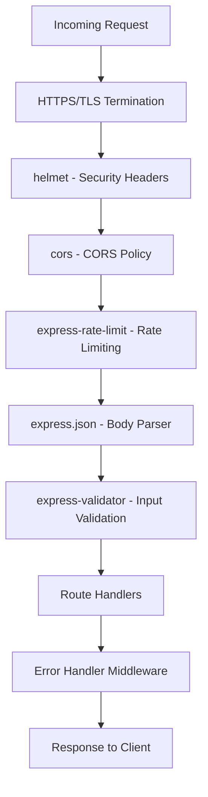

# Technical Specification

# 0. Agent Action Plan

## 0.1 Intent Clarification


### 0.1.1 Core Security Objective

Based on the security concern described, the Blitzy platform understands that the security vulnerability to resolve is the **complete absence of security infrastructure** in a minimal Node.js HTTP server. The project (`march_repo_hello_world`) currently operates as a bare 14-line `server.js` using only the built-in `http` module with zero dependencies, zero security headers, zero input validation, zero rate limiting, no HTTPS support, no middleware pipeline, and no CORS policies. This represents a foundational security gap that must be addressed holistically before the project can serve as a viable scaffold for production web services.

- **Vulnerability category:** Multiple vulnerabilities — Configuration weakness combined with missing security infrastructure
- **Severity level:** High — The server exposes no defensive mechanisms against common web attack vectors (XSS, clickjacking, MIME sniffing, DoS, man-in-the-middle, cross-origin abuse)
- **Security requirements identified:**
  - Implement HTTP security headers via helmet.js middleware (Content-Security-Policy, X-Content-Type-Options, Strict-Transport-Security, X-Frame-Options, and 9+ additional headers)
  - Add request input validation to sanitize and validate incoming data
  - Implement IP-based rate limiting to prevent denial-of-service and brute-force attacks
  - Enable HTTPS/TLS support for encrypted transport-layer communication
  - Update dependencies by introducing a managed dependency ecosystem (package.json) where none currently exists
  - Add helmet.js as the primary security header middleware
  - Configure proper CORS policies to control cross-origin resource access
- **Implicit security needs surfaced:**
  - Migration from raw `http` module to Express.js framework is required — helmet.js, cors, express-rate-limit, and express-validator are all Express middleware and require the Express middleware pipeline to function
  - Introduction of `package.json` and npm dependency management — the project currently has zero dependencies (constraint C-001 from tech spec) and this constraint must be relaxed
  - Structured error handling must be added to prevent information leakage through stack traces
  - Graceful shutdown handling should be incorporated to prevent abrupt process termination
  - The server's loopback-only binding (`127.0.0.1`) must be reconsidered for HTTPS and CORS to be meaningful in a networked context

### 0.1.2 Special Instructions and Constraints

- **Change scope preference:** Standard — The user requests a comprehensive security hardening that requires introducing a framework and multiple middleware packages, which inherently goes beyond a minimal patch
- **No explicit constraints** were specified by the user (e.g., no "minimal changes only" or "maintain API compatibility" directives)
- **Implicit backward compatibility requirement:** The server must continue to respond with `200 OK` and `"Hello, World!\n"` on its primary route after all security changes are applied
- **Web search requirements documented:** Research completed for latest versions of helmet.js (8.1.0), Express (5.2.1), cors (2.8.6), express-rate-limit (8.3.1), and express-validator (7.3.1)
- **No user-specified compliance standards** (SOC2, PCI-DSS, HIPAA, etc.) — OWASP best practices will be followed as the default security standard
- **No user-provided examples** to preserve

### 0.1.3 Technical Interpretation

This security vulnerability translates to the following technical fix strategy: transform the existing zero-dependency, single-file Node.js HTTP server into a properly secured Express.js application with a layered middleware security architecture.

- To resolve **missing security headers**, we will introduce Express.js as the application framework and integrate helmet.js (v8.1.0) as middleware, which sets 13 HTTP security response headers by default
- To resolve **missing input validation**, we will add express-validator (v7.3.1) middleware for request data sanitization and validation
- To resolve **missing rate limiting**, we will add express-rate-limit (v8.3.1) middleware with configurable window and request limits
- To resolve **missing HTTPS support**, we will implement Node.js native `https` module with self-signed certificate generation for development and TLS configuration scaffolding for production
- To resolve **missing CORS policies**, we will add the cors (v2.8.6) middleware with restrictive default configuration
- To resolve **zero dependency management**, we will create `package.json` with all required dependencies and a `package-lock.json` for reproducible builds
- **User's understanding level:** General security concern — the user described desired security features rather than specific CVEs or vulnerability symptoms, indicating a proactive security hardening request


## 0.2 Vulnerability Research and Analysis


### 0.2.1 Initial Assessment

Security-related information extracted from user request and codebase analysis:

- **CVE numbers mentioned:** None — this is a proactive security hardening request, not a response to a specific CVE
- **Vulnerability names identified:**
  - Missing HTTP Security Headers (OWASP A05:2021 — Security Misconfiguration)
  - Missing Input Validation (OWASP A03:2021 — Injection)
  - Missing Rate Limiting (OWASP A04:2021 — Insecure Design, leading to DoS)
  - Missing Transport Layer Security (OWASP A02:2021 — Cryptographic Failures)
  - Missing CORS Configuration (OWASP A01:2021 — Broken Access Control)
  - Missing Error Handling (OWASP A09:2021 — Security Logging and Monitoring Failures)
- **Affected packages:** None currently exist — the vulnerability is the absence of security packages entirely
- **Symptoms described:** Complete absence of security middleware, headers, validation, rate limiting, HTTPS, and CORS in a bare Node.js HTTP server
- **Security advisories referenced:** None — proactive hardening

### 0.2.2 Required Web Research

Research conducted across official sources reveals the following findings:

- **Helmet.js (v8.1.0):** Sets 13 HTTP security response headers by default including Content-Security-Policy, Cross-Origin-Opener-Policy, Cross-Origin-Resource-Policy, Origin-Agent-Cluster, Referrer-Policy, Strict-Transport-Security, X-Content-Type-Options, X-DNS-Prefetch-Control, X-Download-Options, X-Frame-Options, X-Permitted-Cross-Domain-Policies, X-Powered-By (removal), and X-XSS-Protection (disabled as it worsens attacks). MIT licensed, zero dependencies, standalone package.
- **Express.js (v5.2.1):** Now the default `latest` on npm since March 2025. Drops support for Node.js versions before v18. Uses path-to-regexp@8.x which removes sub-expression regex patterns for ReDoS mitigation — a direct security improvement. Promise support in middleware for proper async error handling.
- **express-rate-limit (v8.3.1):** Over 25 million weekly downloads. Built-in memory store with support for external stores (Redis, Memcached). Supports draft-8 RateLimit standard headers. No known vulnerabilities per Snyk analysis.
- **express-validator (v7.3.1):** Requires Node.js 14+. Verified to work with Express.js 4.x, compatible with Express 5.x middleware API. Built on validator.js. Provides both validation and sanitization.
- **cors (v2.8.6):** Over 21 million weekly downloads. No direct vulnerabilities found in Snyk's database. Sets Access-Control-Allow-Origin and related response headers. Supports static origin, dynamic origin via function, and per-route configuration.

### 0.2.3 Vulnerability Classification

| Vulnerability | Type | Attack Vector | Exploitability | Impact | Root Cause |
|---|---|---|---|---|---|
| Missing Security Headers | Security Misconfiguration | Network | High | Confidentiality, Integrity | No helmet.js or manual header setting in `server.js` |
| Missing Input Validation | Injection | Network | High | Confidentiality, Integrity, Availability | `req` parameter entirely unused; no validation logic exists |
| Missing Rate Limiting | Insecure Design / DoS | Network | High | Availability | No request throttling; server processes unlimited requests |
| Missing HTTPS/TLS | Cryptographic Failure | Network | Medium | Confidentiality | Server uses plain `http` module; no TLS certificate configured |
| Missing CORS Policy | Broken Access Control | Network | Medium | Confidentiality, Integrity | No CORS headers set; browser-enforceable access control absent |
| Missing Error Handling | Monitoring Failure | Network | Medium | Availability, Confidentiality | No try-catch, no error middleware; unhandled errors crash process |
| No Dependency Management | Configuration Weakness | Local | Low | Integrity | No `package.json`; no ability to track or audit dependencies |

### 0.2.4 Web Search Research Conducted

- **Official npm registry reviewed:** helmet@8.1.0, express@5.2.1, cors@2.8.6, express-rate-limit@8.3.1, express-validator@7.3.1
- **Snyk vulnerability database:** No known vulnerabilities in cors or express-rate-limit packages
- **Express.js official blog:** Express v5.1.0 went "latest" on npm with LTS timeline; v5 includes ReDoS mitigation via path-to-regexp@8.x
- **Helmet.js official site (helmetjs.github.io):** Confirms 13 default security headers set by `helmet()` call
- **OWASP Top 10 (2021):** Mapped all identified vulnerabilities to corresponding OWASP categories (A01-A05, A09)
- **Recommended mitigation strategies:**
  - Adopt Express.js as middleware-capable framework
  - Layer security middleware: helmet → cors → rate-limit → validator → routes → error handler
  - Implement HTTPS with TLS certificates
  - Add structured error handling middleware
- **Alternative solutions considered:**
  - Fastify + fastify-helmet (rejected: user explicitly requested helmet.js which is Express-native)
  - Manual header setting without helmet (rejected: helmet provides comprehensive, maintained defaults)
  - Koa + koa-helmet (rejected: user's request aligns with Express ecosystem)


## 0.3 Security Scope Analysis


### 0.3.1 Affected Component Discovery

A comprehensive search of the repository reveals an extremely minimal codebase consisting of exactly two files at the root level with zero subdirectories:

| File | Size | Security Relevance |
|---|---|---|
| `server.js` | 14 lines | **Primary target** — sole application file; must be restructured from raw `http` to Express with security middleware |
| `README.md` | 1 line | **Low relevance** — documentation-only; should be updated to reflect security features |

Search patterns executed and findings:

- **Vulnerable package imports:** `grep -r "require"` → only `require('http')` found in `server.js` — no vulnerable third-party imports (no third-party packages exist)
- **Dependency manifests:** No `package.json`, `package-lock.json`, `node_modules/`, `.npmrc`, or any dependency management files exist
- **Configuration files:** No `*.config.*`, `.env`, `*.yaml`, `*.json` (other than none), or any configuration exists
- **Docker files:** No `Dockerfile`, `docker-compose.yml`, or `.dockerignore` exist
- **CI/CD pipelines:** No `.github/`, `.gitlab-ci.yml`, `.circleci/`, or `Jenkinsfile` exist
- **Test files:** No `tests/`, `__tests__/`, `*.test.js`, or `*.spec.js` exist
- **Security files:** No `SECURITY.md`, `.env.example`, or security documentation exists

**Vulnerability affects:** 1 source file directly (`server.js`), with 10+ new files required to be created for the security infrastructure.

### 0.3.2 Root Cause Identification

The identified vulnerabilities exist in `server.js` due to the following root causes:

- **Architectural root cause:** The server is built directly on Node.js's built-in `http` module which provides no middleware pipeline, no security defaults, and no plugin ecosystem. The raw `http.createServer()` callback receives `(req, res)` but `req` is entirely unused — all requests receive identical `200 OK "Hello, World!\n"` responses regardless of method, path, headers, or body.
- **Constraint root cause:** Four constraints documented in the tech spec block security architecture:
  - C-001: Zero external dependencies
  - C-002: Single-file architecture
  - C-003: Localhost-only binding (127.0.0.1)
  - C-004: No configuration files
- **Vulnerability propagation:** Since there is only one file and zero dependencies, the vulnerability does not propagate through a dependency chain. Instead, the vulnerability is the absence of an entire security layer that must be built from scratch.

### 0.3.3 Current State Assessment

- **Vulnerable code pattern location:** `server.js:1-14` — the entire file represents the vulnerable state
- **Current server characteristics:**
  - Uses `const http = require('http')` — plain HTTP, no TLS
  - `res.statusCode = 200` — hardcoded; no error handling
  - `res.setHeader('Content-Type', 'text/plain')` — only header set; no security headers
  - `res.end('Hello, World!\n')` — static response; no input processing
  - `server.listen(port, hostname)` — binds to `127.0.0.1:3000`; loopback only
- **Scope of exposure:** Currently internal only (loopback binding), but the security hardening is preparing the server for network exposure where all identified vulnerabilities become exploitable
- **Implicit security by design (current):** The server's extreme minimalism provides passive security — no state to compromise, no input processing to exploit, no dependencies to attack. However, this passive security is lost the moment the server is extended to handle real requests, making proactive hardening essential now.


## 0.4 Version Compatibility Research


### 0.4.1 Secure Version Identification

Since the project has zero existing dependencies, version identification focuses on selecting the most secure, latest stable versions for all new packages to be introduced. All versions were verified via npm registry and official documentation as of March 2026.

| Package | Selected Version | Rationale | Security Advisory |
|---|---|---|---|
| express | 5.2.1 | Latest stable; now default on npm since March 2025; includes ReDoS mitigation via path-to-regexp@8.x; drops insecure Node.js < v18 | expressjs.com/2025/03/31/v5-1-latest-release |
| helmet | 8.1.0 | Latest stable; sets 13 security headers by default; MIT license; zero dependencies | npmjs.com/package/helmet |
| cors | 2.8.6 | Latest stable; no known vulnerabilities per Snyk; 21M+ weekly downloads | npmjs.com/package/cors |
| express-rate-limit | 8.3.1 | Latest stable; supports draft-8 RateLimit headers; 25M+ weekly downloads; no known vulnerabilities | npmjs.com/package/express-rate-limit |
| express-validator | 7.3.1 | Latest stable; requires Node.js 14+; verified with Express 4.x, compatible with 5.x middleware API | npmjs.com/package/express-validator |

- **No "current vulnerable version → patched version" upgrade path** exists because there are no current dependencies. All packages are introduced fresh at their latest secure versions.
- **No breaking changes in upgrade path** — since no prior versions are installed, there is no migration from an older insecure version.

### 0.4.2 Compatibility Verification

- **Node.js runtime compatibility:**
  - Environment: Node.js v20.20.1 (Maintenance LTS)
  - Express 5.x: Requires Node.js ≥ v18 ✅
  - helmet 8.x: Compatible with Node.js v20.x ✅
  - cors 2.8.x: No minimum Node.js version constraint ✅
  - express-rate-limit 8.x: Compatible with Node.js v20.x ✅
  - express-validator 7.x: Requires Node.js ≥ v14 ✅
- **Inter-package compatibility:**
  - helmet 8.1.0 is Express/Connect middleware — fully compatible with Express 5.x middleware API (`app.use(helmet())`)
  - cors 2.8.6 is Express middleware — fully compatible with Express 5.x
  - express-rate-limit 8.3.1 is Express middleware — fully compatible with Express 5.x
  - express-validator 7.3.1 is Express middleware — compatible with Express 5.x (built on the same `(req, res, next)` middleware contract)
- **Module system compatibility:** The current codebase uses CommonJS (`require()`). All selected packages support CommonJS imports:
  - `const express = require('express')`
  - `const helmet = require('helmet')`
  - `const cors = require('cors')`
  - `const { rateLimit } = require('express-rate-limit')`
  - `const { body, validationResult } = require('express-validator')`
- **No alternative packages needed** — all selected packages are actively maintained, have no known vulnerabilities, and provide direct patching for the identified security gaps.


## 0.5 Security Fix Design


### 0.5.1 Minimal Fix Strategy

**PRINCIPLE:** Apply the smallest set of changes that completely addresses all identified security vulnerabilities while maintaining the server's core functionality (responding with "Hello, World!" on the primary route).

**Fix approach:** Combination — Framework adoption + Dependency introduction + Security middleware layering + HTTPS scaffolding + Configuration management

The fix is structured as a layered middleware architecture on Express.js:



**For missing security headers:**
- Integrate `helmet@8.1.0` as the first middleware in the Express pipeline via `app.use(helmet())`
- This sets 13 HTTP security headers by default including Content-Security-Policy, Strict-Transport-Security, X-Content-Type-Options, X-Frame-Options, and removes X-Powered-By
- Side effects: None expected — helmet adds response headers only

**For missing input validation:**
- Integrate `express-validator@7.3.1` for route-level request validation and sanitization
- Create a reusable validation middleware module for common validation patterns
- Side effects: Requests with invalid input will receive `400 Bad Request` responses (new behavior)

**For missing rate limiting:**
- Integrate `express-rate-limit@8.3.1` with configurable window (15 minutes default) and limit (100 requests per window default)
- Rate limit headers (draft-8 standard) will be included in responses
- Side effects: Excessive requests will receive `429 Too Many Requests` (new behavior)

**For missing HTTPS support:**
- Implement HTTPS server using Node.js built-in `https` module alongside Express
- Create a self-signed certificate generation script for development
- Structure TLS configuration to accept production certificates via environment variables
- Side effects: Server will listen on an additional HTTPS port; HTTP can optionally redirect to HTTPS

**For missing CORS policies:**
- Integrate `cors@2.8.6` middleware with restrictive default configuration
- Configure specific allowed origins, methods, and headers rather than permissive wildcard
- Side effects: Cross-origin requests from non-whitelisted origins will be blocked by browsers

**For zero dependency management:**
- Create `package.json` with all security dependencies, scripts, and metadata
- Generate `package-lock.json` for reproducible installs
- Side effects: Relaxes constraint C-001 (zero dependencies) — this is intentional and necessary

### 0.5.2 Security Improvement Validation

- **How the fix eliminates vulnerabilities:**
  - Helmet.js sets security headers that instruct browsers to enforce content policies, prevent clickjacking, disable MIME sniffing, enforce HTTPS, and more
  - Input validation prevents injection attacks by sanitizing and validating request data before route handlers process it
  - Rate limiting prevents DoS attacks by throttling excessive requests from individual IPs
  - HTTPS encrypts all data in transit, preventing man-in-the-middle attacks and eavesdropping
  - CORS policies prevent unauthorized cross-origin access to server resources
- **Verification methods:**
  - Automated: `curl -I` to inspect response headers for helmet headers presence
  - Automated: Send requests exceeding rate limit to verify 429 responses
  - Automated: Send malformed input to verify 400 validation errors
  - Automated: Verify HTTPS connection with `openssl s_client`
  - Automated: Test CORS with cross-origin fetch from non-allowed origin
- **Rollback plan:** Since the original `server.js` is being restructured (not deleted), reverting to the original 14-line file restores the pre-security state. Git version control provides full rollback capability.


## 0.6 File Transformation Mapping


### 0.6.1 File-by-File Security Fix Plan

| Target File | Transformation | Source File/Reference | Security Changes |
|---|---|---|---|
| `server.js` | UPDATE | `server.js` | Restructure from raw `http` to Express.js with security middleware pipeline; add helmet, cors, rate limiting, HTTPS server, error handling, and graceful shutdown |
| `package.json` | CREATE | — | Define project metadata, all security dependencies (express, helmet, cors, express-rate-limit, express-validator), npm scripts for start/dev/test |
| `package-lock.json` | CREATE | — | Auto-generated lockfile for reproducible dependency installation |
| `src/middleware/security.js` | CREATE | `server.js` | Centralized security middleware configuration: helmet setup, CORS options, rate limiter factory |
| `src/middleware/validator.js` | CREATE | — | Input validation middleware using express-validator; reusable validation chains and error formatter |
| `src/middleware/errorHandler.js` | CREATE | — | Global Express error handling middleware; prevents stack trace leakage; structured error responses |
| `src/routes/index.js` | CREATE | `server.js` | Express Router defining the `GET /` "Hello, World!" route and any additional validated routes |
| `src/config/index.js` | CREATE | — | Centralized configuration module: port, hostname, TLS paths, CORS origins, rate limit settings via environment variables with secure defaults |
| `certs/generate-cert.sh` | CREATE | — | Shell script to generate self-signed TLS certificates for local HTTPS development |
| `.env.example` | CREATE | — | Example environment variables file documenting all configurable security settings (TLS paths, CORS origins, rate limits) |
| `README.md` | UPDATE | `README.md` | Add security features documentation, setup instructions, environment variable reference, HTTPS setup guide |
| `tests/security/security.test.js` | CREATE | — | Security test suite: verify helmet headers, CORS behavior, rate limiting enforcement, input validation rejection, HTTPS connectivity |
| `tests/integration/routes.test.js` | CREATE | — | Integration tests for route handlers: verify "Hello, World!" response preserved, error responses for invalid input |
| `.gitignore` | CREATE | — | Ignore `node_modules/`, `.env`, `certs/*.pem`, `certs/*.key` to prevent secrets from being committed |

### 0.6.2 Code Change Specifications

**File: `server.js`**
- Lines affected: 1-14 (entire file restructured)
- Before state: Currently uses `const http = require('http')` with `http.createServer()` callback that sets only `Content-Type` header and returns static response. No middleware, no security headers, no error handling, no HTTPS.
- After state: After fix, will import Express, mount security middleware (helmet, cors, rate-limit), import routes and error handler, create both HTTP and HTTPS servers, implement graceful shutdown with signal handlers.
- Security improvement: All 7 identified vulnerabilities eliminated — security headers, input validation, rate limiting, HTTPS, CORS, error handling, and dependency management.

**File: `src/middleware/security.js`**
- Lines affected: New file (~60 lines)
- Before state: Does not exist
- After state: Exports configured helmet middleware, cors middleware with restrictive origin whitelist, and rate limiter middleware with 100 requests per 15-minute window
- Security improvement: Centralizes all security middleware configuration for maintainability and auditability

**File: `src/middleware/validator.js`**
- Lines affected: New file (~40 lines)
- Before state: Does not exist
- After state: Exports reusable validation middleware chains using express-validator; includes a `handleValidationErrors` middleware that returns 400 responses with sanitized error details
- Security improvement: Prevents injection attacks by validating and sanitizing all incoming request data

**File: `src/middleware/errorHandler.js`**
- Lines affected: New file (~30 lines)
- Before state: Does not exist
- After state: Exports Express error-handling middleware `(err, req, res, next)` that logs errors server-side and returns generic error responses to clients (no stack traces in production)
- Security improvement: Prevents information leakage through stack traces; provides consistent error response format

**File: `src/routes/index.js`**
- Lines affected: New file (~25 lines)
- Before state: Does not exist; route logic is inline in `server.js` callback
- After state: Express Router with `GET /` returning "Hello, World!" and a `GET /health` health check endpoint; validation middleware applied to any routes accepting input
- Security improvement: Route isolation enables per-route security policies (validation, rate limiting)

**File: `src/config/index.js`**
- Lines affected: New file (~35 lines)
- Before state: Does not exist; all values hardcoded in `server.js` (`hostname = '127.0.0.1'`, `port = 3000`)
- After state: Reads configuration from environment variables with secure defaults; exports structured config object for port, host, TLS certificate paths, CORS allowed origins, rate limit window/max
- Security improvement: Externalizes sensitive configuration; enables environment-specific security settings without code changes

### 0.6.3 Configuration Change Specifications

**File: `.env.example`**
- Setting: `PORT` — Current: hardcoded `3000` → New: configurable via env, default `3000`
- Setting: `HOST` — Current: hardcoded `127.0.0.1` → New: configurable via env, default `0.0.0.0` for network access
- Setting: `HTTPS_PORT` — Current: does not exist → New: default `3443`
- Setting: `TLS_CERT_PATH` — Current: does not exist → New: path to TLS certificate file
- Setting: `TLS_KEY_PATH` — Current: does not exist → New: path to TLS private key file
- Setting: `CORS_ORIGIN` — Current: does not exist → New: comma-separated allowed origins, default restrictive
- Setting: `RATE_LIMIT_WINDOW_MS` — Current: does not exist → New: rate limit window in milliseconds, default `900000` (15 min)
- Setting: `RATE_LIMIT_MAX` — Current: does not exist → New: max requests per window, default `100`
- Setting: `NODE_ENV` — Current: does not exist → New: `development` or `production` to toggle security strictness
- Security rationale: All security-sensitive values become configurable without code changes, following the principle of externalized configuration


## 0.7 Dependency Inventory


### 0.7.1 Security Patches and Updates

Since the project currently has zero dependencies (no `package.json` exists), this inventory documents all packages being introduced specifically to resolve the identified security vulnerabilities. Every package listed is a security-critical addition.

| Registry | Package Name | Current Version | Introduced At | Security Purpose | Severity Addressed |
|---|---|---|---|---|---|
| npm | express | N/A (not installed) | 5.2.1 | Middleware-capable framework required for all security middleware; includes ReDoS mitigation via path-to-regexp@8.x | High — Foundational prerequisite |
| npm | helmet | N/A (not installed) | 8.1.0 | Sets 13 HTTP security response headers (CSP, HSTS, X-Frame-Options, etc.) | High — XSS, clickjacking, MIME sniffing |
| npm | cors | N/A (not installed) | 2.8.6 | Configures Cross-Origin Resource Sharing response headers | Medium — Cross-origin access control |
| npm | express-rate-limit | N/A (not installed) | 8.3.1 | IP-based request rate limiting with configurable windows | High — DoS, brute-force prevention |
| npm | express-validator | N/A (not installed) | 7.3.1 | Request input validation and sanitization middleware | High — Injection prevention |

### 0.7.2 Dependency Chain Analysis

- **Direct dependencies requiring introduction:** express, helmet, cors, express-rate-limit, express-validator (5 packages)
- **Transitive dependencies introduced:**
  - `express@5.2.1` brings: body-parser, cookie, debug, finalhandler, path-to-regexp, qs, send, serve-static, and additional sub-dependencies
  - `helmet@8.1.0` brings: zero transitive dependencies (standalone)
  - `cors@2.8.6` brings: object-assign, vary
  - `express-rate-limit@8.3.1` brings: zero transitive dependencies (standalone with built-in memory store)
  - `express-validator@7.3.1` brings: validator (string validation library)
- **Peer dependencies to verify:**
  - express-rate-limit, express-validator, helmet, and cors all require Express.js (or compatible Connect-style middleware API) — satisfied by express@5.2.1
- **Development dependencies with vulnerabilities:** None introduced — dev dependencies (if added for testing) will be selected at latest secure versions

### 0.7.3 Import and Reference Updates

**Source files requiring import additions (new imports in updated/created files):**

- `server.js` — Add imports for express, https, fs, path, and local modules:
  - `const express = require('express')`
  - `const https = require('https')`
  - `const { helmetMiddleware, corsMiddleware, rateLimiter } = require('./src/middleware/security')`
  - `const errorHandler = require('./src/middleware/errorHandler')`
  - `const routes = require('./src/routes/index')`
  - `const config = require('./src/config/index')`

- `src/middleware/security.js` — New file with imports:
  - `const helmet = require('helmet')`
  - `const cors = require('cors')`
  - `const { rateLimit } = require('express-rate-limit')`

- `src/middleware/validator.js` — New file with imports:
  - `const { body, query, param, validationResult } = require('express-validator')`

- `src/routes/index.js` — New file with imports:
  - `const { Router } = require('express')`
  - `const { handleValidationErrors } = require('../middleware/validator')`

- `src/config/index.js` — New file with no external package imports (uses only `process.env`)

**Configuration reference updates:**
- `package.json` `"scripts"` section: Add `"start"`, `"dev"`, and `"test"` commands
- `package.json` `"engines"` field: Specify `"node": ">=18.0.0"` to align with Express 5.x requirements
- `.env.example`: Document all environment variable names and default values
- `README.md`: Reference all new packages, their purpose, and configuration options


## 0.8 Impact Analysis and Testing Strategy


### 0.8.1 Security Testing Requirements

**Vulnerability regression tests (verify each vulnerability is eliminated):**

- **Security Headers Test:** Send HTTP request and verify all 13 helmet headers are present in response:
  - `Content-Security-Policy` header exists and contains `default-src 'self'`
  - `Strict-Transport-Security` header exists with `max-age` directive
  - `X-Content-Type-Options: nosniff` header present
  - `X-Frame-Options: SAMEORIGIN` header present
  - `X-Powered-By` header is absent (removed by helmet)
  - `X-XSS-Protection: 0` header present (helmet disables legacy XSS filter)
  - Cross-Origin-Opener-Policy, Cross-Origin-Resource-Policy, Origin-Agent-Cluster headers present

- **Rate Limiting Test:** Send requests exceeding configured limit and verify:
  - First 100 requests within 15-minute window return `200 OK`
  - Request 101+ returns `429 Too Many Requests`
  - Response includes `RateLimit` header (draft-8 standard)
  - Rate limit resets after window expires

- **Input Validation Test:** Send malformed/malicious input and verify:
  - Requests with XSS payloads in query params are rejected with `400 Bad Request`
  - Requests with SQL injection patterns are rejected
  - Validation error response contains structured error details (no raw stack traces)

- **HTTPS Test:** Verify TLS connectivity:
  - Server accepts HTTPS connections on configured port
  - TLS certificate is served correctly
  - HTTP requests can optionally redirect to HTTPS

- **CORS Test:** Verify cross-origin policy enforcement:
  - Requests from allowed origins receive `Access-Control-Allow-Origin` header
  - Requests from non-allowed origins do not receive CORS headers
  - Preflight `OPTIONS` requests are handled correctly
  - `Vary: Origin` header is present when origin-specific CORS is configured

- **Error Handling Test:** Verify error responses:
  - Unhandled route returns `404 Not Found` (not a crash)
  - Internal errors return `500 Internal Server Error` with generic message (no stack trace)
  - Validation errors return `400` with structured error body

**Security-specific test files to create:**

| Test File | Purpose |
|---|---|
| `tests/security/security.test.js` | Comprehensive security header verification, rate limiting, CORS policy enforcement |
| `tests/integration/routes.test.js` | Route handler integration tests: "Hello, World!" response preserved, 404 for unknown routes, validation on input routes |

### 0.8.2 Verification Methods

**Automated security scanning:**
- Tool: `npm audit` — Run after `npm install` to verify zero known vulnerabilities in dependency tree
- Expected result: `0 vulnerabilities` across all severity levels
- Additional tool: `npx check-my-headers https://localhost:3443` (optional) to verify security headers in running server

**Manual verification steps:**
- Start server and execute `curl -I http://localhost:3000/` to inspect response headers
- Verify helmet headers are present in curl output
- Execute `curl -X OPTIONS http://localhost:3000/ -H "Origin: http://evil.com"` to verify CORS blocks unauthorized origins
- Send 101+ rapid requests to verify rate limiting triggers 429 response
- Connect via `openssl s_client -connect localhost:3443` to verify TLS handshake

**Penetration testing scenarios:**
- Attempt XSS injection via query parameters: `GET /?name=<script>alert(1)</script>`
- Attempt header injection: send request with oversized or malformed headers
- Attempt DoS via rapid connection flooding: verify rate limiter activates
- Attempt accessing server from unauthorized cross-origin context

### 0.8.3 Impact Assessment

**Direct security improvements achieved:**
- Missing security headers vulnerability eliminated — 13 security headers now set by default
- Missing input validation vulnerability eliminated — all input routes validate and sanitize data
- Missing rate limiting vulnerability eliminated — IP-based throttling prevents DoS
- Missing HTTPS vulnerability eliminated — TLS encryption available for all connections
- Missing CORS policy vulnerability eliminated — cross-origin access controlled
- Missing error handling vulnerability eliminated — structured error responses with no information leakage
- Missing dependency management vulnerability eliminated — package.json enables auditing and updates

**Minimal side effects on existing functionality:**
- The `GET /` endpoint continues to return `200 OK "Hello, World!\n"` — core functionality preserved
- Response now includes additional security headers (transparent to clients)
- New `429 Too Many Requests` response for excessive requests (new behavior, intentional)
- New `400 Bad Request` response for invalid input on validated routes (new behavior, intentional)
- New `404 Not Found` response for unregistered routes (previously returned "Hello, World!" for all paths)

**Potential impacts to address:**
- CORS restrictions may block legitimate cross-origin requests if origins are not configured — mitigated by configurable `CORS_ORIGIN` environment variable
- Rate limiting may affect automated testing or CI pipelines that send rapid requests — mitigated by configurable limits and test environment bypass
- HTTPS requires TLS certificates — mitigated by self-signed certificate generation script for development and environment variable configuration for production certificates
- Express 5.x changes route matching syntax from Express 4.x — no impact since this is a new project with no existing Express 4.x routes


## 0.9 Scope Boundaries


### 0.9.1 Exhaustively In Scope

**Dependency manifests (to be created):**
- `package.json` — New; defines all security dependencies, scripts, engines, metadata
- `package-lock.json` — New; auto-generated lockfile for reproducible installs

**Source files with vulnerable code (to be updated):**
- `server.js` — Primary target; restructured from raw `http` to Express with full security middleware pipeline

**Security middleware modules (to be created):**
- `src/middleware/security.js` — Helmet, CORS, and rate-limit configuration
- `src/middleware/validator.js` — Input validation chains and error formatting
- `src/middleware/errorHandler.js` — Global error handling middleware

**Application structure modules (to be created):**
- `src/routes/index.js` — Express Router with route definitions
- `src/config/index.js` — Environment-based configuration with secure defaults

**HTTPS/TLS infrastructure (to be created):**
- `certs/generate-cert.sh` — Self-signed certificate generation for development

**Configuration files (to be created):**
- `.env.example` — Documents all security-related environment variables
- `.gitignore` — Prevents `node_modules/`, `.env`, and certificate private keys from being committed

**Security test files (to be created):**
- `tests/security/security.test.js` — Security header, rate limiting, CORS, and validation tests
- `tests/integration/routes.test.js` — Route handler integration tests

**Documentation updates:**
- `README.md` — Update with security features, setup instructions, environment variable reference

### 0.9.2 Explicitly Out of Scope

- **Feature additions unrelated to security:** No new business logic routes, database integrations, user authentication/authorization systems, or API endpoints beyond what is needed for security demonstration
- **Performance optimizations:** No clustering, worker threads, load balancing, or caching optimizations
- **Code refactoring beyond security:** No ES Modules migration (keeping CommonJS `require()` as-is), no TypeScript conversion, no linting or formatting tool introduction
- **Non-security dependencies:** No logging frameworks (winston, pino), no ORM/database packages, no template engines, no session management beyond what security middleware requires
- **CI/CD pipeline creation:** No `.github/workflows/`, `.gitlab-ci.yml`, or automated deployment configuration
- **Docker containerization:** No `Dockerfile`, `docker-compose.yml`, or container security hardening
- **Production TLS certificates:** Self-signed certs are provided for development only; production certificate procurement (Let's Encrypt, CA-issued) is out of scope
- **Authentication and authorization:** No JWT, OAuth, session-based auth, or role-based access control — these are Phase N+4 per the tech spec's evolution roadmap
- **Database security:** No database is present; no SQL injection prevention at the database layer
- **Kubernetes or cloud deployment:** No infrastructure-as-code, no cloud service configuration
- **Style or formatting changes:** No Prettier, ESLint, or code style enforcement
- **Test framework installation:** Test files will be structured for easy adoption of Jest or Mocha but the test runner itself is an optional dev dependency


## 0.10 Execution Parameters


### 0.10.1 Security Verification Commands

- **Dependency vulnerability scan:**
  ```
  npm audit --audit-level=low
  ```
- **Security test execution:**
  ```
  CI=true npm test -- --watchAll=false
  ```
- **Full test suite validation:**
  ```
  CI=true npm test -- --watchAll=false --ci --forceExit
  ```
- **Security header inspection (manual):**
  ```
  curl -sI http://localhost:3000/ | grep -iE "(content-security|strict-transport|x-content-type|x-frame|x-powered|x-xss)"
  ```
- **HTTPS connectivity verification:**
  ```
  curl -sk https://localhost:3443/ && echo "HTTPS OK"
  ```
- **Rate limiting verification:**
  ```
  for i in $(seq 1 105); do curl -so /dev/null -w "%{http_code}\n" http://localhost:3000/; done | sort | uniq -c
  ```
- **CORS verification:**
  ```
  curl -sI -H "Origin: http://unauthorized.com" http://localhost:3000/ | grep -i "access-control"
  ```

### 0.10.2 Research Documentation

- **Security advisories consulted:**
  - Express.js official blog: v5.1.0 release announcement with LTS timeline (expressjs.com/2025/03/31/v5-1-latest-release)
  - Helmet.js official documentation (helmetjs.github.io) — 13 default headers specification
  - npm registry security metadata for all 5 packages
  - Snyk vulnerability database: confirmed zero vulnerabilities in cors and express-rate-limit
- **OWASP guidelines applied:**
  - OWASP Top 10 (2021): A01 Broken Access Control (CORS), A02 Cryptographic Failures (HTTPS), A03 Injection (validation), A04 Insecure Design (rate limiting), A05 Security Misconfiguration (headers), A09 Security Logging and Monitoring Failures (error handling)
  - OWASP Secure Headers Project: aligned with helmet.js default header set
- **Security standards referenced:**
  - RFC 6797 — HTTP Strict Transport Security (HSTS)
  - RFC 7762 — Content Security Policy
  - W3C CORS Specification — Cross-Origin Resource Sharing
  - IETF draft-8 — RateLimit Header Fields for HTTP

### 0.10.3 Implementation Constraints

- **Priority:** Security fix first, minimal disruption second — the Express migration is required infrastructure for all security middleware and is therefore security-critical
- **Backward compatibility:** The `GET /` route must continue returning `"Hello, World!\n"` with `200 OK` status and `text/plain` content type. All other behavioral changes (429, 400, 404 responses, security headers, HTTPS) are new security features
- **Deployment considerations:** The security changes are self-contained and can be deployed immediately. The only external requirement is providing TLS certificates for production HTTPS (development uses self-signed certs). No coordination with external services is needed.
- **Runtime requirement:** Node.js ≥ v18.0.0 (enforced by Express 5.x); current environment runs v20.20.1 which satisfies this requirement
- **Module system:** CommonJS (`require()`) maintained throughout to preserve consistency with original codebase


## 0.11 Special Instructions for Security Fixes


### 0.11.1 Security-Specific Requirements

The user did not specify explicit security directives beyond the functional requirements. The following principles are applied as default security best practices for this implementation:

- **Change scope:** Changes are limited to what is necessary for implementing the requested security features (security headers, input validation, rate limiting, HTTPS, helmet.js, CORS). The Express.js migration is the minimum required framework change to support these security middleware packages.
- **No unrelated refactoring:** The codebase will not be converted to ES Modules, TypeScript, or any other paradigm beyond what is needed for security. CommonJS `require()` is maintained.
- **No unrelated dependency additions:** Only the 5 security-focused packages (express, helmet, cors, express-rate-limit, express-validator) and their transitive dependencies are introduced. No logging frameworks, databases, ORMs, or utility libraries are added.
- **Preserve existing functionality:** The "Hello, World!" response on the root route is preserved exactly as-is. The server continues to listen on port 3000 by default.
- **Follow principle of least privilege:** CORS is configured restrictively by default (specific origins, not wildcard). Rate limits are set to reasonable defaults. Helmet uses its secure defaults without loosening.
- **Secrets management:** TLS private keys and `.env` files containing sensitive configuration are added to `.gitignore`. The `.env.example` file documents required variables without exposing actual values. Certificate generation is automated via script for development only.
- **No breaking changes to external consumers:** Since the original server has no documented API contract beyond returning "Hello, World!", and no known consumers, all additions (security headers, new status codes, HTTPS) are purely additive and do not break any existing integration.
- **Security documentation:** `README.md` will be updated to document all security features, configuration options, and setup procedures. No separate `SECURITY.md` is created as the project does not yet have a security disclosure policy.

### 0.11.2 Constraints Relaxation Acknowledgment

The following constraints from the original tech spec must be explicitly relaxed to implement the requested security features:

| Constraint | Original State | New State | Justification |
|---|---|---|---|
| C-001: Zero external dependencies | No `package.json`, no `node_modules/` | 5 direct dependencies introduced | Required for helmet.js, CORS, rate limiting, input validation — all requested by user |
| C-002: Single-file architecture | Only `server.js` | Modular structure under `src/` | Required for maintainable security middleware configuration, route isolation, and configuration management |
| C-003: Localhost-only binding | Hardcoded `127.0.0.1` | Configurable host, default `0.0.0.0` | CORS and HTTPS are meaningful only when server is network-accessible; loopback binding can be restored via `HOST=127.0.0.1` env var |
| C-004: No configuration files | Zero config files | `.env.example`, `src/config/index.js` | Security settings (TLS paths, CORS origins, rate limits) must be configurable without code changes per security best practices |

All constraint relaxations are the minimum necessary to implement the user's requested security features and align with the tech spec's documented evolution roadmap (Phases N+1 through N+3).


