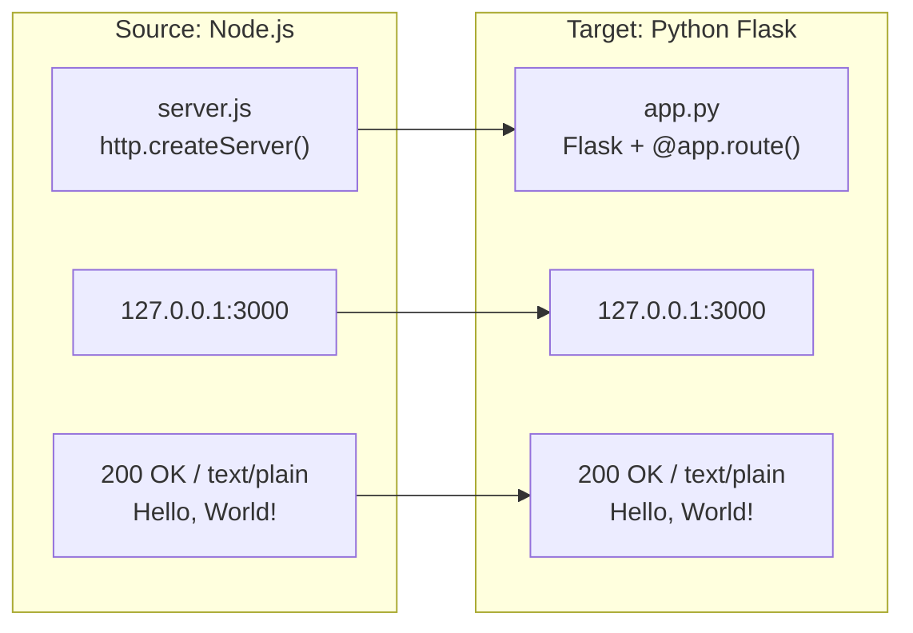

# Technical Specification

# 0. Agent Action Plan

## 0.1 Intent Clarification

### 0.1.1 Core Refactoring Objective

Based on the prompt, the Blitzy platform understands that the refactoring objective is to **perform a complete tech stack migration** of an existing Node.js HTTP server into a functionally equivalent Python 3 Flask application. The user's directive is unambiguous: every feature and functionality present in the original Node.js project must be preserved with exact behavioral parity in the rewritten Flask version.

- **Refactoring type**: Tech stack migration (Node.js → Python 3 Flask)
- **Target repository**: Same repository — the Python Flask application replaces the Node.js server in-place
- **Behavioral contract**: The rewritten application must produce identical HTTP responses (status code, headers, body) to the original for every possible inbound request

The specific refactoring goals, enhanced for clarity, are:

- **Complete language migration**: Translate all runtime logic from JavaScript (ES6+, CommonJS) to Python 3, targeting Flask as the web framework
- **HTTP behavior preservation**: The Flask server must respond to all HTTP methods on all paths with HTTP 200 OK, `Content-Type: text/plain`, and body `Hello, World!\n` — exactly as the Node.js server does
- **Network binding equivalence**: The Flask server must bind to `127.0.0.1` on port `3000`, replicating the original server's network configuration
- **Startup logging equivalence**: The Flask server must emit a startup confirmation message to stdout, mirroring the Node.js server's `Server running at http://127.0.0.1:3000/` log
- **Zero-dependency spirit preservation**: Although Flask introduces a framework dependency (unlike the original zero-dependency Node.js project), the migration should avoid adding any unnecessary packages beyond Flask and its automatic dependencies
- **Implicit requirement — API compatibility**: Since the original server responds identically to every HTTP request regardless of method, path, headers, or body, the Flask application must implement a catch-all route handler that replicates this universal acceptance behavior
- **Implicit requirement — package metadata migration**: The npm-based `package.json` and `package-lock.json` must be replaced with Python-equivalent dependency management (`requirements.txt`) and project documentation updates
- **Implicit requirement — documentation update**: The `README.md` must be updated to reflect the new Python/Flask stack, including revised prerequisites, installation steps, and usage instructions

### 0.1.2 Technical Interpretation

This refactoring translates to the following technical transformation strategy:

The current architecture is a **single-file, zero-dependency Node.js HTTP server** (`server.js`) using only the native `http` module. It creates an HTTP server with `http.createServer()`, binds to `127.0.0.1:3000`, and responds to every inbound request with a static `200 OK` / `text/plain` / `Hello, World!\n` response. The entire runtime consists of approximately 15 lines of functional JavaScript.

The target architecture is a **single-file Flask application** (`app.py`) that uses Flask's routing system to implement an equivalent catch-all handler. Flask's `@app.route()` decorator with a catch-all path rule and support for all HTTP methods will replicate the universal request acceptance behavior. The Flask development server will be configured to bind to `127.0.0.1:3000` to match the original network configuration.



The transformation rules governing this migration are:

| Source Concept | Node.js Implementation | Flask Equivalent |
|---|---|---|
| HTTP module import | `const http = require('http')` | `from flask import Flask` |
| Server instantiation | `http.createServer(callback)` | `app = Flask(__name__)` |
| Request handler | Arrow function `(req, res) => { ... }` | `@app.route()` decorated function |
| Catch-all routing | Implicit (Node.js `http` has no routing) | `@app.route('/', defaults={'path': ''})` + `@app.route('/<path:path>')` with `methods` parameter |
| Status code | `res.statusCode = 200` | `return ('Hello, World!\n', 200)` |
| Content-Type header | `res.setHeader('Content-Type', 'text/plain')` | Flask `Response` object or `make_response` with header |
| Response body | `res.end('Hello, World!\n')` | Return string with explicit content type |
| Server binding | `server.listen(port, hostname, callback)` | `app.run(host='127.0.0.1', port=3000)` |
| Startup log | `console.log(...)` | Flask prints its own startup banner; custom `print()` may supplement |
| Package manifest | `package.json` | `requirements.txt` |
| Lockfile | `package-lock.json` | Not required (pip freeze equivalent) |

## 0.2 Source Analysis

### 0.2.1 Comprehensive Source File Discovery

The source repository is intentionally minimal — a single-file HTTP server with supporting package metadata and documentation. A thorough scan of the repository root reveals the following complete file inventory:

| File | Type | Size (lines) | Functional Lines | Purpose |
|---|---|---|---|---|
| `server.js` | Runtime source | 77 | ~15 | Sole executable; HTTP server implementation |
| `package.json` | Package metadata | 11 | N/A | npm manifest: name, version, scripts, license |
| `package-lock.json` | Lockfile | 14 | N/A | npm lockfile confirming zero dependencies |
| `README.md` | Documentation | 532 | N/A | Comprehensive usage, deployment, and troubleshooting guide |
| `blitzy/` | Folder | N/A | N/A | Non-runtime documentation/governance workspace (out of scope for migration) |

**Discovery approach used:**
- `get_source_folder_contents("")` — enumerated all root-level children
- `read_file` on each of the four files to capture full contents
- Confirmed zero additional source files, configuration files, test files, or hidden dotfiles requiring migration

**Key findings from source inspection:**
- The codebase contains **no legacy patterns**, **no duplicate code**, and **no tightly coupled modules** — it is a single 15-line functional server
- There are **no test files** to migrate (the `npm test` script is a non-functional placeholder that prints an error and exits with code 1)
- There are **no configuration files** beyond `package.json`
- The `blitzy/` folder contains only project governance documentation and is not part of the runtime application

### 0.2.2 Current Structure Mapping

```
Current:
├── server.js              (77 lines - sole runtime file, HTTP server)
├── package.json           (11 lines - npm manifest, zero dependencies)
├── package-lock.json      (14 lines - lockfile, confirms zero packages)
├── README.md              (532 lines - extensive documentation)
└── blitzy/                (documentation workspace - NOT runtime)
    └── documentation/     (nested project governance artifacts)
```

**`server.js` — Detailed Source Analysis:**

The server implements exactly five behaviors:

| Line(s) | Behavior | Code |
|---|---|---|
| 18 | Import Node.js `http` module | `const http = require('http')` |
| 27 | Set hostname to localhost | `const hostname = '127.0.0.1'` |
| 36 | Set port to 3000 | `const port = 3000` |
| 44–61 | Create HTTP server with universal handler returning `200 OK`, `text/plain`, `Hello, World!\n` | `http.createServer((req, res) => { ... })` |
| 68–76 | Bind server and log startup URL | `server.listen(port, hostname, () => { console.log(...) })` |

- The request handler **never accesses** the `req` object — method, URL, headers, and body are all ignored
- The response is completely static: `statusCode = 200`, `Content-Type: text/plain`, body `Hello, World!\n`
- The server uses CommonJS (`require`) module syntax, ES6 `const` declarations, arrow functions, and template literals

**`package.json` — Metadata Analysis:**

| Field | Value | Migration Impact |
|---|---|---|
| `name` | `hello_world` | Informational — project identity preserved in README |
| `version` | `1.0.0` | Informational — no Python version metadata equivalent needed |
| `description` | `Hello world in Node.js` | Must be updated for Flask context |
| `main` | `index.js` | Known defect (D-001): should be `server.js`. Not applicable in Python |
| `scripts.test` | Placeholder (exits with error) | No tests to migrate |
| `author` | `hxu` | Preserved in README |
| `license` | `MIT` | Preserved in README and any Python metadata |

**`README.md` — Documentation Analysis:**

The README is comprehensive (532 lines) and covers: project overview, prerequisites (Node.js >= 12.0.0), installation, quick start, API documentation, configuration, code walkthrough, deployment (PM2, systemd, Nginx, TLS, firewall), troubleshooting (EADDRINUSE, EACCES, external access, Node not found, terminal close), license, and author information. Every section referencing Node.js, npm, and JavaScript must be rewritten for the Python/Flask context.

## 0.3 Scope Boundaries

### 0.3.1 Exhaustively In Scope

**Source Transformations:**
- `server.js` — Complete rewrite to Python 3 Flask equivalent (`app.py`)
  - HTTP server creation → Flask application instantiation
  - Universal request handler → Flask catch-all route with all HTTP methods
  - Server binding configuration → `app.run()` with host and port parameters
  - Startup logging → Python `print()` or Flask startup banner

**Package Metadata Migration:**
- `package.json` → `requirements.txt` (Flask dependency declaration)
- `package-lock.json` → Removed (no Python equivalent needed for this minimal project; `pip freeze` can regenerate)

**Documentation Updates:**
- `README.md` — Full rewrite to reflect:
  - Python 3 prerequisites replacing Node.js >= 12.0.0
  - Flask installation via `pip install` replacing npm workflow
  - `python app.py` or `flask run` replacing `node server.js`
  - Python virtual environment setup instructions
  - Updated code walkthrough for Flask implementation
  - Revised deployment guidance (Gunicorn/uWSGI replacing PM2, Python systemd units)
  - Updated troubleshooting section for Python/Flask-specific issues (port conflicts, permission errors, missing Python)
  - Updated configuration section for Flask-specific settings

**Behavioral Preservation (full parity required):**
- HTTP 200 OK status code on every request
- `Content-Type: text/plain` header on every response
- Response body: `Hello, World!\n` (exact string, including trailing newline)
- Universal acceptance of all HTTP methods (GET, POST, PUT, DELETE, PATCH, HEAD, OPTIONS, etc.)
- Universal acceptance of all URL paths (`/`, `/any/path`, `/api/users`, etc.)
- Server binding to `127.0.0.1:3000` (localhost only)
- Startup confirmation log message to stdout

### 0.3.2 Explicitly Out of Scope

The following items are explicitly excluded from this refactoring, consistent with the original project's intentional design constraints and the user's directive to maintain exact behavioral parity:

- **The `blitzy/` documentation folder** — This is a non-runtime governance workspace and is unaffected by the tech stack migration
- **New feature additions** — No new endpoints, routing logic, request parsing, authentication, or database connectivity will be introduced
- **Production deployment infrastructure** — No Dockerfile, docker-compose, CI/CD pipelines, or cloud deployment configurations will be created (these were out of scope in the original project per Section 1.3.2)
- **Test suite creation** — The original project has no functional tests (the `npm test` script is a placeholder). Creating a test suite is not part of the behavioral replication mandate
- **External interface changes** — The server will remain localhost-only (`127.0.0.1`), single-port (`3000`), HTTP-only (no HTTPS/TLS)
- **Performance optimization** — No performance tuning, caching, or scaling mechanisms will be introduced
- **Monitoring and observability** — No logging frameworks, metrics, or health check endpoints will be added
- **Error handling enhancements** — The original server has no custom error handling (Technical Debt D-002, D-003); the Flask version will mirror this minimal approach
- **Graceful shutdown** — Not implemented in the original; not added in the migration
- **Environment variable configuration** — The original uses hardcoded constants; the migration preserves this pattern

## 0.4 Target Design

### 0.4.1 Refactored Structure Planning

The target structure maintains the original project's radical minimalism philosophy while adopting Python/Flask conventions. Since this is a same-repository tech stack migration, Node.js artifacts are replaced by their Python equivalents.

```
Target:
├── app.py                 (Flask application — replaces server.js)
├── requirements.txt       (Python dependencies — replaces package.json)
├── README.md              (Updated documentation — rewritten for Flask)
└── blitzy/                (unchanged — documentation workspace)
    └── documentation/     (unchanged — governance artifacts)
```

**Target File Details:**

| Target File | Purpose | Replaces | Key Contents |
|---|---|---|---|
| `app.py` | Sole runtime entry point; Flask HTTP server | `server.js` | Flask app instantiation, catch-all route, `app.run()` with host/port |
| `requirements.txt` | Python dependency manifest | `package.json`, `package-lock.json` | `Flask==3.1.3` (single dependency) |
| `README.md` | Project documentation | `README.md` (rewritten) | Python prerequisites, Flask install, usage, config, deployment, troubleshooting |

**Files Removed (no longer applicable):**

| Removed File | Reason |
|---|---|
| `server.js` | Replaced by `app.py` |
| `package.json` | npm manifest; replaced by `requirements.txt` |
| `package-lock.json` | npm lockfile; no longer applicable |

### 0.4.2 Web Search Research Conducted

The following research was performed to inform the target design:

- **Flask latest stable version**: Flask 3.1.3, released February 19, 2026, is the current production-stable release. It supports Python 3.9 and newer. Its automatic dependencies include Werkzeug >= 3.1, ItsDangerous >= 2.2, Jinja2, MarkupSafe, Click, and Blinker.
- **Flask minimal application conventions**: For projects of this scale (single endpoint, no database, no templates), Flask's official documentation and community best practices recommend a single-file structure (`app.py` + `requirements.txt`). This is the standard pattern for simple or demonstration Flask applications.
- **Flask catch-all routing**: Flask supports catch-all routes via `@app.route('/<path:path>')` combined with a default root route `@app.route('/')`. Setting `methods` to accept all standard HTTP methods replicates the Node.js universal handler behavior.
- **Flask host/port binding**: `app.run(host='127.0.0.1', port=3000)` directly mirrors the Node.js `server.listen(3000, '127.0.0.1')` binding pattern.

### 0.4.3 Design Pattern Applications

Given the extreme simplicity of the source project, heavy design patterns are not applicable. The following minimal patterns are applied:

- **Single-module pattern**: The entire Flask application resides in one file (`app.py`), preserving the single-file architecture of the original `server.js`. This is consistent with Flask's documented recommendation for small applications.
- **Catch-all route pattern**: A dual-route decorator pattern (`/` default + `/<path:path>` catch-all) with `methods` parameter listing all HTTP methods replicates the Node.js `http.createServer()` behavior where every request, regardless of method or path, triggers the same handler.
- **Explicit response construction**: Using Flask's `make_response()` or explicit `Response` object to set the exact `Content-Type: text/plain` header and `Hello, World!\n` body ensures byte-level behavioral parity with the Node.js response.
- **Guard clause entry point**: The `if __name__ == '__main__':` guard ensures `app.run()` only executes when the file is run directly (via `python app.py`), following standard Python conventions while also supporting WSGI server deployment (e.g., Gunicorn) without modification.

## 0.5 Transformation Mapping

### 0.5.1 File-by-File Transformation Plan

The complete file transformation map is provided below. Every target file is mapped to a source file. No files are left pending or undiscovered.

| Target File | Transformation | Source File | Key Changes |
|---|---|---|---|
| `app.py` | CREATE | `server.js` | Full rewrite from Node.js to Python 3 Flask: replace `http.createServer()` with Flask app instantiation, replace arrow function handler with `@app.route()` decorated function using catch-all path and all HTTP methods, replace `server.listen()` with `app.run(host='127.0.0.1', port=3000)`, preserve exact response: 200 OK, `text/plain`, `Hello, World!\n` |
| `requirements.txt` | CREATE | `package.json` | Replace npm manifest with Python dependency file; single entry: `Flask==3.1.3` |
| `README.md` | UPDATE | `README.md` | Rewrite all Node.js/npm references to Python 3/Flask equivalents: prerequisites (Python 3.9+), installation (`pip install -r requirements.txt`), quick start (`python app.py`), API docs (unchanged behavior), configuration (Flask host/port), code walkthrough (Flask implementation), deployment (Gunicorn/uWSGI replacing PM2, Python systemd unit), troubleshooting (Python-specific errors) |
| `server.js` | DELETE | `server.js` | Removed — replaced entirely by `app.py` |
| `package.json` | DELETE | `package.json` | Removed — npm manifest replaced by `requirements.txt` |
| `package-lock.json` | DELETE | `package-lock.json` | Removed — npm lockfile no longer applicable |

### 0.5.2 Cross-File Dependencies

Due to the extreme simplicity of this project (single runtime file, zero external imports, no inter-module dependencies), cross-file dependency changes are minimal:

- **No internal import refactoring required**: The original `server.js` imports only `http` from Node.js core. The target `app.py` imports only `Flask` (and optionally `make_response`) from the `flask` package. There are no cross-module imports to update.
- **README.md references to source files**: All references to `server.js` in the README must be updated to reference `app.py`. All references to `package.json` must be updated to reference `requirements.txt`.
- **No configuration file dependencies**: The original project has no configuration files that reference source files. The target project similarly has none.
- **No test file dependencies**: There are no test files in the source or target project.

**Import transformation rule:**

| Context | Old Import (Node.js) | New Import (Python) |
|---|---|---|
| Runtime entry point | `const http = require('http')` | `from flask import Flask, make_response` |

### 0.5.3 Wildcard Patterns

Due to the minimal file count (3 source files → 2 target files + 1 updated), no wildcard patterns are necessary. All files are explicitly enumerated in the transformation table above.

### 0.5.4 One-Phase Execution

The entire refactoring will be executed by Blitzy in **one phase**. The migration scope is small enough (3 files created/updated, 3 files deleted) to complete atomically. There is no need for phased delivery, feature flags, or incremental rollout. All file creations, updates, and deletions are performed in a single pass.

## 0.6 Dependency Inventory

### 0.6.1 Key Packages

The original Node.js project has **zero external dependencies** — it uses only the Node.js native `http` module. The target Flask application introduces Flask as the sole explicit dependency. Flask's transitive dependencies are installed automatically by pip.

**Source Project Dependencies (Node.js):**

| Registry | Package | Version | Purpose |
|---|---|---|---|
| Node.js core | `http` | Built-in | HTTP server creation (native module, not an npm package) |

Confirmed by `package-lock.json`: zero packages in dependency graph. Confirmed by `package.json`: no `dependencies` or `devDependencies` fields.

**Target Project Dependencies (Python):**

| Registry | Package | Version | Purpose |
|---|---|---|---|
| PyPI | `Flask` | 3.1.3 | Web application framework; provides routing, request/response handling, development server |
| PyPI | `Werkzeug` | >= 3.1 | WSGI utility library (auto-installed by Flask) |
| PyPI | `Jinja2` | >= 3.1.2 | Template engine (auto-installed by Flask; not used by this app but required by Flask) |
| PyPI | `MarkupSafe` | >= 2.1.1 | Safe string markup (auto-installed by Jinja2) |
| PyPI | `itsdangerous` | >= 2.2 | Cryptographic signing (auto-installed by Flask) |
| PyPI | `click` | >= 8.1.3 | CLI framework (auto-installed by Flask; powers `flask` CLI command) |
| PyPI | `blinker` | >= 1.9 | Signal support (auto-installed by Flask) |

The `requirements.txt` file will contain only the top-level dependency:

```
Flask==3.1.3
```

All transitive dependencies (Werkzeug, Jinja2, MarkupSafe, itsdangerous, click, blinker) are resolved automatically by pip during installation.

### 0.6.2 Runtime Requirements

| Requirement | Source Project | Target Project |
|---|---|---|
| Language runtime | Node.js >= 12.0.0 (tested: v20.19.5) | Python >= 3.9 (Flask 3.1.x requirement) |
| Package manager | npm (bundled with Node.js) | pip (bundled with Python) |
| Installation step | None (`npm install` not required) | `pip install -r requirements.txt` |
| Virtual environment | Not applicable | Recommended: `python -m venv venv` |

### 0.6.3 Dependency Updates

**Import Refactoring:**

Since the project consists of a single runtime file with no internal module imports, import refactoring is limited to the single source-to-target transformation:

- `app.py` — New file with `from flask import Flask, make_response`
- No other files require import updates (no test files, no utility modules, no configuration files reference runtime imports)

**External Reference Updates:**

| File | Update Type | Details |
|---|---|---|
| `README.md` | Documentation | Replace all references to `npm`, `node`, `package.json`, `Node.js` with `pip`, `python`, `requirements.txt`, `Python 3`/`Flask` |
| `requirements.txt` | New file | Contains `Flask==3.1.3` — replaces `package.json` as the dependency manifest |

**Build/Tooling Files Affected:**

| Old File | Action | New Equivalent |
|---|---|---|
| `package.json` | Remove | `requirements.txt` |
| `package-lock.json` | Remove | Not applicable (no lockfile needed for single-dependency project) |

## 0.7 Refactoring Rules

### 0.7.1 Behavioral Preservation Rules

The user's directive is explicit: "keeping every feature and functionality exactly as in the original Node.js project" and "the rewritten version fully matches the behavior and logic of the current implementation." This translates to the following non-negotiable rules:

- **Exact HTTP response parity**: Every HTTP request to the Flask server must return status code `200`, header `Content-Type: text/plain`, and body `Hello, World!\n` (14 bytes, including trailing newline) — identical to the Node.js server
- **Universal request acceptance**: The Flask server must accept and respond identically to all HTTP methods (GET, POST, PUT, DELETE, PATCH, HEAD, OPTIONS, and any other method) and all URL paths (`/`, `/foo`, `/a/b/c/d`, etc.)
- **Request payload ignorance**: The Flask handler must not inspect, parse, or act upon any aspect of the incoming request (method, path, headers, body) — the response is entirely static and unconditional
- **Network binding**: The server must bind to `127.0.0.1` (localhost only) on port `3000` — preserving the original's localhost-only access restriction
- **Startup log message**: A message confirming the server URL must be printed to stdout upon successful startup

### 0.7.2 Special Instructions and Constraints

- **No new features**: The migration must not introduce routing logic, request parsing, authentication, database connectivity, templates, static file serving, or any functionality not present in the original Node.js server
- **No environment variable configuration**: The original server uses hardcoded constants for hostname and port. The Flask version must preserve this hardcoded approach unless the original behavior is otherwise lost
- **Single-file architecture**: The Flask application must remain a single runtime file (`app.py`), mirroring the original single-file `server.js` design
- **MIT License preservation**: The project remains under the MIT License as declared in the original `package.json`
- **Author attribution**: The original author (`hxu`) must remain credited in the updated README

### 0.7.3 Known Technical Debt Carried Forward

The following technical debt items from the original Node.js project are intentionally **not addressed** in this migration, consistent with the user's directive to match behavior exactly:

| Debt ID | Original Issue | Flask Equivalent | Action |
|---|---|---|---|
| D-001 | `package.json` `main` field references `index.js` instead of `server.js` | Not applicable (no `package.json` in target) | Resolved by removal |
| D-002 | No error handling for EADDRINUSE / EACCES | No custom error handling for `OSError` / `PermissionError` at startup | Carried forward — Flask's default error behavior mirrors Node.js default |
| D-003 | No graceful shutdown on SIGTERM/SIGINT | No graceful shutdown handling | Carried forward — Flask dev server's default signal handling applies |
| D-004 | Missing `npm start` script | Not applicable (no `package.json` in target) | Resolved by removal |
| D-005 | Non-functional test script placeholder | No test suite created | Carried forward — no tests in original, no tests in target |

## 0.8 References

### 0.8.1 Repository Files and Folders Searched

The following files and folders were comprehensively searched and analyzed to derive the conclusions in this Agent Action Plan:

| Path | Type | Tool Used | Key Information Extracted |
|---|---|---|---|
| `` (root) | Folder | `get_source_folder_contents` | Complete repository structure: 4 files + 1 folder |
| `server.js` | File | `read_file` (lines 1–77) | Full HTTP server implementation: `http.createServer()`, handler logic, binding configuration, startup log |
| `package.json` | File | `read_file` (lines 1–11) | npm manifest: `hello_world` v1.0.0, MIT license, zero dependencies, placeholder test script |
| `package-lock.json` | File | `read_file` (lines 1–14) | Lockfile confirming zero external packages (lockfileVersion 3) |
| `README.md` | File | `read_file` (lines 1–532) | Prerequisites (Node.js >= 12.0.0, tested v20.19.5), installation, API docs, configuration, deployment, troubleshooting |

### 0.8.2 Technical Specification Sections Referenced

The following sections of the existing Technical Specification document were retrieved and analyzed:

| Section | Key Information Used |
|---|---|
| 1.1 Executive Summary | Project identity as reference implementation, zero-dependency design, stakeholder context |
| 1.3 Scope | In-scope features (localhost binding, port 3000, universal request acceptance, static response, startup logging), out-of-scope exclusions (production deployment, routing, authentication, database, tests) |
| 3.1 Technology Stack Overview | Radical minimalism philosophy, six architectural constraints (C-001–C-006), complete technology map |
| 3.2 Programming Languages | JavaScript ES6+ feature utilization, Node.js runtime requirements (>= 12.0.0, tested v20.19.5) |
| Node.js Version Compatibility | Confirmed Node.js 12.x–24.x compatibility, stable `http` module API |
| 5.1 High-Level Architecture | Single-file, single-layer monolith classification, system boundaries, data flow, zero external integration points |
| 5.6 Known Technical Debt | Technical debt items D-001 through D-005: entry point mismatch, no error handling, no graceful shutdown, missing start script, placeholder test |
| 6.1 Core Services Architecture | Non-applicability of microservice patterns, single-component topology |

### 0.8.3 External Research Conducted

| Search Query | Source | Key Finding |
|---|---|---|
| Flask latest stable version 2025 2026 | PyPI (`pypi.org/project/Flask/`) | Flask 3.1.3 released Feb 19, 2026; supports Python 3.9+ |
| Flask latest stable version 2025 2026 | Flask official docs (`flask.palletsprojects.com`) | Flask 3.1.x requires Werkzeug >= 3.1, ItsDangerous >= 2.2, Blinker >= 1.9 |
| Python Flask minimal HTTP server best practices | Multiple community sources | Single-file structure (`app.py` + `requirements.txt`) recommended for minimal projects; catch-all routing via `/<path:path>` pattern |

### 0.8.4 Attachments and External Assets

No attachments were provided for this project. No Figma URLs or external design assets are referenced. The project has zero environment files, zero user-specified environment variables, and zero user-specified secrets.

